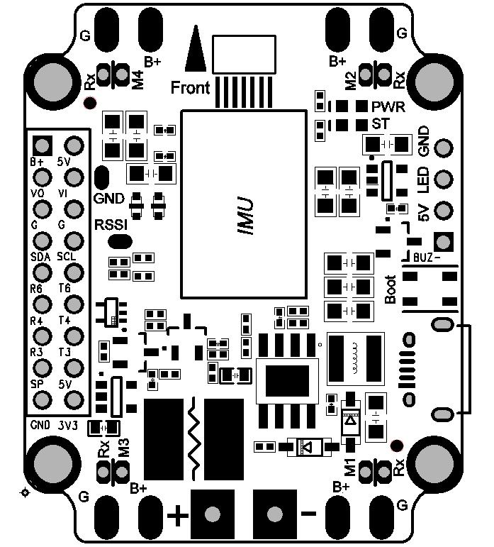
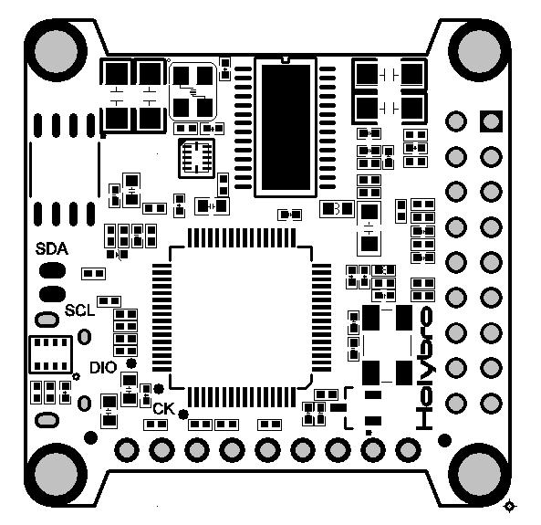

# KakuteF4 AIO Flight Controller

The [KakuteF4 AIO](http://www.holybro.com/product/47) is a flight controller produced by [Holybro](http://www.holybro.com).

## Features

 - STM32F405 microcontroller
 - ICM20689 IMU
 - BMP280 barometer
 - MAX7456 OSD
 - 5 UARTs
 - 4 PWM outputs

## Pinout

## UART Mapping

The UARTs are marked Rn and Tn in the above pinouts. The Rn pin is the
receive pin for UARTn. The Tn pin is the transmit pin for UARTn.

The pin labelled Rx on each corner of the board is a common pin for
ESC telemetry input.

 - SERIAL0 -> USB
 - SERIAL1 -> UART6 (Telem1)
 - SERIAL2 -> UART1 (FrSky S.Port)
 - SERIAL3 -> UART4 (GPS)
 - SERIAL4 -> UART5 (ESC Telemetry, RX only)
 - SERIAL5 -> UART3 (spare, TX only)

## RC Input
 
RC input is configured on the R6 (UART3_RX) pin. It supports all RC protocols.
 
## FrSky Telemetry
 
FrSky Telemetry is supported using the SmartPort pad (UART1). You need
to set the following parameters to enable support for FrSky S.PORT. It
has builtin inverters and a diode to allow for operation from a single
pin with no special adapters.
 
  - SERIAL2_PROTOCOL 10
  - SERIAL2_OPTIONS 0
  
## OSD Support

The KakuteF4 supports OSD using OSD_TYPE 1 (MAX7456 driver).

## PWM Output

The KakuteF4 supports up to 4 PWM outputs. The pads for motor output
M1 to M4 on the above diagram are for the 4 outputs. All 4 outputs
support DShot as well as all PWM types. The M5 and M6 outputs are not
currently available with ArduPilot.

The PWM is in 2 groups:

 - PWM 1 and 4 in group1
 - PWM 2 and 3 in group2

Channels within the same group need to use the same output rate. If
any channel in a group uses DShot then all channels in the group need
to use DShot.

## Battery Monitoring

The board has a builting voltage and current sensor. The voltage
sensor can handle up to 6S LiPo batteries.

The correct battery setting parameters are:

 - BATT_MONITOR 4
 - BATT_VOLT_PIN 13
 - BATT_CURR_PIN 12
 - BATT_VOLT_MULT 10.1
 - BATT_AMP_PERVLT 17.0

## Compass

The KakuteF4 AIO does not have a builting compass, but you can attach an external compass using I2C on the SDA and SCL pads.

## Logging

The KakuteF4 does not support on-board logging at this time.

## Loading Firmware

Initial firmware load can be done with DFU by plugging in USB with the
bootloader button pressed. Then you should load the "with_bl.hex"
firmware, using your favourite DFU loading tool.

Once the initial firmware is loaded you can update the firmware using
any ArduPilot ground station software. Updates should be done with the
*.apj firmware files.

