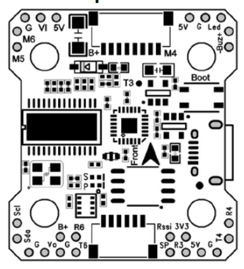

# KakuteF4 Mini Flight Controller

http://www.holybro.com/product/kakute-f4-v2-mini/

The KakuteF7 Mini is a flight controller produced by [Holybro](http://www.holybro.com/product/kakute-f4-v2-mini/).

## Features

 - STM32F405 microcontroller
 - MPU6000 IMU
 - BMP280 barometer
 - 128Mbit dataflash
 - MAX7456 OSD
 - 5 UARTs
 - 7 PWM outputs (2 unallocated)

### KakuteF4 Mini Pinout

## UART Mapping

The UARTs are marked Rn and Tn in the above pinouts. The Rn pin is the
receive pin for UARTn. The Tn pin is the transmit pin for UARTn.

 - SERIAL0 -> USB
 - SERIAL1 -> UART1 (Transmit only, FrSky)
 - SERIAL3 -> UART3 (RC Input)
 - SERIAL4 -> UART4 (GPS/Telem1)
 - SERIAL5 -> UART5 (Receive only, ESC Telemetry)
 - SERIAL6 -> UART6 (GPS2/Telem2)

## ESC Telemetry

The SERIAL5 port (UART5) is for ESC telemetry. It is connected through the
motor connector and works out of the box with the [Tekko32 F3 Mini](https://shop.holybro.com/tekko32-f3-4in1-45a-mini-esc_p1132.html) which is commonly paired with this flight controller

## RC Input
 
RC input is configured on the R3 (UART3_RX) pin. It supports all serial RC protocols.
 
## FrSky Telemetry
 
FrSky Telemetry is supported using the T1 pin (UART1 transmit). You need to set the following parameters to enable support for FrSky S.PORT
  
## OSD Support

The KakuteF7 Mini supports OSD using OSD_TYPE 1 (MAX7456 driver).

## PWM Output

The KakuteF4 supports up to 7 PWM outputs, but only 5 can currently be used. M1 to M4 are accessed via the connector. PWM5 is used for LED output. M1-M4 support bi-directional dshot.

The PWM is in 3 groups:

 - PWM 1 and 2 in group1
 - PWM 3 and 4 in group2
 - PWM 5 in group3

Channels within the same group need to use the same output rate. If
any channel in a group uses DShot then all channels in the group need
to use DShot.

## Battery Monitoring

The board has a built-in voltage and current sensor. The current
sensor can read up to 130 Amps. The voltage sensor can handle up to 6S
LiPo batteries.

The correct battery setting parameters are:

 - BATT_MONITOR 4
 - BATT_VOLT_PIN 13
 - BATT_CURR_PIN 12
 - BATT_VOLT_MULT 10.9
 - BATT_AMP_PERVLT 28.5

## Compass

The KakuteF7 Mini does not have a builtin compass, but you can attach an external compass using I2C on the SDA and SCL pads.

## Loading Firmware

Initial firmware load can be done with DFU by plugging in USB with the
bootloader button pressed. Then you should load the "with_bl.hex"
firmware, using your favourite DFU loading tool.

Note that this hardware has problems going into DFU mode if a GPS is connected and powered - please disconnect your GPS when flashing for the first time.

Once the initial firmware is loaded you can update the firmware using
any ArduPilot ground station software. Updates should be done with the
*.apj firmware files.

