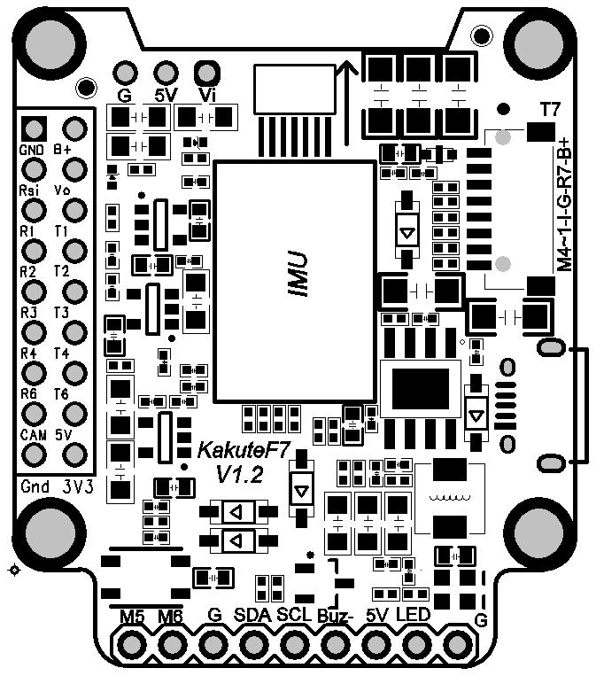
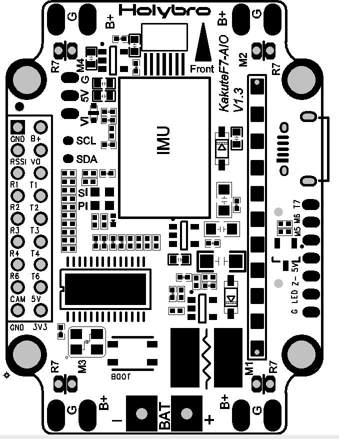

# KakuteF7 AIO Flight Controller

http://www.holybro.com/product/59

The KakuteF7 AIO is a flight controller produced by [Holybro](http://www.holybro.com/product/59).

## Features

 - STM32F745 microcontroller
 - ICM20689 IMU
 - BMP280 barometer
 - microSD card slot
 - AT7456E OSD
 - 6 UARTs
 - 6 PWM outputs

## Pinout

The KakuteF7 comes in two variants. One is an AIO (All-In-One) board,
with OSD. The other is a smaller board without OSD.

### KakuteF7 Pinout

### KakuteF7 AIO Pinout

## UART Mapping

The UARTs are marked Rn and Tn in the above pinouts. The Rn pin is the
receive pin for UARTn. The Tn pin is the transmit pin for UARTn.

 - SERIAL0 -> USB
 - SERIAL1 -> UART1 (Telem1)
 - SERIAL2 -> UART2 (Telem2)
 - SERIAL3 -> UART3 (GPS)
 - SERIAL4 -> UART4
 - SERIAL5 -> UART7
 - SERIAL6 -> UART6 (Transmit only, FrSky)

The SERIAL5 port (UART7) is for ESC telemetry, and has a R7 pad on
each of the four corners of the KakuteF7 AIO board.

## RC Input
 
RC input is configured on the R6 (UART6_RX) pin. It supports all RC protocols.
 
## FrSky Telemetry
 
FrSky Telemetry is supported using the T6 pin (UART6 transmit). You need to set the following parameters to enable support for FrSky S.PORT
 
  - SERIAL6_PROTOCOL 10
  - SERIAL6_OPTIONS 7
  
## OSD Support

The KakuteF7 AIO supports OSD using OSD_TYPE 1 (MAX7456 driver).

## PWM Output

The KakuteF7 supports up to 6 PWM outputs. The pads for motor output M1 to M6 on the above diagram are for the 6 outputs. All 6 outputs support DShot as well as all PWM types.

The PWM is in 3 groups:

 - PWM 1, 2 and 3 in group1
 - PWM 4 and 5 in group2
 - PWM 6 in group3

Channels within the same group need to use the same output rate. If
any channel in a group uses DShot then all channels in the group need
to use DShot.

## Battery Monitoring

The board has a builting voltage and current sensor. The current
sensor can read up to 130 Amps. The voltage sensor can handle up to 6S
LiPo batteries.

The correct battery setting parameters are:

 - BATT_MONITOR 4
 - BATT_VOLT_PIN 13
 - BATT_CURR_PIN 12
 - BATT_VOLT_MULT 10.1
 - BATT_AMP_PERVLT 17.0

## Compass

The KakuteF7 AIO does not have a builting compass, but you can attach an external compass using I2C on the SDA and SCL pads.

## Loading Firmware

Initial firmware load can be done with DFU by plugging in USB with the
bootloader button pressed. Then you should load the "with_bl.hex"
firmware, using your favourite DFU loading tool.

Once the initial firmware is loaded you can update the firmware using
any ArduPilot ground station software. Updates should be done with the
*.apj firmware files.

