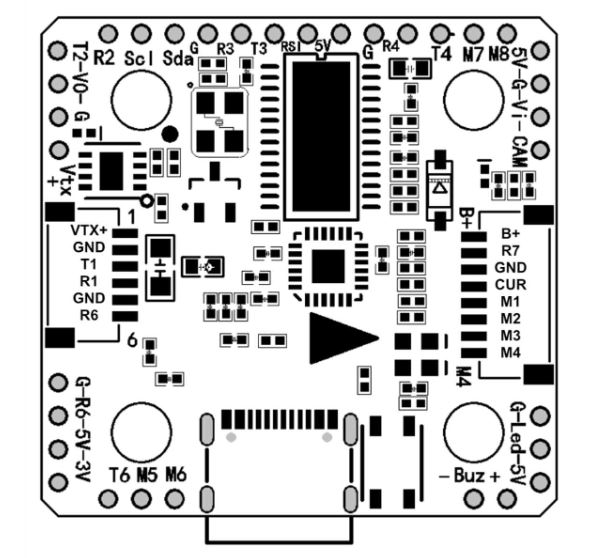

# KakuteH7Mini v2 Flight Controller

The KakuteH7Mini v2 is a flight controller produced by [Holybro](http://www.holybro.com/).

## Features

 - MCU - STM32H743 32-bit processor running at 480 MHz
 - IMU - BMI270
 - Barometer - BMP280
 - OSD - AT7456E
 - Onboard Flash: 1GBit
 - 6x UARTs (1,2,3,4,6,7)
 - 9x PWM Outputs (8 Motor Output, 1 LED)
 - Battery input voltage: 2S-6S
 - BEC 5V 2A

## Pinout

## UART Mapping

The UARTs are marked Rn and Tn in the above pinouts. The Rn pin is the
receive pin for UARTn. The Tn pin is the transmit pin for UARTn.

 - SERIAL0 -> USB
 - SERIAL1 -> UART1 (DJI VTX, DMA-enabled)
 - SERIAL2 -> UART2 (VTX)
 - SERIAL3 -> UART3 (GPS, DMA-enabled)
 - SERIAL4 -> UART4 (DMA-enabled)
 - SERIAL5 -> not available
 - SERIAL6 -> UART6 (RX/SBUS, DMA-enabled)
 - SERIAL7 -> UART7 (ESC Telemetry)

## RC Input

RC input is configured on the R6 (UART6_RX) pin. It supports all serial RC
protocols except PPM. For protocols requiring half-duplex serial to transmit
telemetry (such as FPort) you should setup SERIAL6 with half-duplex, pin-swap 
and inversion enabled.
 
## FrSky Telemetry
 
FrSky Telemetry is supported using the T6 pin (UART6 transmit). You need to set the following parameters to enable support for FrSky S.PORT
 
  - SERIAL6_PROTOCOL 10
  - SERIAL6_OPTIONS 7
  
## OSD Support

The KakuteH7Mini v2 supports OSD using OSD_TYPE 1 (MAX7456 driver).

## PWM Output

The KakuteH7Mini v2 supports up to 9 PWM outputs. The pads for motor output
M1 to M4 on the motor connectors and M5 to M8 on separate pads, plus
M9 for LED strip or another PWM output.

The PWM is in 5 groups:

 - PWM 1, 2 in group1
 - PWM 3, 4 in group2
 - PWM 5, 6 in group3
 - PWM 7, 8 in group4
 - PWM 9 in group5

Channels within the same group need to use the same output rate. If
any channel in a group uses DShot then all channels in the group need
to use DShot. Channels 1-4 support bi-directional dshot.

## Battery Monitoring

The board has a builtin voltage and current sensor. The current
sensor can read up to 130 Amps. The voltage sensor can handle up to 6S
LiPo batteries.

The correct battery setting parameters are:

 - BATT_MONITOR 4
 - BATT_VOLT_PIN 10
 - BATT_CURR_PIN 11
 - BATT_VOLT_MULT 11.1
 - BATT_AMP_PERVLT 59.5

## Compass

The KakuteH7Mini v2 does not have a builtin compass, but you can attach an external compass using I2C on the SDA and SCL pads.

## Loading Firmware

Initial firmware load can be done with DFU by plugging in USB with the
bootloader button pressed. Then you should load the "with_bl.hex"
firmware, using your favourite DFU loading tool.

Once the initial firmware is loaded you can update the firmware using
any ArduPilot ground station software. Updates should be done with the
*.apj firmware files.

