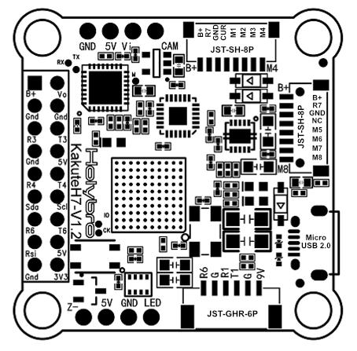
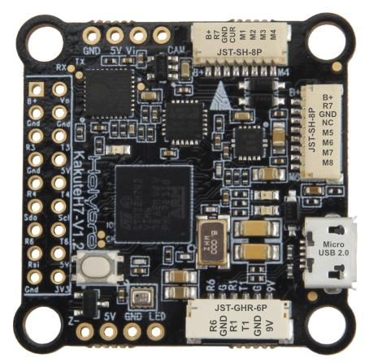

# KakuteH7 v2 Flight Controller

The KakuteH7 v2 is a flight controller produced by [Holybro](http://www.holybro.com/).

## Features

 - STM32H743 microcontroller
 - BMI270 IMU
 - BMP280 barometer
 - Onboard Flash: 1GBit
 - AT7456E OSD
 - 6 UARTs
 - 9 PWM outputs

## Pinout

## UART Mapping

The UARTs are marked Rn and Tn in the above pinouts. The Rn pin is the
receive pin for UARTn. The Tn pin is the transmit pin for UARTn.

 - SERIAL0 -> USB
 - SERIAL1 -> UART1 (DJI-RX, DMA-enabled)
 - SERIAL2 -> UART2 (Telem2, DMA-enabled) (connected to internal BT module)
 - SERIAL3 -> UART3 (VTX)
 - SERIAL4 -> UART4 (GPS, DMA-enabled)
 - SERIAL5 -> not available
 - SERIAL6 -> UART6 (RX, DMA-enabled)
 - SERIAL7 -> UART7 (ESC Telemetry)

## RC Input

RC input is configured on the R6 (UART6_RX) pin. It supports all RC
protocols except PPM. For protocols requiring half-duplex serial to transmit
telemetry (such as FPort) you should configure SERIAL6 with half-duplex, pin-swap
and inversion enabled.
 
## FrSky Telemetry
 
FrSky Telemetry is supported using the Tx pin of any UART including SERIAL6/UART6 . You need to set the following parameters to enable support for FrSky S.PORT (example shows SERIAL6).
 
  - SERIAL6_PROTOCOL 10
  - SERIAL6_OPTIONS 7
  
## OSD Support

The KakuteH7 v2 supports OSD using OSD_TYPE 1 (MAX7456 driver).

## VTX Support

The JST-GH-6P connector supports a standard DJI HD VTX connection. Pin 1 of the connector is 9v so be careful not to connect
this to a peripheral requiring 5v. The 9v supply is controlled by RELAY_PIN2 and is on by default. It can be configured to be operated by an RC switch by selecting the function RELAY2.

## PWM Output

The KakuteH7 supports up to 9 PWM outputs. The pads for motor output
M1 to M8 on the two motor connectors, plus M9 for LED strip or another
PWM output.

The PWM is in 5 groups:

 - PWM 1, 2 in group1
 - PWM 3, 4 in group2
 - PWM 5, 6 in group3
 - PWM 7, 8 in group4
 - PWM 9 in group5

Channels within the same group need to use the same output rate. If
any channel in a group uses DShot then all channels in the group need
to use DShot. Channels 1-8 support bi-directional DShot.

## Battery Monitoring

The board has a builtin voltage and current sensor. The current
sensor can read up to 130 Amps. The voltage sensor can handle up to 6S
LiPo batteries.

The correct battery setting parameters are:

 - BATT_MONITOR 4
 - BATT_VOLT_PIN 10
 - BATT_CURR_PIN 11
 - BATT_VOLT_MULT 10.1
 - BATT_AMP_PERVLT 17.0

## Compass

The KakuteH7 v2 does not have a builtin compass, but you can attach an external compass using I2C on the SDA and SCL pads.

## Loading Firmware

Initial firmware load can be done with DFU by plugging in USB with the
bootloader button pressed. Then you should load the "with_bl.hex"
firmware, using your favourite DFU loading tool.

Once the initial firmware is loaded you can update the firmware using
any ArduPilot ground station software. Updates should be done with the
*.apj firmware files.

