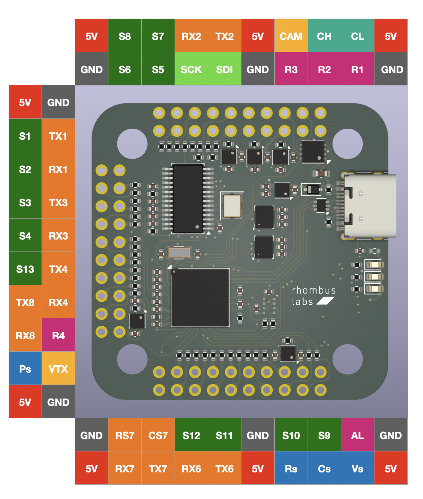
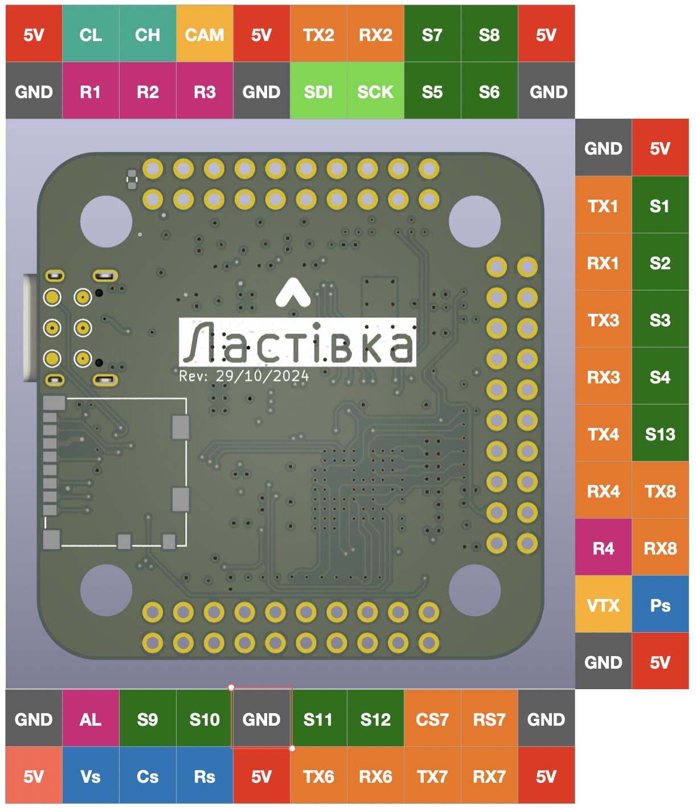

# Lastivka Flight Controller

## Features
    Processor
        STM32H743VIH6, 480MHz , 1MB RAM, 2MB Flash
    Sensors
        ICM-42688/ICM-42605/Gyro
        DPS310 barometer
        AT7456E OSD
    Power
        5V input voltage
    Interfaces
        13x PWM outputs DShot capable
        7x UARTs
        1x I2C
        4x ADC
        USB-C port
    Size
        42 x 42mm

## Overview

## Wiring Diagram

* GND - Ground
* 5V - 5 Volt power supply
* VTX - Video output with OSD
* CAM - Analog camera input
* SCK, SDI - I2C bus
* AL - Alarm
* R1-R4 - 5V relays with overcurrent protection
* S1-S13 - PWM output
* Ps - Pressure sense (0-3.3V)
* Cs - Battery current sense (0-3.3V)
* Vs - Battery voltage sense (0-3.3V)
* Rs - RSSI sense (0-3.3V)
* RX1, TX1 - UART1
* RX2, TX2 - UART2
* RX3, TX3 - UART3
* RX4, TX4 - UART4
* RX6, TX6 - UART6
* RX7, TX7, CS7, RS7 - UART7
* RX8, TX8 - UART8

## UART Mapping

The UARTs are marked Rx* and Tx* in the above pinouts. The Rx* pin is the
receive pin for UART*. The Tx* pin is the transmit pin for UART*.

 - SERIAL0 -> USB
 - SERIAL1 -> USART7
 - SERIAL2 -> USART1
 - SERIAL3 -> USART2
 - SERIAL4 -> USART3
 - SERIAL6 -> USART8
 - SERIAL7 -> USART4
 - SERIAL8 -> USART6

## CAN and I2C

Lastivka supports I2C bus
multiple I2C peripherals can be connected to one I2C bus in parallel.

## Compass

Lastivka does not have a built-in compass, but you can attach an external compass using I2C on the SDA and SCL pads.

## Loading Firmware

Firmware for these boards can be found at https://firmware.ardupilot.org in sub-folders labeled Lastivka.

Initial firmware load can be done with DFU by plugging in USB with the
boot button pressed. Then you should load the "ardu*_with_bl.hex" firmware, using your favourite DFU loading tool. eg STM32CubeProgrammer

Subsequently, you can update firmware with Mission Planner.
