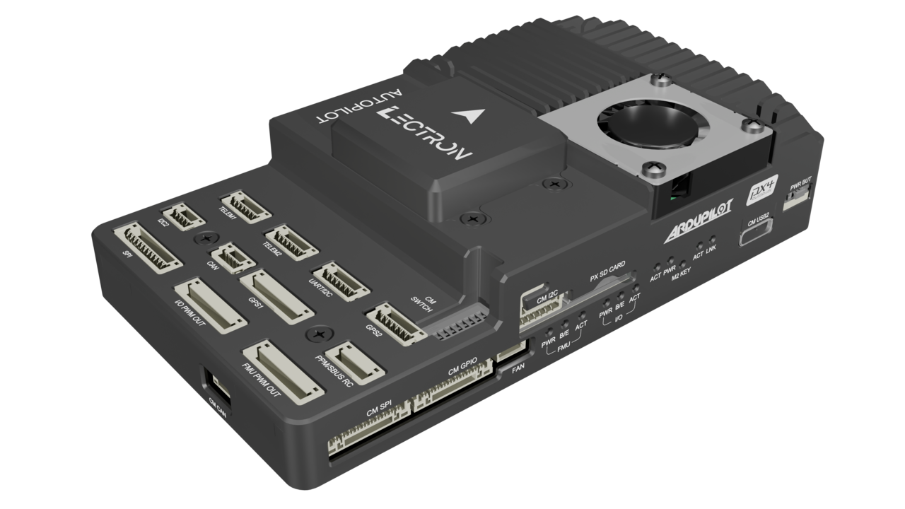
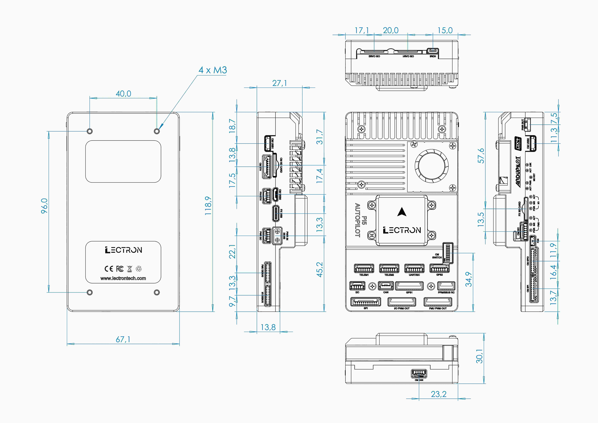
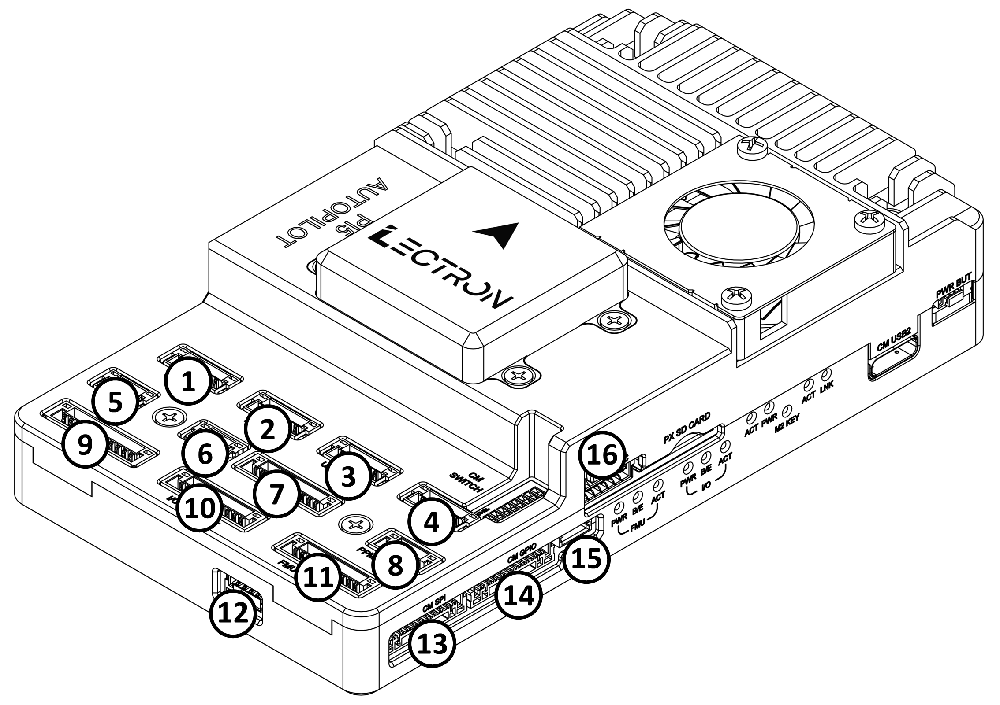
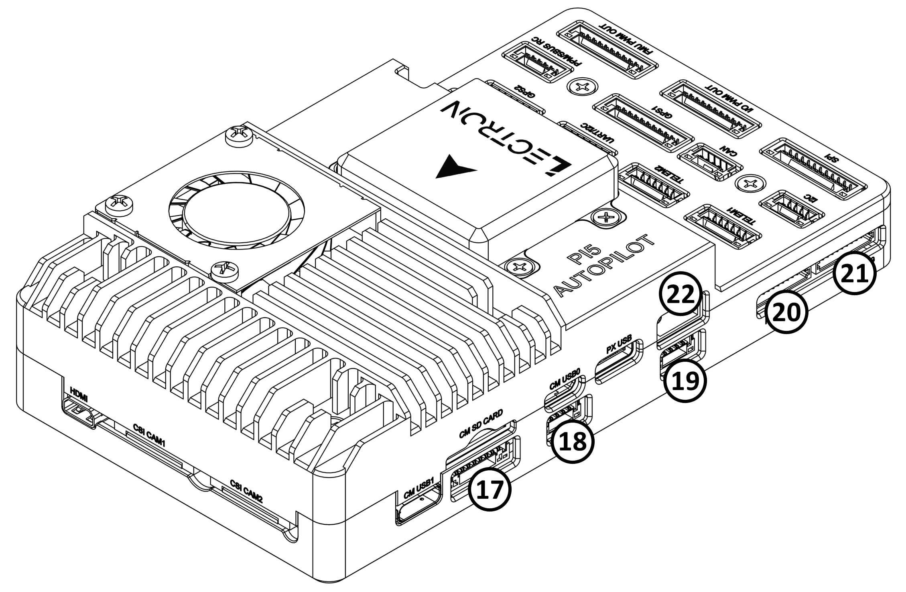
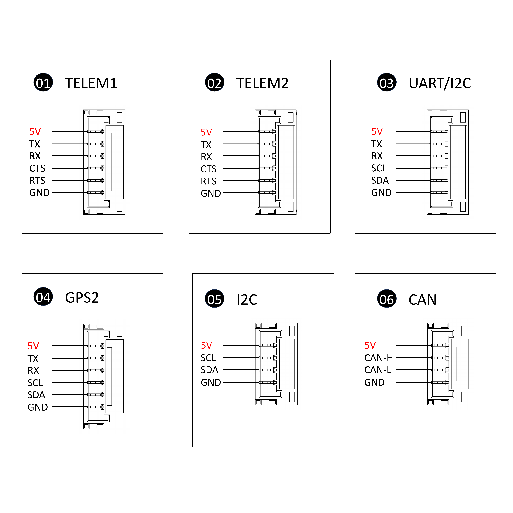
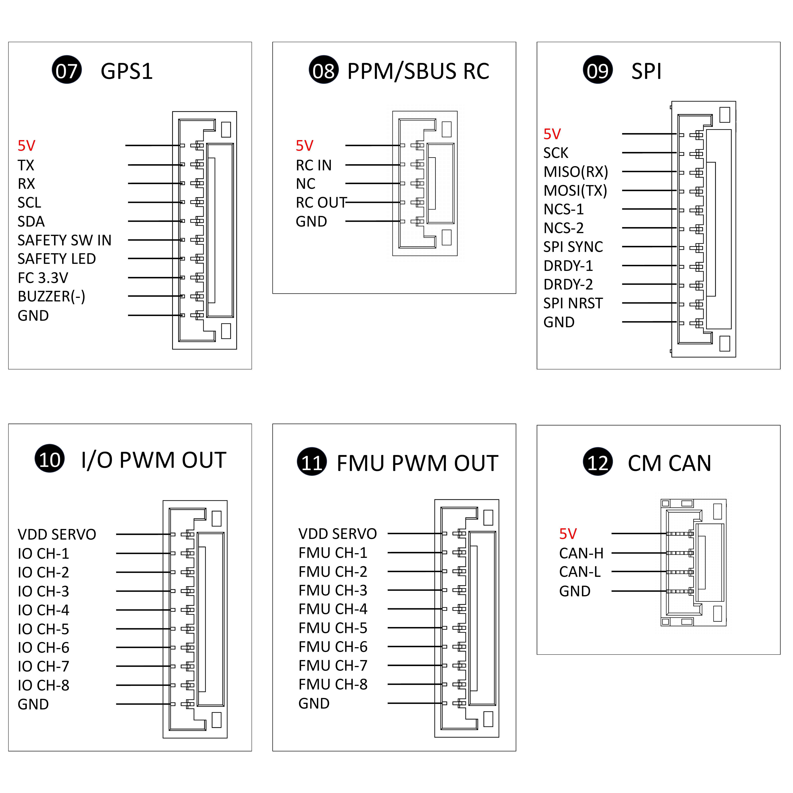
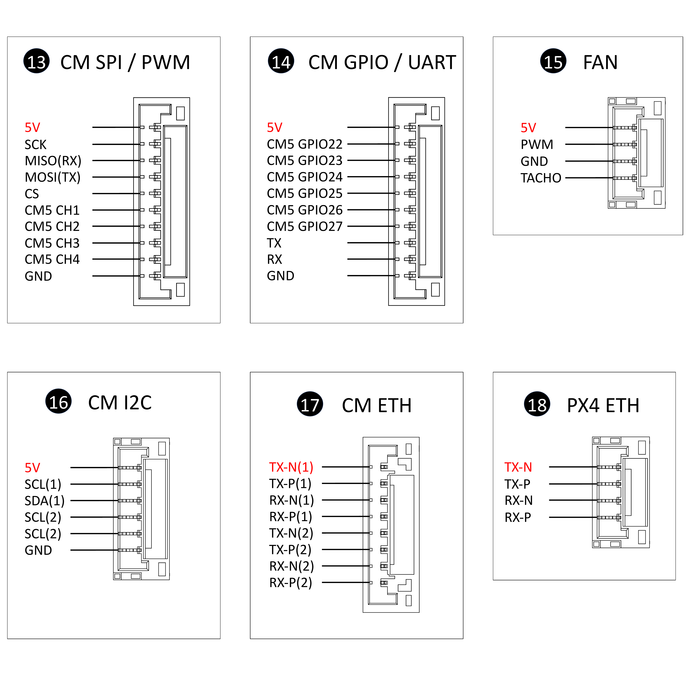
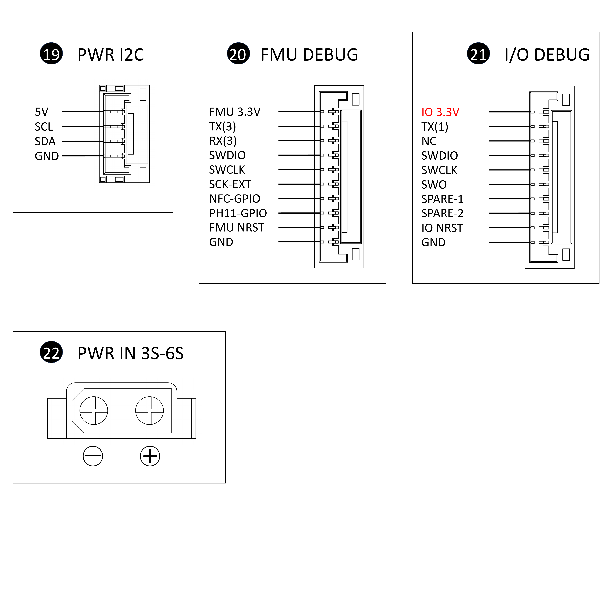
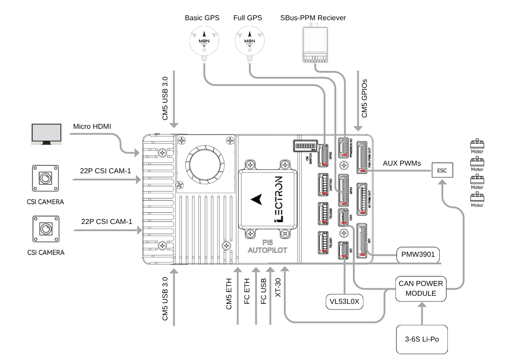

# Lectron Pi5 Autopilot



The Lectron Pi5 Autopilot is an integrated flight control and companion computing platform that combines a Pixhawk FMUv6X compatible flight controller with a Raspberry Pi Compute Module 5 on a single unified board. Designed by [Lectron](https://lectrontech.com/), it maintains a clear separation between safety-critical real-time control and high-level computing workloads.

The FMU follows the Pixhawk FMUv6X open standard with triple-redundant IMUs and dual barometers on separate buses, enabling seamless sensor failover. An independent STM32F103 IO processor handles R/C and PWM outputs in isolation from the main FMU core.

## Where to Buy

Order from [here](https://www.ozdisan.com/p/otopilot-sistemleri-1005816/lectron-pi5-autopilot-1595027)

## Specifications

### Processor

- STM32H753IIK6TR (32-bit Arm Cortex-M7, 480 MHz, 2 MB flash, 1 MB RAM)
- STM32F103C8T7 (32-bit Arm Cortex-M3, 72 MHz, 64 KB SRAM)

### Sensors & Onboard Elements

- Bosch BMI270 IMU (accel, gyro)
- Dual InvenSense ICM-42670-P IMU (accel, gyro)
- Dual Bosch BMP390 barometers
- Bosch BMM350 magnetometer
- FRAM (SPI)
- EEPROM (I2C)
- 1W Heater

### Companion Computer

- **Supported module:** Raspberry Pi Compute Module 5 (CM5 / CM5 Lite)
- **Connection:** CM5 board-to-board connector

## Power

- **Power input:** 12-26 VDC (3S-6S LiPo), XT30 connector
- **Overcurrent protection:** 5 A maximum
- **FMU and CM5 shared rail:** 5 V regulated bus
- **Per-port output limit:** 1.5 A total across FMU and CM5 peripheral 5 V rails
- **Protection:** reverse polarity, overcurrent
- **Voltage monitoring:** INA238 (I2C)
- **Servo rail sensing limit:** 16 VDC

## Interfaces

### Flight Controller

- PPM/SBUS RC input
- microSD card
- 100-Mbps FMU Ethernet
- 1x CAN bus port
- SPI6 port (2x CS)
- 16x PWM outputs (8x Aux & 8x Main)
- 2x GPS ports (Full GPS & Basic GPS)
- 3x I2C Bus
- 6x UART/USART based ports
- PAB Standard (for V6X) FMU & IO Debug ports
- Type-C USB port

### Companion Computers

- Active cooler (0.75W Fan)
- 2x 22 pin CSI
- M.2 Key-M (2230/2242) slot for NVMe SSD or AI accelerator
- 1-Gbps Ethernet (with onboard magnetics)
- 8-position DIP switch for boot mode and peripheral configurations
- 16x GPIO (total), 4x dedicated PWM pin
- 2x I2C ports
- 1x UART port
- SPI port (1x CS)
- 2x USB 3.0 Type-C
- Micro USB 2.0 (host)

### Other



- Weight: 162.4 g (with Lectron IMU-01 & CM5 Lite & SD cards, without Hailo M2)
- Dimensions: 118.9 (L) x 67.1 (W) x 30.1 (H) mm
- Operating Temperature: -40 to 70 deg C ([field-tested](https://www.linkedin.com/posts/lectron-technologies_built-for-real-world-conditions-activity-7463477408948674560-PGf9?utm_source=share&utm_medium=member_android&rcm=ACoAACmr7Q8BHyqmnEh2X5AYhyyLDlcvQeAd_C8))

## Pinouts













Unless noted otherwise, FMU-side and CM5-side connectors are JST-GH 1.25 mm pitch. USB (Type-C), microSD, CSI-1/CSI-2 (22-pin FFC, 0.5 mm pitch, 4-lane MIPI), M.2 Key-M, micro HDMI, and USB 3.0/2.0 ports use standard pinouts and are not detailed here. CM5 CAN is provided by an MCP2515 controller on SPI1-CS0, independent of the FMU CAN bus.

See the [Lectron Pi5 Autopilot Pinout Reference](https://lectronuser.github.io/Lectron-Doc-Center/md/raspberry/pinout/) for full connector diagrams and FFC pin assignments.

### DIP Switch (8-position)

| # | Function |
| --- | --- |
| 1 | WiFi disable (active low) |
| 2 | Bluetooth disable (active low) |
| 3 | RPi boot (eMMC boot disable) |
| 4 | EEPROM write protect (active low) |
| 5 | Ethernet sync out |
| 6 | USB OTG ID |
| 7 | PMIC enable |
| 8 | Power button |


## Flight Controller UART Mapping

| Serial # | UART   | Protocol | Port    | Function                                    | Notes                                       |
| -------- | ------ | -------- | ------- | -------------------------------------------- | -------------------------------------------- |
| SERIAL0  | OTG1   | MAVLink2 | USB     | OTG                                          | USB Type-C 2.0                               |
| SERIAL1  | UART7  | MAVLink2 | TELEM1  | Telemetry port                               | Hardware flow control                        |
| SERIAL2  | UART5  | MAVLink2 | TELEM2  | Telemetry port                               | Hardware flow control                        |
| SERIAL3  | USART1 | GPS      | GPS1    | GPS, Mag, Buzzer, Safety Switch, LED         | Full GPS port                                |
| SERIAL4  | UART8  | GPS      | GPS2    | GPS, Mag                                     | GPS2                                         |
| SERIAL5  | USART2 | MAVLink2 | TELEM3  | Bridged to CM5 UART3 by default              | Hardware flow control; CM5 UART bridge       |
| SERIAL6  | UART4  | MAVLink2 | UART4   | External / I2C3 shared                       | Shared with I2C3                             |
| SERIAL7  | USART3 | MAVLink2 | DEBUG   | FMU Debug Console                            | FMU(H753) Debug port                         |

USART6 provides the internal link between the FMU and the STM32F103 IO co-processor (IOMCU).

## RC Input

Unidirectional RC protocols (PPM, S.BUS) can be connected via the SBUS/RC input connector, which auto-detects PPM or S.BUS. Spektrum satellite receivers are not supported on this connector. The SBUS/RC input connector also carries an RSSI analog input, shared with the SBUS servo output.

The RCIN pin, which by default is mapped to a timer input, can be used for all ArduPilot supported receiver protocols, except CRSF/ELRS and SRXL2, which require a true UART connection. However, FPort, when connected in this manner, will only provide RC without telemetry.

To allow CRSF and embedded telemetry available in FPort, CRSF, and SRXL2 receivers, a full UART (see [UART Mapping](#flight-controller-uart-mapping)), such as TELEM1, would need to be used for receiver connections. Below are example setups for the SERIALn parameters of the UART used.

`SERIALn_PROTOCOL` should be set to `23` (RCIN).

- FPort requires `SERIALn_OPTIONS` be set to `15`.
- CRSF requires `SERIALn_OPTIONS` be set to `0`.
- SRXL2 requires `SERIALn_OPTIONS` be set to `4` and connects only the TX pin.

Any UART can be used for RC system connections in ArduPilot and is compatible with all protocols except PPM. See [Radio Control Systems](https://ardupilot.org/copter/docs/common-rc-systems.html) for details.

## PWM Output

The board has 16 PWM outputs: 8 IO (MAIN) outputs driven by the STM32F103C8T7 IO co-processor and 8 FMU (AUX) outputs driven by the STM32H753IIK6 FMU.

### MAIN - STM32F103C8T7

IO outputs support PWM only. DShot is not supported on any IO output. All outputs within the same timer group must use the same protocol and update rate.

| IO Channel | MCU Pin | Timer / Channel | DShot |
| ---------- | ------- | --------------- | ----- |
| IO_CH 1    | PA0     | TIM2_CH1        | No    |
| IO_CH 2    | PA1     | TIM2_CH2        | No    |
| IO_CH 3    | PB8     | TIM4_CH3        | No    |
| IO_CH 4    | PB9     | TIM4_CH4        | No    |
| IO_CH 5    | PA6     | TIM3_CH1        | No    |
| IO_CH 6    | PA7     | TIM3_CH2        | No    |
| IO_CH 7    | PB0     | TIM3_CH3        | No    |
| IO_CH 8    | PB1     | TIM3_CH4        | No    |

### AUX - STM32H753IIK6

FMU_CH 1-6 support DShot. FMU_CH 7-8 do not support DShot (TIM12 has no DMA). All outputs within the same timer group must use the same protocol and update rate.

| FMU Channel | MCU Pin | Timer / Channel | DShot |
| ----------- | ------- | --------------- | ----- |
| FMU_CH 1    | PI0     | TIM5_CH4        | Yes   |
| FMU_CH 2    | PH12    | TIM5_CH3        | Yes   |
| FMU_CH 3    | PH11    | TIM5_CH2        | Yes   |
| FMU_CH 4    | PH10    | TIM5_CH1        | Yes   |
| FMU_CH 5    | PD13    | TIM4_CH2        | Yes   |
| FMU_CH 6    | PD14    | TIM4_CH3        | Yes   |
| FMU_CH 7    | PH6     | TIM12_CH1       | No    |
| FMU_CH 8    | PH9     | TIM12_CH2       | No    |

## Battery Monitoring

The board defaults to an onboard INA238 I2C voltage sensor on I2C2. This provides voltage sensing only; it has no shunt for current sensing, and no ADC channel is available for battery voltage or current sensing. 

An external I2C-compatible power module providing both voltage and current sensing can be connected via the External Power Monitoring port (I2C2).

Alternatively, a DroneCAN power monitor or smart battery can be connected via the CAN port for voltage and current sensing over CAN. The correct battery monitor parameters depend on the power module connected; see `BATT_MONITOR` and related `BATT_*` parameters.

## Compass

There is no compass on the Flight controller board. A BMM350 I2C magnetometer is provided on the Lectron IMU-01 sensor board bundled with the Lectron Pi5 Autopilot.

## IMU Heater

The IMU heater can be controlled with the `BRD_HEAT_TARG` parameter, in degrees C.

## GPIOs (FMU)

The 8 FMU outputs can be used as GPIOs (relays, buttons, RPM etc). To use them you need to set the output's SERVOx_FUNCTION to -1. See GPIOs page for more information.

The numbering of the GPIOs for PIN variables in ArduPilot is:

  - PWM1 50
  - PWM2 51
  - PWM3 52
  - PWM4 53
  - PWM5 54
  - PWM6 55
  - PWM7 56
  - PWM8 57

Additional GPIOs:

  - NFC_GPIO 59

## Analog Inputs (FMU)

A normal Pixhawk FMUv6X system provides 2 general-purpose analog voltage input channels (AD1/AD2) on the PAB connector, but the Lectron Pi5 Autopilot does not expose these for external use. The only analog inputs available externally are the RSSI input on the SBUS/RC connector (see [RC Input](#rc-input)) and the battery voltage sense input (see [Battery Monitoring](#battery-monitoring)); the remaining ADC channels are used internally for onboard voltage-rail monitoring.

## Connectors

Unless otherwise noted, all connectors are JST-GH.

## Typical Wiring Diagram

Pin 1 of each port is marked in red.



## Loading Firmware

Build the bootloader and vehicle firmware from an ArduPilot source checkout with waf:

```bash
python3 waf configure --board Lectron-Pi5-H7 --bootloader
python3 waf bootloader

python3 waf configure --board Lectron-Pi5-H7
python3 waf copter  # or plane
```

This produces `.bin`/`.hex`/`.apj` files under `build/Lectron-Pi5-H7/bin/`.

On a factory-fresh board with no bootloader installed, both files need to be loaded over SWD with STM32CubeProgrammer, connected to the FMU debug port's SWDIO/SWDCLK/GND/NRST pins:

1. Connect to the STM32H753 over SWD and let STM32CubeProgrammer detect the chip.
2. Perform a full chip erase, select the built bootloader `.hex` file, and start programming. The bootloader is written at address `0x08000000`.
3. Reconnect, select the built vehicle firmware `.hex` file, **uncheck full chip erase** so the bootloader is preserved, and start programming. The firmware is written at address `0x08020000`, after the 128 KB reserved for the bootloader.

Once the bootloader is installed, subsequent firmware updates can instead be loaded as `.apj` files through a ground station (Mission Planner, QGroundControl, etc.) without needing STM32CubeProgrammer again.

For full step-by-step instructions and screenshots, see the [Lectron FMU Firmware Installation guide](https://lectronuser.github.io/Lectron-Doc-Center/md/raspberry/setup/#fmu-firmware-installation).

## Assembly

The Lectron Pi5 Autopilot ships as a kit. Assembly requires the following components:

For full photo-illustrated steps, see the [Lectron Pi5 Assembly Guide](https://lectronuser.github.io/Lectron-Doc-Center/md/raspberry/assembly/).

## Further Information

- [Lectron-Doc-Center](https://lectronuser.github.io/Lectron-Doc-Center/md/raspberry/)