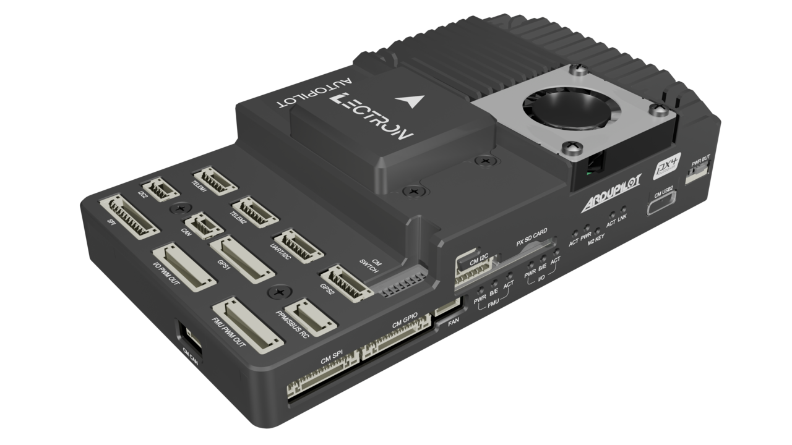
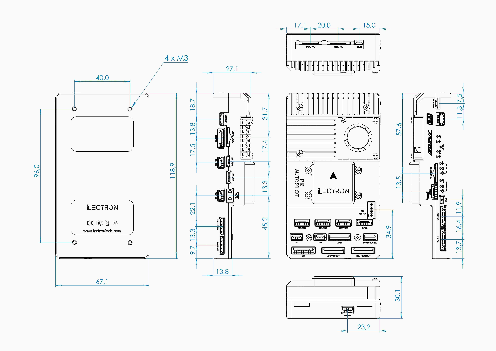
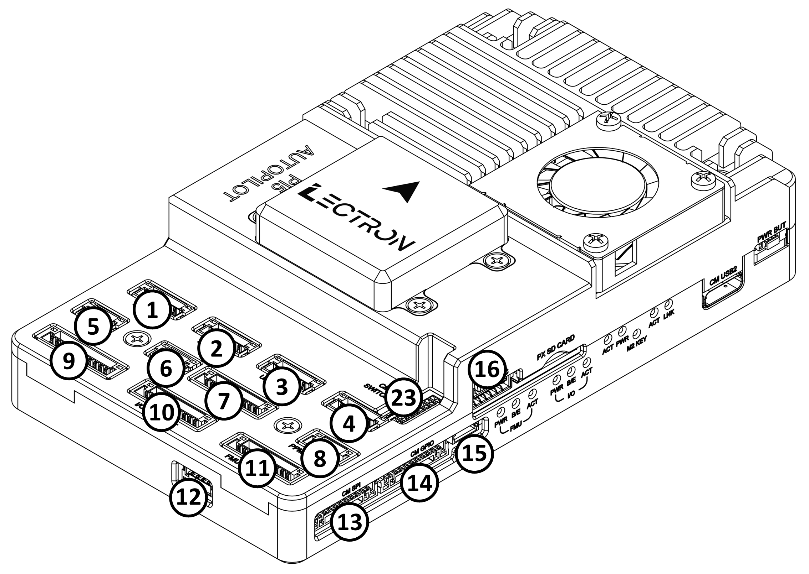
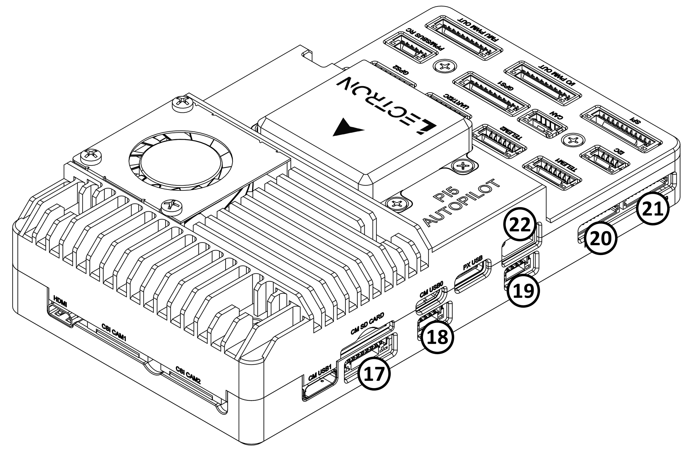
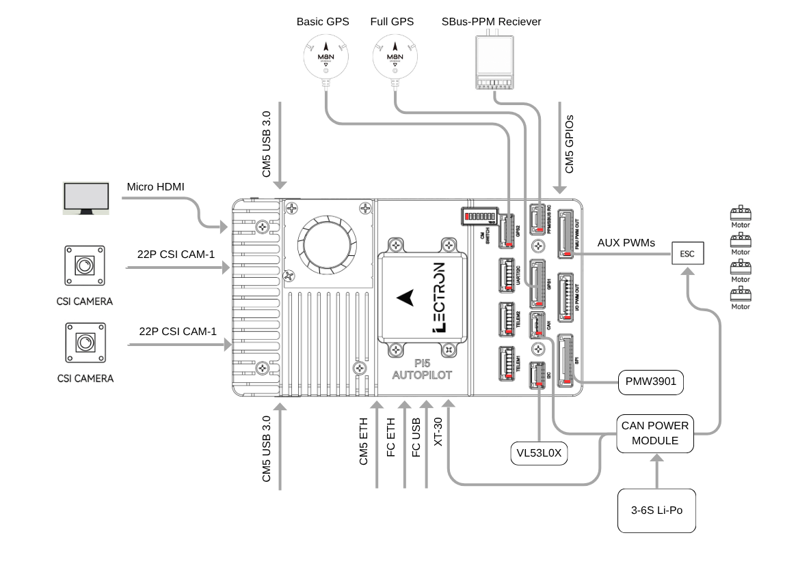

# Lectron Pi5 Autopilot

The Lectron Pi5 Autopilot is an integrated flight control and companion computing platform that combines a Pixhawk FMUv6X compatible flight controller with a Raspberry Pi Compute Module 5 on a single unified board. Designed by [Lectron](https://lectrontech.com/), it maintains a clear separation between safety-critical real-time control and high-level computing workloads.

The FMU follows the Pixhawk FMUv6X open standard with triple-redundant IMUs and dual barometers on separate buses, enabling seamless sensor failover. An independent STM32F103 IO processor handles R/C and PWM outputs in isolation from the main FMU core.

## Where to Buy

Order from [here](https://www.ozdisan.com/p/otopilot-sistemleri-1005816/lectron-pi5-autopilot-1595027)

## Specifications

### Processor

- STM32H753 (32-bit Arm Cortex-M7, 480 MHz, 2 MB flash, 1 MB RAM)
- STM32F103 (32-bit Arm Cortex-M3, 72 MHz, 64 KB SRAM)

### Sensors & Onboard Elements

- Bosch BMI270 IMU (accel, gyro)
- Dual InvenSense ICM-42670-P IMU (accel, gyro)
- Dual Bosch BMP390 barometers
- Bosch BMM350 magnetometer
- FRAM (SPI)
- EEPROM (I2C)
- 1W Heater

### Companion Computer

- **Supported module:** Raspberry Pi Compute Module 5 (CM5 / CM5 Lite)
- **Connection:** CM5 board-to-board connector

## Power

- **Power input:** 9-26 VDC (3S-6S LiPo), XT30 connector
- **Overcurrent protection:** 5 A maximum
- **FMU and CM5 shared rail:** 5 V regulated bus
- **Per-port output limit:** 1.5 A total across FMU and CM5 peripheral 5 V rails
- **Protection:** reverse polarity, overcurrent
- **Voltage monitoring:** INA238 (I2C)
- **Servo rail sensing limit:** 16 VDC

## Interfaces

### Flight Controller

- PPM/SBUS RC input
- microSD card
- 100-Mbps FMU Ethernet
- 1x CAN bus port
- SPI6 port (2x CS)
- 16x PWM outputs (8x IO & 8x FMU)
- 2x GPS ports (Full GPS & Basic GPS)
- 3x I2C Bus
- 6x UART/USART based ports
- PAB Standard (for V6X) FMU & IO Debug ports
- Type-C USB port

### Companion Computers

- Active cooler (0.75W Fan)
- 2x 22 pin CSI Camera Port
- M.2 Key-M (2230/2242) slot for NVMe SSD or AI accelerator
- 1-Gbps Ethernet (with onboard magnetics)
- 8-position DIP switch for boot mode and peripheral configurations
- 16x GPIO (total), 4x dedicated PWM pin
- 2x I2C buses
- 1x UART bus
- 1x SPI bus  (1x CS)
- 2x USB 3.0 Type-C
- Micro USB 2.0 (host)

### Other

- Weight: 162.4 g (with Lectron IMU-01 & CM5 Lite & SD cards, without Hailo M2)
- Dimensions: 118.9 (L) x 67.1 (W) x 30.1 (H) mm
- Operating Temperature: -40 to 70 deg C ([field-tested](https://www.linkedin.com/posts/lectron-technologies_built-for-real-world-conditions-activity-7463477408948674560-PGf9?utm_source=share&utm_medium=member_android&rcm=ACoAACmr7Q8BHyqmnEh2X5AYhyyLDlcvQeAd_C8))

## Pinouts

Unless noted otherwise, FMU-side and CM5-side connectors are JST-GH 1.25 mm pitch. USB (Type-C), microSD, CSI-1/CSI-2 (22-pin FFC, 0.5 mm pitch, 4-lane MIPI), M.2 Key-M, micro HDMI, and USB 3.0/2.0 ports use standard pinouts and are not detailed here. CM5 CAN is provided by an MCP2515 controller on SPI1-CS0, independent of the FMU CAN bus.

See the [Lectron Pi5 Autopilot Pinout Reference](https://lectronuser.github.io/Lectron-Doc-Center/md/raspberry/pinout/) for full connector diagrams and FFC pin assignments.

### CM Switch (8-position)

The CM switches are located on the top face next to the GPS2 connector, labeled `CM SWITCH` on the board, and configure the Raspberry Pi CM5.

| # | Function |
| --- | --- |
| 1 | WiFi disable (active low) |
| 2 | Bluetooth disable (active low) |
| 3 | RPi boot (eMMC boot disable) |
| 4 | EEPROM write protect (active low) |
| 5 | Ethernet sync out |
| 6 | USB OTG ID |
| 7 | PMIC enable |
| 8 | Power button |

## Flight Controller UART Mapping

| Serial # | UART   | Protocol | Port    | Function                                     | Notes                                        |
| -------- | ------ | -------- | ------- | -------------------------------------------- | -------------------------------------------- |
| SERIAL0  | OTG1   | MAVLink2 | USB     | OTG                                          | USB Type-C 2.0                               |
| SERIAL1  | UART7  | MAVLink2 | TELEM1  | Telemetry port                               | Hardware flow control                        |
| SERIAL2  | UART5  | MAVLink2 | TELEM2  | Telemetry port                               | Hardware flow control                        |
| SERIAL3  | USART1 | GPS      | GPS1    | GPS, Mag, Buzzer, Safety Switch, LED         | Full GPS port                                |
| SERIAL4  | UART8  | GPS      | GPS2    | GPS, Mag                                     | GPS2                                         |
| SERIAL5  | USART2 | MAVLink2 | TELEM3  | Bridged to CM5 UART3 by default              | Hardware flow control; CM5 UART bridge       |
| SERIAL6  | UART4  | MAVLink2 | UART/I2C | External / I2C3 shared                       | Shared with I2C3                             |
| SERIAL7  | USART3 | MAVLink2 | FMU DEBUG   | FMU Debug Console                            | FMU(H753) Debug port                         |

- USART6 provides the internal link between the FMU and the STM32F103 IO co-processor (IOMCU).
- All UARTs are DMA capable.

## RC Input

Unidirectional RC protocols (PPM, S.BUS) can be connected via the SBUS/RC input connector, which auto-detects PPM or S.BUS. Spektrum satellite receivers are not supported on this connector. The SBUS/RC input connector also carries an RSSI analog input, shared with the SBUS servo output.

The RCIN pin, which by default is mapped to a timer input, can be used for all ArduPilot supported receiver protocols, except CRSF/ELRS and SRXL2, which require a true UART connection. However, FPort, when connected in this manner, will only provide RC without telemetry.

To allow CRSF and embedded telemetry available in FPort, CRSF, and SRXL2 receivers, a full UART (see [UART Mapping](#flight-controller-uart-mapping)), such as TELEM1, would need to be used for receiver connections. Below are example setups for the SERIALn parameters of the UART used.

`SERIALn_PROTOCOL` should be set to `23` (RCIN).

- FPort requires `SERIALn_OPTIONS` be set to `15`.
- CRSF requires `SERIALn_OPTIONS` be set to `0`.
- SRXL2 requires `SERIALn_OPTIONS` be set to `4` and connects only the TX pin.

Any UART can be used for RC system connections in ArduPilot and is compatible with all protocols except PPM. See [Radio Control Systems](https://ardupilot.org/copter/docs/common-rc-systems.html) for details.

## PWM Output

The board has 16 PWM outputs: 8 IO (MAIN) outputs driven by the STM32F103 IO co-processor and 8 FMU (AUX) outputs driven by the STM32H753 FMU.

### I/O PWM - STM32F103

IO outputs support PWM only. DShot is not supported on any IO output. All outputs within the same timer group must use the same protocol and update rate.

| IO Channel | MCU Pin | Timer / Channel | DShot |
| ---------- | ------- | --------------- | ----- |
| IO_CH 1    | PA0     | TIM2_CH1        | No    |
| IO_CH 2    | PA1     | TIM2_CH2        | No    |
| IO_CH 3    | PB8     | TIM4_CH3        | No    |
| IO_CH 4    | PB9     | TIM4_CH4        | No    |
| IO_CH 5    | PA6     | TIM3_CH1        | No    |
| IO_CH 6    | PA7     | TIM3_CH2        | No    |
| IO_CH 7    | PB0     | TIM3_CH3        | No    |
| IO_CH 8    | PB1     | TIM3_CH4        | No    |

### FMU PWM - STM32H753

FMU_CH 1-6 support DShot. FMU_CH 7-8 do not support DShot (TIM12 has no DMA). All outputs within the same timer group must use the same protocol and update rate.

| FMU Channel | MCU Pin | Timer / Channel | DShot |
| ----------- | ------- | --------------- | ----- |
| FMU_CH 1    | PI0     | TIM5_CH4        | Yes   |
| FMU_CH 2    | PH12    | TIM5_CH3        | Yes   |
| FMU_CH 3    | PH11    | TIM5_CH2        | Yes   |
| FMU_CH 4    | PH10    | TIM5_CH1        | Yes   |
| FMU_CH 5    | PD13    | TIM4_CH2        | Yes   |
| FMU_CH 6    | PD14    | TIM4_CH3        | Yes   |
| FMU_CH 7    | PH6     | TIM12_CH1       | No    |
| FMU_CH 8    | PH9     | TIM12_CH2       | No    |

## Battery Monitoring

The board defaults to an onboard INA238 I2C voltage sensor on I2C1. This provides voltage sensing only; it has no shunt for current sensing, and no ADC channel is available for battery voltage or current sensing.

An external I2C-compatible power module providing both voltage and current sensing can be connected via the External Power Monitoring port (I2C2).

Alternatively, a DroneCAN power monitor or smart battery can be connected via the CAN port for voltage and current sensing over CAN. The correct battery monitor parameters depend on the power module connected; see `BATT_MONITOR` and related `BATT_*` parameters.

## Compass

There is no compass on the flight controller board itself. A BMM350 I2C magnetometer is provided on the Lectron IMU-01 sensor board bundled with the Lectron Pi5 Autopilot. The IMU-01 board mounts on the flight controller in a single fixed position and orientation, so the compass orientation is fixed and preset in firmware; it cannot be changed by the users.

## IMU Heater

The Lectron-01 Imu board has inbuild 2x 51Ohm Heater resistors. Those are driven by flight controllers heater signal. Those reistor provides 1W rated heating performance overall on imu board for certain temperature range.
The IMU heater can be controlled with the `BRD_HEAT_TARG` parameter, in degrees C.

## GPIOs

The auxiliary PWM ports and some pin can be used as GPIOs (relays, buttons, RPM etc).

The numbering of the GPIOs for PIN variables in ArduPilot is:

- FMU_CH_1 50
- FMU_CH_2 51
- FMU_CH_3 52
- FMU_CH_4 53
- FMU_CH_5 54
- FMU_CH_6 55
- FMU_CH_7 56
- FMU_CH_8 57
- NFC_GPIO 59
- IO_CH_1 101
- IO_CH_2 102
- IO_CH_3 103
- IO_CH_4 104
- IO_CH_5 105
- IO_CH_6 106
- IO_CH_7 107
- IO_CH_8 108

## Analog Inputs

The only externally available analog input is the RSSI input on the SBUS/RC connector, which is read on the IO co-processor (STM32F103), not the FMU. In ArduPilot this maps to analog pin 103

To use analog RSSI: set RSSI_TYPE = 1 and RSSI_ANA_PIN = 103.

## Connectors

Unless otherwise noted, all connectors are JST-GH.

> The PAB Standard Debug connectors are JST-SH, and the fan connector is JST-SH.

## Typical Wiring Diagram

Pin 1 of each port is marked in red.

## Loading Firmware

Firmware for these boards can be found at the [ArduPilot firmware server](https://firmware.ardupilot.org) in sub-folders labeled "Lectron-Pi5-H7".

The board comes pre-installed with an ArduPilot compatible bootloader, allowing the loading of \*.apj firmware files with any ArduPilot compatible ground station.

### Reflashing the bootloader over SWD (advanced)

This is only needed to restore a corrupted bootloader or to switch the
board to a different autopilot ecosystem (e.g. PX4). It requires an SWD
probe and STM32CubeProgrammer, connected to the FMU debug port's
SWDIO/SWDCLK/GND/NRST pins:

1. Connect to the STM32H753 over SWD and let STM32CubeProgrammer detect the chip.
2. Perform a full chip erase, select the bootloader *.hex, and program it
   at address 0x08000000.
3. Reconnect, select the vehicle firmware *.hex, uncheck full chip erase
   to preserve the bootloader, and program it at 0x08020000.

Once the bootloader is in place, subsequent updates can again be loaded as
*.apj files through a GCS.

For full step-by-step instructions and screenshots, see the [Lectron FMU Firmware Installation guide](https://lectronuser.github.io/Lectron-Doc-Center/md/raspberry/setup/#fmu-firmware-installation).

## Assembly

For the assembly and installation guide, follow this section: the [Lectron Pi5 Assembly Guide](https://lectronuser.github.io/Lectron-Doc-Center/md/raspberry/assembly/).

## Further Information

- [Lectron-Doc-Center](https://lectronuser.github.io/Lectron-Doc-Center/md/raspberry/)
