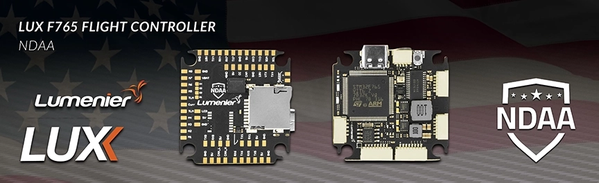
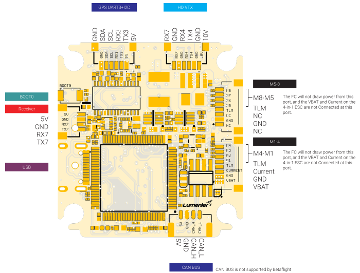
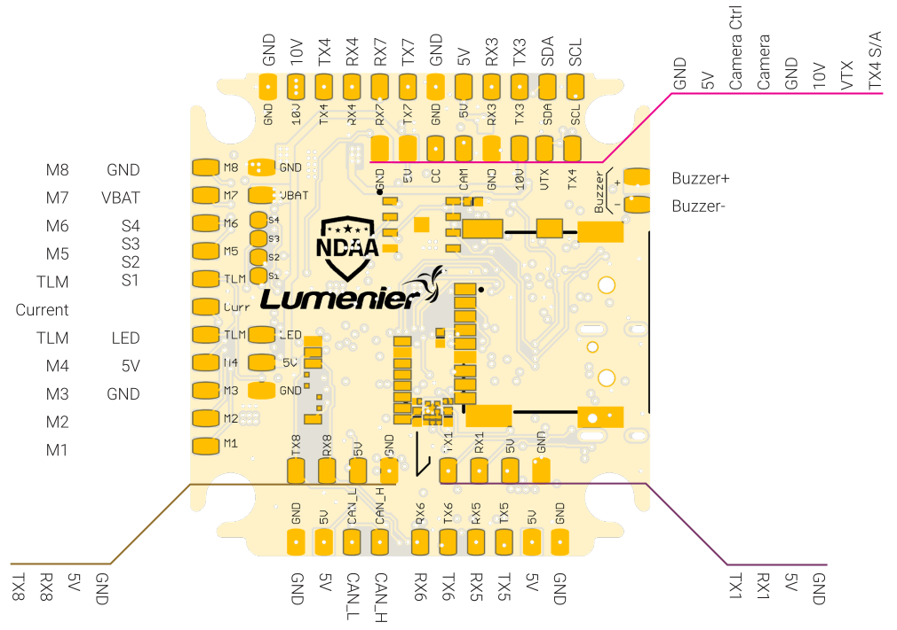

# Lumenier LUX F765 Flight Controller - NDAA

The Lumenier LUX F765 NDAA flight controller is sold by 
[GetFPV](https://www.getfpv.com/lumenier-lux-f765-flight-controller-ndaa.html).

## Features

 - Processor: MCU STM32F765, 216MHz, 512KB RAM, 2MB Flash
 - ICM42688 IMU
 - BMP280 Barometer
 - microSD Card Slot
 - 12 PWM Outputs
 - I2C Ports for External Sensors
 - CANbus Support
 - 8 UART Ports
 - Buzzer Control
 - LED Strip Control
 - Analog Current Sensor Input
 - Analog Battery Sensor Input
 - USB Type-C (2.0)
 - Blackbox Storage - SD Card and Flash (128Mbit/16Mbyte)
 - Camera Control Output
 - AT7456E OSD
 - 10V Regulator for VTX Power
 - 5V Regulator for Accessories
 - Supported Firmware - Betaflight, Ardupilot, and PX4
 - NDAA compliant
 - Power Supply: 3S to 6S Battery Voltage

## Pinout

## UART Mapping

 - SERIAL0 -> USB
 - SERIAL1 -> USART1 (Telem1)
 - SERIAL2 -> UART5  (Telem2)
 - SERIAL3 -> USART3 (GPS1)
 - SERIAL4 -> UART8  (GPS2)
 - SERIAL5 -> USART2 (ESC Telemetry)
 - SERIAL6 -> UART4  (Spare)
 - SERIAL7 -> UART7  (Spare)
 - SERIAL8 -> USART6 (Spare)

Serial1 (USART1) is DMA capable and can be used for CRSF.

## SPI Mapping

   <table border="1" class="docutils">
   <tbody>
   <tr>
   <th>SPI</th>
   <th>Device</th>
   </tr>
   <tr>
   <td>1</td>
   <td>ICM42688</td>
   </tr>
   <tr>
   <td>2</td>
   <td>W25Q128JV Flash</td>
   </tr>
   <tr>
   <td>3</td>
   <td>AT756E</td>
   </tr>
   <tr>
   <td>4</td>
   <td>SD Card</td>

   </tr>
   </tbody>
   </table>

## Connectors

All connectors are JST SH 1.0mm pitch EXCEPT for the CANbus port, which is JST GH 1.25mm pitch.

### ESC #1 Port

   <table border="1" class="docutils">
   <tbody>
   <tr>
   <th>Pin </th>
   <th>Signal </th>
   <th>Volt </th>
   </tr>
   <tr>
   <td>1</td>
   <td>VCC</td>
   <td>VBAT</td>
   </tr>
   <tr>
   <td>2 </td>
   <td>GND</td>
   <td>GND</td>
   </tr>
   <tr>
   <td>3</td>
   <td>CURRENT</td>
   <td>+3.3V</td>
   </tr>
   <tr>
   <td>4</td>
   <td>TELEMETRY</td>
   <td>+3.3V</td>
   </tr>
   <tr>
   <td>5</td>
   <td>MOTOR 1 (TIM2_CH1)</td>
   <td>+3.3V</td>
   </tr>
   <tr>
   <td>6</td>
   <td>MOTOR 2 (TIM2_CH2)</td>
   <td>+3.3V</td>
   </tr>
   <tr>
   <td>7</td>
   <td>MOTOR 3 (TIM2_CH3)</td>
   <td>+3.3V</td>
   </tr>
   <tr>
   <td>8</td>
   <td>MOTOR 4 (TIM2_CH4)</td>
   <td>+3.3V</td>
   </tr>
   </tbody>
   </table>
   
### ESC #2 Port

   <table border="1" class="docutils">
   <tbody>
   <tr>
   <th>Pin </th>
   <th>Signal </th>
   <th>Volt </th>
   </tr>
   <tr>
   <td>1</td>
   <td>NOT CONNECTED</td>
   <td>NOT CONNECTED</td>
   </tr>
   <tr>
   <td>2 </td>
   <td>GND</td>
   <td>GND</td>
   </tr>
   <tr>
   <td>3</td>
   <td>NOT CONNECTED</td>
   <td>NOT CONNECTED</td>
   </tr>
   <tr>
   <td>4</td>
   <td>TELEMETRY</td>
   <td>+3.3V</td>
   </tr>
   <tr>
   <td>5</td>
   <td>MOTOR 5 (TIM4_CH1)</td>
   <td>+3.3V</td>
   </tr>
   <tr>
   <td>6</td>
   <td>MOTOR 6 (TIM4_CH2)</td>
   <td>+3.3V</td>
   </tr>
   <tr>
   <td>7</td>
   <td>MOTOR 7 (TIM4_CH3)</td>
   <td>+3.3V</td>
   </tr>
   <tr>
   <td>8</td>
   <td>MOTOR 8 (TIM4_CH4)</td>
   <td>+3.3V</td>
   </tr>
   </tbody>
   </table>

### GPS port

   <table border="1" class="docutils">
   <tbody>
   <tr>
   <th>Pin</th>
   <th>Signal</th>
   <th>Volt</th>
   </tr>
   <tr>
   <td>1</td>
   <td>+5V</td>
   <td>+5V</td>
   </tr>
   <tr>
   <td>2</td>
   <td>TX3</td>
   <td>+3.3V</td>
   </tr>
   <tr>
   <td>3</td>
   <td>RX3</td>
   <td>+3.3V</td>
   </tr>
   <tr>
   <td>4</td>
   <td>I2C3 SCL</td>
   <td>+3.3V</td>
   </tr>
   <tr>
   <td>5</td>
   <td>I2C3 SDA</td>
   <td>+3.3V</td>
   </tr>
   <tr>
   <td>6</td>
   <td>GND</td>
   <td>GND</td>
   </tr>
   </tbody>
   </table>

### HD VTX port

   <table border="1" class="docutils">
   <tbody>
   <tr>
   <th>Pin</th>
   <th>Signal</th>
   <th>Volt</th>
   </tr>
   <tr>
   <td>1</td>
   <td>+10V</td>
   <td>+10V</td>
   </tr>
   <tr>
   <td>2</td>
   <td>GND</td>
   <td>GND</td>
   </tr>
   <tr>
   <td>3</td>
   <td>TX4</td>
   <td>+3.3V</td>
   </tr>
   <tr>
   <td>4</td>
   <td>RX4</td>
   <td>+3.3V</td>
   </tr>
   <tr>
   <td>5</td>
   <td>GND</td>
   <td>GND</td>
   </tr>
   <tr>
   <td>6</td>
   <td>RX7</td>
   <td>+3V3</td>
   </tr>
   </tbody>
   </table>
   
### Receiver Port

   <table border="1" class="docutils">
   <tbody>
   <tr>
   <th>Pin</th>
   <th>Signal</th>
   <th>Volt</th>
   </tr>
   <tr>
   <td>1</td>
   <td>+5V</td>
   <td>+5V</td>
   </tr>
   <tr>
   <td>2</td>
   <td>GND</td>
   <td>GND</td>
   </tr>
   <tr>
   <td>3</td>
   <td>RX7</td>
   <td>+3.3</td>
   </tr>
   <tr>
   <td>4</td>
   <td>TX7</td>
   <td>+3.3V</td>
   </tr>
   </tbody>
   </table>
   
### CANbus Port

   <table border="1" class="docutils">
   <tbody>
   <tr>
   <th>Pin</th>
   <th>Signal</th>
   <th>Volt</th>
   </tr>
   <tr>
   <td>1</td>
   <td>+5V</td>
   <td>+5V</td>
   </tr>
   <tr>
   <td>2</td>
   <td>GND</td>
   <td>GND</td>
   </tr>
   <tr>
   <td>3</td>
   <td>CAN_H</td>
   <td>+5V</td>
   </tr>
   <tr>
   <td>4</td>
   <td>CAN_L</td>
   <td>+5V</td>
   </tr>
   </tbody>
   </table>

## PWM Output

The Lumenier LUX F7865 NDAA supports 12 PWM outputs. 
The 8 main PWM outputs are labeled M1 through M8.
The 4 auxilliary outputs are labeled S1 through S4. 

The 8 main PWM outputs are in 2 groups:

 - PWM 1 through 4 (M1 - M4) are in TIM2
 - PWM 5 through 8 (M5 - M8) are in TIM4

The 4 auxiliary PWM outputs are in 1 group:
 - PWM 9 through 12 (S1 - S4) are in TIM1

## Analog inputs

The LUX F765 NDAA has 2 analog inputs:

 - PC2 -> Battery Current
 - PC3 -> Battery Voltage

## Loading Firmware

The board comes pre-installed with Betaflight firmware when purchased from GetFPV. 
The board can be easily transitioned from Betaflight to Ardupilot in a matter of minutes. 
Please see the [product page](https://www.getfpv.com/lumenier-lux-f765-flight-controller-ndaa.html)
for firmware binaries and instructions on how to transition from Betaflight to Ardupilot.

Initial firmware load can be done with DFU by plugging in USB with the
bootloader button pressed. Then you should load the "with_bl.hex"
firmware, using your favourite DFU loading tool.

Once the initial firmware is loaded you can update the firmware using
any ArduPilot ground station software. Updates should be done with the
*.apj firmware files.
