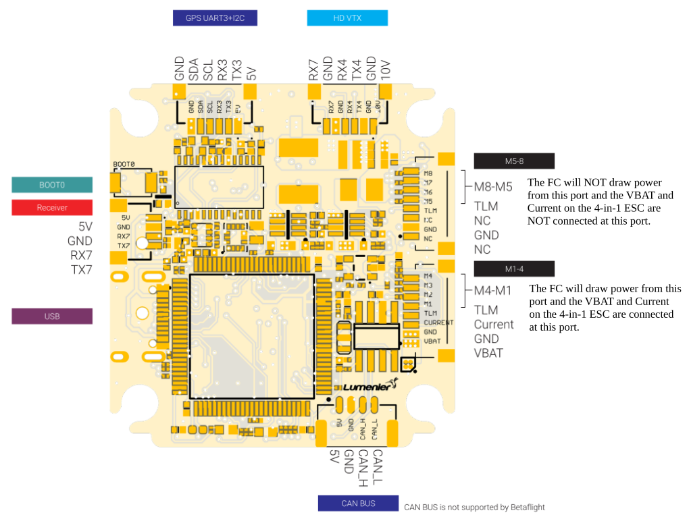

# Lumenier LUX F765 Flight Controller - NDAA

The Lumenier LUX F765 NDAA flight controller is sold by 
[GetFPV](https://www.getfpv.com/lumenier-lux-f765-flight-controller-ndaa.html).

## Features

 - Processor: MCU STM32F765, 216MHz, 512KB RAM, 2MB Flash
 - ICM42688 IMU
 - BMP280 Barometer
 - microSD Card Slot
 - 12 PWM Outputs
 - I2C Ports for External Sensors
 - CANbus Support
 - 8 UART Ports
 - Buzzer Control
 - LED Strip Control
 - Analog Current Sensor Input
 - Analog Battery Sensor Input
 - USB Type-C (2.0)
 - Blackbox Storage - SD Card and Flash (128Mbit/16Mbyte)
 - Camera Control Output
 - AT7456E OSD
 - 10V Regulator for VTX Power
 - 5V Regulator for Accessories
 - Supported Firmware - Betaflight, Ardupilot, and PX4
 - NDAA compliant
 - Power Supply: 3S to 6S Battery Voltage

## Pinout

## UART Mapping

 - SERIAL0 -> USB
 - SERIAL1 -> USART1 (Telem1, DMA enabled)
 - SERIAL2 -> UART5  (Telem2, DMA enabled)
 - SERIAL3 -> USART3 (GPS1, TX DMA enabled)
 - SERIAL4 -> UART8  (GPS2)
 - SERIAL5 -> USART2 (ESC Telemetry)
 - SERIAL6 -> UART4  (DisplayPort)
 - SERIAL7 -> UART7  (RCinput, DMA enabled)
 - SERIAL8 -> USART6 (Spare)

## SPI Mapping

   <table border="1" class="docutils">
   <tbody>
   <tr>
   <th>SPI</th>
   <th>Device</th>
   </tr>
   <tr>
   <td>1</td>
   <td>ICM42688</td>
   </tr>
   <tr>
   <td>2</td>
   <td>W25Q128JV Flash</td>
   </tr>
   <tr>
   <td>3</td>
   <td>AT7456E</td>
   </tr>
   <tr>
   <td>4</td>
   <td>SD Card</td>

   </tr>
   </tbody>
   </table>

## Connectors

All connectors are JST SH 1.0mm pitch EXCEPT for the CANbus port, which is JST GH 1.25mm pitch.

### ESC #1 Port

   <table border="1" class="docutils">
   <tbody>
   <tr>
   <th>Pin </th>
   <th>Signal </th>
   <th>Volt </th>
   </tr>
   <tr>
   <td>1</td>
   <td>VCC</td>
   <td>VBAT</td>
   </tr>
   <tr>
   <td>2 </td>
   <td>GND</td>
   <td>GND</td>
   </tr>
   <tr>
   <td>3</td>
   <td>CURRENT</td>
   <td>+3.3V</td>
   </tr>
   <tr>
   <td>4</td>
   <td>TELEMETRY</td>
   <td>+3.3V</td>
   </tr>
   <tr>
   <td>5</td>
   <td>MOTOR 1 (TIM2_CH1)</td>
   <td>+3.3V</td>
   </tr>
   <tr>
   <td>6</td>
   <td>MOTOR 2 (TIM2_CH2)</td>
   <td>+3.3V</td>
   </tr>
   <tr>
   <td>7</td>
   <td>MOTOR 3 (TIM2_CH3)</td>
   <td>+3.3V</td>
   </tr>
   <tr>
   <td>8</td>
   <td>MOTOR 4 (TIM2_CH4)</td>
   <td>+3.3V</td>
   </tr>
   </tbody>
   </table>
   
### ESC #2 Port

   <table border="1" class="docutils">
   <tbody>
   <tr>
   <th>Pin </th>
   <th>Signal </th>
   <th>Volt </th>
   </tr>
   <tr>
   <td>1</td>
   <td>NOT CONNECTED</td>
   <td>NOT CONNECTED</td>
   </tr>
   <tr>
   <td>2 </td>
   <td>GND</td>
   <td>GND</td>
   </tr>
   <tr>
   <td>3</td>
   <td>NOT CONNECTED</td>
   <td>NOT CONNECTED</td>
   </tr>
   <tr>
   <td>4</td>
   <td>TELEMETRY</td>
   <td>+3.3V</td>
   </tr>
   <tr>
   <td>5</td>
   <td>MOTOR 5 (TIM4_CH1)</td>
   <td>+3.3V</td>
   </tr>
   <tr>
   <td>6</td>
   <td>MOTOR 6 (TIM4_CH2)</td>
   <td>+3.3V</td>
   </tr>
   <tr>
   <td>7</td>
   <td>MOTOR 7 (TIM4_CH3)</td>
   <td>+3.3V</td>
   </tr>
   <tr>
   <td>8</td>
   <td>MOTOR 8 (TIM4_CH4)</td>
   <td>+3.3V</td>
   </tr>
   </tbody>
   </table>

### GPS port

   <table border="1" class="docutils">
   <tbody>
   <tr>
   <th>Pin</th>
   <th>Signal</th>
   <th>Volt</th>
   </tr>
   <tr>
   <td>1</td>
   <td>+5V</td>
   <td>+5V</td>
   </tr>
   <tr>
   <td>2</td>
   <td>TX3</td>
   <td>+3.3V</td>
   </tr>
   <tr>
   <td>3</td>
   <td>RX3</td>
   <td>+3.3V</td>
   </tr>
   <tr>
   <td>4</td>
   <td>I2C3 SCL</td>
   <td>+3.3V</td>
   </tr>
   <tr>
   <td>5</td>
   <td>I2C3 SDA</td>
   <td>+3.3V</td>
   </tr>
   <tr>
   <td>6</td>
   <td>GND</td>
   <td>GND</td>
   </tr>
   </tbody>
   </table>

### HD VTX port

   <table border="1" class="docutils">
   <tbody>
   <tr>
   <th>Pin</th>
   <th>Signal</th>
   <th>Volt</th>
   </tr>
   <tr>
   <td>1</td>
   <td>+10V</td>
   <td>+10V</td>
   </tr>
   <tr>
   <td>2</td>
   <td>GND</td>
   <td>GND</td>
   </tr>
   <tr>
   <td>3</td>
   <td>TX4</td>
   <td>+3.3V</td>
   </tr>
   <tr>
   <td>4</td>
   <td>RX4</td>
   <td>+3.3V</td>
   </tr>
   <tr>
   <td>5</td>
   <td>GND</td>
   <td>GND</td>
   </tr>
   <tr>
   <td>6</td>
   <td>RX7</td>
   <td>+3V3</td>
   </tr>
   </tbody>
   </table>
   
### Receiver Port

   <table border="1" class="docutils">
   <tbody>
   <tr>
   <th>Pin</th>
   <th>Signal</th>
   <th>Volt</th>
   </tr>
   <tr>
   <td>1</td>
   <td>+5V</td>
   <td>+5V</td>
   </tr>
   <tr>
   <td>2</td>
   <td>GND</td>
   <td>GND</td>
   </tr>
   <tr>
   <td>3</td>
   <td>RX7</td>
   <td>+3.3</td>
   </tr>
   <tr>
   <td>4</td>
   <td>TX7</td>
   <td>+3.3V</td>
   </tr>
   </tbody>
   </table>
   
### CANbus Port

   <table border="1" class="docutils">
   <tbody>
   <tr>
   <th>Pin</th>
   <th>Signal</th>
   <th>Volt</th>
   </tr>
   <tr>
   <td>1</td>
   <td>+5V</td>
   <td>+5V</td>
   </tr>
   <tr>
   <td>2</td>
   <td>GND</td>
   <td>GND</td>
   </tr>
   <tr>
   <td>3</td>
   <td>CAN_H</td>
   <td>+5V</td>
   </tr>
   <tr>
   <td>4</td>
   <td>CAN_L</td>
   <td>+5V</td>
   </tr>
   </tbody>
   </table>

## PWM Output

The Lumenier LUX F765 NDAA supports 12 PWM outputs and a serial LED PWM output. 
All outputs are DShot capable. Outputs 1-4 are bi-directional DShot capable.
The 8 main PWM outputs are labeled M1 through M8.
The 4 auxiliary outputs are labeled S1 through S4. 

The 8 main PWM outputs are in 2 groups:

 - PWM 1 through 4 (M1 - M4) are in TIM2
 - PWM 5 through 8 (M5 - M8) are in TIM4

The auxiliary PWM outputs are grouped as follows:

 - PWM 9/10 (S1/S2) are in a group
 - PWM 11/12 (S3/S4) are in a group
 - PWM 13 (LED) is in a group

## RC Input

Bi-directional RC inputs like CRSF/ELRS are supported on UART7 (Serial7).
UART7 (Serial7) will also support all unidirectional RC protocols. 

## OSD Support

The LUX F765 - NDAA is equipped with an onboard AT7456E OSD. 
The AT7456E communicates with the flight controller on SPI3.

## Camera Control

The LUX F765 - NDAA has a camera control output on PE10, which corresponds to GPIO 82. Additionally, RELAY3 is pre-configured to control GPIO 82.

## Analog inputs

The LUX F765 NDAA has 2 analog inputs:

 - PC2 -> Battery Current
 - PC3 -> Battery Voltage

# Battery Monitor

The LUX F765 - NDAA has an internal voltage sensor and connections on the ESC connector
for an external current sensor input. The voltage sensor can handle up to an 8S battery.

The default parameters are as follows:
* :ref:`BATT_MONITOR<BATT_MONITOR>` = 4
* :ref:`BATT_VOLT_PIN<BATT_VOLT_PIN__AP_BattMonitor_Analog>` = 12
* :ref:`BATT_CURR_PIN<BATT_CURR_PIN__AP_BattMonitor_Analog>` = 13
* :ref:`BATT_VOLT_MULT<BATT_VOLT_MULT__AP_BattMonitor_Analog>` = 10.1
* :ref:`BATT_AMP_PERVLT<BATT_AMP_PERVLT__AP_BattMonitor_Analog>` = 17.0 (will need to be adjusted for whichever current sensor is attached)

## Compass

The LUX F765 - NDAA does not have a built-in compass, but you can attach an external compass using I2C on the SDA and SCL pads.

## Firmware

Firmware for the LUX F765 - NDAA can be found [here](https://firmware.ardupilot.org) in sub-folders labeled “LumenierLUXF765-NDAA".

## Loading Firmware

The LUX F765 - NDAA does not come with ArduPilot firmware pre-installed. Use instructions here to load ArduPilot the first time :ref:`common-loading-firmware-onto-chibios-only-boards`.

Initial firmware load can be done with DFU by plugging in USB with the
bootloader button pressed. Then you should load the "with_bl.hex"
firmware, using your favorite DFU loading tool.

Once the initial firmware is loaded you can update the firmware using
any ArduPilot ground station software. Updates should be done with the
*.apj firmware files.
