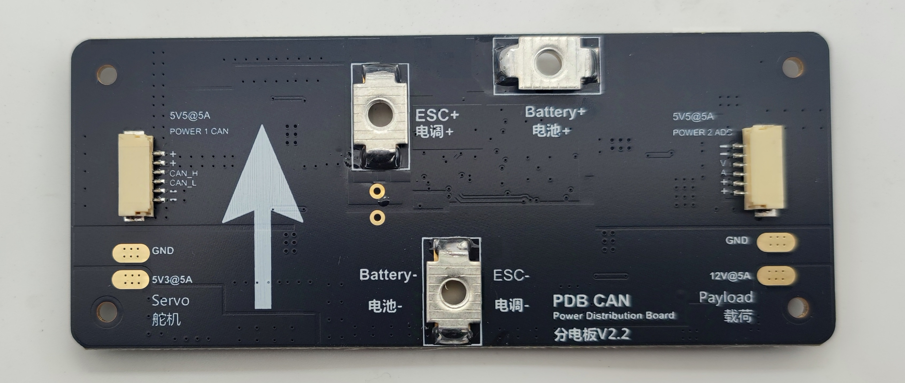

## MFE_PDB_CAN

The MFE_PDB_CAN is sold by a range of resellers listed on the makeflyeasy(http://www.makeflyeasy.com)

## Features

• STM32L431CCU6 microcontroller

• two power for autopilot(5.5V   5A)

• one power for servo(5.3V 5A)

• one power for load(12V 5A)

• Battery monitoring (power1 can, power2 adc)

## Picture

 
 Connector pin assignments
=========================

power1 ports
---------------

   <table border="1" class="docutils">
   <tbody>
   <tr>
   <th>PIN</th>
   <th>SIGNAL</th>
   <th>VOLT</th>
   </tr>
   <tr>
   <td>1</td>
   <td>VCC</td>
   <td>+5.5V</td>
   </tr>
   <tr>
   <td>2</td>
   <td>VCC</td>
   <td>+5.5V</td>
   </tr>
   <tr>
   <td>3</td>
   <td>CAN_H</td>
   <td>SINGAL</td>
   </tr>
   <tr>
   <td>4</td>
   <td>CAN_L</td>
   <td>SINGAL</td>
   </tr>
      <tr>
   <td>5</td>
   <td>GND</td>
   <td>GND</td>
   </tr>
      <tr>
   <td>6</td>
   <td>GND</td>
   <td>GND</td>
   </tr>
   </tbody>
   </table>
   
power2 ports
---------------

   <table border="1" class="docutils">
   <tbody>
   <tr>
   <th>PIN</th>
   <th>SIGNAL</th>
   <th>VOLT</th>
   </tr>
   <tr>
   <td>1</td>
   <td>VCC</td>
   <td>+5.5V</td>
   </tr>
   <tr>
   <td>2</td>
   <td>VCC</td>
   <td>+5.5V</td>
   </tr>
   <tr>
   <td>3</td>
   <td>CURRENT</td>
   <td>SINGAL</td>
   </tr>
   <tr>
   <td>4</td>
   <td>VALTAGE</td>
   <td>SINGAL</td>
   </tr>
      <tr>
   <td>5</td>
   <td>GND</td>
   <td>GND</td>
   </tr>
      <tr>
   <td>6</td>
   <td>GND</td>
   <td>GND</td>
   </tr>
   </tbody>
   </table>

power3 pad
---------------

   <table border="1" class="docutils">
   <tbody>
   <tr>
   <th>PIN</th>
   <th>SIGNAL</th>
   <th>VOLT</th>
   </tr>
   <tr>
   <td>1</td>
   <td>VCC</td>
   <td>+5.3V</td>
   </tr>
   <tr>
   <td>2</td>
   <td>GND</td>
   <td>+GND</td>
   </tr>

   </tbody>
   </table>

power4 pad
---------------

   <table border="1" class="docutils">
   <tbody>
   <tr>
   <th>PIN</th>
   <th>SIGNAL</th>
   <th>VOLT</th>
   </tr>
   <tr>
   <td>1</td>
   <td>VCC</td>
   <td>+12V</td>
   </tr>
   <tr>
   <td>2</td>
   <td>GND</td>
   <td>+GND</td>
   </tr>

   </tbody>
   </table>
   
 Connector pin assignments
=========================

BATT_VOLT_MULT  17.93387

BATT_AMP_PERVLT 22.0

Where to Buy
============

[www.makeflyeasy.com](www.makeflyeasy.com)

