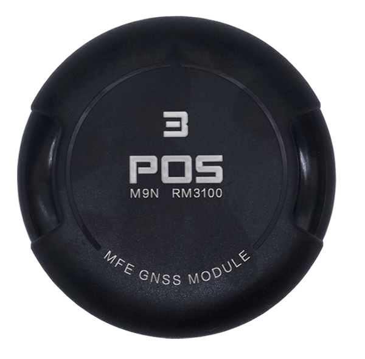

## MFE_POS3_CAN

The MFE_POS3_CAN is sold by a range of resellers listed on the makeflyeasy(http://www.makeflyeasy.com)

## Features

• STM32F427VIT6 microcontroller

• RM3100 compass

• NEO-M9N 

• one CAN port

• Blue led

## Picture

## Pinout
 
 Connector pin assignments
=========================

CAN1 ports
---------------

   <table border="1" class="docutils">
   <tbody>
   <tr>
   <th>PIN</th>
   <th>SIGNAL</th>
   <th>VOLT</th>
   </tr>
   <tr>
   <td>1</td>
   <td>VCC</td>
   <td>+5V</td>
   </tr>
   <tr>
   <td>2</td>
   <td>CAN_H</td>
   <td>+12V</td>
   </tr>
   <tr>
   <td>3</td>
   <td>CAN_L</td>
   <td>+12V</td>
   </tr>
   <tr>
   <td>4</td>
   <td>GND</td>
   <td>GND</td>
   </tr>
   </tbody>
   </table>

Where to Buy
============

`makeflyeasy <http://www.makeflyeasy.com>`

