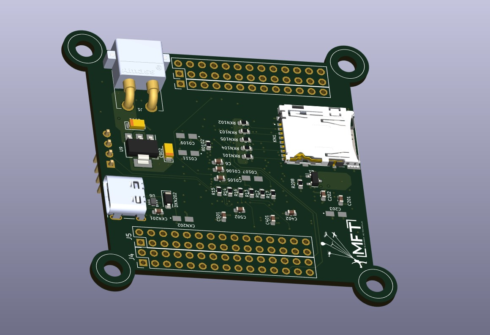
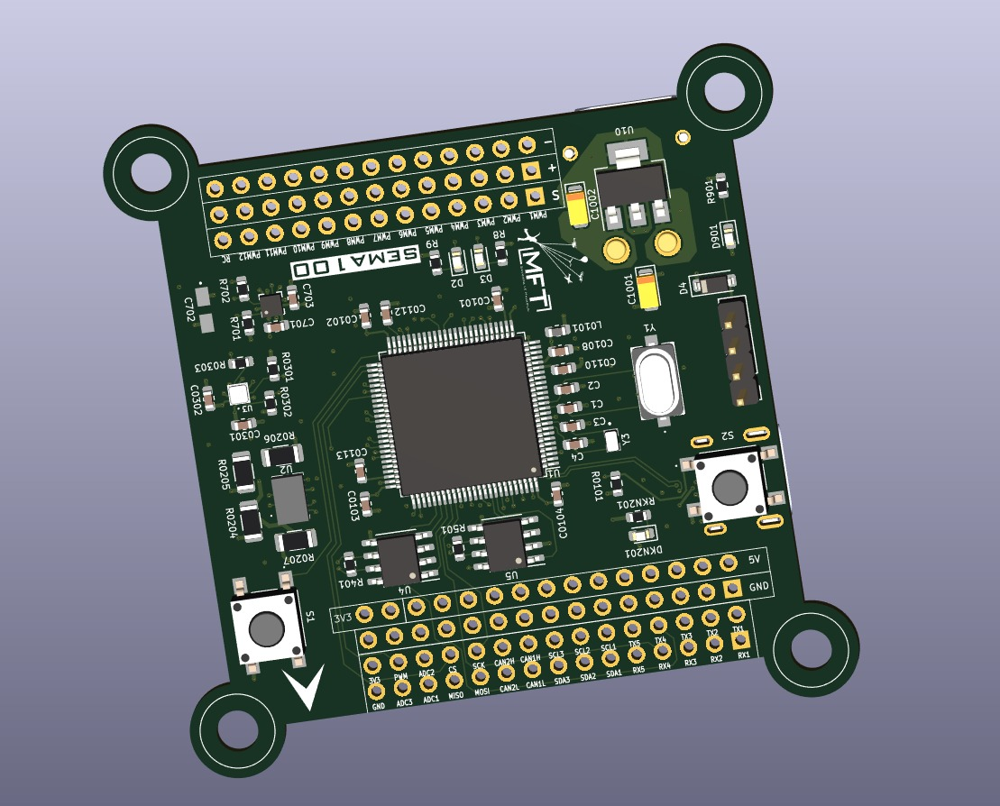

# MFT-SEMA100 Flight Controller

The MFT-SEMA100 is a flight controller designed and produced by MFT Savunma ve Havacılık LTD. ŞTİ.

## Features

 - STM32H743 microcontroller
 - BMI088 IMU
 - BMP390 barometer
 - LIB3MDL magnetometer
 - MicroSD Card Slot
 - 5 UARTs
 - 12 PWM outputs
 - 2 CANs
 - 2 I2Cs

## Physical

## UART Mapping

 - SERIAL0 -> USB
 - SERIAL1 -> UART1 (MAVLink2, DMA-enabled)
 - SERIAL2 -> UART2 (MAVLink2, DMA-enabled)
 - SERIAL3 -> UART3 (GPS, DMA-enabled)
 - SERIAL4 -> UART5 (GPS2, DMA-enabled)
 - SERIAL5 -> UART7 (DMA-enabled)
 - SERIAL6 -> UART8 (RX only)

## Connectors

All pins are 2.54 mm Pin Headers 

## Power Connector

XT30-PW 5V Input for powering the board

## RC Input

The default RC input is configured on the UART8 RCIN pin.

## PWM Output

The MFT-SEMA100 supports up to 12 PWM outputs.

PWM outputs are grouped and every group must use the same output protocol:

1, 2 are Group 1;

3, 4 are Group 2;

5, 6, 7, 8 are Group 3;

9, 10 are Group 4;

11, 12 are Group 5;

Channels within the same group need to use the same output rate. 

## GPIOs
The numbering of the GPIOs for PIN variables in ArduPilot is:

PWM1 50
PWM2 51
PWM3 52
PWM4 53
PWM5 54
PWM6 55
PWM7 56
PWM8 57

PWM9 58
PWM10 59
PWM11 60
PWM12 61

## Battery Monitoring

The board has a internal voltage sensor and connections on the ESC connector for an external current sensor input.
The voltage sensor can handle up to 6S LiPo batteries.

The default battery parameters are:

 - BATT_MONITOR 4
 - BATT_VOLT_PIN 19
 - BATT_CURR_PIN 8
 - BATT_VOLT_MULT 10
 - BATT_AMP_PERVLT 10

## Compass

The MFT-SEMA100 has a built-in compass sensor (LIB3MDL), and you can also attach an external compass using I2C on the SDA and SCL connector.

## IMU Heater

The IMU heater in the MFT-SEMA100 can be controlled with the BRD_HEAT_TARG parameter, which is in degrees C.

## Mechanical

 - Mounting: 55 x 56 mm, Φ4 mm
 - Dimensions: 64 x 65 x 10 mm
 - Weight: 15g

## Loading Firmware

The board comes pre-installed with an ArduPilot compatible bootloader, allowing the loading of *.apj firmware files with any ArduPilot compatible ground station.
