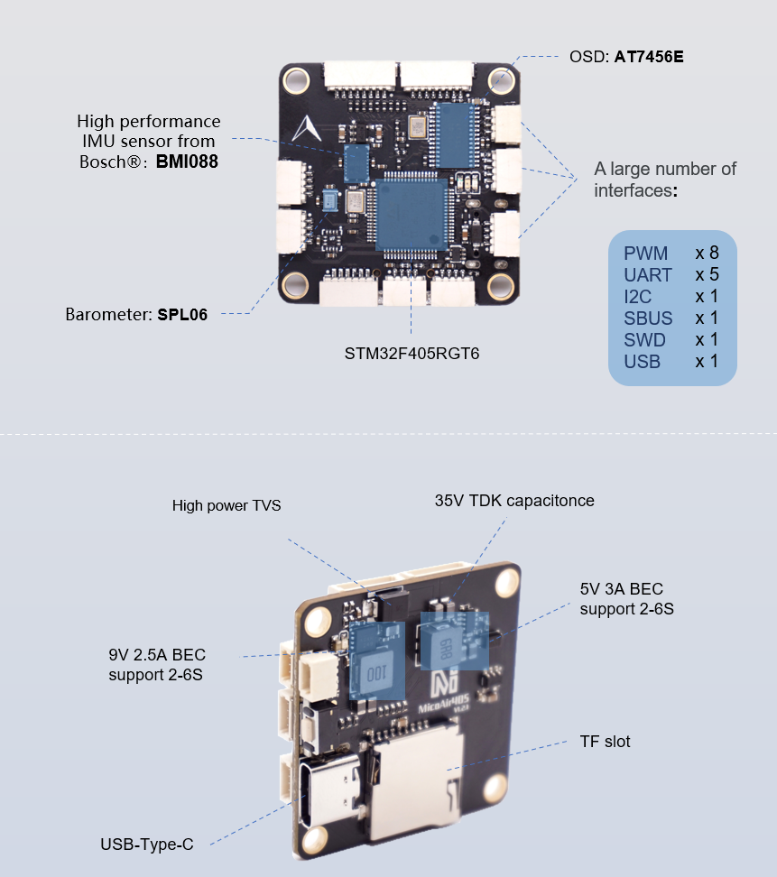
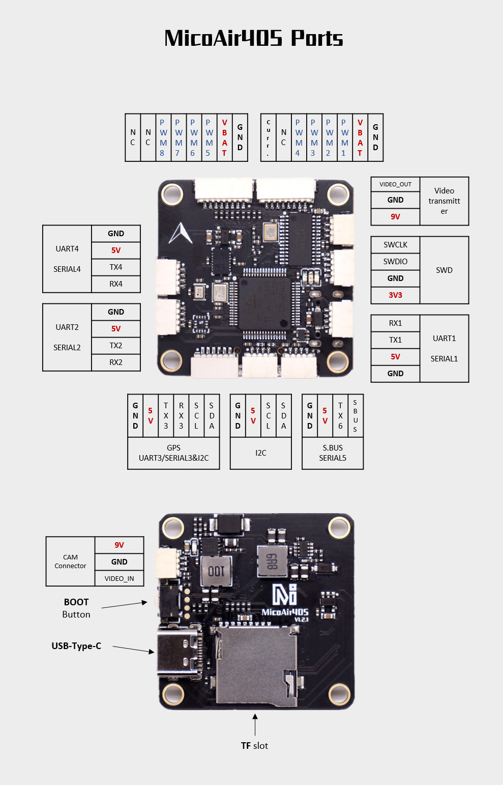

#  Overview

The MicoAir405 is a new cost-effective flight controller runs Ardupilot & INAV firmware, designed and manufactured by MicoAir Technology.

This is the first one which combine the STM32F405 with the high performance IMU sensor BMI088, allowing the flight controllers to have top performance and an attractive price at the same time.

The BMI088 is a high-performance 6-axis IMU sensor that comes from Bosch®, its excellent temperature stability and vibration robustness far exceed similar products on the market, making it particularly suitable for drones and robotics applications. 

The MicoAir405 also integrates a high-performance barometer:spl06, and OSD chip: AT7456E, 2 DC-DC channels to provide 5V-3A and 9V-2.5A power output. These characteristics make this controllers particularly suitable for long range FPV drones.

# Technical Specification

- Processors & Sensors

  - Processor : STM32F405RGT6
  - Accel/Gyro : BMI088
  - Barometer : SPL06
  - OSD : AT7456E

# Electrical data
- Input voltage range : 6 - 28V
- USB Power Input : 4.75~5.25V
- BEC : 9V 2.5A; 5V 3A

# Mechanical data
- Dimensions : 36 * 36 * 8mm
- Hole size : M3 (30.5 * 30.5mm)
- Weight : 9g

# Interfaces
- 8 PWM outputs 

- 3 general purpose serial ports
  - Uart1/Serial1
  - Uart2/Serial2
  - Uart4/Serial4

- 1 GPS ports
  - GPS1/Uart3/Serial3

- 1 S.BUS input port

- 1 I2C port

- 1 Debug port(SWD)

- 1 Current ADC ports

- 1 USB-Type-C

- 1 TF slot

# Pin out

# Other Characteristics

- Operating temperature : -40 ~ 85°c