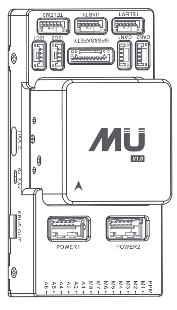
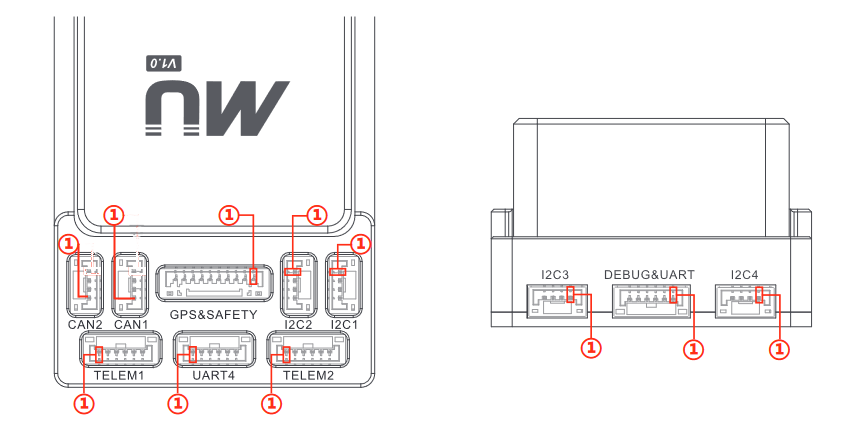
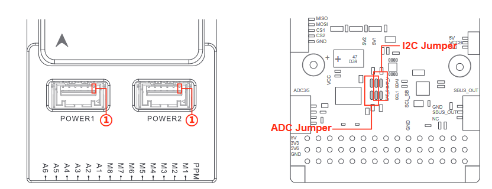
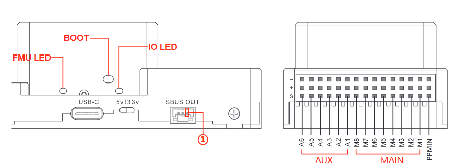
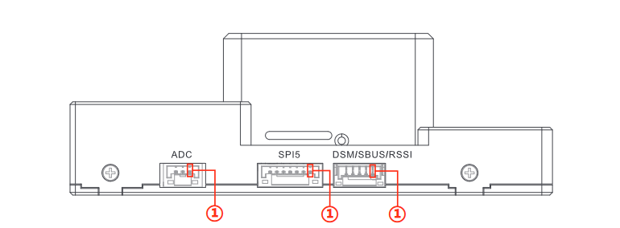

# MUPilot Flight Controller

The MUPilot flight controller is sold by [MUGIN UAV](http://https://www.muginuav.com/)

## Features

 - STM32F765 Microcontroller
 - STM32F103 IOMCU
 - Three IMUs: ICM20689, MPU6000 and BMI055
 - Internal vibration isolation for IMUs
 - Two MS5611 SPI barometers
 - IST8310 magnetometer
 - MicroSD card slot
 - 6 UARTs plus USB
 - 14 PWM outputs with selectable 5V or 3.3V output voltage
 - Four I2C and two CAN ports
 - External Buzzer
 - builtin RGB LED
 - external safety Switch
 - voltage monitoring for servo rail and Vcc
 - two dedicated power input ports for external power bricks
 
## Mechanical

 - 91mm x 46mm x 31mm
 - 106g 

## Connectors

**CAN1/2**

| Pin  | Signal | Volt  |
| :--: | :----: | :---: |
|  1   |  VCC   |  +5V  |
|  2   | CAN_H  | +3.3V |
|  3   | CAN_L  | +3.3V |
|  4   |  GND   |  GND  |

**GPS&SAFETY**

| Pin  |    Signal     | Volt  |
| :--: | :-----------: | :---: |
|  1   |      VCC      |  +5V  |
|  2   |    UART_TX1   | +3.3V |
|  3   |    UART_RX1   | +3.3V |
|  4   |    I2C1_SCL   | +3.3V |
|  5   |    I2C1_SDA   | +3.3V |
|  6   |   SAFETY_SW   | +3.3V |
|  7   | SAFETY_SW_LED | +3.3V |
|  8   |    3V3_OUT    | +3.3V |
|  9   |    BUZZER     | +3.3V |
|  10  |      GND      |  GND  |

**I2C1/2/3/4**

| Pin  | Signal   | Volt  |
| :--: | :------: | :---: |
|  1   |   VCC    |  +5V  |
|  2   | I2Cx_SCL | +3.3V |
|  3   | I2Cx _SDA| +3.3V |
|  4   |   GND    |  GND  |

**TELEM1**

| Pin  | Signal  | Volt  |
| :--: | :-----: | :---: |
|  1   |   VCC   |  +5V  |
|  2   | UART_TX2| +3.3V |
|  3   | UART_RX2| +3.3V |
|  4   |   CTS   | +3.3V |
|  5   |   RTS   | +3.3V |
|  6   |   GND   |  GND  |

**TELEM2**

| Pin  | Signal  | Volt  |
| :--: | :-----: | :---: |
|  1   |   VCC   |  +5V  |
|  2   | UART_TX6| +3.3V |
|  3   | UART_RX6| +3.3V |
|  4   |   CTS   | +3.3V |
|  5   |   RTS   | +3.3V |
|  6   |   GND   |  GND  |

**UART4(GPS2)**

| Pin  | Signal  | Volt  |
| :--: | :-----: | :---: |
|  1   |   VCC   |  +5V  |
|  2   |UART_TX3 | +3.3V |
|  3   |UART_RX3 | +3.3V |
|  4   |I2C2_SCL | +3.3V |
|  5   |I2C2_SDA | +3.3V |
|  6   |   GND   |  GND  |

**DEBUG**

| Pin  | Signal | Volt  |
| :--: | :----: | :---: |
|  1   |  VCC   |  +5V  |
|  2   |UART_TX7| +3.3V |
|  3   |UART_RX7| +3.3V |
|  4   | SWDIO  | +3.3V |
|  5   | SWCLK  | +3.3V |
|  6   |  GND   |  GND  |

**POWER1**

| Pin  |     Signal      | Volt  |
| :--: | :-------------: | :---: |
|  1   |     VCC_IN      |  +5V  |
|  2   |     VCC_IN      |  +5V  |
|  3   | CURRENT_ADC     | +3.3V |
|  4   | VOLTAGE_ADC     | +3.3V |
|  5   |       GND       |  GND  |
|  6   |       GND       |  GND  |

**POWER2**

| Pin  |     Signal         | Volt  |
| :--: | :----------------: | :---: |
|  1   |     VCC_IN         |  +5V  |
|  2   |     VCC_IN         |  +5V  |
|  3   |CURRENT_ADC/I2C1_SCL| +3.3V |
|  4   |VOLTAGE_ADC/I2C1_SDA| +3.3V |
|  5   |       GND          |  GND  |
|  6   |       GND          |  GND  |

**SBUS  OUT**

| Pin  | Signal | Volt  |
| :--: | :----: | :---: |
|  1   | -      |   -   |
|  2   |SBUS OUT| +3.3V |
|  3   | GND    |  GND  |

**ADC**

| Pin  | Signal  | Volt  |
| :--: | :-----: | :---: |
|  1   |   VCC   |  +5V  |
|  2   | ADC_3V3 | +3.3V |
|  3   | ADC_6V6 | +6.6V |
|  4   |   GND   |  GND  |

**SPI5**

| Pin  | Signal | Volt  |
| :--: | :----: | :---: |
|  1   |  VCC   |  +5V  |
|  2   |  SCK   | +3.3V |
|  3   |  MISO  | +3.3V |
|  5   |  MOSI  | +3.3V |
|  6   |  CS1   | +3.3V |
|  7   |  CS2   | +3.3V |
|  8   |  GND   |  GND  |

**DSM/SBUS/RSSI**

| Pin  |    Signal   | Volt  |
| :--: | :---------: | :---: |
|  1   |    VCC      | +5V   |
|  2   |   DSM/SBUS  | +3.3V |
|  3   |   RSSI      | +3.3V |
|  4   |   3V3_OUT   | +3.3V |
|  5   |   GND       |  GND  |

## UART Mapping

 - SERIAL0 -> USB
 - SERIAL1 -> UART2 (Telem1)
 - SERIAL2 -> UART3 (Telem2)
 - SERIAL3 -> UART1 (GPS)
 - SERIAL4 -> UART4 (GPS2)
 - SERIAL5 -> UART6 (spare)
 - SERIAL6 -> UART7 (spare, debug)
 - SERIAL7 -> USB2  (SLCAN)

The Telem1 and Telem2 ports have RTS/CTS pins, the other UARTs do not
have RTS/CTS.

The UART7 connector is labelled debug, but is available as a general
purpose UART with ArduPilot.

## RC Input
 
RC input is configured on the PPM pin, at one end of the servo rail,
marked RC in the above diagram. This pin supports all unidirectional RC protocols including PPM.  The DSM/SBUS pin is also tied to the PPM pin.For CRSF/ELRS/etc. protocols
a full UART will need to be used with its SERIALx_PROTOCOL set to "23".

## PWM Output

The MUPilot supports up to 14 PWM outputs. First first 8 outputs (labelled
"M1 to M8") are controlled by a dedicated STM32F103 IO controller. These 8
outputs support all PWM output formats, but not DShot.

The remaining 6 outputs (labelled A1 to A6) are the "auxiliary"
outputs. These are directly attached to the STM32F765 and support all
PWM protocols as well as DShot.

All 14 PWM outputs have GND on the top row, 5V on the middle row and
signal on the bottom row.

The 8 main PWM outputs are in 3 groups:

 - PWM 1 and 2 in group1
 - PWM 3 and 4 in group2
 - PWM 5, 6, 7 and 8 in group3

The 6 auxiliary PWM outputs are in 2 groups:

 - PWM 1, 2, 3 and 4 in group1
 - PWM 5 and 6 in group2

Channels within the same group need to use the same output rate. If
any channel in a group uses DShot then all channels in the group need
to use DShot.

The output levels of the auxiliary outputs can be selected by switch to be either 3.3V or 5V. The output level is 3.3V for the main outputs.

## Battery Monitoring

The board has two dedicated power monitor ports on 6 pin
connectors. The correct battery setting parameters are dependent on
the type of power brick which is connected. The first is analog only, the second may be either analog or I2C, depending on baseboard jumpers. 
In order to enable monitoring, the BATT_MONITOR or BATT2_MONIOT parameter must be set. By default :ref:`BATT_MONITOR<BATT_MONITOR>` is set to "4" for the included power module..

Default params for the first monitor are set and are:

- BATT_VOLT_PIN = 2
- BATT_CURR_PIN = 1
- BATT_VOLT_MULT = 18.0
- BATT_AMP_PERVLT = 24.0 (may need adjustment if supplied monitor is not used)

## Compass

The MUPilot has a builtin IST8310 compass. Due to potential
interference the board is usually used with an external I2C compass as
part of a GPS/Compass combination.

## GPIOs

The 6 auxiliary outputs can be used as GPIOs (relays, buttons, RPM etc). To
use them see https://ardupilot.org/rover/docs/common-gpios.html

The numbering of the GPIOs for PIN variables in ArduPilot is:

 - MAIN1 101
 - MAIN2 102
 - MAIN3 103
 - MAIN4 104
 - MAIN5 105
 - MAIN6 106
 - MAIN7 107
 - MAIN8 108
 - AUX1 50
 - AUX2 51
 - AUX3 52
 - AUX4 53
 - AUX5 54
 - AUX6 55

## Analog inputs

The MUPilot has 7 analog inputs

 - ADC Pin0 -> Battery Voltage
 - ADC Pin1 -> Battery Current Sensor
 - ADC Pin2 -> Battery Voltage 2
 - ADC Pin3 -> Battery Current Sensor 2
 - ADC Pin4 -> ADC port pin 2
 - ADC Pin14 -> ADC port pin 3
 - ADC Pin10 -> Board 5V Sense
 - ADC Pin11 -> Board 3.3V Sense
 - ADC Pin103 -> RSSI voltage monitoring

## Loading Firmware

The board comes pre-installed with an ArduPilot compatible bootloader,
allowing the loading of \*.apj firmware files with any ArduPilot
compatible ground station.

