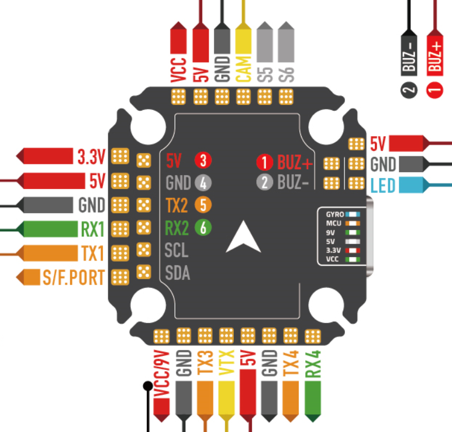

# Mamba Basic F405 MK4 Flight Controller

The Mamba Basic line of flight controllers are produced by [Diatone](https://www.diatone.us).

## Features

 - STM32F405RGT6 microcontroller
 - MPU6000 IMU
 - AT7456E OSD
 - 4 UARTs
 - 7 PWM outputs (6 Motor Output, 1 LED)

## Pinout

## UART Mapping

The UARTs are marked Rn and Tn in the above pinouts. The Rn pin is the
receive pin for UARTn. The Tn pin is the transmit pin for UARTn.
|Name|Pin|Function|
|:-|:-|:-|
|SERIAL0|COMPUTER|USB|
|SERIAL1|PPM/RX1/SBUS/TX1|UART1 (RC Input)|
|SERIAL2|TX2/RX2|UART2 (DMA-enabled)|
|SERIAL3|TX3/RX3|UART3 (Telem1)|
|SERIAL4|TX4/RX4|UART4 (Empty)|
|SERIAL6|TX6/RX6|UART6 (GPS, DMA-enabled)|

## RC Input
 
RC input is configured on the PPM (UART1_RX) pin. It supports all RC protocols.
  
## OSD Support

The Mamba F405 MK4 supports OSD using OSD_TYPE 1 (MAX7456 driver).

## PWM Output

The Mamba F405 MK4 supports up to 7 PWM outputs. The pads for motor output ESC1 to ESC4 on the above diagram are for the 4 outputs. All outputs support DShot as well as all PWM types. Motors 1-4 support bi-directional DShot.

The PWM is in 4 groups:

 - PWM 1,2 in group1
 - PWM 3,4 in group2
 - PWM 5,6 in group3
 - PWM 7   in group4

Channels within the same group need to use the same output rate. If
any channel in a group uses DShot then all channels in the group need
to use DShot.

## Battery Monitoring

The board has a built-in voltage sensor. The voltage sensor can handle up to 6S
LiPo batteries.

The correct battery setting parameters are:

 - BATT_MONITOR 3
 - BATT_VOLT_PIN 11
 - BATT_VOLT_MULT around 11.0
 - BATT_CURR_PIN 13
 - BATT_CURR_MULT around 28 with the 20x20 40A ESC (calculated, needs to be verified)

## Compass

The Mamba Basic flight controllers do not have a builtin compass, but you can attach an external compass using I2C on the SDA and SCL pads.

## Alternate settings

It is possible to set alternate configurations with the BRD_ALT_CONFIG parameter.

|BRD_ALT_CONFIG|RX1 function|
|:----|:----|
|ALT 0(default) |RCININT|
|ALT 1|RX1/TX1|

## Loading Firmware

Initial firmware load can be done with DFU by plugging in USB with the
bootloader button pressed. Then you should load the "with_bl.hex"
firmware, using your favourite DFU loading tool.

Once the initial firmware is loaded you can update the firmware using
any ArduPilot ground station software. Updates should be done with the
*.apj firmware files.
