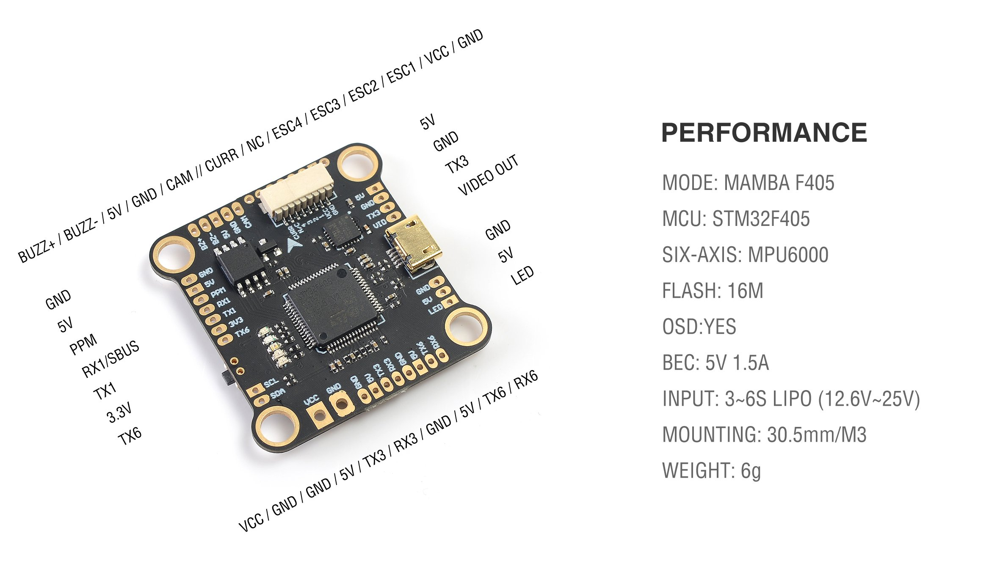

# Mamba F405 Flight Controller

https://www.diatoneusa.com/store/p587/MAMBA_F405_Betaflight_Flight_Controller_F40_40A_3-6S_DSHOT600_FPV_Racing_Brushless_ESC.html

The Mamba F405 is a flight controller produced by [Diatone](https://www.diatone.us).

## Features

 - STM32F405 microcontroller
 - MPU6000 IMU
 - AT7456E OSD
 - 4 UARTs
 - 4 PWM outputs

## Pinout

## UART Mapping

The UARTs are marked Rn and Tn in the above pinouts. The Rn pin is the
receive pin for UARTn. The Tn pin is the transmit pin for UARTn.
|Name|Pin|Function|
|:-|:-|:-|
|SERIAL0|COMPUTER|USB|
|SERIAL1|PPM/RX1/SBUS/TX1|UART1 (RC Input)|
|SERIAL3|TX3/RX3|UART3 (Telem1)|
|SERIAL6|TX6/RX6|UART6 (GPS)|

## RC Input
 
RC input is configured on the PPM (UART1_RX) pin. It supports all RC protocols.
The S.BUS pad provides an inverted input for S.BUS receivers.
  
## OSD Support

The Mamba F405 supports OSD using OSD_TYPE 1 (MAX7456 driver).

## PWM Output

The Mamba F405 supports up to 4 PWM outputs. The pads for motor output ESC1 to ESC4 on the above diagram are for the 4 outputs. All 4 outputs support DShot as well as all PWM types.

The PWM are in one group.

Channels within the same group need to use the same output rate. If
any channel in a group uses DShot then all channels in the group need
to use DShot.

## Battery Monitoring

The board has a builting voltage sensor. The voltage sensor can handle up to 6S
LiPo batteries.

The correct battery setting parameters are:

 - BATT_MONITOR 3
 - BATT_VOLT_PIN 13
 - BATT_VOLT_MULT around 12.0

## Compass

The Mamba F405 does not have a builting compass, but you can attach an external compass using I2C on the SDA and SCL pads.

## Alternate settings

It is possible to set alternate configurations with the BRD_ALT_CONFIG parameter.
The alternate configurations affects how RX1/TX1 (SERIAL1) and RX6/TX6 (SERIAL6) works.
It is possible to use RX1/TX1 as a RC input or as SERIAL1. It is possible to invert its input or not.
It is possible to use RX6/TX6 as SERIAL6 input or as an extra I2C port (I2C2).

|BRD_ALT_CONFIG|RX1 function|RX1 is inverted ?|RX6/TX6 function|
|:----|:----|:----|:----|
|ALT 0(default) |RCININT|not inverted|USART6|
|ALT 1|RCININT|inverted|USART6|
|ALT 2|RX1/TX1|not inverted|USART6|
|ALT 3|RX1/TX1|inverted|USART6|
|ALT 4|RCININT|not inverted|I2C2|
|ALT 5|RCININT|inverted|I2C2|
|ALT 6|RX1/TX1|not inverted|I2C2|
|ALT 7|RX1/TX1|inverted|I2C2|

## Loading Firmware

Initial firmware load can be done with DFU by plugging in USB with the
bootloader button pressed. Then you should load the "with_bl.hex"
firmware, using your favourite DFU loading tool.

Once the initial firmware is loaded you can update the firmware using
any ArduPilot ground station software. Updates should be done with the
*.apj firmware files.
