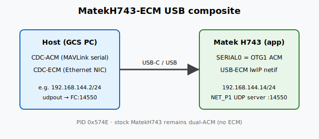

# MatekH743-ECM Flight Controller Target

Experimental **software** board target for [Matek H743](https://www.mateksys.com/) / H743-Mini
class hardware (same MCU and sensors as **MatekH743**), with USB configured as a
**CDC-ACM + CDC-ECM** composite instead of stock **dual CDC-ACM**.

This target is for lab / development use (USB tether IP + MAVLink). Prefer stock
**MatekH743** for normal flight builds unless you need ECM.



## Features (vs MatekH743)

- Same STM32H743 platform and pinout as **MatekH743** (see that target / Matek docs for hardware features)
- USB application firmware: **single CDC-ACM** (SERIAL0 / OTG1) + **CDC-ECM** Ethernet gadget
- Distinct USB product ID **0x574E** and product string `MatekH743-ECM` (stock dual-ACM uses 0x5740)
- Bootloader remains **ACM-only** (`USE_BOOTLOADER_FROM_BOARD MatekH743`) — ECM is not in the BL
- `AP_Networking` USB-ECM backend enabled; defaults for static IP and **UDP MAVLink2 server** on port **14550** (FC does not need GCS IP)

## Build

```bash
./waf configure --board MatekH743-ECM
./waf copter   # or plane / other vehicle as appropriate
```

## UART / USB mapping (application)

- SERIAL0 → USB CDC-ACM (OTG1) — GCS serial MAVLink
- No OTG2 / no second ACM (OTG2 dropped from `SERIAL_ORDER` so EP budget is for ECM)
- Other UARTs follow MatekH743 (Telem1 = UART7 / SERIAL1, etc.)

## Networking defaults (`defaults.parm`)

| Item | Default |
|------|---------|
| `NET_ENABLE` | 1 |
| `NET_DHCP` | 0 |
| `NET_IPADDR` | 192.168.144.14/24 |
| `NET_GWADDR` | 192.168.144.1 |
| `NET_P1_TYPE` | 2 (UDP **server**) |
| `NET_P1_PROTOCOL` | 2 (MAVLink2) |
| `NET_P1_PORT` | 14550 |
| `NET_P1_IP*` | 0.0.0.0 (listen; no peer IP required) |

Example host on the ECM NIC: `192.168.144.2/24`. GCS connects **to** the FC, e.g.:

```text
mavproxy.py --master=udpout:192.168.144.14:14550
```

QGroundControl: UDP **target host** `192.168.144.14` port `14550` (not only “listen for vehicle broadcast”).

## Notes

- Host OS may display the USB ECM **device** MAC on the host interface; if ARP fails, set a **distinct** host link address (e.g. macOS `ifconfig enX lladdr …`) different from the FC MAC.
- Do not enable `HAL_WITH_USB_CDC_ECM` on stock **MatekH743** without reviewing EP map and USB identity.
