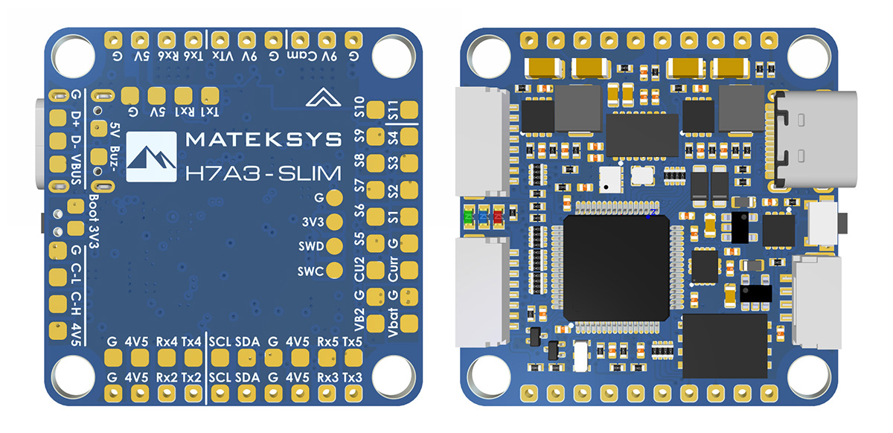

# Matek H7A3-slim Flight Controller

https://www.mateksys.com/?portfolio=h7a3-slim.

## Features
    Processor
        STM32H7A3RIT6 Cortex-M7 280 MHz, 2MB flash
    Sensors
        ICM-42688p Acc/Gyro
        SPL06-001 barometer
        AT7456E OSD
        W25N01GV dataflash
    Power
        2S - 6S Lipo input voltage with voltage monitoring
        9V, 2A BEC for powering Video Transmitter and camera controlled by GPIO
        5V, 2A BEC for internal and peripherals
    Interfaces
        11x PWM outputs DShot capable
        6x UARTs
        1x CAN
        1x I2C
        4x ADC
        128MB NAND for logging
        USB-C port
    LED
        Red, 3.3V power indicator
        Blue and Green, FC status
    Size
        36 x 36mm PCB with 30.5mm M3 mounting

  
## Overview

## Wiring Diagram

## UART Mapping

The UARTs are marked Rx* and Tx* in the above pinouts. The Rx* pin is the
receive pin for UART*. The Tx* pin is the transmit pin for UART*.

 - SERIAL0 -> USB
 - SERIAL1 -> USART1 (MAVLink2 telem)  (DMA capable)
 - SERIAL2 -> USART2 (Serial RC input) (DMA capable)
 - SERIAL3 -> USART3 (GPS)  (DMA capable)
 - SERIAL4 -> UART4  (User) (NO DMA)
 - SERIAL5 -> UART5  (User) (NO DMA)
 - SERIAL6 -> USART6 (User) (NO DMA)

## CAN and I2C

H7A3-SLIM supports 1x CAN bus and 1x I2C bus
multiple CAN peripherals can be connected to one CAN bus in parallel. similarly for I2C bus.

## RC Input

RC input is configured on the USART2(SERIAL2). It supports all serial RC protocols. SERIAL2_PROTOCOL=23 by default.
- PPM is not supported.
- CRSF requires Tx2 & Rx2 connection, and set SERIAL2_OPTIONS to “0” (default).
- SBUS/DSM/SRXL connects to the Rx2 pin, but SBUS requires that the SERIAL2_OPTIONS be set to “3”.
- FPort requires connection to Tx2, and set SERIAL2_OPTIONS to “7”.
- SRXL2 requires a connection to Tx2, and automatically provides telemetry. Set SERIAL2_OPTIONS to “4”.

   
## OSD Support

H7A3-SLIM supports using its internal OSD using OSD_TYPE 1 (MAX7456 driver). External OSD support such as DJI or DisplayPort is supported using any spare UART. See :ref:`common-msp-osd-overview-4.2` for more info.

## PWM Output

H7A3-SLIM supports up to 11 PWM outputs. All outputs support DShot.
The PWM is in 5 groups:

 - PWM 1,2    TIM1
 - PWM 3,4    TIM2
 - PWM 5,6,7,8  TIM3
 - PWM 9,10   TIM4
 - PWM 11     TIM16

## Battery Monitoring

The board has 2x built-in voltage dividers and 2x current ADC. support external 3.3V based current sensor

The correct battery setting parameters are set by default and are:

 - BATT_MONITOR 4

 - BATT_VOLT_PIN 10
 - BATT_CURR_PIN 11
 - BATT_VOLT_MULT 21.0 ("Vbat" pad support 5.5~30V input, limited by onboard regulator chips)
 - BATT_AMP_PERVLT X  ("Curr" pad, set it according to external current sensor spec)

 - BATT2_VOLT_PIN 18
 - BATT2_CURR_PIN 8
 - BATT2_VOLT_MULT 21.0  ("VB2" pad support Max.69V voltage sense)
 - BATT_AMP_PERVLT X ("CU2" pad, set it according to external current sensor spec)

## Compass

H7A3-SLIM does not have a built-in compass, but you can attach an external compass using I2C on the SDA and SCL pads.

## VTX power control

GPIO 81 controls the 9V BEC output to pins marked "9V". Setting this GPIO high removes voltage supply to pins. Default GPIO 81 is low(9V output enable)

## Loading Firmware
Firmware for these boards can be found at https://firmware.ardupilot.org in sub-folders labeled MatekH7A3.

Initial firmware load can be done with DFU by plugging in USB with the
boot button pressed. Then you should load the "ardu*_with_bl.hex" firmware, using your favourite DFU loading tool. eg STM32CubeProgrammer

Subsequently, you can update firmware with Mission Planner.

