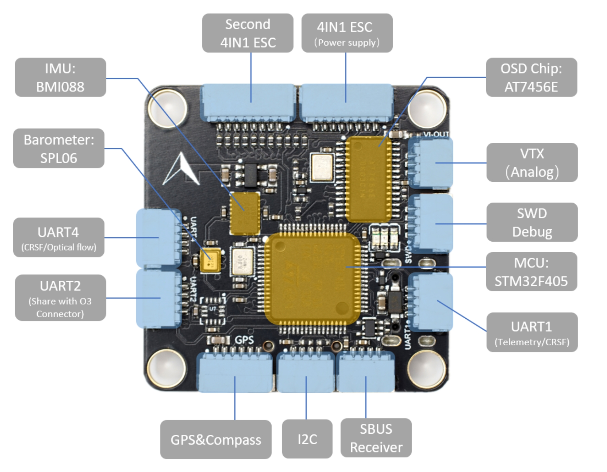
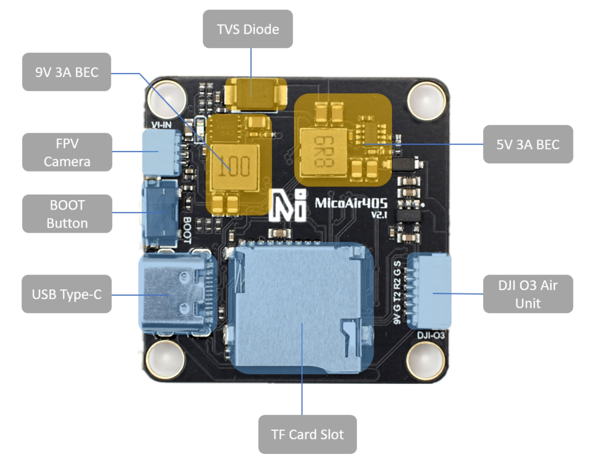
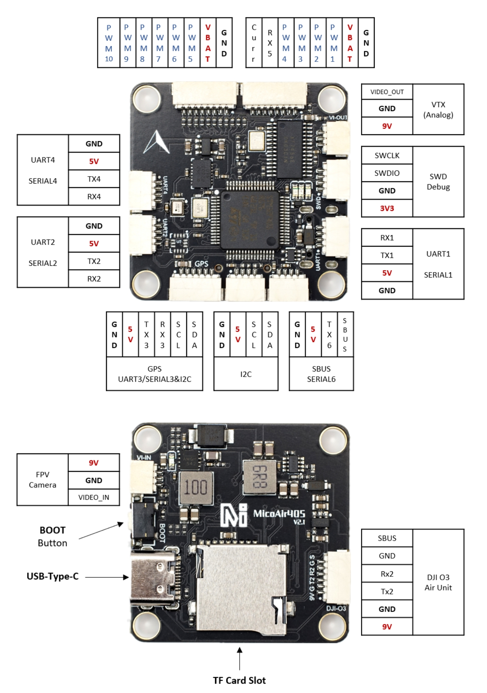

# MicoAir405v2 Flight Controller

The MicoAir405v2 is a flight controller produced by [MicoAir](http://micoair.com/).

## Features

 - STM32F405 microcontroller
 - BMI088 IMU
 - SPL06 barometer
 - AT7456E OSD
 - 9V 3A BEC; 5V 3A BEC
 - SDCard
 - 6 UARTs
 - 10 PWM outputs
 - 1 SWD

## Physical

## UART Mapping

 - SERIAL0 -> USB
 - SERIAL1 -> UART1 (DMA-enabled)
 - SERIAL2 -> UART2 (DJI - VTX, TX only is DMA Enabled)
 - SERIAL3 -> UART3 (GPS)
 - SERIAL4 -> UART4 (TX only is DMA Enabled)
 - SERIAL5 -> UART5 (ESC Telemetry)
 - SERIAL6 -> UART6 (RX6 is inverted from SBUS pin, RX only is DMA Enabled)

## RC Input

The default RC input is configured on the UART6_RX inverted from the SBUS pin. Other RC  protocols  should be applied at other UART port such as UART1 or UART4, and set the protocol to receive RC data: `SERIALn_PROTOCOL=23` and change SERIAL6 _Protocol to something other than '23'

## OSD Support

The MicoAir405v2 supports OSD using OSD_TYPE 1 (MAX7456 driver).

## VTX Support

The SH1.0-6P connector supports a standard DJI HD VTX connection. Pin 1 of the connector is 9v so be careful not to connect
this to a peripheral requiring 5v.

## PWM Output

The MicoAir405v2 supports up to 10 PWM outputs.

Channels 1-8 support DShot.

Channels 1-4 support bi-directional DShot.
PWM outputsare grouped and every  group must use the same output protocol:
1,2,5,6 are group1
3, 4 are group 2
7,8 are group 3
9,10 are in group 4

## Battery Monitoring

The board has a internal voltage sensor and connections on the ESC connector for an external current sensor input.
The voltage sensor can handle up to 6S LiPo batteries.

The default battery parameters are:

 - BATT_MONITOR 4
 - BATT_VOLT_PIN 10
 - BATT_CURR_PIN 11
 - BATT_VOLT_MULT 21.2
 - BATT_CURR_SCALE 40.2

## Compass

The MicoAir405v2 does not have a built-in compass, but you can attach an external compass using I2C on the SDA and SCL connector.

## Ports Connector

## Loading Firmware

Initial firmware load can be done with DFU by plugging in USB with the bootloader button pressed. Then you should load the "with_bl.hex" firmware, using your favorite DFU loading tool.

Once the initial firmware is loaded you can update the firmware using any ArduPilot ground station software. Updates should be done with the "*.apj" firmware files.
