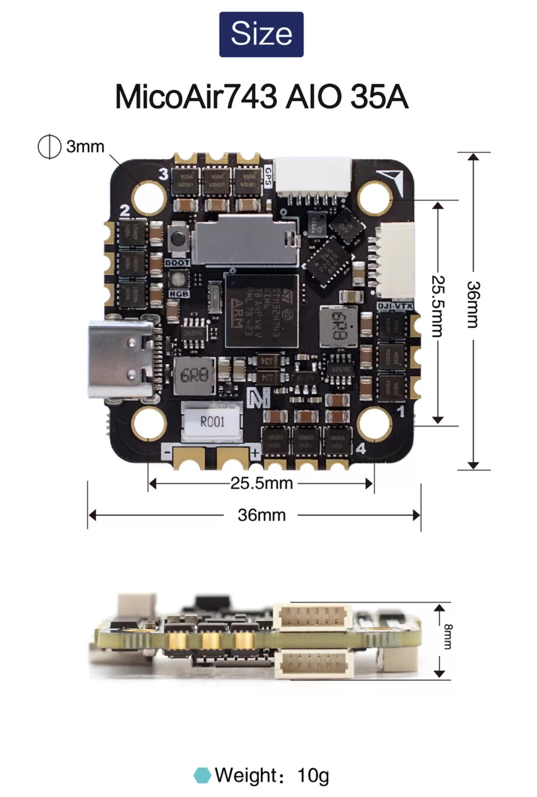
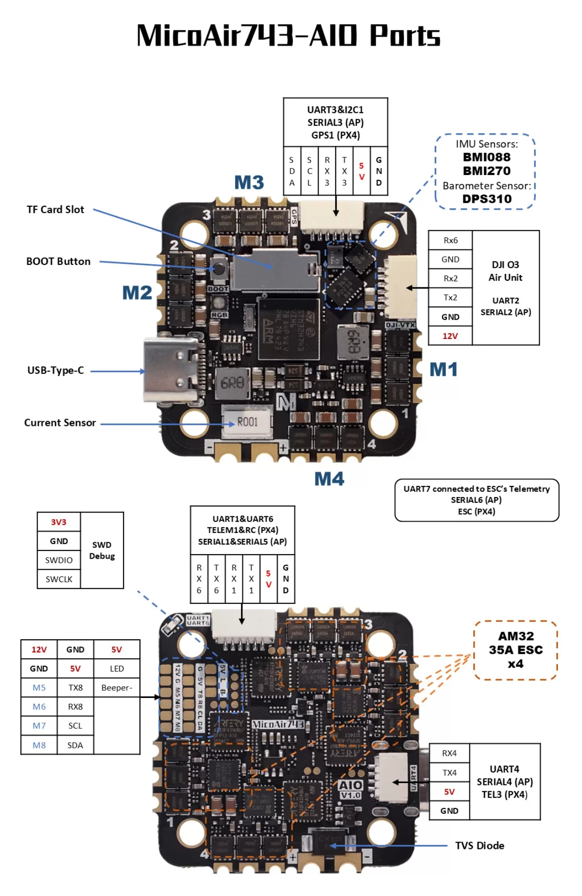

# MicoAir743-AIO Flight Controller

The MicoAir743-AIO is a flight controller designed and produced by [MicoAir Tech](http://micoair.com/).

## Features

 - STM32H743 microcontroller
 - BMI088/BMI270 dual IMUs
 - DPS310 barometer
 - 12V 2A BEC; 5V 2A BEC
 - MicroSD Card Slot
 - 7 UARTs
 - Integrated 4-in-1 AM32 35A ESC, 5 additional PWM outputs, one defaulted as serial LED

 - 1 I2C
 - 1 SWD

## Physical

## UART Mapping

 - SERIAL0 -> USB
 - SERIAL1 -> UART1 (MAVLink2, DMA-enabled)
 - SERIAL2 -> UART2 (DisplayPort, DMA-enabled)
 - SERIAL3 -> UART3 (GPS, DMA-enabled)
 - SERIAL4 -> UART4 (MAVLink2, DMA-enabled)
 - SERIAL5 -> UART6 (RCIN, DMA-enabled)
 - SERIAL6 -> UART7 (RX only, ESC Telemetry, DMA-enabled)
 - SERIAL7 -> UART8 (User, DMA-enabled)

## RC Input

The default RC input is configured on the UART6. The SBus input on the HD VTX connector is tied to RX6.

## VTX Support

The SH1.0-6P connector supports a DJI Air Unit / HD VTX connection. Protocol defaults to DisplayPort. Pin 1 of the connector is 12v so be careful not to connect this to a peripheral requiring 5v.

## PWM Output

The MicoAir743-AIO supports up to 9 PWM outputs.

All the channels support DShot.

Channels 1-8 support bi-directional DShot.

PWM outputs are grouped and every group must use the same output protocol:

1, 2, 3, 4 are Group 1;

5, 6 are Group 2;

7, 8, 9 are Group 3;

PWM1-4 are internally tied to the 4-in-1 ESC. PWM 9 is labelled as LED output on the board.
## Battery Monitoring

The board has internal voltage sensor and current sensor for battery.
The voltage input should be 3~6S LiPo batteries.

The default battery parameters are:

 - BATT_MONITOR 4
 - BATT_VOLT_PIN 10
 - BATT_CURR_PIN 11
 - BATT_VOLT_MULT 21.2
 - BATT_CURR_SCALE 14.14

## Compass

The MicoAir743-AIO does not have a built-in compass, but you can attach an external compass using I2C on the SDA and SCL connector.

## Mechanical

 - Mounting: 25.5 x 25.5mm, Φ3mm
 - Dimensions: 36 x 36 x 8 mm
 - Weight: 10g

## Ports Connector

## Loading Firmware

Initial firmware load can be done with DFU by plugging in USB with the bootloader button pressed. Then you should load the "with_bl.hex" firmware, using your favorite DFU loading tool.

Once the initial firmware is loaded you can update the firmware using any ArduPilot ground station software. Updates should be done with the "*.apj" firmware files.
