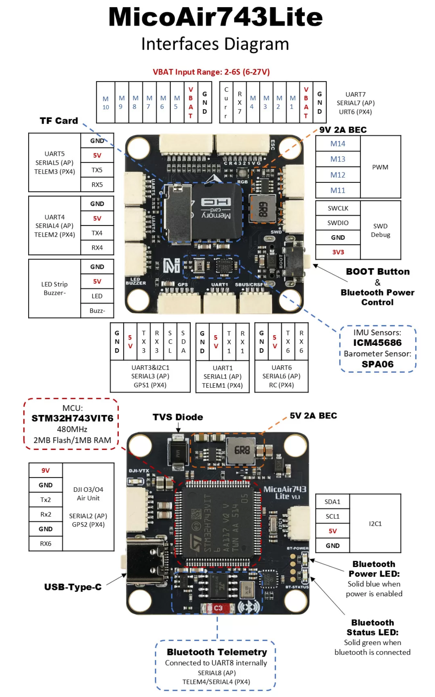

# MicoAir743-Lite Flight Controller

The MicoAir743-Lite is a flight controller designed and produced by [MicoAir Tech](http://micoair.com/).

## Features

 - STM32H743 microcontroller
 - ICM45686 IMU
 - Integrated BlueTooth module for telemetry
 - SPA06 barometer
 - 9V 2A BEC; 5V 2A BEC
 - MicroSD Card Slot
 - 8 UARTs
 - 15 PWM outputs
 - DJI O3/O4 VTX connector
 - 1 I2C
 - 1 SWD

## UART Mapping

 - SERIAL0 -> USB
 - SERIAL1 -> UART1 (MAVLink2, DMA-enabled)
 - SERIAL2 -> UART2 (DisplayPort, DMA-enabled)
 - SERIAL3 -> UART3 (GPS, DMA-enabled)
 - SERIAL4 -> UART4 (MAVLink2, DMA-enabled)
 - SERIAL5 -> UART5 (User, DMA-enabled)
 - SERIAL6 -> UART6 (RCIN, DMA-enabled)
 - SERIAL7 -> UART7 (RX only, ESC Telemetry, DMA-enabled)
 - SERIAL8 -> UART8 (MAVLink2, connected to on board BlueTooth module)

## RC Input

The UART6  is compatible with all ArduPilot supported receiver protocols, 

  * PPM is not supported.

  * SBUS/DSM/SRXL connects to the RX6 pin.

  * FPort requires connection to TX6. See FPort Receivers.

  *  CRSF also requires a TX6 connection, in addition to RX6, and automatically provides telemetry.

  *  SRXL2 requires a connection to TX6 and automatically provides telemetry. Set SERIAL6_OPTIONS to “4”.

Any UART can also be used for RC system connections in ArduPilot and is compatible with all protocols except PPM. See Radio Control Systems for details.

## OSD Support

The MicoAir743-Lite doesn’t have an onboard OSD chip, but DisplayPort OSD is available on the HD VTX connector, See below.

## VTX Support

The SH1.0-6P connector supports a DJI Air Unit / HD VTX connection. Protocol defaults to DisplayPort. Pin 1 of the connector is 9v so be careful not to connect this to a peripheral requiring 5v.

## PWM Output

The MicoAir743-Lite supports up to 15 PWM/DShot outputs.

Channels 1-8 support bi-directional DShot.

PWM outputs are grouped and every group must use the same output protocol:

1, 2, 3, 4 are Group 1;

5, 6, 7, 8 are Group 2;

9, 10 are Group 3;

11, 12, 15 are Group 4;

13, 14 are Group 5;

Note: PWM15 is the "LED" pin. If this is configured for serial LED use then PWM11 and 12 can only be used as serial LED also.

## Battery Monitoring

The board has a internal voltage sensor and connections on the ESC connector for an external current sensor input.

The voltage sensor can handle up to 6S LiPo batteries.

The default battery parameters are:

 - BATT_MONITOR 4
 - BATT_VOLT_PIN 10
 - BATT_CURR_PIN 11
 - BATT_VOLT_MULT 21.12
 - BATT_AMP_PERVLT 40.2 (may need adjustment according to ESC used)

## Compass

The MicoAir743-Lite doesn’t have a built-in compass sensor, but you can attach an external compass using I2C on the SDA and SCL connector.

## BlueTooth

The MicoAir743-Lite has an on board BlueTooth module connected to UART8(SERIAL8). The BlueTooth id is MicoAir743-Lite-xxxxxx and you can connect to it without pairing id.

## Mechanical

 - Mounting: 30.5 x 30.5mm, Φ4mm
 
 - Dimensions: 36 x 36 x 8 mm
 
 - Weight: 10g

## Ports Connector

## Loading Firmware
Firmware can be found on the `firmware server <https://firmare.ardupilot.org>`__ in folders marked "MicoAir743-Lite"

Initial firmware load can be done with DFU by plugging in USB with the bootloader button pressed. Then you should load the "XXXX_with_bl.hex" firmware, using your favorite DFU loading tool.

Once the initial firmware is loaded you can update the firmware using any ArduPilot ground station software. Updates should be done with the "\*.apj" firmware files.
