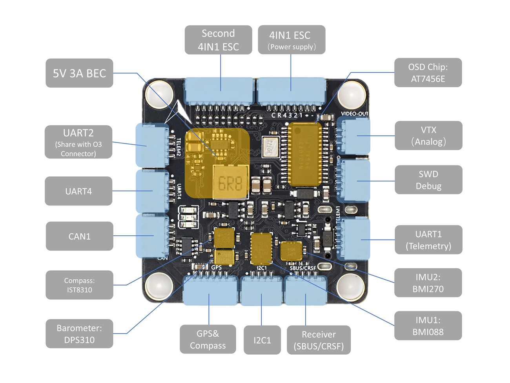
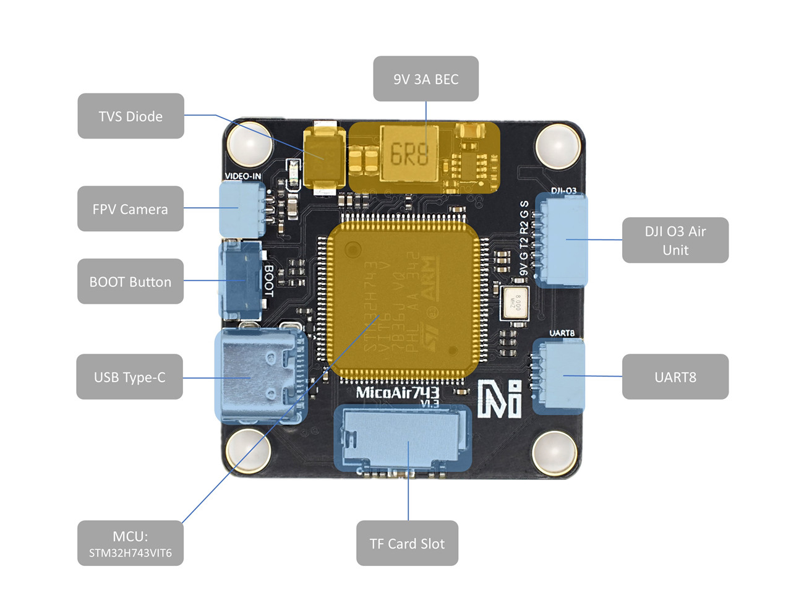
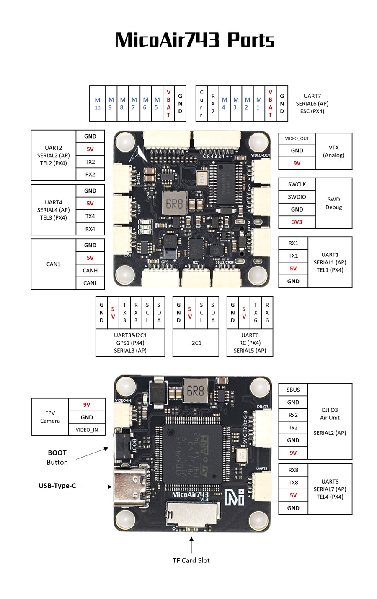

# MicoAir743 Flight Controller

The MicoAir743 is a flight controller designed and produced by [MicoAir Tech.](http://micoair.com/).

## Features

 - STM32H743 microcontroller
 - BMI088/BMI270 dual IMUs
 - DPS310 barometer
 - IST8310 magnetometer
 - AT7456E OSD
 - 9V 3A BEC; 5V 3A BEC
 - MicroSD Card Slot
 - 7 UARTs
 - 10 PWM outputs
 - 1 CAN
 - 1 I2C
 - 1 SWD

## Physical

## UART Mapping

 - SERIAL0 -> USB
 - SERIAL1 -> UART1 (MAVLink2, DMA-enabled)
 - SERIAL2 -> UART2 (DisplayPort, DMA-enabled)
 - SERIAL3 -> UART3 (GPS, DMA-enabled)
 - SERIAL4 -> UART4 (MAVLink2, DMA-enabled)
 - SERIAL5 -> UART6 (RCIN, DMA-enabled)
 - SERIAL6 -> UART7 (RX only, ESC Telemetry, DMA-enabled)
 - SERIAL7 -> UART8 (User, DMA-enabled)

## RC Input

The default RC input is configured on the UART6. The SBUS pin is inverted and connected to RX6. Non SBUS, single wire serial inputs can be directly tied to RX6 if SBUS pin is left unconnected. RC could  be applied instead at a different UART port such as UART1, UART4 or UART8, and set the protocol to receive RC data: `SERIALn_PROTOCOL=23` and change SERIAL5 _Protocol to something other than '23'.

## OSD Support

The MicoAir743 supports onboard OSD using OSD_TYPE 1 (MAX7456 driver). Simultaneously, DisplayPort OSD is available on the HD VTX connector, See below.

## VTX Support

The SH1.0-6P connector supports a DJI Air Unit / HD VTX connection. Protocol defaults to DisplayPort. Pin 1 of the connector is 9v so be careful not to connect this to a peripheral requiring 5v.

## PWM Output

The MicoAir743 supports up to 10 PWM outputs.

All the channels support DShot.

Channels 1-8 support bi-directional DShot.

PWM outputs are grouped and every group must use the same output protocol:

1, 2, 3, 4 are Group 1;

5, 6 are Group 2;

7, 8, 9, 10 are Group 3;

## Battery Monitoring

The board has a internal voltage sensor and connections on the ESC connector for an external current sensor input.
The voltage sensor can handle up to 6S LiPo batteries.

The default battery parameters are:

 - BATT_MONITOR 4
 - BATT_VOLT_PIN 10
 - BATT_CURR_PIN 11
 - BATT_VOLT_MULT 21.2
 - BATT_CURR_SCALE 40.2

## Compass

The MicoAir743 has a built-in compass sensor (IST8310), and you can also attach an external compass using I2C on the SDA and SCL connector.

## Mechanical

 - Mounting: 30.5 x 30.5mm, Φ4mm
 - Dimensions: 36 x 36 x 8 mm
 - Weight: 9g

## Ports Connector

## Loading Firmware

Initial firmware load can be done with DFU by plugging in USB with the bootloader button pressed. Then you should load the "with_bl.hex" firmware, using your favorite DFU loading tool.

Once the initial firmware is loaded you can update the firmware using any ArduPilot ground station software. Updates should be done with the "*.apj" firmware files.
