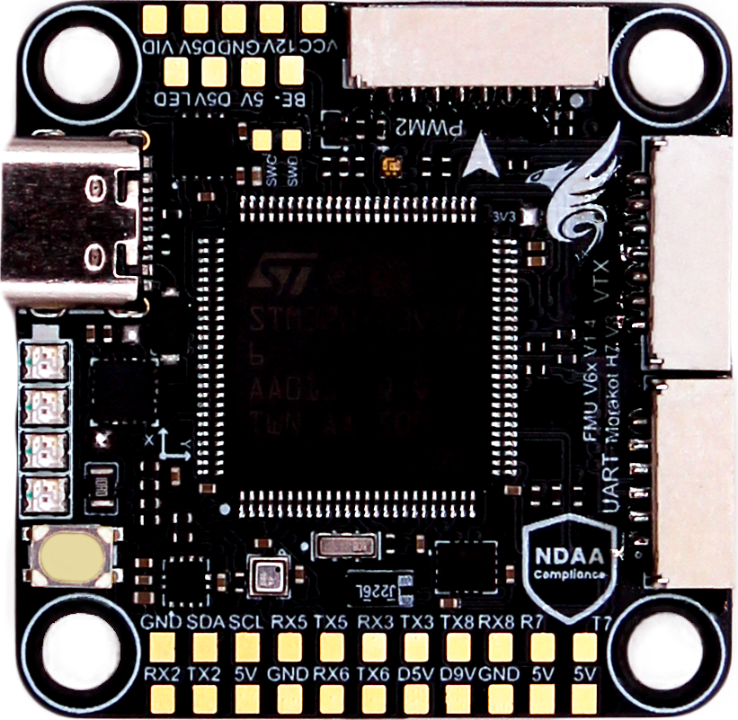
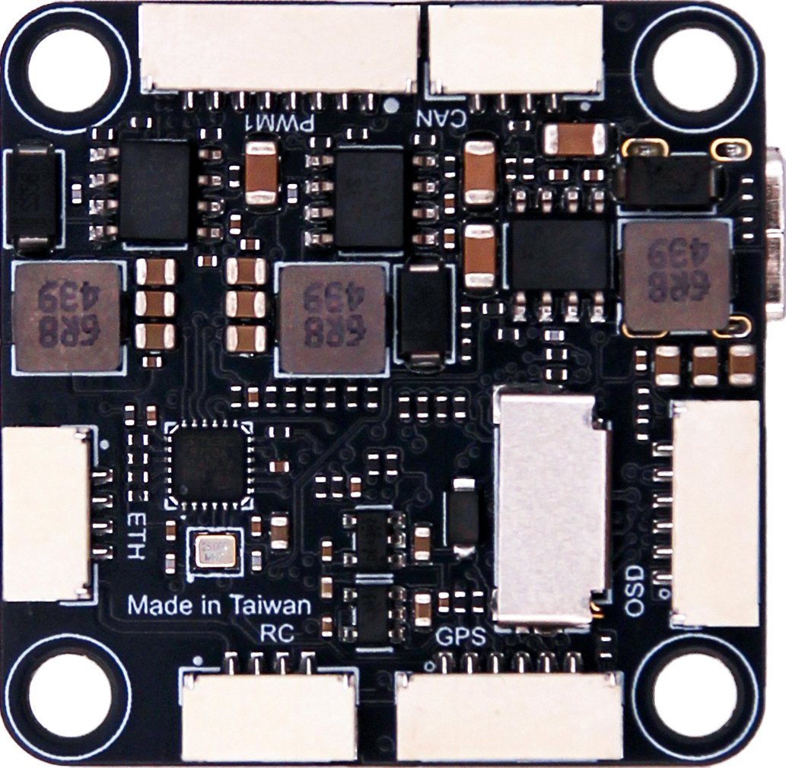
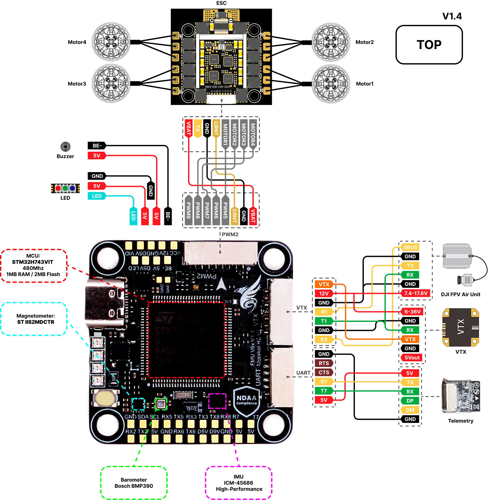

# Morakot Flight Controller Overview

The Morakot is a flight controller designed and produced by [Taiphoon](https://taiphoon.com.tw/)

Morakot Flight Controller — **NDAA-Compliant. Made in Taiwan.** Built for Performance.
Engineered, tested, and manufactured in Taiwan, the Morakot Flight Controller meets full NDAA compliance, ensuring trusted quality and security for professional applications. With an integrated Ethernet interface, it delivers high-speed, reliable connectivity for next-generation FPV and unmanned aerial systems.

## Pinout

## Features
#### Sensors
- [ICM-45686 High-Performance IMU](https://invensense.tdk.com/products/motion-tracking/6-axis/icm-45686/)
- [Bosch BMP390 Barometer](https://www.bosch-sensortec.com/products/environmental-sensors/pressure-sensors/bmp390/)
- [ST IIS2MDC Magnetometer](https://www.st.com/en/mems-and-sensors/iis2mdc.html)

#### Microprocessor
- [STM32H743VIT MCU](https://www.st.com/en/microcontrollers-microprocessors/stm32h743vi.html)
  - 480Mhz / 1MB RAM / 2MB Flash

#### Power
- 3S–8S DC Input power
- 5V 2A BEC peripherals power 
- 9V 2A BEC servos power 
- 12V 2A BEC video power

#### Other
- LED Indicators
- Battery voltage indicator LED
- MicroSD Slot
- 9x motor outputs
- 8x UART
- 1x I2C
- 1x CAN
- 1x Ethernet

### UART Mapping
UART Mapping
The UARTs are marked Rn and Tn in the above pinouts. The Rn pin is the receive pin for UARTn. The Tn pin is the transmit pin for UARTn.
Port      UART      Protocol        TX DMA  RX DMA
--------- --------- ---------------- ------- -------
0         USB       MAVLink2        ✘       ✘
1         USART1    MSP_DisplayPort ✔       ✔
2         USART2    MAVLink2        ✔       ✔
3         USART3    None            ✔       ✔
4         UART5     GPS             ✔       ✔
5         USART6    ESCTelemetry    ✔       ✔
6         UART7     MAVLink2        ✔       ✔
7         UART8     RCIN            ✔       ✔

RTS/CTS flow control is available on UART7.

### VTX Support
The JST-GH 7p connector supports a DJI Air Unit / HD VTX connection. Protocol defaults to DisplayPort. Pin 1 of the connector is 12v so be careful not to connect this to a peripheral that can not tolerate this voltage.

## Additional Information
- Dimensions: 38.5 x 30.5 mm
- Height: up to 8.5 mm
- Mounting: 30.5 x 30.5 mm (M3/M4 with dampers)
- Weight: 7 g

## More Information
- [Morakot Flight Controller](https://taiphoon.com.tw/morakot-flight-controllor)
- [Morakot documentation](https://taiphoon-com.gitbook.io/taiphoon.com-docs/flight-stack/morakot-flight-controller)

## Connetions
#### ESC1 - 8 Pin JST-GH
| Pin | Signal Name     | Voltage      |
|-----|-----------------|--------------|
| 1   | VBAT IN         | 12V-33.6V    |
| 2   | UART6_RX        | 3.3V         |
| 3   | GND             | 3.3V         |
| 4   | CURRENT         | 3.3V         |
| 5   | MOTOR/SERVO 1   | 3.3V         |
| 6   | MOTOR/SERVO 2   | 3.3V         |
| 7   | MOTOR/SERVO 3   | 3.3V         |
| 8   | MOTOR/SERVO 4   | 3.3V         |

#### ESC2 - 8 Pin JST-GH
| Pin | Signal Name     | Voltage      |
|-----|-----------------|--------------|
| 1   | VBAT IN         | 12V-33.6V    |
| 2   | GND             | 3.3V         |
| 3   | CURRENT         | 3.3V         |
| 4   | MOTOR/SERVO 5   | 3.3V         |
| 5   | MOTOR/SERVO 6   | 3.3V         |
| 6   | MOTOR/SERVO 7   | 3.3V         |
| 7   | MOTOR/SERVO 8   | 3.3V         |
| 8   | MOTOR/SERVO 9   | 3.3V         |

#### CAN - 4 Pin JST-GH
| Pin | Signal Name | Voltage |
|-----|-------------|---------|
| 1   | 5.0V        | 5.0V    |
| 2   | CAN1_H      | 5.0V    |
| 3   | CAN1_L      | 5.0V    |
| 4   | GND         | GND     |

#### GPS - 6 Pin JST-GH
| Pin | Signal Name         | Voltage |
|-----|---------------------|---------|
| 1   | 5.0V                | 5.0V    |
| 2   | UART5_TX            | 3.3V    |
| 3   | UART5_RX            | 3.3V    |
| 4   | I2C1_SCL            | 3.3V    |
| 5   | I2C1_SDA            | 3.3V    |
| 6   | GND                 | GND     |

#### UART(TELEM) - 6 Pin JST-GH
| Pin | Signal Name           | Voltage |
|-----|-----------------------|---------|
| 1   | 5.0V                  | 5.0V    |
| 2   | UART7_TX              | 3.3V    |
| 3   | UART7_RX              | 3.3V    |
| 4   | UART7_CTS             | 3.3V    |
| 5   | UART7_RTS             | 3.3V    |
| 6   | GND                   | GND     |

#### VTX - 7 Pin JST-GH
Note: connector pinout not in same order as standard HD VTX cabling
| Pin | Signal Name           | Voltage |
|-----|-----------------------|---------|
| 1   | VIDEO                 |         |
| 2   | 12.0V                 | 12.0V   |
| 3   | GND                   | GND     |
| 4   | USART1_RX             | 3.3V    |
| 5   | USART1_TX             | 3.3V    |
| 6   | GND                   | 3.3V    |
| 7   | USART3_RX             | GND     |

#### SPI (external OSD or IMU) - 6 Pin JST-SH
| Pin | Signal Name         | Voltage |
|-----|---------------------|---------|
| 1   | 5.0V                | 5.0V    |
| 2   | SPI4_MOSI           | 3.3V    |
| 3   | SPI4_MISO           | 3.3V    |
| 4   | SPI4_SCK            | 3.3V    |
| 5   | SPI4_CS             | 3.3V    |
| 6   | GND                 | GND     |

#### RC - 4 Pin JST-GH
| Pin | Signal Name         | Voltage |
|-----|---------------------|---------|
| 1   | 5.0V                | 5.0V    |
| 2   | UART8_RX            | 3.3V    |
| 3   | UART8_TX            | 3.3V    |
| 4   | GND                 | GND     |

#### ETH - 4 Pin JST-GH
| Pin | Signal Name         | Voltage |
|-----|---------------------|---------|
| 1   | RXN                 | 3.3V    |
| 2   | RXP                 | 3.3V    |
| 3   | TXN                 | 3.3V    |
| 4   | TXP                 | 3.3V    |

## RC Input

RC input is via SERIAL7(UART8) on the RC connector. Unidirectional protocols can be connected to R8. Bi-Directional Protocols will use the T8 pin also.
- PPM is not supported.  
- SBUS/DSM/SRXL connects to the RX8 pin.  
- FPort requires connection to TX8. Set :ref:`SERIAL7_OPTIONS<SERIAL7_OPTIONS>` = 7  
- CRSF/ELRS also requires both TX8 and RX8 connections and provides telemetry automatically.
In order to use the SBUS pin on the HD VTX connector, you must change SERIAL7_PROTOCOL to something other than "23" and set :ref:`SERIAL3_PROTOCOL<SERIAL3_PROTOCOL> to "23".

## PWM Outputs

The Morakot supports up to 9 PWM outputs. All are DSHot and Bi-Directional DShot capable

The PWM is in 3 groups:

 - PWM 1-4  in group1
 - PWM 4-8  in group2
 - PWM 9  in group3
 
 Channels within the same group need to use the same output rate. If any channel in a group uses DShot then all channels in that group need to use DShot.
 
## Compass
The Morakot has a built-in compass. Due to potential interference, the autopilot is usually used with an external I2C compass as part of a GPS/Compass combination and the internal compass disabled.

## OSD
DisplayPort OSD is enabled by default on the HD VTX connector. Simutaneous DisplayPort operation on HD VTX connector is enabled by default also.

## Firmware
Firmware for this board can be found here in sub-folders labeled “Morakot”

## Loading Firmware

Initial firmware load can be done with DFU by plugging in USB with the bootloader button pressed. Then you should load the “Morakotxx_bl.bin” firmware, using your favorite DFU loading tool.
Once the initial firmware is loaded you can update the firmware using any ArduPilot ground station software. Updates should be done with the “*.apj” firmware files.

