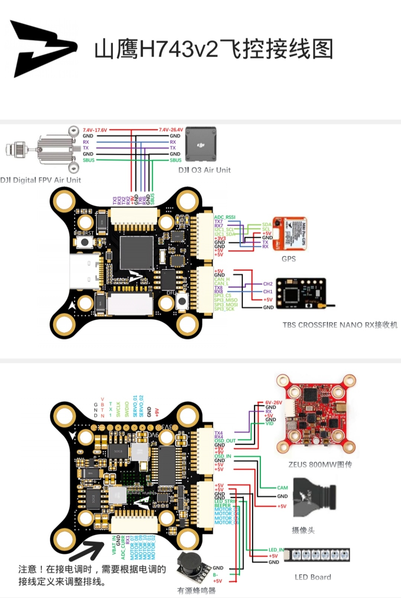

# MountainEagle H743 Flight Controller

The H743 HD is a flight controller produced by [MountainEagleElectronics](www.mountain-eagle-electronics.com).

## Features

 - MCU - STM32H743 32-bit processor running at 480 MHz
 - IMU - dual ICM42688P (SPI4)  and  BMI270 (SPI1)
 - Barometer - DPS310 (I2C-2)
 - Voltage & current sensor
 - OSD - AT7456E (SPI2)
 - SD-Card Slot
 - CAN
 - 7x UARTs on Connectors (1,2,3,4,6,8)
 - I2C-1 on Connector
 - 13x PWM Outputs (10 Motor Output, 2 Servo Output, 1 LED-Strip)
 - S-BUS input
 - A/D input: On-Board Bat-Volt, Bat-Current (connector), RSSI (connector)
 - Beeper-Output
 - 3x On-Board LEDs
 - On-Board USB-C Connector
 - Boot and Reset Switches
 - Battery input voltage: 3S-6S
 - BEC 5V/3.0A, 9V/2.0A

## Pinout

## UART Mapping

 - SERIAL0 -> USB
 - SERIAL1 -> USART7 (Telemetry1, DMA-enabled)
 - SERIAL2 -> USART1 (Telemetry2, DMA-enabled)
 - SERIAL3 -> USART2 (GPS1, SBUS-Inv-In, DMA-enabled)
 - SERIAL4 -> UASRT3 (GPS2, DMA-enabled)
 - SERIAL5 -> UART8 (spare)
 - SERIAL6 -> UART4 (spare, DMA-enabled)
 - SERIAL7 -> USART6 (RC-In, DMA-enabled)
 - SERIAL8 -> (OTG2)

## RC Input

RC input is configured on the RX6/TX6 (USART6_RX/USART6_TX) pins.
It supports ELRS(CSRF), TBS(CSRF), SBUS, IBUS, DSM2, and DSMX.

## OSD Support

The H743 supports OSD using OSD_TYPE 1 (MAX7456 driver).

## PWM Output

The H743 supports up to 13 PWM outputs (10 motors, 2 servos and 1 LED strip / PWM output)

The PWMs are sorted into 5 groups:

 - Motor 1 - 2   in group1
 - Motor 3 - 6   in group2
 - Motor 7 - 10  in group3
 - Servo 1, 2    in group4
 - LED-Strip     in group5

Channels within the same group need to use the same output rate.
If any channel in a group uses DShot then all channels in the group need to use DShot.
Motor 1-10 support bi-directional dshot.

## Battery Monitoring

The board has a built-in voltage sensor.
The voltage sensor can handle up to 6S LiPo batteries (1K:10K divider to the MCU pin)
The current sensor's max Amps is not specified (directly to the MCU pin)

## Compass

The H743 does not have a builtin compass, but you can attach an external compass using I2C1 on connector-6

## Loading Firmware

Initial firmware load can be done with DFU by plugging in USB with the
bootloader button pressed. Then you should load the "with_bl.hex"
firmware, using your favourite DFU loading tool.

Once the initial firmware is loaded you can update the firmware using
any ArduPilot ground station software. Updates should be done with the
*.apj firmware files.

