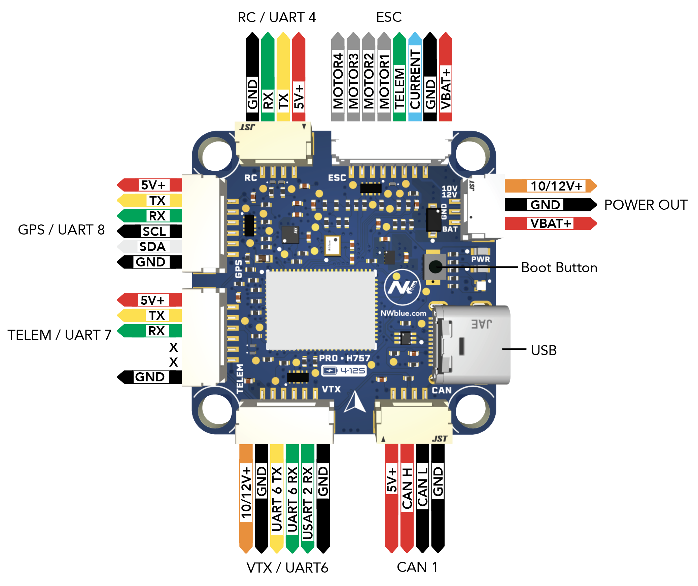
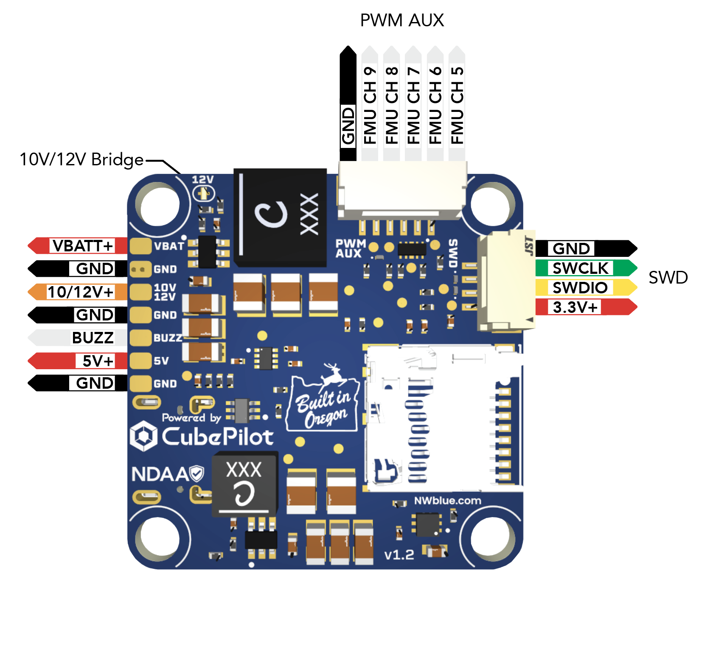

# NWBLUE_PROH757 Flight Controller

The [NWBLUE_PROH757](https://nwblue.com/products/pro-h757-fpv-flight-controller) is a 30 x 30 mm multirotor flight controller built around the
[CubePilot CubeNode H7 module](https://docs.cubepilot.org/user-guides/cubenode/pin-descriptions).

## Where to Buy

The NWBLUE_PROH757 is available from [NWBlue](https://nwblue.com/products/pro-h757-fpv-flight-controller).

## Features

- MCU - STM32H757 dual-core (Cortex-M7 / M4) running the M7 core at 480 MHz, 2 MB flash
- On-module ICM-45686 IMU on SPI3 (mounted upside down on this carrier -- `ROTATION_ROLL_180`)
- On-board DPS368 barometer on SPI3
- On-board IIS2MDC magnetometer on internal I2C3
- microSD card slot on SDMMC2
- 6 UARTs plus USB
- 9 PWM / DShot outputs (4 motor + 5 AUX)
- MSP DisplayPort OSD support for HD VTX (no analog / MAX7456 OSD chip on board)
- CAN1 for DroneCAN peripherals
- USB-C
- RGB notify LED + amber status LED
- Buzzer driver on a solder pad
- 4S - 12S battery input
- 5 V 2.5 A buck converter, plus a 10 V / 12 V 3.5 A buck converter selectable by solder jumper
- Voltage and current monitoring on the battery rail; rail-health sensing on 3V3, 5V, and the 10 V / 12 V rail
- 30 x 30 mm mounting

The CubeNode module also provides Ethernet and a second CAN bus, but the
NWBLUE_PROH757 carrier does not expose those signals.

## Pinout

## UART Mapping

`SERIALn` maps 1:1 to `USARTn` / `UARTn`, with `EMPTY` placeholders for the
UARTs not broken out on the carrier (USART3, UART5):

| SERIAL | UART | Connector | Default protocol | DMA |
| --- | --- | --- | --- | --- |
| SERIAL0 | OTG1 | USB | MAVLink2 | - |
| SERIAL1 | USART1 | ESC J10 pin 4 (RX only) | ESC Telemetry | No |
| SERIAL2 | USART2 | VTX J9 pin 5 (RX only) | None -- user picks (e.g. RunCam, MSP) | Yes |
| SERIAL3 | - | (USART3 not exposed) | - | - |
| SERIAL4 | UART4 | RC J11 | RC Input | Yes |
| SERIAL5 | - | (UART5 not exposed) | - | - |
| SERIAL6 | USART6 | VTX J9 pins 3-4 (TX/RX) | MSP DisplayPort | Yes |
| SERIAL7 | UART7 | TELEM1 J4 | MAVLink2 | Yes |
| SERIAL8 | UART8 | GPS J8 | GPS | Yes |

TELEM1 has no hardware flow control -- pins 4 and 5 of the connector are not
connected, and the firmware uses UART7 in 8N1.

`SERIAL6_PROTOCOL` defaults to MSP DisplayPort assuming an HD VTX (DJI / Walksnail / HDZero) is plugged into J9. For an analog VTX, change it to:

- 37 (`SerialProtocol_SmartAudio`) for SmartAudio VTXs
- 44 (`SerialProtocol_Tramp`) for Tramp VTXs

`SERIAL2_PROTOCOL` is left at None because J9 pin 5 (USART2 RX) can be used for several different camera/VTX backchannels -- set it to match the device you connect.

## Connectors

All signal connectors are JST-GH 1.25 mm pitch.

### TELEM1 (J4, 6-pin)

| Pin | Signal | Voltage |
| --- | --- | --- |
| 1 | VCC | +5 V |
| 2 | UART7 TX (out) | +3.3 V |
| 3 | UART7 RX (in) | +3.3 V |
| 4 | Not connected | - |
| 5 | Not connected | - |
| 6 | GND | GND |

### GPS (J8, 6-pin)

| Pin | Signal | Voltage |
| --- | --- | --- |
| 1 | VCC | +5 V |
| 2 | UART8 TX (out) | +3.3 V |
| 3 | UART8 RX (in) | +3.3 V |
| 4 | I2C4 SCL | +3.3 V |
| 5 | I2C4 SDA | +3.3 V |
| 6 | GND | GND |

### RC (J11, 4-pin)

| Pin | Signal | Voltage |
| --- | --- | --- |
| 1 | VCC | +5 V |
| 2 | UART4 TX (out) | +3.3 V |
| 3 | UART4 RX (in) | +3.3 V |
| 4 | GND | GND |

### VTX (J9, 6-pin)

| Pin | Signal | Voltage |
| --- | --- | --- |
| 1 | VCC | +10 V / +12 V (see Power Outputs) |
| 2 | GND | GND |
| 3 | USART6 TX (out) | +3.3 V |
| 4 | USART6 RX (in) | +3.3 V |
| 5 | USART2 RX (in) | +3.3 V |
| 6 | GND | GND |

### CAN1 (J3, 4-pin)

| Pin | Signal | Voltage |
| --- | --- | --- |
| 1 | VCC | +5 V |
| 2 | CAN_H | - |
| 3 | CAN_L | - |
| 4 | GND | GND |

A 120 ohm termination resistor is fitted on the carrier between CAN_H and CAN_L.

### ESC (J10, 8-pin)

| Pin | Signal | Voltage |
| --- | --- | --- |
| 1 | VBAT (VSYS, battery direct) | battery |
| 2 | GND | GND |
| 3 | Current sense input | analog |
| 4 | USART1 RX (ESC telemetry) | +3.3 V |
| 5 | M1 (FMU_CH1) | +3.3 V |
| 6 | M2 (FMU_CH2) | +3.3 V |
| 7 | M3 (FMU_CH3) | +3.3 V |
| 8 | M4 (FMU_CH4) | +3.3 V |

### PWM AUX (J7, 6-pin)

| Pin | Signal | Voltage |
| --- | --- | --- |
| 1 | M5 (FMU_CH5) | +3.3 V |
| 2 | M6 (FMU_CH6) | +3.3 V |
| 3 | M7 (FMU_CH7) | +3.3 V |
| 4 | M8 (FMU_CH8) | +3.3 V |
| 5 | M9 (FMU_CH9) | +3.3 V |
| 6 | GND | GND |

### SWD (J5, 4-pin)

| Pin | Signal | Voltage |
| --- | --- | --- |
| 1 | VCC | +3.3 V |
| 2 | SWDIO | +3.3 V |
| 3 | SWCLK | +3.3 V |
| 4 | GND | GND |

For programming and debug, with on-board ESD protection.

### PWR Output (J6, 3-pin)

| Pin | Signal | Voltage |
| --- | --- | --- |
| 1 | VBAT (battery direct) | battery |
| 2 | GND | GND |
| 3 | VREG | +10 V / +12 V |

## Power Outputs

The board takes 4S - 12S on the battery rail and generates two switching rails
from it:

- +5 V from a 2.5 A buck converter. This feeds the +5 V pins on the TELEM1, GPS, RC and CAN connectors, and (via an eFuse) the 5 V solder pad.
- VREG, a 3.5 A buck converter that powers the VTX connector (J9 pin 1), the PWR output (J6 pin 3) and the 10V/12V solder pad.

VREG is 10 V by default. Bridging the solder jumper marked "12V" on the
underside of the board -- labelled "10V/12V Bridge" in the pinout diagram above
-- changes it to 12 V. Check what your VTX tolerates before bridging it.

Only the 5 V solder pad is eFuse-protected; the +5 V connector pins are taken
ahead of the eFuse.

## Solder Pads

A row of pads along the edge of the underside brings out power and the buzzer
drive:

| Pad | Signal |
| --- | --- |
| VBAT | battery direct |
| GND | GND |
| 10V 12V | VREG (+10 V, or +12 V if the bridge is soldered) |
| GND | GND |
| BUZZ | buzzer drive (low side) |
| 5V | +5 V, eFuse-protected |
| GND | GND |

A buzzer connects between the 5V and BUZZ pads. BUZZ is the drain of a low-side
MOSFET driven from the FMU, so the firmware sinks the buzzer to ground rather
than driving it directly.

## RC Input

The default RC input is on UART4 (SERIAL4, J11). It supports all serial RC
protocols (SBUS, CRSF/ELRS, DSM, FPort, SRXL2) except PPM. For
bi-directional / half-duplex protocols the UART4 TX pin is also brought out on
J11 pin 2. See [RC Systems](https://ardupilot.org/copter/docs/common-rc-systems.html)
for wiring and protocol-specific setup.

- `SERIAL4_PROTOCOL` defaults to 23 (RC Input)
- `SERIAL4_OPTIONS` = 0 for CRSF/ELRS (default), 4 for SRXL2, 15 for FPort

## OSD Support

The NWBLUE_PROH757 has no analog (MAX7456) OSD chip. OSD is provided over MSP
DisplayPort to an HD VTX (DJI O3, Walksnail, HDZero, etc.) on the J9 VTX
connector. Defaults:

- `OSD_TYPE` = 5 (MSP DisplayPort)
- `SERIAL6_PROTOCOL` = 42 (MSP DisplayPort)

If you are connecting an analog VTX instead, change `SERIAL6_PROTOCOL` to
`SerialProtocol_SmartAudio` (37) or `SerialProtocol_Tramp` (44) and either
disable the OSD (`OSD_TYPE = 0`) or use a separate analog OSD module.

## PWM Output

The board has 9 PWM / DShot outputs grouped by timer:

- PWM 1-4 in group 1 (TIM1) -- motor outputs on the ESC connector
- PWM 5-6 in group 2 (TIM4) -- AUX on PWM AUX connector
- PWM 7-8 in group 3 (TIM3) -- AUX on PWM AUX connector
- PWM 9   in group 4 (TIM2) -- AUX on PWM AUX connector

Channels within the same group must use the same output rate. If any channel
in a group uses DShot, all channels in that group must use DShot. PWM 1-8
(motors and the PWM AUX connector) support bi-directional DShot. PWM 9 is on
TIM2 and runs DShot without bi-directional telemetry.

## GPIOs

The 9 PWM outputs can be used as GPIOs (relays, buttons, RPM etc). To use them
as GPIOs set the corresponding `SERVOx_FUNCTION` to -1.

The numbering of the GPIOs for PIN variables in ArduPilot is:

- PWM1 50
- PWM2 51
- PWM3 52
- PWM4 53
- PWM5 54
- PWM6 55
- PWM7 56
- PWM8 57
- PWM9 58

## Battery Monitoring

The board has an on-board voltage divider for the battery rail and accepts 4S -
12S. The current sense signal is brought in via the ESC connector (J10 pin 3) so
that it can be fed by an in-line current sensor or by the ESC's own current
output.

Default battery monitor parameters:

- `BATT_MONITOR` = 4 (Analog Voltage and Current)
- `BATT_VOLT_PIN` = 5
- `BATT_CURR_PIN` = 12 (ESC connector J10 pin 3)
- `BATT_VOLT_MULT` = 21.0
- `BATT_AMP_PERVLT` = 24.0

`BATT_VOLT_MULT` is the 200k / 10k on-board divider, so a fully charged 12S pack
(50.4 V) puts 2.4 V on the ADC pin. `BATT_AMP_PERVLT` should be calibrated
against whatever current sensor is attached to the ESC connector.

## Compass

The NWBLUE_PROH757 has a built-in IIS2MDC magnetometer on the internal I2C3
bus. External compasses can be added on the GPS connector (I2C4 bus) -- for
example the magnetometer in a u-blox / Holybro / Matek GPS module.

## CAN

CAN1 is exposed on connector J3 for DroneCAN peripherals (GPS, compass,
ESCs, airspeed, range finders, etc.). The CubeNode module's on-module CAN
transceiver is enabled by default. CAN2 is not broken out on this carrier.

## Firmware

Firmware for the NWBLUE_PROH757 can be found [here](https://firmware.ardupilot.org)
in sub-folders labeled `NWBLUE_PROH757`.

## Loading Firmware

Initial firmware load can be done with DFU by plugging in USB with the
bootloader button held. Then load the `with_bl.hex` firmware using your
favourite DFU tool.

Once the initial firmware is loaded, you can update the firmware using any
ArduPilot ground station software. Updates should be done with the `*.apj`
firmware files.
