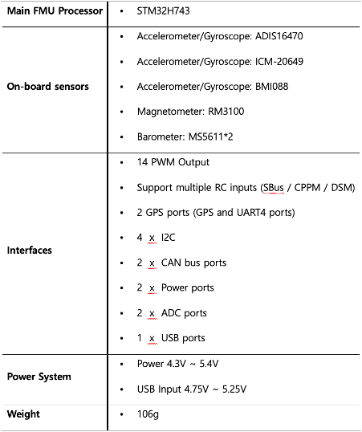
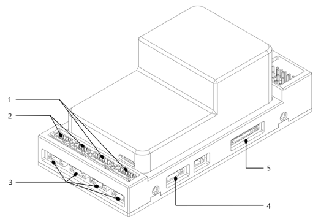
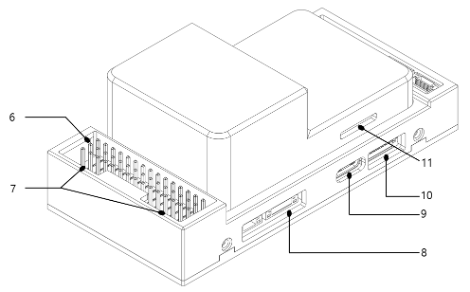

# [NarinFC-H7 VOLOLAND CO., LTD](https://vololand.com/pages/product/computer "NarinFC-H7")

The NarinFC-H7 is a flight controller produced by [VOLOLAND CO., LTD](https://vololand.com "VOLOLAND CO., LTD")

## 1. Basic Parameters

## 2. Outline Dimensions

## 3. Wire Diagram

## 4. Port Diagram & Pin outs

### 1. TELEM1, TELEM2 Port (JST GH 6P Connector)
.png "TELEM Pinout")

### 2. CAN1, CAN2 Port (JST GH 4P Connector)
.png "CAN Port")

### 3. I2C, I2C2, I2C3, I2C4 Port (JST GH 4P Connector)
.png "I2C Port")

### 4. UART4 Port (JST GH 6P Connector)
.png "UART Port")

### 5. GPS & Safety Port (JST GH 10P Connector)
.png "GPS & Safety Port")

 

### 6. PWM Out (M1-M14)
.png "PWM Out")

### 7. Power Input

### 8. DEBUG Port(JST GH 6P Connector)
.png "DEBUG Port")

### 9. USB Port(USB C Type)

### 10. SPI Port (JST GH 7P Connector)
.png "SPI Port")

### 11. SD CARD

 

# [VOLOLAND CO., LTD](https://vololand.com "VOLOLAND CO., LTD")

