# [NarinFC-H7 VOLOLAND CO., LTD](https://vololand.com/pages/product/computer "NarinFC-H7")

## Introduction

The NarinFC-H7 is a flight controller produced by [VOLOLAND CO., LTD](https://vololand.com "VOLOLAND CO., LTD")

NarinFC-H7 is an advanced autopilot family designed in-house by VOLOLAND CO., LTD.

It uses a higher-performance STM32H7 processor and integrates industrial-grade sensors.

Compared with previous autopilots, it has better performance and higher reliability.

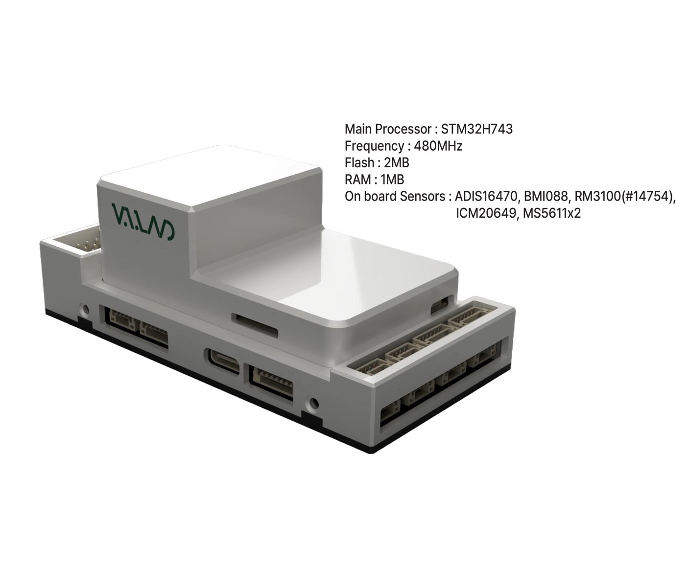

## Features/Specifications

-  **Processor**
    - STM32H743

-  **Sensors**
    - Accelerometer/Gyroscope: ADIS16470
    - Accelerometer/Gyroscope: ICM-20649
	- Accelerometer/Gyroscope: BMI088
	- Magnetometer: RM3100
	- Barometer: MS5611*2

-  **Interfaces**
    - 14 PWM servo outputs
	- Support multiple RC inputs (SBus / CPPM / DSM)
    - Analog/PWM RSSI input
	- 2 GPS ports (GPS and UART4 ports)
	- 4 ⅹ I2C buses
	- 2 ⅹ CAN bus ports
	- 2 ⅹ Power ports
	- 2 ⅹ ADC ports
	- 1 ⅹ USB port

-  **Power**
    - Power 4.3V ~ 5.4V
    - USB Input 4.75V ~ 5.25V

-  **Size and Dimensions**
    - 93.4mm x 46.4mm x 34.1mm
    - 106g

## Where to Buy

[VOLOLAND CO., LTD](https://vololand.com "VOLOLAND CO., LTD")

## Outline Dimensions

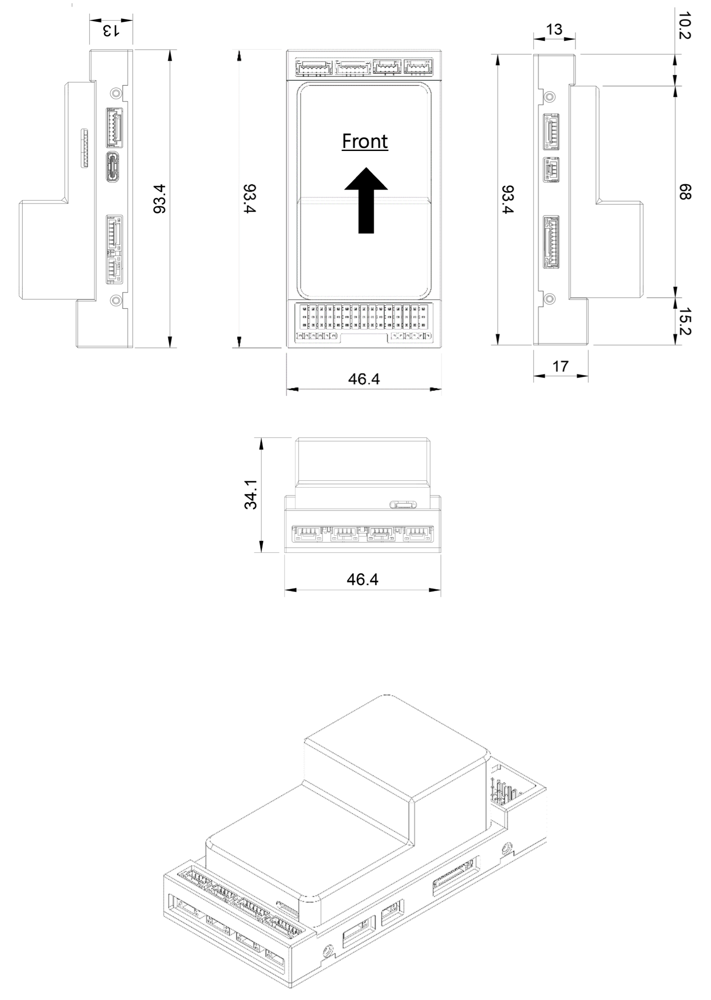

## Wiring Diagram

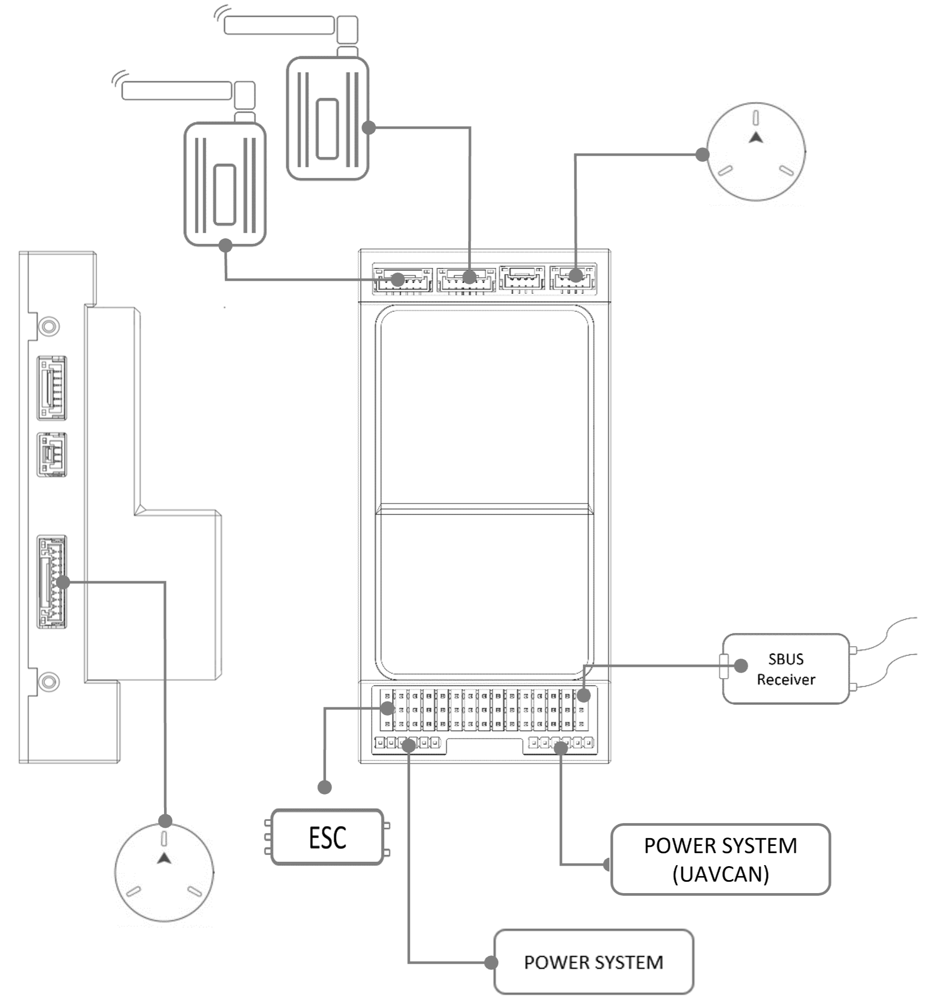

## UART Mapping (Port Diagram & Pin outs)

  - SERIAL0 = console = USB (MAVLink2)
  - SERIAL1 = Telemetry1 (MAVlink2 default)= USART2 DMA-enabled
  - SERIAL2 = Telemetry2 (MAVlink2 default)= USART6 DMA-enabled
  - SERIAL3 = GPS1 = USART1
  - SERIAL4 = GPS2 = UART4
  - SERIAL5 = USER = UART8 (not available except on custom carrier boards) DMA-enabled
  - SERIAL6 = USER = UART7
  - SERIAL7 = USB2 (Default protocol is MAVLink2)
    
  Serial protocols can be adjusted to personal preferences.
  
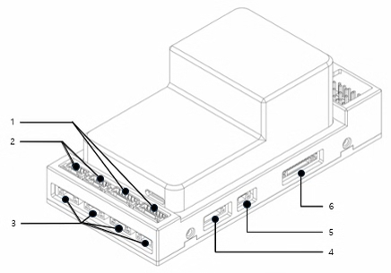

#### 1. TELEM1, TELEM2 Port

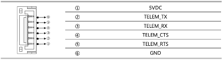

  - JST GH 6P connector
  - TELEMETRY Port

#### 2. CAN1, CAN2 Port

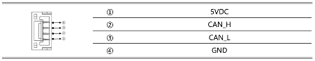

  - JST GH 4P connector
  - Communication Protocol: UAVCAN v0 (default), UAVCAN v1 (limited support)
  - Power Supply: Typically provides 5V or 12V output
  - Pin Configuration: Usually includes CAN_H, CAN_L, VCC, and GND

#### 3. I2C, I2C2, I2C3, I2C4 Port

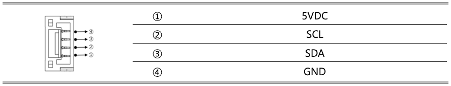

  - JST GH 4P connector

#### 4. UART4 Port

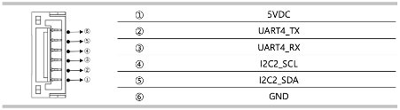
  
  - JST GH 6P connector

#### 5. GPS & Safety Port

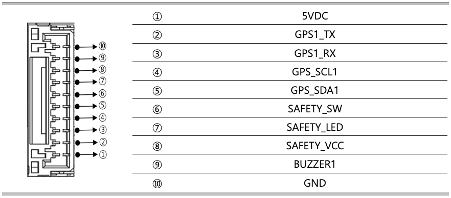

  - JST GH 10P connector
  - GPS NODMA

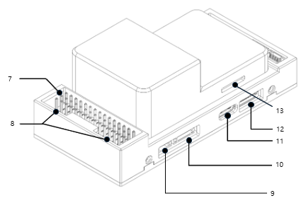

#### 6. PWM & RC_IN

The NarinFC-H7 supports up to 14 PWM outputs. Outputs are grouped and all outputs within their group must be the same protocol.

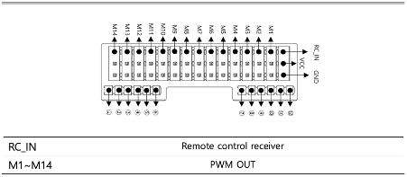
  
  - 2.54mm pitch Dupont connector
  - RC_IN : Remote control receiver

#### 7. Power Input

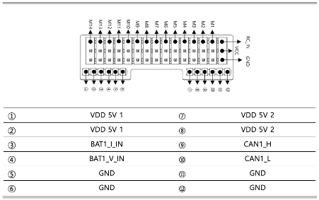

  - 2mm pitch Dupont connector

#### 8. DEBUG & UART7 Port

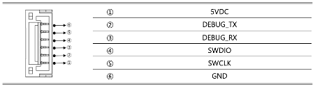
  
  - JST GH 6P connector
  - DEBUG NODMA

#### 9. USB Port
  - USB C Type

#### 10. SPI Port

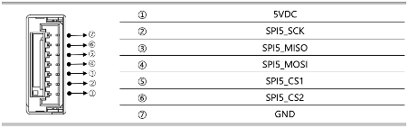

  - JST GH 7P connector
  - SPI Port

#### 11. SD CARD
  - SD CARD

#### 12. ADC Port
  - ADC input

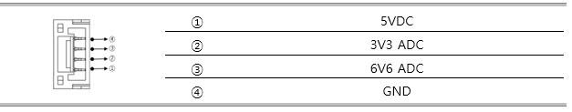

#### 13. RSSI Port
  - RSSI input

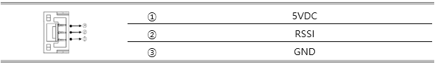

## PWM Output

The NarinFC-H7 supports up to 14 PWM outputs.

The 14 PWM outputs are in 4 groups:
  - Outputs 1, 2, 3 and 4 in group1
  - Outputs 5, 6, 7 and 8 in group2
  - Outputs 9, 10, 11 and 12 in group3
  - Outputs 13 and 14 in group4

ALL outputs within the same group need to use the same output rate and protocol.

## GPIOs

The 14 outputs can be used as GPIOs (relays, buttons, RPM etc). To use them you need to set the output’s SERVOx_FUNCTION to -1. See GPIOs page for more information.

The numbering of the GPIOs for use in the PIN parametersin ArduPilot is:

pins:

- PWM1(M1) 50
- PWM2(M2) 51
- PWM3(M3) 52
- PWM4(M4) 53
- PWM5(M5) 54
- PWM6(M6) 55
- PWM7(M7) 56
- PWM8(M8) 57
- PWM9(M9) 58
- PWM10(M10) 59
- PWM11(M11) 60
- PWM12(M12) 61
- PWM13(M13) 62
- PWM14(M14) 63

## Analog inputs

The NarinFC-H7 has 2 analog inputs, one 6V tolerant and one 3.3V tolerant

- ADC Pin4 -> ADC 6.6V Sense
- ADC Pin18 -> ADC 3.3V Sense
- Analog 3.3V RSSI input pin = 6

## Battery Monitor

If you are using an analog battery monitor instead, connect to the Power A connector and set the following parameters (if used as second monitor use the BATT2 parameters instead):

- :ref:`BATT_MONITOR<BATT_MONITOR>` = 4
- :ref:`BATT_CURR_PIN<BATT_CURR_PIN__AP_BattMonitor_Analog>` = 17
- :ref:`BATT_VOLT_PIN<BATT_VOLT_PIN__AP_BattMonitor_Analog>` = 16
- Set the :ref:`BATT_AMP_PERVLT<BATT_AMP_PERVLT__AP_BattMonitor_Analog>` and :ref:`BATT_VOLT_MULT<BATT_VOLT_MULT__AP_BattMonitor_Analog>` as required for the analog PMU used.

## RC Input
  
The RCIN pin, which by default is mapped to a timer input, can be used for all ArduPilot supported receiver protocols, except CRSF/ELRS and SRXL2 which require a true UART connection. However, FPort, when connected in this manner, will only provide RC without telemetry. 

To allow CRSF and embedded telemetry available in Fport, CRSF, and SRXL2 receivers, a full UART, such as SERIAL6 (UART7) would need to be used for receiver connections. Below are setups using Serial6.

- :ref:`SERIAL6_PROTOCOL<SERIAL6_PROTOCOL>` should be set to "23".
- FPort would require :ref:`SERIAL6_OPTIONS<SERIAL6_OPTIONS>` be set to "15".
- CRSF would require :ref:`SERIAL6_OPTIONS<SERIAL6_OPTIONS>` be set to "0".
- SRXL2 would require :ref:`SERIAL6_OPTIONS<SERIAL6_OPTIONS>` be set to "4" and connects only the TX pin.
  
Any UART can be used for RC system connections in ArduPilot also, and is compatible with all protocols except PPM. See :ref:`common-rc-systems` for details.
The power rail associated with this connector position is powered via USB or PMU.

## Loading Firmware

This board comes with ArduPilot firmware pre-installed and other vehicle/revision Ardupilot firmware can be loaded using most Ground Control Stations.

Firmware for these boards can be found at https://firmware.ardupilot.org in sub-folders labeled “NarinFC-H7”.

The board comes pre-installed with an NarinFC-H7 bootloader, allowing the loading of *.apj firmware files with any ArduPilot compatible ground station.

you can update firmware with Mission Planner.

 

# [VOLOLAND CO., LTD](https://vololand.com "VOLOLAND CO., LTD")

