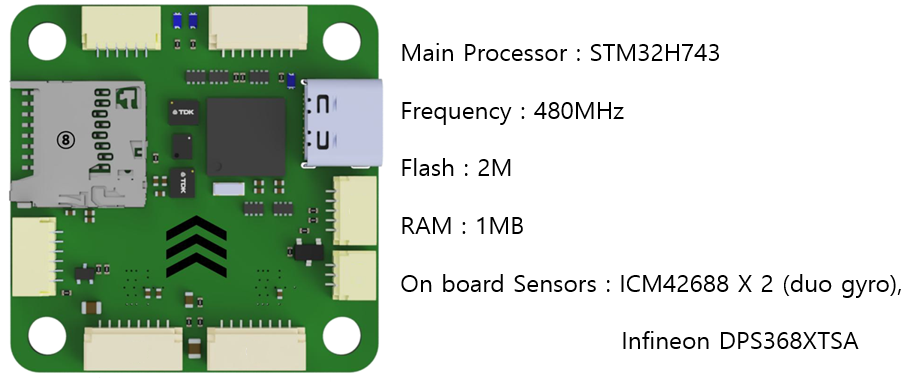
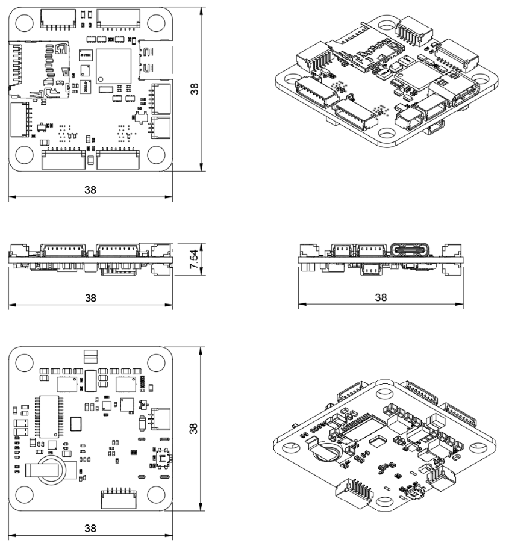
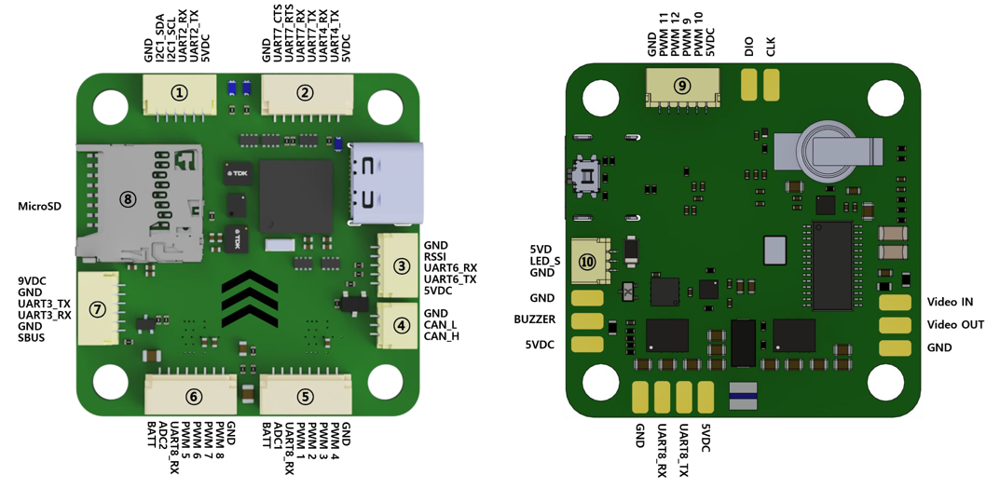
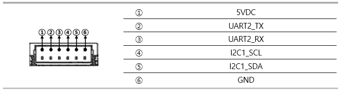
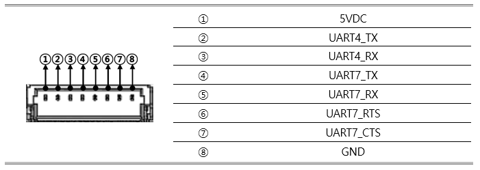
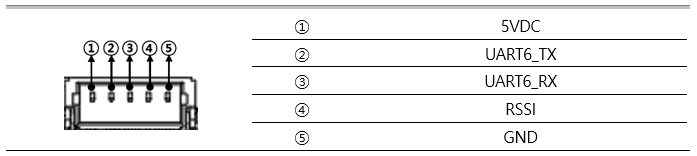
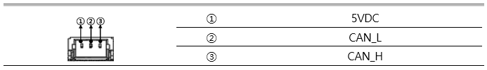
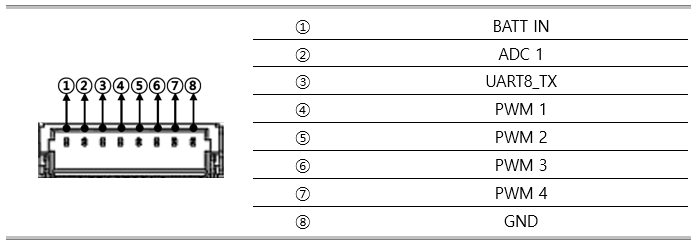
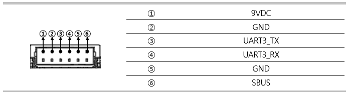
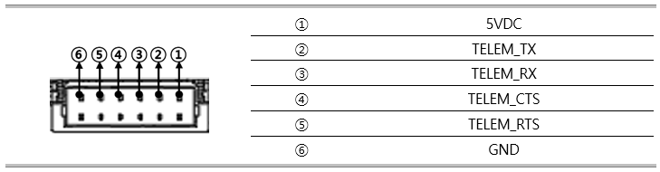

# [NarinFC-X3 VOLOLAND Inc.](https://vololand.com/pages/product/computer "NarinFC-X3")

## Introduction

The NarinFC-X3 is a flight controller produced by [VOLOLAND Inc.](https://vololand.com "VOLOLAND Inc.")

NarinFC-X3 is an advanced autopilot family designed in-house by VOLOLAND Inc.

It uses a higher-performance STM32H7 processor and integrates industrial-grade sensors.

Compared with previous autopilots, it has better performance and higher reliability.

 

## Features/Specifications

-  **Processor**
    - STM32H743

-  **Sensors**
    - Accelerometer/Gyroscope: ICM-42688-P X 2
    - Barometer: DPS368XTSA1

-  **Interfaces**
    - 12 x PWM servo outputs
    - 1 ⅹ I2C buses
    - 1 ⅹ CAN bus ports
    - 5 ⅹ UART
    - 1 ⅹ USB Type-C
    - 1 ⅹ MicroSD card
    - JST Connector (SH1.0)
    
-  **Power**
    - Input Power 6VDC ~ 36VDC (2S ~ 8S)
    - Output Power
        - 3.3VDC 0.5A
        - 5VDC 2.5A
        - 9VDC 2.5A

-  **Size and Dimensions**
    - 38mm x 38mm (mount hole 30.5mm x 30.5mm)
    - 8g

 

## Where to Buy

[VOLOLAND Inc.](https://vololand.com "VOLOLAND Inc.")

 

## Outline Dimensions

 

## UART Mapping (Port Diagram & Pin outs)

 UART corresponding to each SERIAL port, and its default protocol, are shown below:

  - SERIAL0 -> USB (MAVLink2)
  - SERIAL1 -> UART1 (RX1 is SBUS in HD VTX connector)
  - SERIAL2 -> UART2 (GPS, DMA-enabled)
  - SERIAL3 -> UART3 (DisplayPort, DMA-enabled)
  - SERIAL4 -> UART4 (MAVLink2, Telem1)
  - SERIAL6 -> UART6 (RC Input, DMA-enabled)
  - SERIAL7 -> UART7 (MAVLink2, Telem2, DMA and flow-control enabled)
  - SERIAL8 -> UART8 (ESC Telemetry, RX8 on ESC connector for telem)
    
  Serial protocols can be adjusted to personal preferences.

  

 

#### 1. I2C, UART2 Port

  - I2C1
  - UART 2: Ardupilot port Serial2 GPS1

 

#### 2. UART 7, UART 4 Port

  - UART 7: Ardupilot port Serial7 Telem_2
  - UART 4: Ardupilot port Serial4 Telem_1

 

#### 3. UART 6, RSSI Port

  - UART 6: Ardupilot port Serial6 Receiver

 

#### 4. CAN Port

  
  - JST GH 6P connector

 

#### 5. PWM Port-1

  - PWM 1 ~ PWM 4
  - UART8_RX
  - ADC1
  - BATT Input

 

#### 6. PWM Port-2

  - PWM 5 ~ PWM 8
  - UART8_RX
  - ADC2
  - BATT Input

 

#### 7. UART 3 Port
  - UART 3: Ardupilot port Serial3 MSP Display Port

  
  - 2.54mm pitch DuPont connector
  - RC_IN : Remote control receiver

 

#### 8. MicroSD Card Slot

 

#### 9. PWM Port-3
  - PWM 9 ~ PWM 12

 

#### 10. DEBUG/UART7 Port

UART7(SERIAL6) is labeled DEBUG RX/TX below

  
  - JST GH 6P connector
  - DEBUG NODMA

 

## RC Input

RC input is configured by default via the USART6 RX input. It supports all serial RC protocols except PPM.
Note: If the receiver is FPort the receiver must be tied to the USART6 TX pin , RSSI_TYPE set to 3, and SERIAL6_OPTIONS must be set to 7 (invert TX/RX, half duplex). For full duplex like CRSF/ELRS use both RX6 and TX6 and set RSSI_TYPE also to 3.
If SBUS is used on HD VTX connector (DJI TX), then SERIAL1_PROTOCOl should be set to “23” and SERIAL6_PROTOCOL changed to something else.

 

## FrSky Telemetry

FrSky Telemetry is supported using an unused UART, such as the T1 pin (UART1 transmit). You need to set the following parameters to enable support for FrSky S.PORT:
SERIAL1_PROTOCOL = 10
SERIAL1_OPTIONS = 7

 

## OSD Support

The NarinFC-X3 supports OSD using OSD_TYPE 1 (MAX7456 driver) and simultaneously DisplayPort using TX3/RX3 on the HD VTX connector.

 

## PWM Output

The NarinFC-X3 supports up to 13 PWM or DShot outputs.
The pads for motor output M1 to M4 are provided on both the motor connectors and on separate pads, plus M9-13 on a separate pads for LED strip and other PWM outputs.

  - The PWM is in 4 groups:
  - PWM 1-2 in group1
  - PWM 3-4 in group2
  - PWM 5-6 in group3
  - PWM 7-10 in group4
  - PWM 11-12 in group5
  - PWM 13 in group6

Channels within the same group need to use the same output rate. If any channel in a group uses DShot then all channels in the group need to use DShot. Channels 1-10 support bi-directional dshot.
ALL outputs within the same group need to use the same output rate and protocol.

 

## Battery Monitoring

The board has a built-in voltage sensor and external current sensor input. The current sensor can read up to 130 Amps. The voltage sensor can handle up to 6S LiPo batteries.

The correct battery setting parameters are:

  - BATT_MONITOR = 4
  - BATT_VOLT_PIN = 10
  - BATT_CURR_PIN = 11
  - BATT_VOLT_MULT = 11.0
  - BATT_AMP_PERVLT = 40

Pads for a second analog battery monitor are provided. To use:

  - Set BATT2_MONIOTOR = 4
  - BATT2_VOLT_PIN = 18
  - BATT2_CURR_PIN = 7
  - BATT2_VOLT_MULT = 11.0
  - BATT2_AMP_PERVLT as required

 

## Analog RSSI and AIRSPEED inputs
Analog RSSI uses RSSI_ANA_PIN = 8   
Analog Airspeed sensor would use ARSPD_PIN = 4

 

## Compass

The NarinFC-X3 does not have a builtin compass, but you can attach an external compass using I2C on the SDA and SCL pads.

 

## Firmware

Firmware for this board can be found here in sub-folders labeled “NarinFC-X3”

 

## Loading Firmware

This board comes with ArduPilot firmware pre-installed and other vehicle/revision ArduPilot firmware can be loaded using most Ground Control Stations.
Firmware for these boards can be found [https://firmware.ardupilot.org](https://firmware.ardupilot.org "https://fireware.ardupilot.org") in sub-folders labeled “NarinFC-X3”.
The board comes pre-installed with an ArduPilot bootloader, allowing the loading of \*.apj firmware files with any ArduPilot compatible ground station, such as Mission Planner.

 

# [VOLOLAND Inc.](https://vololand.com "VOLOLAND Inc.")
