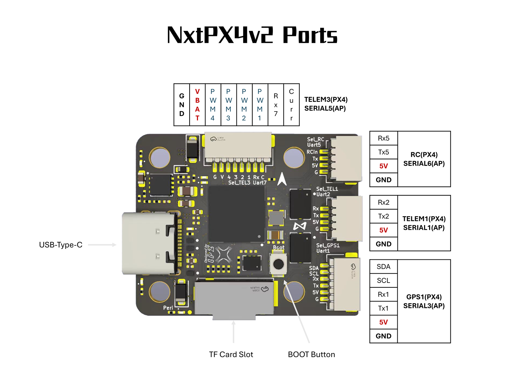
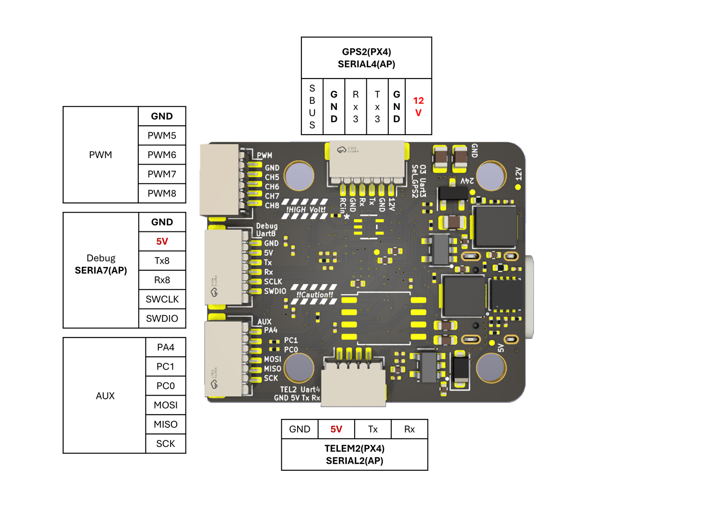

# NxtPX4v2 Flight Controller

The NxtPX4v2 is an open-source hardware designed and maintened by [HKUST UAV-Group](https://github.com/HKUST-Aerial-Robotics/Nxt-FC). And it is produced by [MicoAir Tech.](http://micoair.com/).

## Features

 - STM32H743 microcontroller
 - BMI088+BMI088(DUAL) IMU
 - SPL06 barometer
 - 12V 2.5A BEC; 5V 2.5A BEC
 - SDCard
- 7x UART
- 8x PWM
- 1x I2C
- 1x SPI
- 1x SWD

## UART Mapping

 - SERIAL0 -> USB
 - SERIAL1 -> UART2 (MAVLink2, DMA-enabled)
 - SERIAL2 -> UART4 (MAVLink2, DMA-enabled)
 - SERIAL3 -> UART1 (GPS, DMA-enabled)
 - SERIAL4 -> UART3 (VTX-HD, DMA-enabled)
 - SERIAL5 -> UART7 (ESC Telemetry, DMA-enabled)
 - SERIAL6 -> UART5 (RCIN, DMA-enabled)
 - SERIAL7 -> UART8 (DMA-enabled)

## RC Input

The default RC input is configured on the UART5. The SBUS pin is inverted and connected to RX5. Non SBUS,  single wire serial inputs can be directly tied to RX5 if SBUS pin is left unconnected. RC could  be applied instead at a different UART port such as UART2, UART4 or UART8, and set the protocol to receive RC data: `SERIALn_PROTOCOL=23` and change SERIAL6 _Protocol to something other than '23'

## VTX Support

The SH1.0-6P connector supports a DJI Air Unit / HD VTX connection. Protocol defaults to DisplayPort. Pin 1 of the connector is 12v so be careful not to connect this to a peripheral requiring 5v.

## PWM Output

The NxtPX4v2 supports up to 8 PWM outputs. All channels support bi-directional DShot.

PWM outputs are grouped and every group must use the same output protocol:

1, 2, 3, 4 are Group1;

5, 6 are Group 2;

7, 8 are Group 3;

## Battery Monitoring

The board has a internal voltage sensor and connections on the ESC connector for an external current sensor input.
The voltage sensor can handle up to 6S LiPo batteries.

The default battery parameters are:

 - BATT_MONITOR 4
 - BATT_VOLT_PIN 4
 - BATT_CURR_PIN 8
 - BATT_VOLT_MULT 10.2
 - BATT_CURR_SCALE 20.4

## Compass

The NxtPX4v2 does not have a built-in compass, but you can attach an external compass using I2C on the SDA and SCL connector.

## GPIOs

The remaining 3 outputs (labelled AUX1 to AUX3) are the "auxiliary" outputs. These are directly attached to the STM32H743.

The numbering of the GPIOs for PIN variables in ardupilot is:

 - AUX1 - PA4 - 81
 - AUX2 - PC1 - 82
 - AUX3 - PC0 - 83

## Physical

 - Mounting: 20 x 20mm, Φ3mm
- Dimensions: 27 x 32 x 8 mm
- Weight: 6.5g

## Ports Connector

## Loading Firmware

Initial firmware load can be done with DFU by plugging in USB with the bootloader button pressed. Then you should load the "with_bl.hex" firmware, using your favorite DFU loading tool.

Once the initial firmware is loaded you can update the firmware using any ArduPilot ground station software. Updates should be done with the "*.apj" firmware files.
