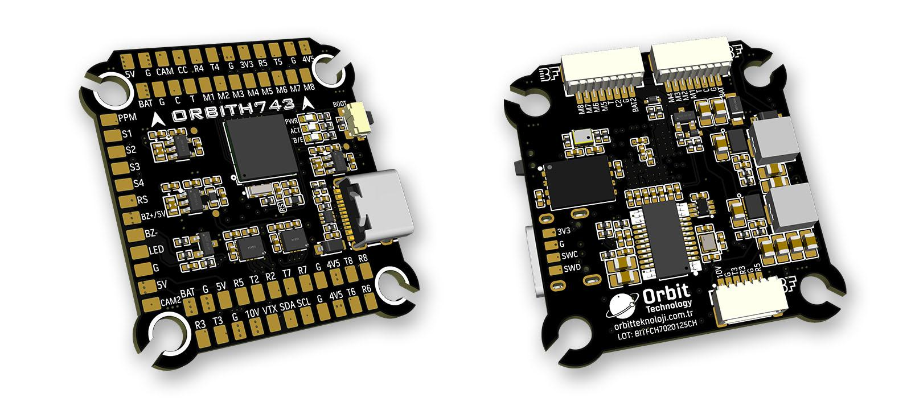
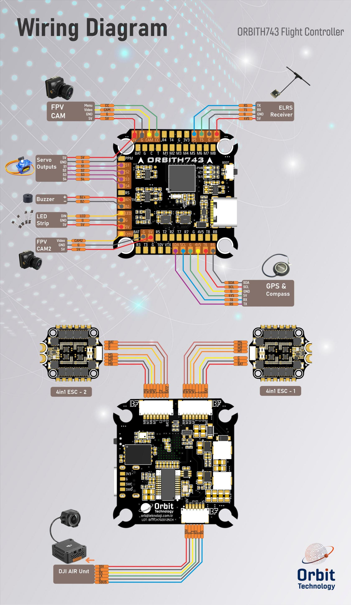

# ORBITH743

The above image and some content courtesy of [orbitteknoloji.com.tr](https://orbitteknoloji.com.tr/)

## Specifications

### **Processor**
- STM32H743VIH6 (480MHz)
- 256MB Flash for data logging

### **Sensors**
- InvenSense 2x ICM42688 IMU (accel, gyro)
- DPS368 barometer
- Voltage & Current sensor

### **Power**
- 2–6S LiPo input power
- 5V 3A BEC for peripherals
- 10V 3A BEC for video, GPIO controlled

### **Interfaces**
- USB Type-C port
- 8x UARTs
- 13x PWM outputs(one for serial LED by default) via two 8-pin ESC connectors and/or solder pads
- 1x RC input (PWM/SBUS)
- I2C port for external compass, airspeed sensor, etc.
- HD VTX support
- Dual switchable analog Camera inputs
- 2x Power Monitor
- Buzzer and LED strip
- Built-in OSD

### **Size and Dimensions**
- 38.3 mm x 39.8 mm
- 8.4 g

### **Mounting Hole**
- 30.5 mm x 30.5 mm

## Default UART Order

- `SERIAL0` = USB (MAVLink2)  
- `SERIAL1` = UART1 (ESC Telemetry)  
- `SERIAL2` = UART2 (USER)  
- `SERIAL3` = UART3 (DJI HD Air Unit)  
- `SERIAL4` = UART4 (VTX)  
- `SERIAL5` = UART5 (RC Input)  
- `SERIAL6` = UART6 (GPS)  
- `SERIAL7` = UART7 (USER)  
- `SERIAL8` = UART8 (USER)  

All UARTs, except UART1, are DMA capable.

> **Note:** Serial port protocols (Telem, GPS, etc.) can be adjusted based on personal preferences.

## RC Input

RC input is configured by default on `SERIAL5` (UART5). The 4V5 pin is powered by both USB and the onboard 5V BEC from the battery.

- PPM is supported.  
- SBUS/DSM/SRXL connects to the RX5 pin.  
- FPort requires connection to TX5. Set :ref:`SERIAL5_OPTIONS<SERIAL5_OPTIONS>` = 7  
- CRSF also requires both TX5 and RX5 connections and provides telemetry automatically.

Any UART can be used for RC system connections in ArduPilot. See the [common RC systems](https://ardupilot.org) documentation for details.

## RSSI

Analog inputs are supported.

- RSSI reference pin number: **8**

> **Note:** Set :ref:`RSSI_TYPE<RSSI_TYPE>` = 1 for analog RSSI, or = 3 for RSSI provided by RC protocols like CRSF.

## OSD Support

The ORBITH743 has an onboard OSD using a MAX7456 chip and is enabled by default. The CAM1/2 and VTX pins provide connections for using the internal OSD. Simultaneous DisplayPort OSD is possible and is configured by default.

## DJI Video and OSD

An **SH1.0 6P** connector supports a standard DJI HD VTX. ``SERIAL3`` is configured by default for DisplayPort. Pin 1 provides 10V which is controlled by GPIO81 —**do not** connect peripherals that require 5V to this pin.

## DShot Capability

All motor outputs (M1–M8) support:
- DShot
- Bi-directional DShot (for BIDIR motors)
- PWM

> **Important:** Mixing DShot and PWM within the same timer group is **not allowed**. Groups must be uniformly configured. Output timer groups are:  
1/2, 3/4, 5/6, 7/8.

Servo outputs (Outputs 9-12, marked S1–S4) on PA15, PB3, PD12, and PD13 (TIM2 and TIM4 timers) are PWM only. Output 13 (marked LED) is in a separate group and supports PWM/DShot or serial LED operation.

## GPIOs

ORBITH743 outputs can be used as GPIOs (relays, buttons, RPM, etc.).  
Set the ``SERVOx_FUNCTION`` = -1 to enable GPIO functionality. See [ArduPilot GPIO docs](https://ardupilot.org) for more info.

### GPIO Pin Mapping

- PWM1 → 50  
- PWM2 → 51  
- PWM3 → 52  
- PWM4 → 53  
- PWM5 → 54  
- PWM6 → 55  
- PWM7 → 56  
- PWM8 → 57  
- PWM9 → 58  
- PWM10 → 59  
- PWM11 → 60  
- PWM12 → 61  
- LED → 62  
- BUZZER → 80  
- VTX PWR → 81 (internal)  
- CAM SW→ 82 (internal)

## VTX Power Control

GPIO 81 controls the 10V VTX BEC output.  
Setting GPIO 81 **low** disables voltage to the pins.

Example (using Channel 10 to toggle VTX BEC using Relay 2, as an example):

* :ref:`RELAY2_FUNCTION<RELAY2_FUNCTION>` = 1 (already set as default)
* :ref:`RELAY2_PIN<RELAY2_PIN>` = 81  (already set as default)
* :ref:`RC10_OPTION<RC10_OPTION>` = 34  ; Relay2 Control

> ⚠️ **Warning:** GPIO81 controls the 10V DC-DC converter (HIGH = on, LOW = off). Default: ON. Always install an antenna on the VTX when battery-powered.

## Camera Switch Control

GPIO 82 controls camera switching via PINIO2. Set high or low to toggle between cameras (e.g., front/rear).

Example (using Channel 11 to control camera switch via Relay 3):

* :ref:`RELAY3_FUNCTION<RELAY3_FUNCTION>` = 1 (already set as default)
* :ref:`RELAY3_PIN<RELAY3_PIN>` = 82  (already set as default)
* :ref:`RC11_OPTION<RC10_OPTION>` = 35  ; Relay3 Control

> ⚠️ **Warning:** GPIO82 toggles camera input (HIGH/LOW). Ensure wiring matches desired switching behavior.

## Connecting a GPS/Compass Module

This board does **not** include GPS or compass modules. An [external GPS/compass](https://ardupilot.org) must be connected for autonomous features.

> **Note:** If GPS is powered via 5V , a battery is required for power.

> **Tip:** The 4V5 pin can power both RC and GPS for bench setup (without battery), as long as the total current does not exceed USB limits (typically 1A).

## Battery Monitor Settings

These are set by default. If reset:

Enable battery monitor with:

* :ref:`BATT_MONITOR<BATT_MONITOR>` = 4

Then reboot.

**First battery monitor is enabled by default:**

* :ref:`BATT_VOLT_PIN<BATT_VOLT_PIN>` = 10
* :ref:`BATT_CURR_PIN<BATT_CURR_PIN>` = 11
* :ref:`BATT_VOLT_MULT<BATT_VOLT_MULT>` = 10.1
* :ref:`BATT_AMP_PERVLT<BATT_AMP_PERVLT>` = 80.0 *(Calibrate as needed, depending on current sensor.)*

**The second battery monitor is not enabled by default, but its parameter defaults have been set:**

* :ref:`BATT2_VOLT_PIN<BATT2_VOLT_PIN>` = 4
* :ref:`BATT2_CURR_PIN<BATT2_CURR_PIN>` = 18
* :ref:`BATT2_VOLT_MULT<BATT2_VOLT_MULT>` = 10.1
* :ref:`BATT2_AMP_PERVLT<BATT2_AMP_PERVLT>` = 80.0 *(Calibrate as needed, depending on current sensor)*

## Where to Buy

* [orbitteknoloji.com.tr](https://orbitteknoloji.com.tr)

## Firmware

This board does **not** ship with ArduPilot pre-installed.
Follow [this guide](https://ardupilot.org/copter/docs/common-loading-firmware-onto-chibios-only-boards.html) to load it for the first time.

Firmware can be found in [ArduPilot firmware repo](https://firmware.ardupilot.org) under the `ORBITH743` sub-folder.

> **Note:** If the board fails to initialize after powering up, refer to [H7 troubleshooting section](https://ardupilot.org/copter/docs/common-when-problems-arise.html) in the ArduPilot docs.

## Wiring Diagram

