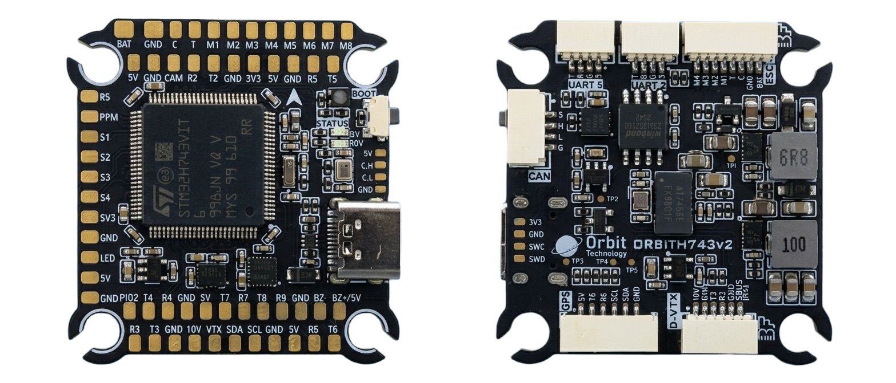
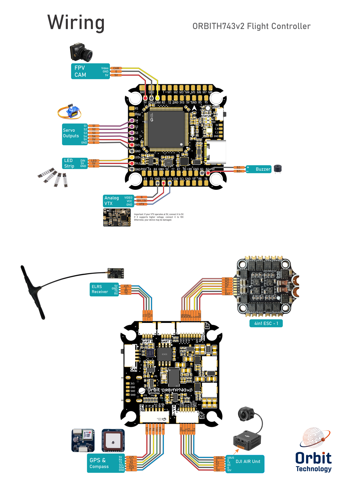

# ORBITH743v2

The above image and some content courtesy of [orbitteknoloji.com.tr](https://orbitteknoloji.com.tr/)

## Specifications

### **Processor**

- STM32H743VIT6 (480MHz)
- 16MB Flash for data logging

### **Sensors**

- InvenSense ICM42688P/ICM40609D IMUs (accel, gyro)
- SPL06 barometer
- Voltage & Current sensor

### **Power**
  
- 2-6S LiPo input power
- 5V 3A BEC for peripherals
- 10V 3A BEC for video, GPIO controlled
- 3.3V regulated output for low-power peripherals (sensors, logic devices)

### **Interfaces**

- USB Type-C port
- 8x UARTs
- 13x PWM outputs(one for serial LED by default) via two 8-pin ESC connectors and/or solder pads
- 1x RC input (PWM/SBUS)
- I2C port for external compass, airspeed sensor, etc.
- 1x CAN port
- HD VTX support
- 1x Power Monitor
- Buzzer and LED strip
- Built-in OSD
- 1x RGB LED (FC Status)
- 2x Red LEDs (5V / 10V Power Status)

### **Size and Dimensions**

- 38.5 mm x 40 mm
- 8.4 g

### **Mounting Hole**

- 30.5 mm x 30.5 mm

## UART Ports

ORBITH743v2 provides 8x hardware UARTs for peripherals such as telemetry, RC systems, GPS, companion computers, and other serial devices.

All UART ports use standard STM32H743 DMA-capable serial interfaces (except UART1, depending on configuration).

### Default UART Order

- `SERIAL0` = USB (MAVLink2)  
- `SERIAL1` = UART1 (ESC Telemetry)  
- `SERIAL2` = UART2 (USER / General Purpose)  
- `SERIAL3` = UART3 (DJI HD Air Unit / VTX)  
- `SERIAL4` = UART4 (USER / General Purpose)  
- `SERIAL5` = UART5 (RC Input)  
- `SERIAL6` = UART6 (GPS)  
- `SERIAL7` = UART7 (USER / General Purpose)  
- `SERIAL8` = UART8 (USER / General Purpose)  

> **Note:** Serial port functions can be reassigned in ArduPilot depending on application requirements.

## External UART Connectors

The board provides **two external SH1.0 4P UART connectors**:

- UART5 connector (RC Input default)
- UART2 connector (User configurable)

These connectors are intended for external serial peripherals such as telemetry radios, companion computers, rangefinders, or other UART-based devices.

### Connector Pinout (Both UART Ports)

| Pin | Signal |
|-----|--------|
| 1   | 5V     |
| 2   | GND    |
| 3   | RX     |
| 4   | TX     |

> **Note:** UART5 is configured by default for RC input. UART2 is available for general-purpose use and can be reassigned in ArduPilot.

## RC Input

RC input is configured by default on `SERIAL5` (UART5). The 5V pin is powered by both USB and the onboard 5V BEC from the battery.

- PPM is supported via a dedicated solder pad on the board.  
- SBUS/DSM/SRXL connects to the RX5 pin.
- FPort requires connection to TX5. Set [SERIAL5_OPTIONS](https://ardupilot.org/copter/docs/parameters.html#serial5-options-serial5-options) = 7  
- CRSF also requires both TX5 and RX5 connections and provides telemetry automatically.

Any UART can be used for RC system connections in ArduPilot. See the [common RC systems](https://ardupilot.org) documentation for details.

## RSSI

Analog inputs are supported.

- RSSI reference pin number: **8**

> **Note:** Set [RSSI_TYPE](https://ardupilot.org/copter/docs/parameters.html#rssi-type-rssi-type) = 1 for analog RSSI, or = 3 for RSSI provided by RC protocols like CRSF.

## GPS

This board does **not** include onboard GPS or compass modules. An [external GPS/compass](https://ardupilot.org) module must be connected to use autonomous navigation features.

A **JST GH1.24 6P** connector is provided for GPS and follows the standard Pixhawk GPS pinout. `SERIAL6` is configured by default for GPS operation.

### GPS Connector Pinout

| Pin | Signal    |
|-----|-----------|
| 1   | VCC       |
| 2   | TX        |
| 3   | RX        |
| 4   | I2C1 SCL  |
| 5   | I2C1 SDA  |
| 6   | GND       |

## CAN Bus

A **GH1.24 4P** connector is provided for CAN Bus peripherals. The interface uses the `TJA1051TK/3` CAN transceiver and follows the standard Pixhawk CAN pinout. The CAN interface is compatible with DroneCAN peripherals and includes onboard 120Ω bus termination.

### CAN Connector Pinout

| Pin | Signal |
|-----|--------|
| 1   | 5V     |
| 2   | CAN_H  |
| 3   | CAN_L  |
| 4   | GND    |

## OSD Support

The ORBITH743v2 has an onboard OSD using a AT7456 chip and is enabled by default. The CAM and VTX pins provide connections for using the internal OSD. Simultaneous DisplayPort OSD is possible and is configured by default.

## DJI Video and OSD

An **SH1.0 6P** connector supports a standard DJI HD VTX connection. `SERIAL3` is configured by default for DisplayPort. Pin 1 provides 10V power controlled by `GPIO81` — **do not** connect peripherals that require 5V to this pin.

### DJI Connector Pinout

| Pin | Signal       |
|-----|--------------|
| 1   | 10V          |
| 2   | GND          |
| 3   | UART3_TX (T3)|
| 4   | UART3_RX (R3)|
| 5   | GND          |
| 6   | SBUS (R4)    |

## DShot Capability

All motor outputs (M1-M8) support:

- DShot
- Bi-directional DShot (for BIDIR motors)
- PWM

> **Important:** Mixing DShot and PWM within the same timer group is **not allowed**. Groups must be uniformly configured. Output timer groups are:  
1/2, 3/4, 5/6, 7/8.

Servo outputs (Outputs 9-12, marked S1-S4) on PA15, PB3, PD12, and PD13 (TIM2 and TIM4 timers) are PWM only. Output 13 (marked LED) is in a separate group and supports PWM/DShot or serial LED operation.

## GPIOs

ORBITH743v2 outputs can be used as GPIOs (relays, buttons, RPM, etc.).  
Set the `SERVOx_FUNCTION = -1` to enable GPIO functionality. See [ArduPilot GPIO docs](https://ardupilot.org) for more info.

### GPIO Pin Mapping

- PWM1 → 50  
- PWM2 → 51  
- PWM3 → 52  
- PWM4 → 53  
- PWM5 → 54  
- PWM6 → 55  
- PWM7 → 56  
- PWM8 → 57  
- PWM9 → 58  
- PWM10 → 59  
- PWM11 → 60  
- PWM12 → 61  
- LED → 62  
- BUZZER → 80  
- VTX PWR → 81 (internal)  
- PINIO2 → 82

## VTX Power Control

GPIO 81 controls the 10V VTX BEC output.  
Setting GPIO 81 **low** disables voltage to the pins.

Example (using Channel 10 to toggle VTX BEC using Relay 2, as an example):

- [RELAY2_FUNCTION](https://ardupilot.org/copter/docs/parameters.html#relay2-function-relay-function) = 1 (already set as default)
- [RELAY2_PIN](https://ardupilot.org/copter/docs/parameters.html#relay2-pin-relay-pin) = 81  (already set as default)
- [RC10_OPTION](https://ardupilot.org/copter/docs/parameters.html#rc10-option-rc-input-option) = 34  ; Relay2 Control

> ⚠️ **Warning:** GPIO81 controls the 10V DC-DC converter (HIGH = on, LOW = off). Default: ON. Always install an antenna on the VTX when battery-powered.

## PINIO2

GPIO 82 is connected to PINIO2 and can be used as a general-purpose output (relay, LED control, peripheral power switching, etc.).

Example (using Channel 11 to control PINIO2 via Relay 3):

- [RELAY3_FUNCTION](https://ardupilot.org/copter/docs/parameters.html#relay3-function-relay-function) = 1 (already set as default)
- [RELAY3_PIN](https://ardupilot.org/copter/docs/parameters.html#relay3-pin-relay-pin) = 82  (already set as default)
- [RC11_OPTION](https://ardupilot.org/copter/docs/parameters.html#rc11-option-rc-input-option) = 35  ; Relay3 Control

## Battery Monitor Settings

These are set by default. If reset:

Enable battery monitor with: `BATT_MONITOR=4`, then reboot.

**First battery monitor is enabled by default:**

- BATT_VOLT_PIN = 10
- BATT_CURR_PIN = 11
- BATT_VOLT_MULT = 11
- BATT_AMP_PERVLT = 80.0 (Calibrate as needed, depending on current sensor.)

## Where to Buy

- [orbitteknoloji.com.tr](https://orbitteknoloji.com.tr)

## Firmware

This board does **not** ship with ArduPilot pre-installed.
Follow [this guide](https://ardupilot.org/copter/docs/common-loading-firmware-onto-chibios-only-boards.html) to load it for the first time.

Firmware can be found in [ArduPilot firmware repo](https://firmware.ardupilot.org) under the `ORBITH743v2` sub-folder.

> **Note:** If the board fails to initialize after powering up, refer to [H7 troubleshooting section](https://ardupilot.org/copter/docs/common-when-problems-arise.html) in the ArduPilot docs.

## Wiring Diagram

