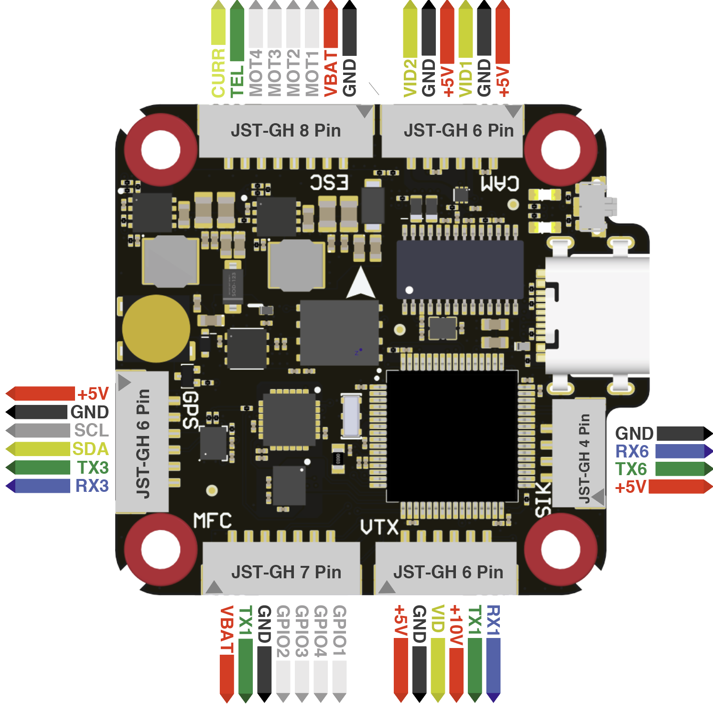

# Orqa FC 3030 F405 Flight Controller

The Orqa FC 3030 F405 is a flight controller produced by [Orqa](https://enterprise.orqafpv.com/).

## Features

 - MCU - STM32F405 32-bit processor
 - IMU - MPU6000
 - Barometer - DPS310
 - OSD - AT7456E
 - Onboard Flash: 128Mbit
 - 4x UARTs
 - 8x PWM Outputs (8 Motor Output)
 - Battery input voltage: 2S-6S
 - BEC 5V 2A
 - BEC 10V 2A

## Pinout

## UART Mapping

The UARTs are marked Rn and Tn in the above pinouts. The Rn pin is the
receive pin for UARTn. The Tn pin is the transmit pin for UARTn.

 - SERIAL0 -> USB
 - SERIAL1 -> UART1 (RX/GHST, DMA-enabled)
 - SERIAL3 -> UART3 (GPS, DMA-enabled)
 - SERIAL5 -> UART5 (ESC Telemetry)
 - SERIAL6 -> UART6 (Sik/MAVLink)

## RC Input

RC input is configured for GHST by default on the T1 (UART1_TX) pin using half-duplex. To support other RC protocols set SERIAL1_OPTIONS to 0. This will support all serial RC protocols except SBUS. For PPM and SBUS support on UART1_RX set BRD_ALT_CONFIG to 1.
  
## OSD Support

The Orqa FC 3030 F405 supports OSD using OSD_TYPE 1 (MAX7456 driver) or OSD_TYPE 3 if using DJI OSD

## PWM Output

The Orqa FC 3030 F405 supports up to 8 PWM outputs in the JST-GH ESC and MFC connectors. Outputs 5-8 are labeled as GPIO1-4 on the 7pin JST-GH connector

The PWM is in 3 groups:

 - PWM 1,4-6 in group1
 - PWM 2-3 in group2
 - PWM 7-8 in group3

Channels within the same group need to use the same output rate. If
any channel in a group uses DShot then all channels in the group need
to use dshot. All channels support dshot. Channels 1-4 support bi-directional dshot.
All channels can also be used for GPIO.

## Battery Monitoring

The board has a built-in voltage and current sensor. The current
sensor can read up to 130 Amps. The voltage sensor can handle up to 6S
LiPo batteries.

The correct battery setting parameters are:

 - BATT_MONITOR 4
 - BATT_VOLT_PIN 13
 - BATT_CURR_PIN 12
 - BATT_VOLT_MULT 8.3
 - BATT_AMP_PERVLT 92.6

## VTX Control

Switching between Camera1 and Camera2 can be achieved via GPIO pin 74 which is configured on RELAY2

## Compass

The Orqa FC 3030 F405 does not have a builtin compass, but you can attach an external compass using I2C on the SDA and SCL pin.

## Loading Firmware

Initial firmware load can be done with DFU by plugging in USB with the
bootloader button pressed. Then you should load the "with_bl.hex"
firmware, using your favourite DFU loading tool.

Once the initial firmware is loaded you can update the firmware using
any ArduPilot ground station software. Updates should be done with the
*.apj firmware files.

