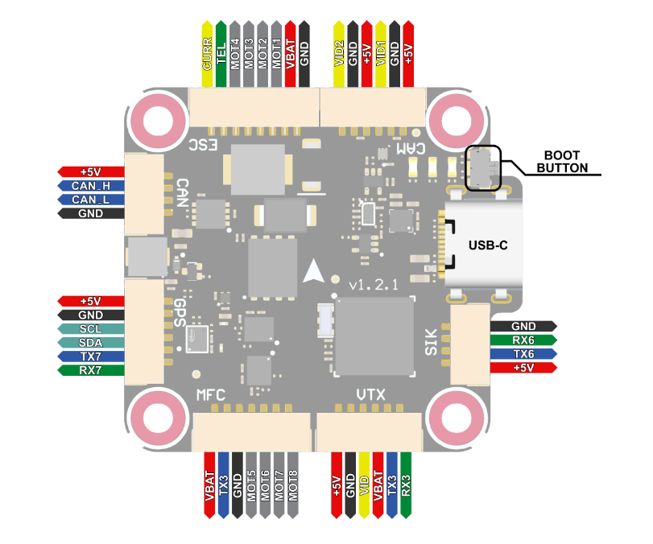
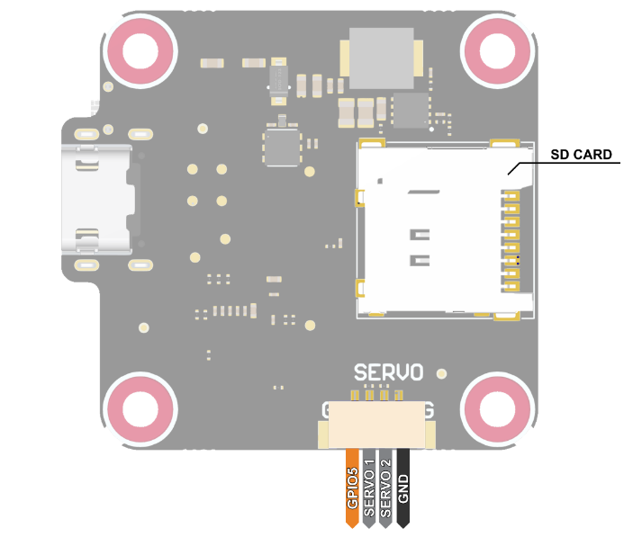

# Orqa FC 3030 H743 Flight Controller

The Orqa FC 3030 H743 is a flight controller produced by [Orqa](https://enterprise.orqafpv.com/).

## Features

 - MCU - STM32H743 32-bit processor
 - IMU - MPU6000
 - Barometer - DPS310
 - OSD - AT7456E
 - Onboard Flash: 128Mbit
 - microSD card slot
 - 1x CAN
 - 4x UARTs
 - 10x PWM Outputs (8 Motor Output)
 - Battery input voltage: 2S-8S
 - BEC 5V 2A
 - BEC 10V 2.5A

## Pinout

## UART Mapping

The UARTs are marked Rn and Tn in the above pinouts. The Rn pin is the
receive pin for UARTn. The Tn pin is the transmit pin for UARTn.

 - SERIAL0 -> USB
 - SERIAL3 -> UART3 (RX/GHST, DMA-enabled)
 - SERIAL6 -> UART6 (Sik/MAVLink, DMA-enabled)
 - SERIAL7 -> UART7 (GPS)
 - SERIAL8 -> UART8 (ESC Telemetry)

## RC Input

RC input is configured for half duplex protocls (GHST/SRXL2) by default on the T3 (UART3_TX) pin using half-duplex. To support other RC protocols set SERIAL1_OPTIONS to 0 and connect to R3/T3 as required (see https://ardupilot.org/plane/docs/common-rc-systems.html). This will support all serial RC protocols but not PPM.
  
## OSD Support

The Orqa FC 3030 H743 supports OSD using OSD_TYPE 1 (MAX7456 driver). HD OSD and other ODSDs can be supported using a UART (see https://ardupilot.org/plane/docs/common-osd-boards-on-screen-display.html)

## PWM Output

The Orqa FC 3030 H743 supports up to 10 PWM outputs in the JST-GH ESC and MFC connectors and Servo pads.

The PWM is in 5 groups:

 - PWM 1-2 in group1
 - PWM 3-4 in group2
 - PWM 5-6 in group3
 - PWM 7-8 in group4
 - PWM 9-10 in group5

Channels within the same group need to use the same output rate. If
any channel in a group uses DShot then all channels in the group need
to use dshot. Channels 1-8 support dshot and bi-directional dshot.
All channels can also be used for GPIO.

## Battery Monitoring

The board has a builting voltage and current sensor. The current
sensor can read up to 130 Amps. The voltage sensor can handle up to 6S
LiPo batteries.

The correct battery setting parameters are:

 - BATT_MONITOR 4
 - BATT_VOLT_PIN 13
 - BATT_CURR_PIN 12
 - BATT_VOLT_MULT 8.3
 - BATT_AMP_PERVLT 92.6

## VTX Control

Switching between Camera1 and Camera2 can be achieved via GPIO pin 74 which is configured on RELAY2

## GPIO5
The GPIO5 pin is assigned as GPIO 75
## Compass

The Orqa FC 3030 H743 does not have a builtin compass, but you can attach an external compass using I2C on the SDA and SCL pin.

## Loading Firmware
Firmware is found under the "OrqaH743Pro" folders on the firmware server: https://firmware.ardupilot.org/

Initial firmware load can be done with DFU by plugging in USB with the
bootloader button pressed. Then you should load the "with_bl.hex"
firmware, using your favourite DFU loading tool.

Once the initial firmware is loaded you can update the firmware using
any ArduPilot ground station software. Updates should be done with the
*.apj firmware files.

