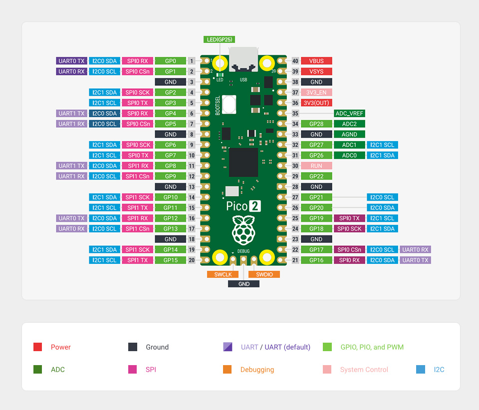
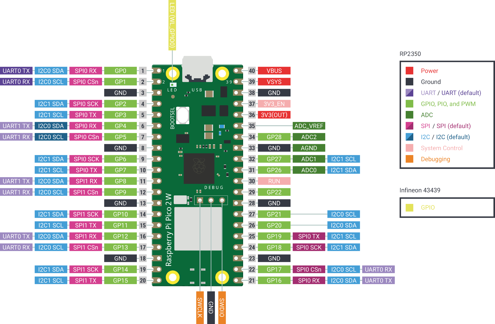

# Raspberry Pi Pico 2 (RP2350)

The Pico2 target runs ArduPilot on a stock Raspberry Pi Pico 2 or Pico 2 W
module with nothing attached. The module carries no sensors, so like the
Nucleo targets this is a Simulation-on-Hardware build: the flight code runs on
the real RP2350, on both cores and at real loop rates, against a physics model
running on the same MCU instead of against an IMU and barometer.

It is the bench target for the RP2350 port. Laurel and RPI_UAVFC are the
flight controllers; this board runs the same SMP configuration, clock and
flash timing as they do, so scheduler, core1 and timing work can be done
without one.




## Features

- RP2350A (QFN-60), dual Cortex-M33 at 225 MHz, running ChibiOS SMP
  (the rate thread is pinned to core1)
- 520 KB SRAM, 4 MB QSPI flash
- USB CDC (SERIAL0), two hardware UARTs and two PIO UARTs
- 8 PWM outputs
- 3 ADC inputs
- Onboard LED on GPIO25 (Pico 2 only; the Pico 2 W LED is on the wireless chip)

Only GPIO0-29 exist on the RP2350A.

## Pinout

GPIO numbers are the RP2350 GPIO; board pins are the module's header pins,
1-20 down the left and 21-40 up the right with the USB connector at the top.

| Function | GPIO | Board pin |
|----------|------|-----------|
| SERIAL1 TX / RX (UART0) | 12 / 13 | 16 / 17 |
| SERIAL2 TX / RX (UART1) | 10 / 11 | 14 / 15 |
| SERIAL3 TX / RX (PIOUART0) | 20 / 21 | 26 / 27 |
| SERIAL4 TX / RX (PIOUART1) | 16 / 17 | 21 / 22 |
| PWM1-PWM4 | 0-3 | 1, 2, 4, 5 |
| PWM5-PWM8 | 4-7 | 6, 7, 9, 10 |
| RC input (PPM) | 21 | 27 |
| Battery voltage (ADC0) | 26 | 31 |
| Battery current (ADC1) | 27 | 32 |
| RSSI (ADC2) | 28 | 34 |

GPIO21 is shared between PPM input and SERIAL3 RX. With SERIAL3_PROTOCOL left
at 0 it reads PPM; set SERIAL3_PROTOCOL 23 to use it as a serial RC input
instead. SERIAL1-SERIAL4 have no protocol-specific defaults beyond that.

DShot is not enabled: the RP2350 DShot driver drives at most four channels.

## Simulation

`defaults.parm` selects the SITL AHRS (`AHRS_EKF_TYPE 10`), a simulated GPS
(`GPS1_TYPE 100`) and a quad frame, so the board runs on the bench with
nothing attached but USB. `SIM_RATE_HZ` and `SCHED_LOOP_RATE` are both 200
and want to stay equal: the physics model steps once per main loop and
`sync_frame_time()` sleeps to hold `SIM_RATE_HZ`.

The fast rate thread compiles in off (`FSTRATE_ENABLE 0`). Turning it on
starts the rate loop on core1, fed by the simulated IMU.

## Flash layout

| Region | Address |
|--------|---------|
| Bootloader | 0x10000000-0x10007FFF |
| Parameter storage | 0x10008000-0x1000FFFF |
| Application | 0x10010000-0x103FFFFF |

## Building and flashing

```bash
./waf configure --board Pico2 --bootloader
./waf bootloader
./waf configure --board Pico2
./waf copter
```

Load the bootloader once over BOOTSEL: hold BOOTSEL while plugging in USB,
then run `./waf bootloader --upload`, which converts to UF2 and loads it with
picotool from PATH (`Tools/scripts/rp2350_pioasm.py --install` provides one),
or copy `Tools/bootloaders/Pico2_bl.uf2` to the drive that appears. After that, `./waf copter --upload` updates the firmware through
the bootloader over USB.

For SWD debugging with a second Pico 2 as the probe, see
[Debugger.md](Debugger.md) and [HARDWARE.md](HARDWARE.md).

## Clock and flash timing

The core runs at 225 MHz with the VREG raised to 1.15 V, and the QSPI flash
at 75 MHz (`RP_QMI_CLKDIV 3`, `RP_QMI_RXDELAY 2`). These match Laurel and
RPI_UAVFC, where they are characterised; the datasheet qualifies the RP2350
at 150 MHz.
