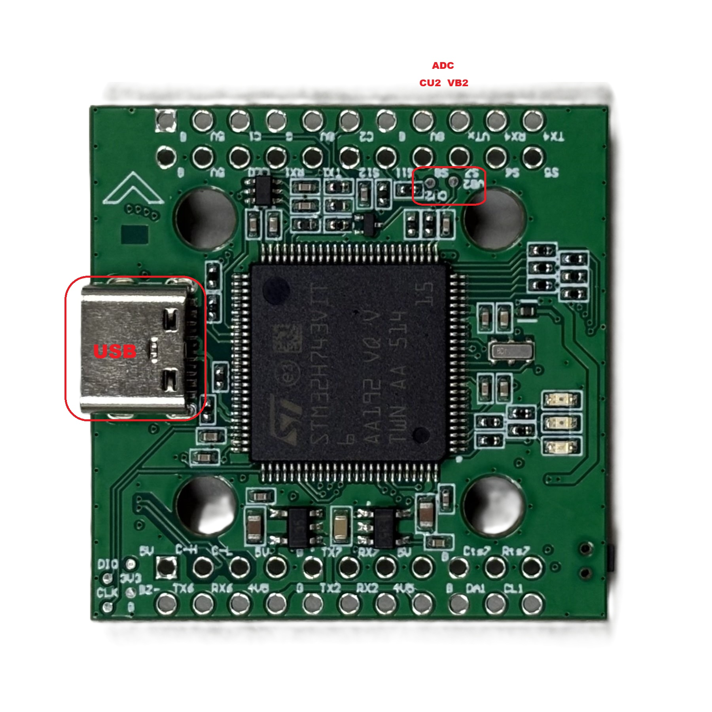
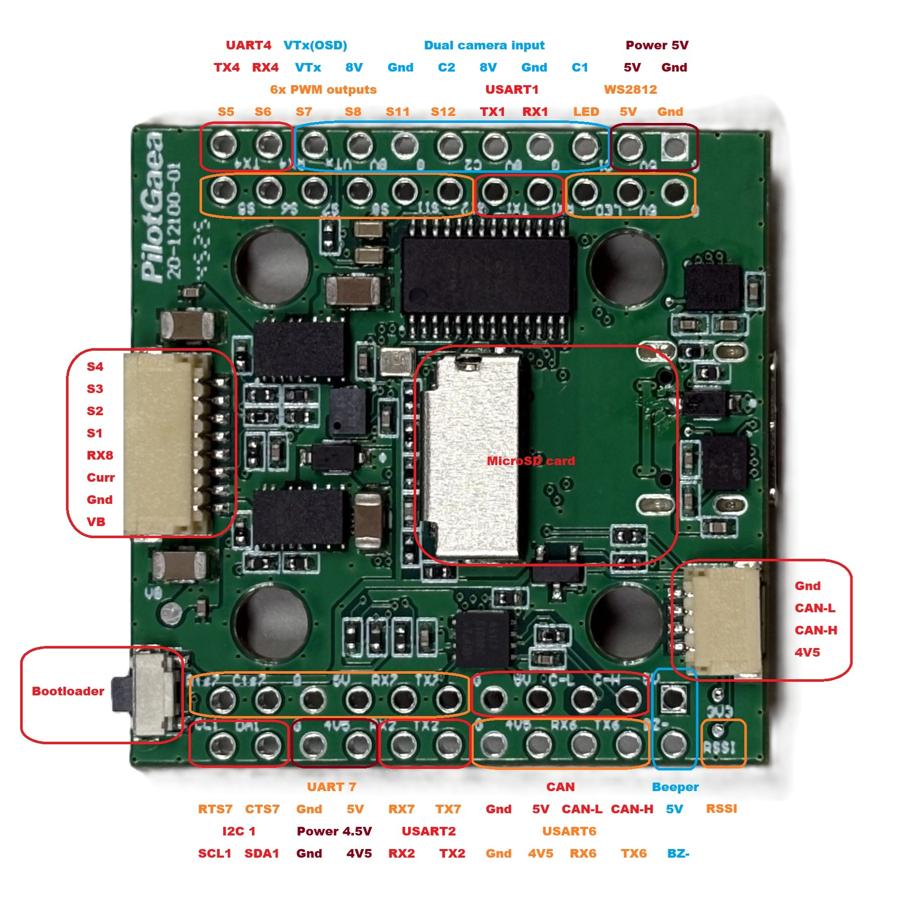

# PilotGaeaSH7V1-bdshot Flight Controller

The PilotGaeaSH7V1-bdshot is a flight controller designed and produced by PilotGaea.

## Features

- STM32H743 microcontroller
- Dual ICM42688P IMUs (on SPI1 and SPI4)
- DPS310 barometer
- AT7456E OSD
- MicroSD card slot
- Dual camera input with switching support
- 1x USB (Type-C)
- 5.5 UARTs (UART7 with CTS/RTS flow control)
- 11 PWM / Dshot outputs (8 with Bi-directional DShot support)
- 2x I2C (I2C2 internal, I2C1 external)
- 1x CAN bus
- 5 ADC inputs (Battery Voltage, Current, BATT2 Voltage, BATT2 Current, RSSI)
- 5V/1.5A BEC for main power supply
- 8V/1.5A BEC for powering Video Transmitter

## Mechanical

- Dimensions: 36 x 36 x 17 mm
- Weight: 10.5g

## Physical and pinout

## Power supply

The PilotGaeaSH7V1-bdshot supports 3-8s Li battery input. It has 2 ways of BEC, which result in 3 ways of power supplies. Please see the table below.

| Power symbol | Power source | Max power (current) |
| :--- | :--- | :--- |
| BAT | directly from battery | |
| 5V | from 5V BEC | 7.5W (1.5A) |
| 8V | from 8V BEC, controlled by MCU | 12W (1.5A) |
| 4V5 | from USB or 5V BEC, diodes isolate the two powers | 4.7W (1A) |

## UART Mapping

The UARTs are marked RXn and TXn in the above pinouts. The RXn pin is the receive pin for UARTn. The TXn pin is the transmit pin for UARTn.

| ArduPilot Serial | Hardware UART | Default Function | DMA Support |
| :--- | :--- | :--- | :--- |
| SERIAL0 | OTG1 | USB | No |
| SERIAL1 | UART7(CTS/RTS) | Telem 1 | Yes |
| SERIAL2 | USART1 | Telem 2 | Yes |
| SERIAL3 | USART2 | GPS | Yes |
| SERIAL4 | EMPTY | None | N/A |
| SERIAL5 | UART8 | ESC Telem | No (NODMA) |
| SERIAL6 | UART4 | MSP/DisplayPort | No (NODMA) |
| SERIAL7 | USART6 | RCIN | Yes |

> **NOTE:** Telem function is MAVLINK2 protocol. Any UART can be re-tasked by changing its protocol parameter.

## RC Input

The default RC input is configured on USART6 and supports all RC protocols except PPM. The SBUS pin is hardware-inverted and connected to the RX6 pin.

RC input can be attached to any UART port. To reassign it:

1. Set the target port protocol to RC input (e.g., `SERIALn_PROTOCOL` = 23).
2. Change `SERIAL6_PROTOCOL` to a different protocol (e.g., -1 or 2) to avoid resource conflicts.

## OSD Support

The PilotGaeaSH7V1-bdshot Supports onboard analog OSD using the AT7456 chip. The composited image is output via the VTX pin.  Simultaneous HD VTX DisplayPort is supported via SERIAL6.

## PWM Output and DShot

The PilotGaeaSH7V1-bdshot supports up to **11 physical PWM outputs**, organized into **6 independent timer groups**. All groups support DShot, but **Bi-directional DShot (BDShot)** is fully optimized for **Groups 1-4 (Outputs 1-8)**.

### PWM Grouping Table

| Group | PWM Output | Timer | BDShot Support | Recommended Use |
| :--- | :--- | :--- | :--- | :--- |
| **1** | 1, 2 | TIM3 | **Full (DMA)** | Motors 1-2 (BDShot) |
| **2** | 3, 4 | TIM2 | **Full (DMA)** | Motors 3-4 (BDShot) |
| **3** | 5, 6 | TIM5 | **Full (DMA)** | Motors 5-6 (BDShot) |
| **4** | 7, 8 | TIM4 | **Full (DMA)** | Motors 7-8 (BDShot) |
| **5** | 13 | TIM1 | **Yes (DMA)*** | NeoPixel / LED (Default) |
| **6** | 11, 12 | TIM15 | No, only can be PWM | Auxiliary / Servos |

### Bi-directional DShot Configuration

To use BDShot for RPM filtering, you must flash the `PilotGaeaSH7V1-bdshot` firmware.

- **Outputs 1-8:** Fully optimized with dedicated DMA streams and `TIMx_UP` support for stable DShot600 and bi-directional RPM telemetry.
- **Outputs 9-12:** Configured with `NODMA`. These can only be used for standard PWM (servos) or GPIOs; they do not support DShot or RPM telemetry.
- **Output 13:** Supports DMA but is pre-configured for Serial LED.

> **Note:** PWM 9 and 10 are defined in firmware but not physically broken out on the board.
>
> **Note:** **PWM 13 (Group 5)** supports DMA, but is pre-configured for Serial LED ( `NTF_LED_TYPES` = **455** ) in default parameters to support onboard status lighting.
>
> **Important:** Every output within a timer group must use the same protocol (e.g., Output 3 & 4 must both be DShot or PWM).

## Battery Monitoring

The PilotGaeaSH7V1-bdshot features high-voltage monitoring capabilities, supporting up to 8S LiPo on both sensors. Notably, **BATT2** is optimized with a higher divider ratio for enhanced voltage range support.

### Primary Battery (BATT)

- `BATT_MONITOR`: **4** (Analog Voltage and Current)
- `BATT_VOLT_PIN`: **10**
- `BATT_CURR_PIN`: **11**
- `BATT_VOLT_MULT`: **11.0**
- `BATT_AMP_PERVLT`: **40.0**

### Secondary Battery (BATT2)

To enable the second monitor, set the parameters below and **reboot** the flight controller:

- `BATT2_MONITOR`: **4**
- `BATT2_VOLT_PIN`: **18**
- `BATT2_CURR_PIN`: **7**
- `BATT2_VOLT_MULT`: **21.0**
- `BATT2_AMP_PERVLT`: **40.0**

## Compass

The PilotGaeaSH7V1-bdshot has no built-in compass, so if needed, you should use an external compass.

## Analog cameras

The PilotGaeaSH7V1-bdshot supports up to 2 cameras, connected to pin C1 and C2. You can select the video signal to VTX from camera by an RC channel. Set the parameters below:

- `RELAY2_FUNCTION`: **1**
- `RELAY_PIN2`: **82** (PinIO 2)
- `RC8_OPTION`: **34** (Relay2 On/Off)

## 8V switch

The 8V power supply can be controlled by an RC channel. Set the parameters below:

- `RELAY1_FUNCTION`: **1**
- `RELAY_PIN`: **81** (PinIO 1)
- `RC7_OPTION`: **28** (Relay On/Off)

## Loading Firmware

The firmware target name is **`PilotGaeaSH7V1-bdshot`**.

### Initial Flash (DFU Mode)

If you are flashing this board for the first time or recovering from a corrupted bootloader, use DFU mode:

1. Connect the USB cable to your PC while holding down the physical **bootloader button**.
2. Use a DFU loading tool (such as **STM32CubeProgrammer** or **Betaflight Configurator**) to load the `PilotGaeaSH7V1-bdshot_with_bl.hex` file.
3. Once the flashing process is complete, the board will reboot into ArduPilot.

### Firmware Updates

For subsequent updates once the bootloader is present:

- **GCS Update:** Use Mission Planner or QGroundControl to upload the `PilotGaeaSH7V1-bdshot.apj` file.
- **SD Card Update:** Alternatively, place the `latest.bin` or `firmware.bin` on the root of the MicroSD card to utilize the onboard auto-update feature.
