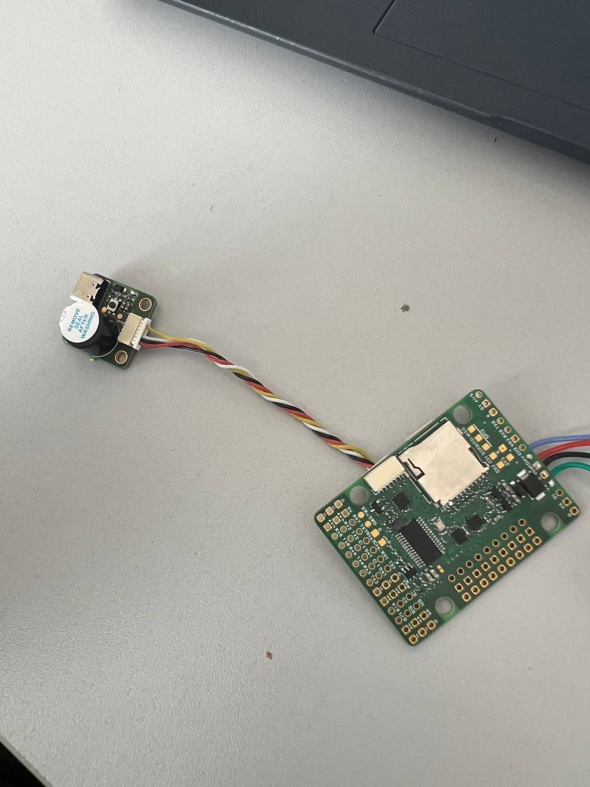
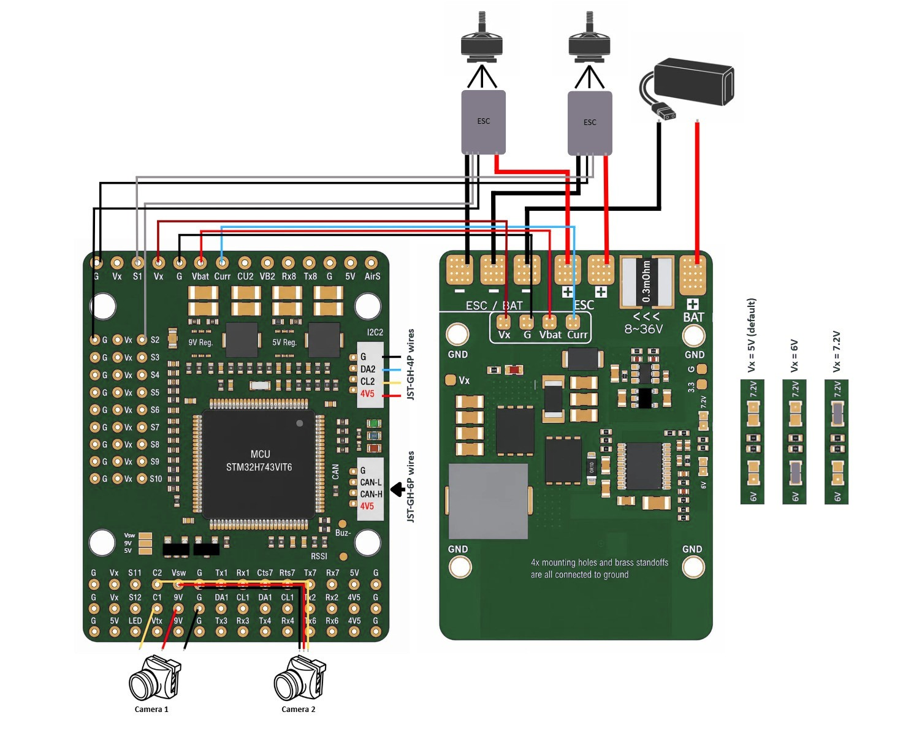

# PilotIX

The PilotIX autopilot is manufactured by [Partizan Security s.r.o.](https://www.partizanstore.eu/en/)

## Where to Buy

[Partizan Security s.r.o.](https://www.hobbydrone.cz/cs/)

## Specifications

- Processor

  - STM32H743VIT6, 480MHz, LQFP100
  - 2048KB Flash
  - AT7456E OSD (MAX7456-compatible)

- Sensors

  - 2x ICM-42688-P IMU (SPI1 + SPI4, dedicated CS and data-ready lines per sensor)
  - DPS310 / DPS368 barometer (I2C2)

- Interfaces

  - MicroSD card slot (SDMMC1, 4-bit)
  - USB-C
  - 12 PWM/servo outputs (S1-S12) + 1 dedicated LED-strip output
  - 7 UART-capable serial ports (USART1, USART2, USART3, UART4, USART6, UART7, UART8)
  - 2x I2C buses (I2C1 external, I2C2 internal to the barometer)
  - 1x CAN bus (SIT1051ATK/3 transceiver, with software silent/standby control)
  - Onboard analog camera/VTX video switch with PINIO-controlled select line
  - WS2812 addressable LED strip output
  - Piezo buzzer output

- Power

  - Dual power-input monitoring circuits (main + secondary)
  - Wide-range synchronous buck front end (LM5116) plus 5V/9V/3.3V regulated rails
  - Input voltage: 3S-8S LiPo (verify against your own board's resistor divider before first use)

- Dimensions

  - Size: 4.9 x 3.5 cm
  - Weight: 12g

## Pinout

## UART Mapping

The UARTs are marked TXn/RXn in the silkscreen. There is no physical
UART5 on this STM32H743VIT6 LQFP100 package, so numbering skips from 4 to 6.

| Port | UART    | Protocol          | TX DMA | RX DMA |
|------|---------|--------------------|--------|--------|
| 0    | OTG1    | MAVLink2 (USB)     | N      | N      |
| 1    | UART7   | MAVLink2 (Telem1)  | Y      | Y      |
| 2    | USART1  | MAVLink2 (Telem2)  | Y      | Y      |
| 3    | USART2  | GPS1               | Y      | Y      |
| 4    | USART3  | GPS2               | Y      | Y      |
| 5    | UART4   | MAVLink2 (spare)   | Y      | Y      |
| 6    | USART6  | RCin               | N      | N      |
| 7    | UART8   | MAVLink2 (spare)   | Y      | Y      |

UART7 (SERIAL1/Telem1) additionally exposes RTS7/CTS7 flow control pins.

## RC Input

RC input defaults to SERIAL6 (USART6, silkscreen TX6/RX6) and supports all
serial RC protocols (SBUS, CRSF, ELRS, etc.) by setting `SERIAL6_PROTOCOL`
to match the receiver. Any other spare UART can also be used for RC input,
compatible with all protocols except PPM; see
[Radio Control Systems](https://ardupilot.org/copter/docs/common-rc-systems.html)
for protocol-specific setup.

## PWM Output

The board provides 12 motor/servo outputs (S1-S12) plus a dedicated
WS2812 LED-strip output (S13). `FRAME_CLASS` defaults to 1 (Quad);
S1-S4 drive the motors on a quadcopter build, S5-S12 are free for
servos/gimbal/lighting. Change `FRAME_CLASS`/`FRAME_TYPE` to match
whatever frame you actually build.

Outputs are grouped by timer. **All outputs in the same group must use the
same output protocol** (e.g. if any channel in a group uses DShot, every
channel in that group must use DShot):

- Group 1 (TIM8): S1, S2
- Group 2 (TIM5): S3, S4, S5, S6
- Group 3 (TIM4): S7, S8, S9, S10
- Group 4 (TIM15): S11, S12
- LED strip (TIM1): S13 (WS2812, not a motor/servo output)

Note that S3/S4 share Group 2 with S5/S6 — if S3/S4 run DShot for ESCs on a
quad build, S5/S6 must also run DShot rather than a standard 50Hz servo
signal.

## OSD Support

Onboard analog OSD using an AT7456E (MAX7456-compatible driver) is enabled
by default.

## Camera Switch

An onboard analog video multiplexer selects between two camera inputs.
The select line is controlled via PINIO2 (GPIO 82). By default this is not
pre-bound to a RELAY; assign a RELAY or script to PINIO2 to switch sources
in flight.

## Compass

The PilotIX does not have a built-in compass, but an external compass can
be attached via I2C1 (external connector, SCL/SDA pads).

## RSSI

If an analog RSSI signal is used, connect it to the pin labelled ADC_RSSI1
(PC5) on the schematic; the board defaults `RSSI_TYPE` to 1 (analog).

## Analog Airspeed

If an analog airspeed sensor is used, set `ARSPD_PIN` to 4 and `ARSPD_TYPE`
to 2. The pin is labelled ADC_AIRS (PC4) on the schematic.

## GPIOs

| Function          | Pin  | GPIO Number |
|--------------------|------|-------------|
| LED0 (status, blue)  | PE3  | 90          |
| LED1 (status, green) | PE4  | 91          |
| LED strip (WS2812)    | PA8  | 62          |
| Buzzer (ALARM)         | PA15 | 32          |
| CAN1 silent/standby    | PD3  | 70          |
| PINIO1 (Vsw power switch) | PD10 | 81      |
| PINIO2 (camera/VTX select) | PD11 | 82    |
| PWM1 (S1)  | PB0  | 50 |
| PWM2 (S2)  | PB1  | 51 |
| PWM3 (S3)  | PA0  | 52 |
| PWM4 (S4)  | PA1  | 53 |
| PWM5 (S5)  | PA2  | 54 |
| PWM6 (S6)  | PA3  | 55 |
| PWM7 (S7)  | PD12 | 56 |
| PWM8 (S8)  | PD13 | 57 |
| PWM9 (S9)  | PD14 | 58 |
| PWM10 (S10) | PD15 | 59 |
| PWM11 (S11) | PE5  | 60 |
| PWM12 (S12) | PE6  | 61 |

## Battery Monitoring

The board has two independent analog voltage/current monitoring circuits
(main and secondary), both configured via hwdef.dat defaults:

- Battery 1: `BATT_VOLT_MULT` = 11.21, `BATT_AMP_PERVLT` = 15.49
  (verified against a multimeter and a current clamp at 50% throttle,
  using a known 16.8V 4S source)
- Battery 2: `BATT2_VOLT_MULT` = 21.46, `BATT2_AMP_PERVLT` = 15.58
  (verified the same way)

## Firmware

Firmware for the PilotIX can be found on the
[ArduPilot firmware server](https://firmware.ardupilot.org) in sub-folders
labeled "PilotIX", once the board port has been merged.

## Loading Firmware

This board does not come with ArduPilot firmware pre-installed. Use DFU to
load firmware the first time; see
[Loading Firmware onto boards without existing ArduPilot firmware](https://ardupilot.org/plane/docs/common-loading-firmware-onto-chibios-only-boards.html).
Subsequent updates can be applied using `.apj` firmware files through any
compatible ground station.
