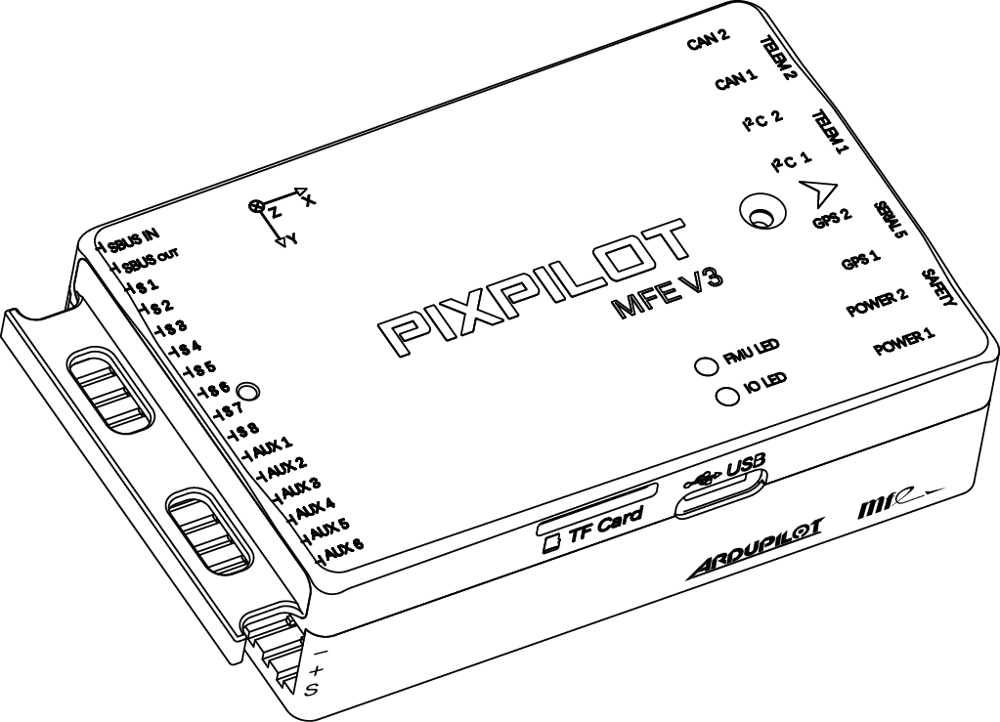
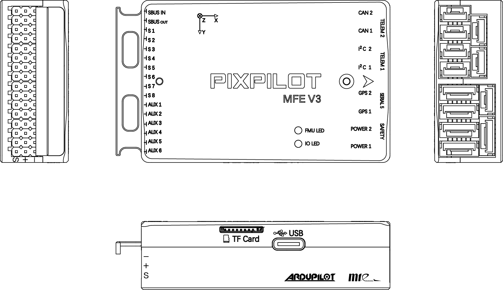

## PixPilot-V3 Flight Controller

The PixPilot-V3 flight controller is sold by a range of resellers listed on the makeflyeasy(http://www.makeflyeasy.com)

## Features

•	STM32F427VIT6 and STM32F103C8T6 microcontroller

•	Three IMUs, two ICM42688-P(SPI), one ICM40605(SPI)

•	internal heater for IMUs temperature control

•	internal Soft Rubber Damping Column isolation for All interna IMUs

•	Two barometers, MS5611(SPI)

•	builtin IST8310 magnetometer(internal I2C)

•	builtin RAMTRON(SPI)

•	microSD card slot

•	5 UARTs

•	USB(Type-C)

•	PPM & S.Bus input

•	14 PWM outputs

•	tow I2C ports and two FDCAN ports

•	one S.Bus output

•	External Buzzer

•	builtin RGB LED

•	two voltage & current monitoring

•	servo rail BEC independent power input for servos

•	external safety Switch

## Pinout

UART Mapping
============

 - SERIAL0 -> console (primary mavlink, usually USB)
 - SERIAL1 -> USART2  (telem1, DMA-enabled)
 - SERIAL2 -> USART3  (Telem2, DMA-enabled)
 - SERIAL3 -> UART4   (GPS1)
 - SERIAL4 -> UART8   (GPS2, DMA-enabled)
 - SERIAL5 -> UART7   (USER)
 
 Connector pin assignments
=========================

TELEM1, TELEM2 ports
--------------------

   <table border="1" class="docutils">
   <tbody>
   <tr>
   <th>Pin</th>
   <th>Signal</th>
   <th>Volt</th>
   </tr>
   <tr>
   <td>1</td>
   <td>VCC</td>
   <td>+5V</td>
   </tr>
   <tr>
   <td>2</td>
   <td>TX (OUT)</td>
   <td>+3.3V</td>
   </tr>
   <tr>
   <td>3</td>
   <td>RX (IN)</td>
   <td>+3.3V</td>
   </tr>
   <tr>
   <td>4</td>
   <td>GND</td>
   <td>GND</td>
   </tr>
   </tbody>
   </table>

I2C1, I2C2 ports
----------------

   <table border="1" class="docutils">
   <tbody>
   <tr>
   <th>PIN</th>
   <th>SIGNAL</th>
   <th>VOLT</th>
   </tr>
   <tr>
   <td>1</td>
   <td>VCC</td>
   <td>+5V</td>
   </tr>
   <tr>
   <td>2</td>
   <td>SCL</td>
   <td>+3.3V</td>
   </tr>
   <tr>
   <td>3</td>
   <td>SDA</td>
   <td>+3.3V</td>
   </tr>
   <tr>
   <td>4</td>
   <td>GND</td>
   <td>GND</td>
   </tr>
   </tbody>
   </table>

CAN1, CAN2 ports
----------------

   <table border="1" class="docutils">
   <tbody>
   <tr>
   <th>PIN</th>
   <th>SIGNAL</th>
   <th>VOLT</th>
   </tr>
   <tr>
   <td>1</td>
   <td>VCC</td>
   <td>+5V</td>
   </tr>
   <tr>
   <td>2</td>
   <td>CAN_H</td>
   <td>+12V</td>
   </tr>
   <tr>
   <td>3</td>
   <td>CAN_L</td>
   <td>+12V</td>
   </tr>
   <tr>
   <td>4</td>
   <td>GND</td>
   <td>GND</td>
   </tr>
   </tbody>
   </table>

Safety and buzzer port
----------------------

   <table border="1" class="docutils">
   <tbody>
   <tr>
   <th>PIN</th>
   <th>SIGNAL</th>
   <th>VOLT</th>
   </tr>
   <tr>
   <td>1</td>
   <td>VCC</td>
   <td>+5V</td>
   </tr>
   <tr>
   <td>2</td>
   <td>LED</td>
   <td>+5V</td>
   </tr>
   <tr>
   <td>3</td>
   <td>SAFKEY</td>
   <td>+5V</td>
   </tr>
   <tr>
   <td>4</td>
   <td>BUZZER</td>
   <td>+5V</td>
   </tr>
   <tr>
   <td>5</td>
   <td>3V+</td>
   <td>+3.3V</td>
   </tr>
   <tr>
   <td>6</td>
   <td>GND</td>
   <td>GND</td>
   </tr>
   </tbody>
   </table>

GPS1/I2C1, GPS2/I2C2 ports
--------------------------

   <table border="1" class="docutils">
   <tbody>
   <tr>
   <th>PIN</th>
   <th>SIGNAL</th>
   <th>VOLT</th>
   </tr>
   <tr>
   <td>1</td>
   <td>VCC</td>
   <td>+5V</td>
   </tr>
   <tr>
   <td>2</td>
   <td>TX</td>
   <td>+3.3V</td>
   </tr>
   <tr>
   <td>3</td>
   <td>RX</td>
   <td>+3.3V</td>
   </tr>
   <tr>
   <td>4</td>
   <td>SCL</td>
   <td>+3.3V</td>
   </tr>
   <tr>
   <td>5</td>
   <td>SDA</td>
   <td>+3.3V</td>
   </tr>
   <tr>
   <td>6</td>
   <td>GND</td>
   <td>GND</td>
   </tr>
   </tbody>
   </table>

Serial5 port
------------

   <table border="1" class="docutils">
   <tbody>
   <tr>
   <th>Pin</th>
   <th>Signal</th>
   <th>Volt</th>
   </tr>
   <tr>
   <td>1</td>
   <td>VCC</td>
   <td>+5V</td>
   </tr>
   <tr>
   <td>2</td>
   <td>TX (OUT)</td>
   <td>+3.3V</td>
   </tr>
   <tr>
   <td>3</td>
   <td>RX (IN)</td>
   <td>+3.3V</td>
   </tr>
   <tr>
   <td>4</td>
   <td>GND</td>
   <td>GND</td>
   </tr>
   </tbody>
   </table>

Power1, Power2 ports
--------------------

   <table border="1" class="docutils">
   <tbody>
   <tr>
   <th>PIN</th>
   <th>SIGNAL</th>
   <th>VOLT</th>
   </tr>
   <tr>
   <td>1</td>
   <td>VCC</td>
   <td>+5V</td>
   </tr>
   <tr>
   <td>2</td>
   <td>VCC</td>
   <td>+5V</td>
   </tr>
   <tr>
   <td>3</td>
   <td>CURRENT</td>
   <td>+3.3V</td>
   </tr>
   <tr>
   <td>4</td>
   <td>VOLTAGE</td>
   <td>+3.3V</td>
   </tr>
   <tr>
   <td>5</td>
   <td>GND</td>
   <td>GND</td>
   </tr>
   <tr>
   <td>6</td>
   <td>GND</td>
   <td>GND</td>
   </tr>
   </tbody>
   </table>

RC Input
--------

All compatible RC protocols can be decoded by attaching the Receiver's output to the SBUS input pin next to the Servo/Output VCC input connector. Note that some protocols such as CRSF or FPort including telemetry, require connection to, and setup of, one of the UARTs instead of this pin. 

PWM Output
----------

The PixPilot-V3 supports up to 14 PWM outputs. First first 8 outputs (labelled S1 to S8) are controlled by a dedicated STM32F103 IO controller. These 8
outputs support all PWM output formats, but not DShot.

The remaining 6 outputs (labelled AUX1 to AUX6) are the "auxiliary"
outputs. These are directly attached to the STM32F427 and support all
PWM protocols as well as DShot.

All 14 PWM outputs have GND on the top row, 5V on the middle row and
signal on the bottom row.

The 8 main PWM outputs are in 3 groups:

 - PWM 1 and 2 in group1
 - PWM 3 and 4 in group2
 - PWM 5, 6, 7 and 8 in group3

The 6 auxiliary PWM outputs are in 2 groups:

 - PWM 1, 2, 3 and 4 in group1
 - PWM 5 and 6 in group2

Channels within the same group need to use the same output rate. If
any channel in a group uses DShot then all channels in the group need
to use DShot.

Battery Monitor Settings
========================

These should already be set by default. However, if lost or changed:

Enable Battery monitor with these parameter settings :

:ref:`BATT_MONITOR<BATT_MONITOR>` =4

Then reboot.

:ref:`BATT_VOLT_PIN<BATT_VOLT_PIN>` 2

:ref:`BATT_CURR_PIN<BATT_CURR_PIN>` 3

:ref:`BATT_VOLT_MULT<BATT_VOLT_MULT>` 18.0

:ref:`BATT_AMP_PERVLT<BATT_AMP_PERVLT>` 24.0

:ref:`BATT2_VOLT_PIN<BATT2_VOLT_PIN>` 14

:ref:`BATT2_CURR_PIN<BATT2_CURR_PIN>` 13

:ref:`BATT2_VOLT_MULT<BATT2_VOLT_MULT>` 18.0

:ref:`BATT2_AMP_PERVLT<BATT2_AMP_PERVLT>` 24.0

DroneCAN capability
===================
There are 2 CAN ports which allow connecting two independant CAN bus outputs. Each of these can have multiple CAN peripheral devices connected. 

Where to Buy
============

`makeflyeasy <http://www.makeflyeasy.com>`_

[copywiki destination="plane,copter,rover,blimp"]
