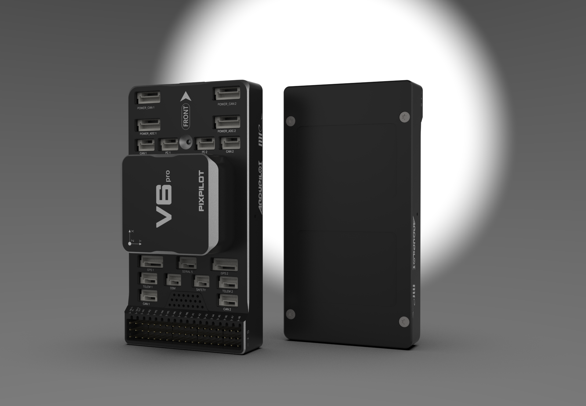
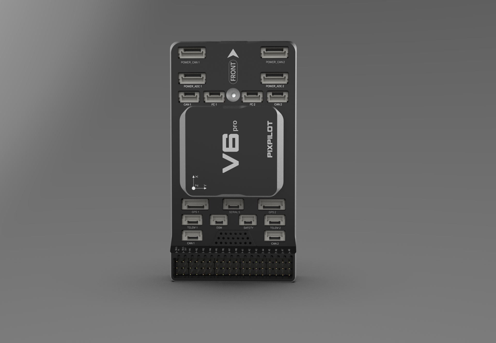

## PixPilot-V6PRO Flight Controller

The PixPilot-V6PRO flight controller is sold by a range of resellers listed at [MakeFlyEasy](http://www.makeflyeasy.com)

## Features

• STM32H743VIT6 microcontroller

•STM32F103C8T6 IOMCU microcontroller

•    Three IMUs, two ICM42688-P(SPI), one ICM40605(SPI)

•    internal heater for IMUs temperature control

•    internal Soft Rubber Damping Ball isolation for All interna IMUs

•    Two barometers, BMP388(SPI)

•    builtin RAMTRON(SPI)

•    microSD card slot

•    5 UARTs, two with RTS/CTS flow control

•    USB(Type-C)

•    PPM & S.Bus input

•    16 PWM outputs

•    twoI2C ports and two FDCAN ports

•    one S.Bus output

•    internal Buzzer

•    builtin RGB LED

• Four voltage & current monitoring, Two analog and Two CAN

•    servo rail BEC independent power input for servos

•    external safety Switch

## Picture

## Pinout

UART Mapping
============

- SERIAL0 -> console (primary mavlink, usually USB)
- SERIAL1 -> USART2 (Telem1,MAVLINK2) (DMA capable)
- SERIAL2 -> USART3 (Telem2, MAVLink2) (DMA capable)
- SERIAL3 -> UART4 (GPS1) (TX is DMA capable)
- SERIAL4 -> UART8 (GPS2) (RX is DMA capable)
- SERIAL5 -> UART7   (USER)

Connector pin assignments
=========================

POWER_CAN1 port, POWER_CAN2 ports
--------------------

| PIN | SIGNAL | VOLT |
| --- | --- | --- |
| 1 | VCC | +5V |
| 2 | VCC | +5V |
| 3 | CAN_H | +12V |
| 4 | CAN_L | +12V |
| 5 | GND | GND |
| 6 | GND | GND |

TELEM1, TELEM2 ports
--------------------

   | Pin | Signal | Volt |
| --- | --- | --- |
| 1 | VCC | +5V |
| 2 | TX (OUT) | +3.3V |
| 3 | RX (IN) | +3.3V |
| 4 | GND | GND |

I2C1, I2C2 ports
---------------

   | PIN | SIGNAL | VOLT |
| --- | --- | --- |
| 1 | VCC | +5V |
| 2 | SCL | +3.3V |
| 3 | SDA | +3.3V |
| 4 | GND | GND |

CAN1, CAN2 ports
---------------

   | PIN | SIGNAL | VOLT |
| --- | --- | --- |
| 1 | VCC | +5V |
| 2 | CAN_H | +12V |
| 3 | CAN_L | +12V |
| 4 | GND | GND |

Safety and buzzer port
-----------

   | PIN | SIGNAL | VOLT |
| --- | --- | --- |
| 1 | VCC | +5V |
| 2 | LED | +5V |
| 3 | Safety Switch | +5V |

DSM port
-----------

   | PIN | SIGNAL | VOLT |
| --- | --- | --- |
| 1 | VCC | +5V |
| 2 | DSM_IN | +5V |
| 3 | GND | GND |

GPS1/I2C1, GPS2/I2C2 ports
--------------------------

   | PIN | SIGNAL | VOLT |
| --- | --- | --- |
| 1 | VCC | +5V |
| 2 | TX | +3.3V |
| 3 | RX | +3.3V |
| 4 | SCL | +3.3V |
| 5 | SDA | +3.3V |
| 6 | GND | GND |

Serial5 port
--------------------

   | Pin | Signal | Volt |
| --- | --- | --- |
| 1 | VCC | +5V |
| 2 | TX (OUT) | +3.3V |
| 3 | RX (IN) | +3.3V |
| 4 | GND | GND |

Power1, Power2 ports
--------------------

   | PIN | SIGNAL | VOLT |
| --- | --- | --- |
| 1 | VCC | +5V |
| 2 | VCC | +5V |
| 3 | CURRENT | +3.3V |
| 4 | VOLTAGE | +3.3V |
| 5 | GND | GND |
| 6 | GND | GND |

RC Input
--------

All compatible RC protocols can be decoded by attaching the Receiver's output to the SBUS input pin next to the Servo/Output VCC input connector. Note that some protocols such as CRSF or FPort including telemetry, require connection to, and setup of, one of the UARTs instead of this pin.

Battery Monitor Settings
========================

These should already be set by default. However, if lost or changed:

Enable Battery monitor with these parameter settings :

:ref:`BATT_MONITOR<BATT_MONITOR>` =4

Then reboot.

:ref:`BATT_VOLT_PIN<BATT_VOLT_PIN>` 14

:ref:`BATT_CURR_PIN<BATT_CURR_PIN>` 15

:ref:`BATT_VOLT_MULT<BATT_VOLT_MULT>` 18.0

:ref:`BATT_AMP_PERVLT<BATT_AMP_PERVLT>` 24.0

:ref:`BATT2_VOLT_PIN<BATT2_VOLT_PIN>` 13

:ref:`BATT2_CURR_PIN<BATT2_CURR_PIN>` 4

:ref:`BATT2_VOLT_MULT<BATT2_VOLT_MULT>` 18.0

:ref:`BATT2_AMP_PERVLT<BATT2_AMP_PERVLT>` 24.0

DroneCAN capability
===================

There are 4 CAN ports which allow connecting two independent CAN bus outputs. Each of these can have multiple CAN peripheral devices connected. There are also two separate CAN POWER ports for easy access to CAN-PMU.

Where to Buy
============

`makeflyeasy <http://www.makeflyeasy.com>`_

[copywiki destination="plane,copter,rover,blimp"]
