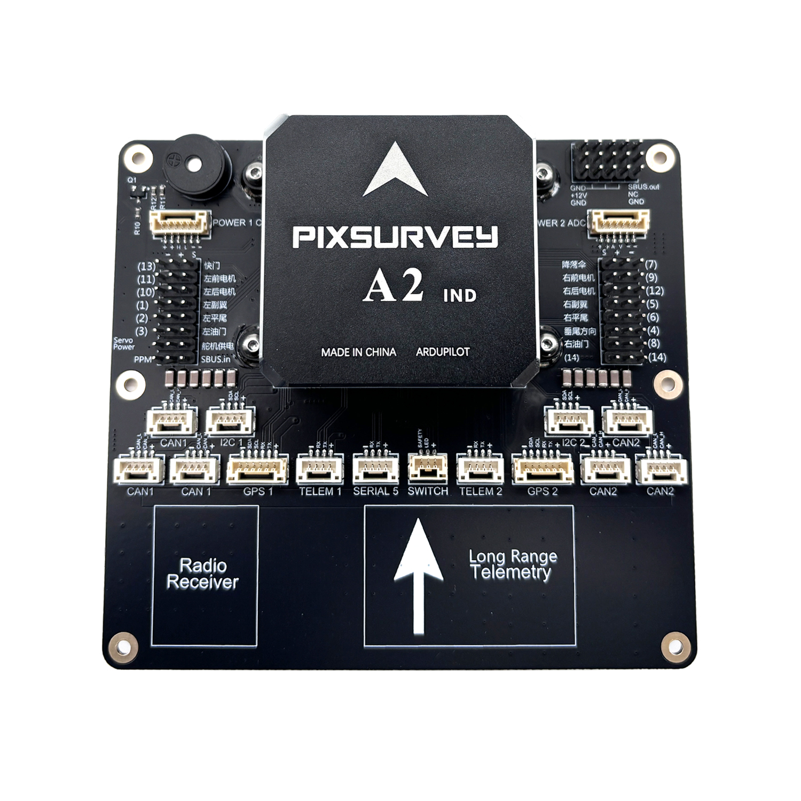

# PixSurveyA2-IND Flight Controller

The PixSurveyA2-IND flight controller is sold by a range of resellers listed on the makeflyeasy(http://www.makeflyeasy.com)

## Features

• STM32H743VIT6 microcontroller
• STM32F103C8T6 IOMCU microcontroller
• 3x IMUs, 2- ICM-42652(SPI), one ICM42688-P(SPI)
   • internal heater for IMUs temperature control
   • internal Soft Rubber Damping Ball isolation for All interna IMUs
• 2x barometers, BMP388(SPI)
• Built-in RAMTRON(SPI)
• microSD card slot
• 5 UARTs
• USB(Type-C)
• PPM & S.Bus input
• 14 PWM outputs
• Two I2C ports and Two FDCAN ports, with multiple connectors
• S.Bus output
• internal Buzzer
• Two power module inputs, one analog and one CAN
• Independent power input for servo rail BEC
• External safety Switch

## Where to Buy

`makeflyeasy <http://www.makeflyeasy.com>`_

## Pinout

## UART Mapping

- SERIAL0 -> console (primary mavlink, usually USB)
- SERIAL1 -> USART2 (Telem1,MAVLINK2) (DMA capable)
- SERIAL2 -> USART3 (Telem2, MAVLink2) (DMA capable)
- SERIAL3 -> UART4 (GPS1) (TX is DMA capable)
- SERIAL4 -> UART8 (GPS2) (RX is DMA capable)
- SERIAL5 -> UART7 (USER)

## Connectors

### POWER_CAN1 port

<table border="1" class="docutils">
   <tbody>
   <tr>
   <th>PIN</th>
   <th>SIGNAL</th>
   <th>VOLT</th>
   </tr>
   <tr>
   <td>1</td>
   <td>VCC</td>
   <td>+5V</td>
   </tr>
   <tr>
   <td>2</td>
   <td>VCC</td>
   <td>+5V</td>
   </tr>
   <tr>
   <td>3</td>
   <td>CAN_H</td>
   <td>+12V</td>
   </tr>
   <tr>
   <td>4</td>
   <td>CAN_L</td>
   <td>+12V</td>
   </tr>
   <tr>
   <td>5</td>
   <td>GND</td>
   <td>GND</td>
   </tr>
   <tr>
   <td>6</td>
   <td>GND</td>
   <td>GND</td>
   </tr>
   </tbody>
   </table>
   
### TELEM1, TELEM2 ports

   <table border="1" class="docutils">
   <tbody>
   <tr>
   <th>Pin</th>
   <th>Signal</th>
   <th>Volt</th>
   </tr>
   <tr>
   <td>1</td>
   <td>VCC</td>
   <td>+5V</td>
   </tr>
   <tr>
   <td>2</td>
   <td>TX (OUT)</td>
   <td>+3.3V</td>
   </tr>
   <tr>
   <td>3</td>
   <td>RX (IN)</td>
   <td>+3.3V</td>
   </tr>
   <tr>
   <td>4</td>
   <td>GND</td>
   <td>GND</td>
   </tr>
   </tbody>
   </table>

### I2C1, I2C2 ports

   <table border="1" class="docutils">
   <tbody>
   <tr>
   <th>PIN</th>
   <th>SIGNAL</th>
   <th>VOLT</th>
   </tr>
   <tr>
   <td>1</td>
   <td>VCC</td>
   <td>+5V</td>
   </tr>
   <tr>
   <td>2</td>
   <td>SCL</td>
   <td>+3.3V</td>
   </tr>
   <tr>
   <td>3</td>
   <td>SDA</td>
   <td>+3.3V</td>
   </tr>
   <tr>
   <td>4</td>
   <td>GND</td>
   <td>GND</td>
   </tr>
   </tbody>
   </table>

### CAN1, CAN2 ports

   <table border="1" class="docutils">
   <tbody>
   <tr>
   <th>PIN</th>
   <th>SIGNAL</th>
   <th>VOLT</th>
   </tr>
   <tr>
   <td>1</td>
   <td>VCC</td>
   <td>+5V</td>
   </tr>
   <tr>
   <td>2</td>
   <td>CAN_H</td>
   <td>+12V</td>
   </tr>
   <tr>
   <td>3</td>
   <td>CAN_L</td>
   <td>+12V</td>
   </tr>
   <tr>
   <td>4</td>
   <td>GND</td>
   <td>GND</td>
   </tr>
   </tbody>
   </table>

### Safety and buzzer port(labeled SWITCH)

   <table border="1" class="docutils">
   <tbody>
   <tr>
   <th>PIN</th>
   <th>SIGNAL</th>
   <th>VOLT</th>
   </tr>
   <tr>
   <td>1</td>
   <td>VCC</td>
   <td>+5V</td>
   </tr>
   <tr>
   <td>2</td>
   <td>LED</td>
   <td>+5V</td>
   </tr>
   <tr>
   <td>3</td>
   <td>Safety Switch</td>
   <td>+5V</td>
   </tr>
   </tbody>
   </table>

### GPS1/I2C1, GPS2/I2C2 ports

   <table border="1" class="docutils">
   <tbody>
   <tr>
   <th>PIN</th>
   <th>SIGNAL</th>
   <th>VOLT</th>
   </tr>
   <tr>
   <td>1</td>
   <td>VCC</td>
   <td>+5V</td>
   </tr>
   <tr>
   <td>2</td>
   <td>TX</td>
   <td>+3.3V</td>
   </tr>
   <tr>
   <td>3</td>
   <td>RX</td>
   <td>+3.3V</td>
   </tr>
   <tr>
   <td>4</td>
   <td>SCL</td>
   <td>+3.3V</td>
   </tr>
   <tr>
   <td>5</td>
   <td>SDA</td>
   <td>+3.3V</td>
   </tr>
   <tr>
   <td>6</td>
   <td>GND</td>
   <td>GND</td>
   </tr>
   </tbody>
   </table>

### Serial5 port

   <table border="1" class="docutils">
   <tbody>
   <tr>
   <th>Pin</th>
   <th>Signal</th>
   <th>Volt</th>
   </tr>
   <tr>
   <td>1</td>
   <td>VCC</td>
   <td>+5V</td>
   </tr>
   <tr>
   <td>2</td>
   <td>TX (OUT)</td>
   <td>+3.3V</td>
   </tr>
   <tr>
   <td>3</td>
   <td>RX (IN)</td>
   <td>+3.3V</td>
   </tr>
   <tr>
   <td>4</td>
   <td>GND</td>
   <td>GND</td>
   </tr>
   </tbody>
   </table>
   
### Power2 ADC ports

   <table border="1" class="docutils">
   <tbody>
   <tr>
   <th>PIN</th>
   <th>SIGNAL</th>
   <th>VOLT</th>
   </tr>
   <tr>
   <td>1</td>
   <td>VCC</td>
   <td>+5V</td>
   </tr>
   <tr>
   <td>2</td>
   <td>VCC</td>
   <td>+5V</td>
   </tr>
   <tr>
   <td>3</td>
   <td>CURRENT</td>
   <td>+3.3V</td>
   </tr>
   <tr>
   <td>4</td>
   <td>VOLTAGE</td>
   <td>+3.3V</td>
   </tr>
   <tr>
   <td>5</td>
   <td>GND</td>
   <td>GND</td>
   </tr>
   <tr>
   <td>6</td>
   <td>GND</td>
   <td>GND</td>
   </tr>
   </tbody>
   </table>

## RC Input

All compatible unidirectional RC protocols can be decoded by attaching the Receiver's output to the SBUS input pin next to the Servo/Output VCC input connector.

To allow CRSF and embedded telemetry available in Fport, CRSF, and SRXL2 receivers, a full UART with DMA, such as SERIAL2 would need to be used for receiver connections. Below are setups using Serial6.

* :ref:`SERIAL2_PROTOCOL<SERIAL2_PROTOCOL>` should be set to “23”.
* FPort would require :ref:`SERIAL2_OPTIONS<SERIAL2_OPTIONS>` be set to “15”.
* CRSF/ELRS would require :ref:`SERIAL2_OPTIONS<SERIAL2_OPTIONS>` be set to “0”.
* SRXL2 would require :ref:`SERIAL2_OPTIONS<SERIAL2_OPTIONS>` be set to “4” and connects only the TX pin.

## PWM Outputs

The autopilot supports up to 14 PWM outputs. All 14 outputs
support all normal PWM output formats. All outputs also support DShot. Outputs 9-14 support Bi-Directional DShot. Outputs within the same timer group need to use the same output rate. If any output in a group uses DShot then all channels in the group need to use DShot,etc..

* Outputs 1 and 2 in group1
* Outputs 3 and 4 in group2
* Outputs 5, 6, 7 and 8 in group3
* Outputs 9-12 in group4
* Outputs 13 and 14 in group5

## GPIOs

All PWM outputs can be used as GPIOs (relays, camera, RPM etc). To use them you need to set the output’s ``SERVOx_FUNCTION`` to -1. The numbering of the GPIOs for PIN variables in ArduPilot is:

.. raw:: html

   <table>
     <tr>
       <th colspan="3">IO Pins</th>
       <th colspan="1"> </th>
       <th colspan="3">FMU Pins</th>
     </tr>
     <tr><td> Name </td><td> Value </td><td> Option </td><td>  </td><td> Name </td><td> Value </td><td> Option </td></tr>
     <tr><td> M1 </td><td> 101 </td> <td> Out1 </td><td>  </td><td> M9  </td><td> 50 </td><td> AuxOut1 </td></tr>
     <tr><td> M2 </td><td> 102 </td> <td> Out2 </td><td>  </td><td> M10 </td><td> 51 </td><td> AuxOut2 </td></tr>
     <tr><td> M3 </td><td> 103 </td> <td> Out3 </td><td>  </td><td> M11 </td><td> 52 </td><td> AuxOut3 </td></tr>
     <tr><td> M4 </td><td> 104 </td> <td> Out4 </td><td>  </td><td> M12 </td><td> 53 </td><td> AuxOut4 </td></tr>
     <tr><td> M5 </td><td> 105 </td> <td> Out5 </td><td>  </td><td> M13 </td><td> 54 </td><td> AuxOut5 </td></tr>
     <tr><td> M6 </td><td> 106 </td> <td> Out6 </td><td>  </td><td> M14 </td><td> 55 </td><td> AuxOut6 </td></tr>
     <tr><td> M7 </td><td> 107 </td> <td> Out7 </td><td>  </td><td> </td><td>  </td><td>  </td></td></tr>
     <tr><td> M8 </td><td> 108 </td> <td> Out8 </td><td>  </td><td> </td><td>  </td><td>  </td></td></tr>
   </table>

## Battery Monitor Settings

These should already be set by default. However, if lost or changed:

Enable Battery monitor with these parameter settings :
 - :ref:`BATT1_MONITOR<BATT_MONITOR>` 8
 - :ref:`BATT2_MONITOR<BATT_MONITOR>` 4

Then reboot.

- :ref:`BATT2_VOLT_PIN<BATT2_VOLT_PIN__AP_BattMonitor>` 13
- :ref:`BATT2_CURR_PIN<BATT2_CURR_PIN__AP_BattMonitor>` 4
- :ref:`BATT2_VOLT_MULT<BATT2_VOLT_MULT__AP_BattMonitor>` 18.0
- :ref:`BATT2_AMP_PERVLT<BATT2_AMP_PERVLT__AP_BattMonitor>` 24.0

.. note:: OSDs will by default display the first battery monitor unless the second battery monitor panel is setup in OSD parameters.

## DroneCAN capability

There are 6 CAN ports which allow connecting two independent CAN bus outputs. Each of these can have multiple CAN peripheral devices connected. There are also two separate CAN POWER ports for easy access to CAN-PMU.

## Loading Firmware

The board comes pre-installed with an ArduPilot compatible bootloader,
allowing the loading of xxxxxx.apj firmware files with any ArduPilot
compatible ground station.

Firmware for these boards can be found `here <https://firmware.ardupilot.org>`_ in  sub-folders labeled "PixSurveyA2-IND".

