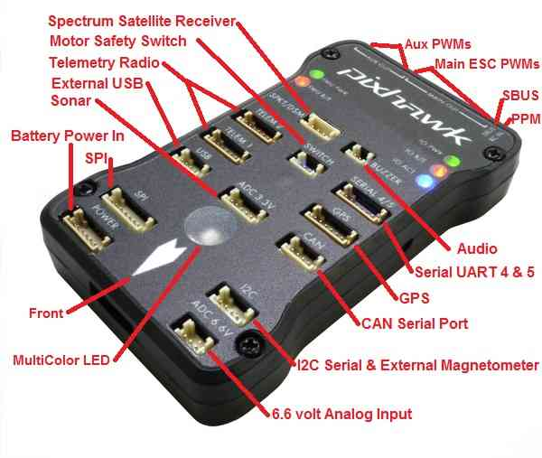

# Pixhawk1 Flight Controller

The Pixhawk1 flight controller was originally produced by 3DR. A
number of vendors now sell boards with the same layout as the original
board.

## Features

 - STM32F427 microcontroller
 - MPU6000 and LSM303D/L3GD20 IMUs
 - MS5611 SPI barometer
 - builtin SPI LSM303D magnetometer
 - microSD card slot
 - 5 UARTs plus USB
 - 14 PWM outputs
 - I2C and CAN ports
 - Spektrum satellite connector
 - External Buzzer
 - builtin RGB LED
 - external safety Switch
 - external SPI port
 - voltage monitoring for servo rail and Vcc
 - dedicated power input port for external power brick
 - external USB connectors (micro USB and DF13)

## Pinout

## UART Mapping

 - SERIAL0 -> USB
 - SERIAL1 -> UART2 (Telem1)
 - SERIAL2 -> UART3 (Telem2)
 - SERIAL3 -> UART4 (GPS)
 - SERIAL4 -> UART8 (GPS2)
 - SERIAL5 -> UART7 (spare)

The Telem1 and Telem2 ports have RTS/CTS pins, the other UARTs do not
have RTS/CTS.

The GPS2/spare port (labelled serial5) has two UARTs on one 6 pin
connector. The spare port was originally used as a debug console, but
debug is now on USB, so this port is free for any UART protocol.

## Connectors

The original Pixhawk1 uses DF13 connectors, and has 14 ports

### TELEM1, TELEM2 ports

   <table border="1" class="docutils">
   <tbody>
   <tr>
   <th>Pin </th>
   <th>Signal </th>
   <th>Volt </th>
   </tr>
   <tr>
   <td>1 (red)</td>
   <td>VCC</td>
   <td>+5V</td>
   </tr>
   <tr>
   <td>2 (blk)</td>
   <td>TX (OUT)</td>
   <td>+3.3V</td>
   </tr>
   <tr>
   <td>3 (blk)</td>
   <td>RX (IN)</td>
   <td>+3.3V</td>
   </tr>
   <tr>
   <td>4 (blk)</td>
   <td>CTS</td>
   <td>+3.3V</td>
   </tr>
   <tr>
   <td>5 (blk)</td>
   <td>RTS</td>
   <td>+3.3V</td>
   </tr>
   <tr>
   <td>6 (blk)</td>
   <td>GND</td>
   <td>GND</td>
   </tr>
   </tbody>
   </table>

### GPS port

   <table border="1" class="docutils">
   <tbody>
   <tr>
   <th>Pin</th>
   <th>Signal</th>
   <th>Volt</th>
   </tr>
   <tr>
   <td>1 (red)</td>
   <td>VCC</td>
   <td>+5V</td>
   </tr>
   <tr>
   <td>2 (blk)</td>
   <td>TX (OUT)</td>
   <td>+3.3V</td>
   </tr>
   <tr>
   <td>3 (blk)</td>
   <td>RX (IN)</td>
   <td>+3.3V</td>
   </tr>
   <tr>
   <td>4 (blk)</td>
   <td>CAN2 TX</td>
   <td>+3.3V</td>
   </tr>
   <tr>
   <td>5 (blk)</td>
   <td>CAN2 RX</td>
   <td>+3.3V</td>
   </tr>
   <tr>
   <td>6 (blk)</td>
   <td>GND</td>
   <td>GND</td>
   </tr>
   </tbody>
   </table>

### SERIAL 4/5 port

   <table border="1" class="docutils">
   <tbody>
   <tr>
   <th>Pin</th>
   <th>Signal</th>
   <th>Volt</th>
   </tr>
   <tr>
   <td>1 (red)</td>
   <td>VCC</td>
   <td>+5V</td>
   </tr>
   <tr>
   <td>2 (blk)</td>
   <td>TX (#4)</td>
   <td>+3.3V</td>
   </tr>
   <tr>
   <td>3 (blk)</td>
   <td>RX (#4)</td>
   <td>+3.3V</td>
   </tr>
   <tr>
   <td>4 (blk)</td>
   <td>TX (#5)</td>
   <td>+3.3V</td>
   </tr>
   <tr>
   <td>5 (blk)</td>
   <td>RX (#5)</td>
   <td>+3.3V</td>
   </tr>
   <tr>
   <td>6 (blk)</td>
   <td>GND</td>
   <td>GND</td>
   </tr>
   </tbody>
   </table>

### ADC 6.6V

   <table border="1" class="docutils">
   <tbody>
   <tr>
   <th>Pin</th>
   <th>Signal</th>
   <th>Volt</th>
   </tr>
   <tr>
   <td>1 (red)</td>
   <td>VCC</td>
   <td>+5V</td>
   </tr>
   <tr>
   <td>2 (blk)</td>
   <td>ADC IN</td>
   <td>up to +6.6V</td>
   </tr>
   <tr>
   <td>3 (blk)</td>
   <td>GND</td>
   <td>GND</td>
   </tr>
   </tbody>
   </table>

### ADC 3.3V

   <table border="1" class="docutils">
   <tbody>
   <tr>
   <th>Pin</th>
   <th>Signal</th>
   <th>Volt</th>
   </tr>
   <tr>
   <td>1 (red)</td>
   <td>VCC</td>
   <td>+5V</td>
   </tr>
   <tr>
   <td>2 (blk)</td>
   <td>ADC IN</td>
   <td>up to +3.3V</td>
   </tr>
   <tr>
   <td>3 (blk)</td>
   <td>GND</td>
   <td>GND</td>
   </tr>
   <tr>
   <td>4 (blk)</td>
   <td>ADC IN</td>
   <td>up to +3.3V</td>
   </tr>
   <tr>
   <td>5 (blk)</td>
   <td>GND</td>
   <td>GND</td>
   </tr>
   </tbody>
   </table>

### I2C

   <table border="1" class="docutils">
   <tbody>
   <tr>
   <th>Pin</th>
   <th>Signal</th>
   <th>Volt</th>
   </tr>
   <tr>
   <td>1 (red)</td>
   <td>VCC</td>
   <td>+5V</td>
   </tr>
   <tr>
   <td>2 (blk)</td>
   <td>SCL</td>
   <td>+3.3 (pullups)</td>
   </tr>
   <tr>
   <td>3 (blk)</td>
   <td>SDA</td>
   <td>+3.3 (pullups)</td>
   </tr>
   <tr>
   <td>4 (blk)</td>
   <td>GND</td>
   <td>GND</td>
   </tr>
   </tbody>
   </table>

### CAN

   <table border="1" class="docutils">
   <tbody>
   <tr>
   <th>Pin</th>
   <th>Signal</th>
   <th>Volt</th>
   </tr>
   <tr>
   <td>1 (red)</td>
   <td>VCC</td>
   <td>+5V</td>
   </tr>
   <tr>
   <td>2 (blk)</td>
   <td>CAN_H</td>
   <td>+12V</td>
   </tr>
   <tr>
   <td>3 (blk)</td>
   <td>CAN_L</td>
   <td>+12V</td>
   </tr>
   <tr>
   <td>4 (blk)</td>
   <td>GND</td>
   <td>GND</td>
   </tr>
   </tbody>
   </table>

### SPI

   <table border="1" class="docutils">
   <tbody>
   <tr>
   <th>Pin</th>
   <th>Signal</th>
   <th>Volt</th>
   </tr>
   <tr>
   <td>1 (red)</td>
   <td>VCC</td>
   <td>+5V</td>
   </tr>
   <tr>
   <td>2 (blk)</td>
   <td>SPI_SCK</td>
   <td>3.3V</td>
   </tr>
   <tr>
   <td>3 (blk)</td>
   <td>SPI_MISO</td>
   <td>+3.3V</td>
   </tr>
   <tr>
   <td>4 (blk)</td>
   <td>SPI_MOSI</td>
   <td>+3.3V</td>
   </tr>
   <tr>
   <td>5 (blk)</td>
   <td>!SPI_NSS</td>
   <td>+3.3V</td>
   </tr>
   <tr>
   <td>6 (blk)</td>
   <td>!GPIO</td>
   <td>+3.3V</td>
   </tr>
   <tr>
   <td>7 (blk)</td>
   <td>GND</td>
   <td>GND</td>
   </tr>
   </tbody>
   </table>

### POWER

   <table border="1" class="docutils">
   <tbody>
   <tr>
   <th>Pin</th>
   <th>Signal</th>
   <th>Volt</th>
   </tr>
   <tr>
   <td>1 (red)</td>
   <td>VCC</td>
   <td>+5V</td>
   </tr>
   <tr>
   <td>2 (blk)</td>
   <td>VCC</td>
   <td>+5V</td>
   </tr>
   <tr>
   <td>3 (blk)</td>
   <td>CURRENT</td>
   <td>up to +3.3V</td>
   </tr>
   <tr>
   <td>4 (blk)</td>
   <td>VOLTAGE</td>
   <td>up to +3.3V</td>
   </tr>
   <td>5 (blk)</td>
   <td>GND</td>
   <td>GND</td>
   </tr>
   <td>6 (blk)</td>
   <td>GND</td>
   <td>GND</td>
   </tr>
   </tbody>
   </table>

### SWITCH

   <table border="1" class="docutils">
   <tbody>
   <tr>
   <th>Pin</th>
   <th>Signal</th>
   <th>Volt</th>
   </tr>
   <tr>
   <td>1 (red)</td>
   <td>VCC</td>
   <td>+3.3V</td>
   </tr>
   <tr>
   <td>2 (blk)</td>
   <td>!IO_LED_SAFETY</td>
   <td>GND</td>
   </tr>
   <tr>
   <td>3 (blk)</td>
   <td>SAFETY</td>
   <td>GND</td>
   </tr>
   </tbody>
   </table>

## RC Input
 
RC input is configured on the RCIN pin, at one end of the servo rail,
marked PPM in the above diagram. This pin supports all RC
protocols. In addition there is a dedicated Spektrum satellite port
which supports software power control, allowing for binding of
Spektrum satellite receivers.
 
## PWM Output

The Pixhawk1 supports up to 14 PWM outputs. First first 8 outputs (labelled
"MAIN") are controlled by a dedicated STM32F100 IO controller. These 8
outputs support all PWM output formats, but not DShot.

The remaining 6 outputs (labelled AUX1 to AUX6) are the "auxiliary"
outputs. These are directly attached to the STM32F427 and support all
PWM protocols as well as DShot.

The 8 main PWM outputs are in 3 groups:

 - PWM 1 and 2 in group1
 - PWM 3 and 4 in group2
 - PWM 5, 6, 7 and 8 in group3

The 6 auxiliary PWM outputs are in 2 groups:

 - PWM 1, 2, 3 and 4 in group1
 - PWM 5 and 6 in group2

Channels within the same group need to use the same output rate. If
any channel in a group uses DShot then all channels in the group need
to use DShot.

## Battery Monitoring

The board has a dedicated power monitor port on a 6 pin DF13
connector. The correct battery setting parameters are dependent on the
type of power brick which is connected.

## Compass

The Pixhawk1 has a LSM303D builtin SPI compass, but due to
interference the board is usually used with an external I2C compass as
part of a GPS/Compass combination.

## GPIOs

The 6 auxiliary PWM ports can be used as GPIOs (relays, buttons, RPM
etc). To use them you need to limit the number of these pins that is
used for PWM by setting the BRD_PWM_COUNT to a number less than 6. For
example if you set BRD_PWM_COUNT to 4 then AUX5 and AUX6 will be
available for use as GPIOs.

The numbering of the GPIOs for PIN variables in ArduPilot is:

 - AUX1 50
 - AUX2 51
 - AUX3 52
 - AUX4 53
 - AUX5 54
 - AUX6 55

## Analog inputs

The Pixhawk1 has 6 analog inputs on the FMU, plus servo rail voltage
and RSSI monitoring on the IO controller.

 - ADC Pin2 -> Battery Voltage
 - ADC Pin3 -> Battery Current Sensor
 - ADC Pin4 -> Vdd 5V supply sense
 - ADC Pin13 -> ADC 3.3V Port pin1
 - ADC Pin14 -> ADC 3.3V Port pin2
 - ADC Pin15 -> ADC 6.6V port
 - ADC Pin103 -> RSSI voltage monitoring

## Loading Firmware

The board comes pre-installed with an ArduPilot compatible bootloader,
allowing the loading of *.apj firmware files with any ArduPilot
compatible ground station.
