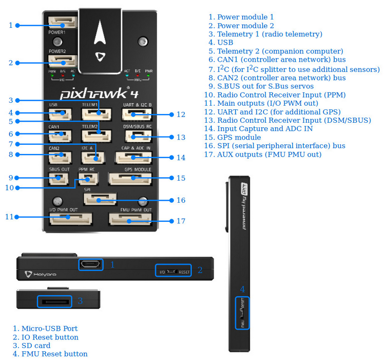

# Pixhawk4 Flight Controller

The Pixhawk4 flight controller is sold by [Holybro](http://www.holybro.com/product/55)

## Features

 - STM32F765 microcontroller
 - Two IMUs: ICM20689 and BMI055
 - MS5611 SPI barometer
 - builtin SPI IST8310 magnetometer
 - microSD card slot
 - 6 UARTs plus USB
 - 14 PWM outputs
 - Four I2C and two CAN ports
 - External Buzzer
 - external safety Switch
 - voltage monitoring for servo rail and Vcc
 - two dedicated power input ports for external power bricks

## Pinout

## UART Mapping

 - SERIAL0 -> USB
 - SERIAL1 -> UART2 (Telem1)
 - SERIAL2 -> UART3 (Telem2)
 - SERIAL3 -> UART1 (GPS)
 - SERIAL4 -> UART4 (GPS2)
 - SERIAL5 -> UART6 (spare)
 - SERIAL6 -> UART7 (spare, debug)

The Telem1 and Telem2 ports have RTS/CTS pins, the other UARTs do not
have RTS/CTS.

The UART7 connector is labelled debug, but is available as a general
purpose UART with ArduPilot.

### TELEM1, TELEM2 ports

   <table border="1" class="docutils">
   <tbody>
   <tr>
   <th>Pin </th>
   <th>Signal </th>
   <th>Volt </th>
   </tr>
   <tr>
   <td>1 (red)</td>
   <td>VCC</td>
   <td>+5V</td>
   </tr>
   <tr>
   <td>2 (blk)</td>
   <td>TX (OUT)</td>
   <td>+3.3V</td>
   </tr>
   <tr>
   <td>3 (blk)</td>
   <td>RX (IN)</td>
   <td>+3.3V</td>
   </tr>
   <tr>
   <td>4 (blk)</td>
   <td>CTS</td>
   <td>+3.3V</td>
   </tr>
   <tr>
   <td>5 (blk)</td>
   <td>RTS</td>
   <td>+3.3V</td>
   </tr>
   <tr>
   <td>6 (blk)</td>
   <td>GND</td>
   <td>GND</td>
   </tr>
   </tbody>
   </table>

### GPS port

   <table border="1" class="docutils">
   <tbody>
   <tr>
   <th>Pin </th>
   <th>Signal </th>
   <th>Volt </th>
   </tr>
   <tr>
   <td>1 (red)</td>
   <td>VCC</td>
   <td>+5V</td>
   </tr>
   <tr>
   <td>2 (blk)</td>
   <td>SERIAL3 TX (OUT)</td>
   <td>+3.3V</td>
   </tr>
   <tr>
   <td>3 (blk)</td>
   <td>SERIAL3 RX (IN)</td>
   <td>+3.3V</td>
   </tr>
   <tr>
   <td>4 (blk)</td>
   <td>SCL</td>
   <td>+3.3 (pullups)</td>
   </tr>
   <tr>
   <td>5 (blk)</td>
   <td>SDA</td>
   <td>+3.3 (pullups)</td>
   </tr>
   <tr>
   <td>6 (blk)</td>
   <td>SafetyButton</td>
   <td>+3.3V</td>
   </tr>
   <tr>
   <td>7 (blk)</td>
   <td>SafetyLED</td>
   <td>+3.3V</td>
   </tr>
   <tr>
   <td>8 (blk)</td>
   <td>VDD 3.3 (OUT)</td>
   <td>+3.3V</td>
   </tr>
   <tr>
   <td>9 (blk)</td>
   <td>Buzzer</td>
   <td>+3.3V</td>
   </tr>
   <tr>
   <td>10 (blk)</td>
   <td>GND</td>
   <td>GND</td>
   </tr>
   </tbody>
   </table>

## RC Input
 
RC input is configured on the port marked DSM/SBUS RC. This connector
supports all RC protocols. Two cables are available for this port. To
use software binding of Spektrum satellite receivers you need to use
the Spektrum satellite cable.

## PWM Output

The Pixhawk4 supports up to 16 PWM outputs. First first 8 outputs (labelled
"MAIN") are controlled by a dedicated STM32F100 IO controller. These 8
outputs support all PWM output formats, but not DShot.

The remaining 8 outputs (labelled AUX1 to AUX8) are the "auxillary"
outputs. These are directly attached to the STM32F765 and support all
PWM protocols. The first 6 of the auxillary PWM outputs support DShot.

The 8 main PWM outputs are in 3 groups:

 - PWM 1 and 2 in group1
 - PWM 3 and 4 in group2
 - PWM 5, 6, 7 and 8 in group3

The 8 auxillary PWM outputs are in 2 groups:

 - PWM 1, 2, 3 and 4 in group1
 - PWM 5 and 6 in group2
 - PWM 7 and 8 in group3

Channels within the same group need to use the same output rate. If
any channel in a group uses DShot then all channels in the group need
to use DShot.

## Battery Monitoring

The board has two dedicated power monitor ports on 6 pin
connectors. The correct battery setting parameters are dependent on
the type of power brick which is connected.

## Compass

The Pixhawk4 has a builtin IST8310 compass. Due to potential
interference the board is usually used with an external I2C compass as
part of a GPS/Compass combination.

## GPIOs

The 6 PWM ports can be used as GPIOs (relays, buttons, RPM etc). To
use them you need to limit the number of these pins that is used for
PWM by setting the BRD_PWM_COUNT to a number less than 6. For example
if you set BRD_PWM_COUNT to 4 then PWM5 and PWM6 will be available for
use as GPIOs.

The numbering of the GPIOs for PIN variables in ArduPilot is:

 - AUX1 50
 - AUX2 51
 - AUX3 52
 - AUX4 53
 - AUX5 54
 - AUX6 55

## Analog inputs

The Pixhawk4 has 7 analog inputs

 - ADC Pin0 -> Battery Voltage
 - ADC Pin1 -> Battery Current Sensor
 - ADC Pin2 -> Battery Voltage 2
 - ADC Pin3 -> Battery Current Sensor 2
 - ADC Pin4 -> ADC port pin 2
 - ADC Pin14 -> ADC port pin 3
 - ADC Pin10 -> ADC 5V Sense
 - ADC Pin11 -> ADC 3.3V Sense
 - ADC Pin103 -> RSSI voltage monitoring

## I2C Buses

 - the internal I2C port is bus 0 in ArduPilot (I2C3 in hardware)
 - the port labelled I2CA is bus 3 in ArduPilot (I2C1 in hardware)
 - the port labelled I2CB is bus 2 in ArduPilot (I2c2 in hardware)
 - there is no external connector for I2C4

### Pinout for I2CA

   <table border="1" class="docutils">
   <tbody>
   <tr>
   <th>Pin</th>
   <th>Signal</th>
   <th>Volt</th>
   </tr>
   <tr>
   <td>1 (red)</td>
   <td>VCC</td>
   <td>+5V</td>
   </tr>
   <tr>
   <td>2 (blk)</td>
   <td>SCL</td>
   <td>+3.3 (pullups)</td>
   </tr>
   <tr>
   <td>3 (blk)</td>
   <td>SDA</td>
   <td>+3.3 (pullups)</td>
   </tr>
   <tr>
   <td>4 (blk)</td>
   <td>GND</td>
   <td>GND</td>
   </tr>
   </tbody>
   </table>

### Pinout for I2CB+UART

   <table border="1" class="docutils">
   <tbody>
   <tr>
   <th>Pin</th>
   <th>Signal</th>
   <th>Volt</th>
   </tr>
   <tr>
   <td>1 (red)</td>
   <td>VCC</td>
   <td>+5V</td>
   </tr>
   <tr>
   <td>2 (blk)</td>
   <td>SERIAL4 TX (OUT)</td>
   <td>+3.3V</td>
   </tr>
   <tr>
   <td>3 (blk)</td>
   <td>SERIAL4 RX (IN)</td>
   <td>+3.3V</td>
   </tr>
   <tr>
   <td>4 (blk)</td>
   <td>SCL</td>
   <td>+3.3 (pullups)</td>
   </tr>
   <tr>
   <td>5 (blk)</td>
   <td>SDA</td>
   <td>+3.3 (pullups)</td>
   </tr>
   <tr>
   <td>6 (blk)</td>
   <td>GND</td>
   <td>GND</td>
   </tr>
   </tbody>
   </table>

## CAN

The Pixhawk4 has two independent CAN buses, with the following pinouts.

### CAN1&2

   <table border="1" class="docutils">
   <tbody>
   <tr>
   <th>Pin</th>
   <th>Signal</th>
   <th>Volt</th>
   </tr>
   <tr>
   <td>1 (red)</td>
   <td>VCC</td>
   <td>+5V</td>
   </tr>
   <tr>
   <td>2 (blk)</td>
   <td>CAN_H</td>
   <td>+12V</td>
   </tr>
   <tr>
   <td>3 (blk)</td>
   <td>CAN_L</td>
   <td>+12V</td>
   </tr>
   <tr>
   <td>4 (blk)</td>
   <td>GND</td>
   <td>GND</td>
   </tr>
   </tbody>
   </table>

## Debug

The Pixhawk4 supports SWD debugging on the debug port

   <table border="1" class="docutils">
   <tbody>
   <tr>
   <th>Pin </th>
   <th>Signal </th>
   <th>Volt </th>
   </tr>
   <tr>
   <td>1 (red)</td>
   <td>FMU VDD 3.3</td>
   <td>+3.3V</td>
   </tr>
   <tr>
   <td>2 (blk)</td>
   <td>UART TX Debug (OUT)</td>
   <td>+3.3V</td>
   </tr>
   <tr>
   <td>3 (blk)</td>
   <td>UART RX Debug (IN)</td>
   <td>+3.3V</td>
   </tr>
   <tr>
   <td>4 (blk)</td>
   <td>SWDIO</td>
   <td>+3.3V</td>
   </tr>
   <tr>
   <td>5 (blk)</td>
   <td>SWCLK</td>
   <td>+3.3V</td>
   </tr>
   <tr>
   <td>6 (blk)</td>
   <td>GND</td>
   <td>GND</td>
   </tr>
   </tbody>
   </table>

## Loading Firmware

The board comes pre-installed with an ArduPilot compatible bootloader,
allowing the loading of *.apj firmware files with any ArduPilot
compatible ground station.

## Acknowledgements

Thanks to
[PX4](https://docs.px4.io/en/flight_controller/pixhawk4.html) for
images used under the [CC-BY 4.0 license](https://creativecommons.org/licenses/by/4.0/)
