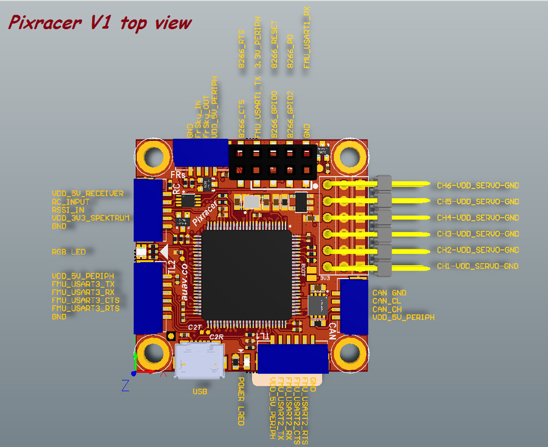
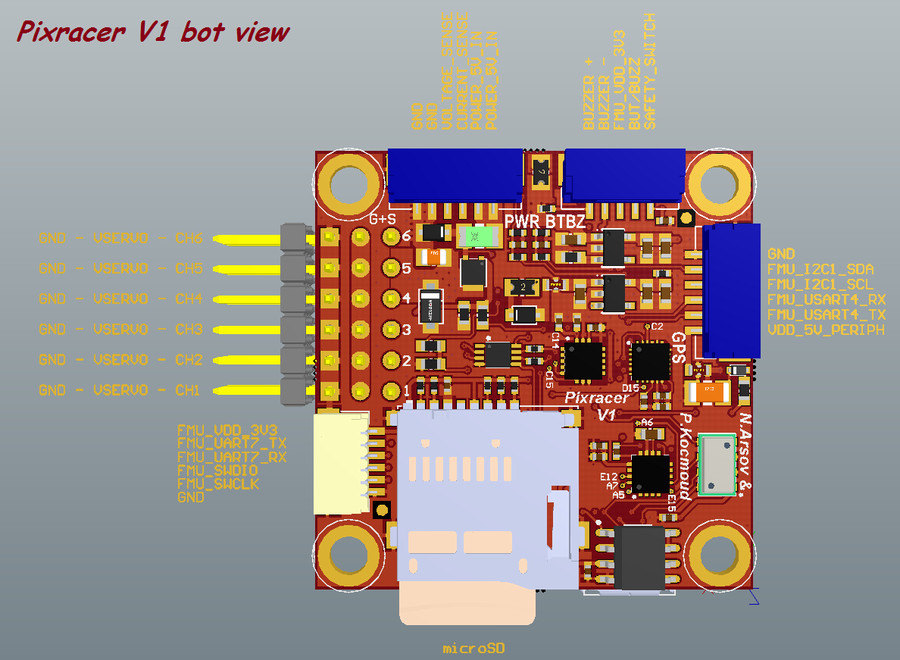

# Pixracer Flight Controller

The Pixracer flight controller is
[sold by mRobotics](https://store.mrobotics.io/category-s/112.htm)

The full schematics of the board are available here:

  https://github.com/ArduPilot/Schematics/tree/master/mRobotics

## Features

 - STM32F427 microcontroller
 - MPU9250 and ICM20608 IMUs
 - MS5611 SPI barometer
 - builtin HMC5843 and MPU9250 magnetometers
 - microSD card slot
 - 6 UARTs plus USB
 - 6 PWM outputs
 - I2C and CAN ports
 - Spektrum satellite cable
 - External Buzzer
 - builtin RGB LEDs
 - external safety Switch
 - voltage monitoring for Vcc
 - dedicated power input port for external power brick

## Pinout

## UART Mapping

 - SERIAL0 -> USB
 - SERIAL1 -> UART2 (Telem1)
 - SERIAL2 -> UART3 (Telem2)
 - SERIAL3 -> UART4 (GPS)
 - SERIAL4 -> UART8 (GPS2, FrSky Telem)
 - SERIAL5 -> UART1 (spare)
 - SERIAL6 -> UART7 (spare, debug port)

The Telem1 and Telem2 ports have RTS/CTS pins, the other UARTs do not
have RTS/CTS.

## Connectors

Unless noted otherwise all connectors are JST GH

### TELEM1, TELEM2+OSD ports

   <table border="1" class="docutils">
   <tbody>
   <tr>
   <th>Pin</th>
   <th>Signal</th>
   <th>Volt</th>
   </tr>
   <tr>
   <td>1 (red)</td>
   <td>VCC</td>
   <td>+5V</td>
   </tr>
   <tr>
   <td>2 (blk)</td>
   <td>TX (OUT)</td>
   <td>+3.3V</td>
   </tr>
   <tr>
   <td>3 (blk)</td>
   <td>RX (IN)</td>
   <td>+3.3V</td>
   </tr>
   <tr>
   <td>4 (blk)</td>
   <td>CTS (IN)</td>
   <td>+3.3V</td>
   </tr>
   <tr>
   <td>5 (blk)</td>
   <td>RTS (OUT)</td>
   <td>+3.3V</td>
   </tr>
   <tr>
   <td>6 (blk)</td>
   <td>GND</td>
   <td>GND</td>
   </tr>
   </tbody>
   </table>

### GPS port

   <table border="1" class="docutils">
   <tbody>
   <tr>
   <th>PIN</th>
   <th>SIGNAL</th>
   <th>VOLT</th>
   </tr>
   <tr>
   <td>1 (red)</td>
   <td>VCC</td>
   <td>+5V</td>
   </tr>
   <tr>
   <td>2 (blk)</td>
   <td>TX (OUT)</td>
   <td>+3.3V</td>
   </tr>
   <tr>
   <td>3 (blk)</td>
   <td>RX (IN)</td>
   <td>+3.3V</td>
   </tr>
   <tr>
   <td>4 (blk)</td>
   <td>I2C1 SCL</td>
   <td>+3.3V</td>
   </tr>
   <tr>
   <td>5 (blk)</td>
   <td>I2C1 SDA</td>
   <td>+3.3V</td>
   </tr>
   <tr>
   <td>6 (blk)</td>
   <td>GND</td>
   <td>GND</td>
   </tr>
   </tbody>
   </table>

### FrSky Telemetry / SERIAL4

This UART is inverted by default. You can disable the inverter by
setting SERIAL4_OPTIONS=2 if you want to use it with a non-inverted
protocol.

   <table border="1" class="docutils">
   <tbody>
   <tr>
   <th>PIN</th>
   <th>SIGNAL</th>
   <th>VOLT</th>
   </tr>
   <tr>
   <td>1 (red)</td>
   <td>VCC</td>
   <td>+5V</td>
   </tr>
   <tr>
   <td>2 (blk)</td>
   <td>TX (OUT)</td>
   <td>+3.3V</td>
   </tr>
   <tr>
   <td>3 (blk)</td>
   <td>RX (IN)</td>
   <td>+3.3V</td>
   </tr>
   <tr>
   <td>4 (blk)</td>
   <td>GND</td>
   <td>GND</td>
   </tr>
   </tbody>
   </table>

### RC Input (accepts all RC protocols)

   <table border="1" class="docutils">
   <tbody>
   <tr>
   <th>PIN</th>
   <th>SIGNAL</th>
   <th>VOLT</th>
   </tr>
   <tr>
   <td>1 (red)</td>
   <td>VCC</td>
   <td>+5V</td>
   </tr>
   <tr>
   <td>2 (blk)</td>
   <td>RC IN</td>
   <td>+3.3V</td>
   </tr>
   <tr>
   <td>3 (blk)</td>
   <td>RSSI IN</td>
   <td>+3.3V</td>
   </tr>
   <tr>
   <td>4 (blk)</td>
   <td>VDD 3V3</td>
   <td>+3.3V</td>
   </tr>
   <tr>
   <td>5 (blk)</td>
   <td>GND</td>
   <td>GND</td>
   </tr>
   </tbody>
   </table>

### CAN

   <table border="1" class="docutils">
   <tbody>
   <tr>
   <th>PIN</th>
   <th>SIGNAL</th>
   <th>VOLT</th>
   </tr>
   <tr>
   <td>1 (red)</td>
   <td>VCC</td>
   <td>+5V</td>
   </tr>
   <tr>
   <td>2 (blk)</td>
   <td>CAN_H</td>
   <td>+12V</td>
   </tr>
   <tr>
   <td>3 (blk)</td>
   <td>CAN_L</td>
   <td>+12V</td>
   </tr>
   <tr>
   <td>4 (blk)</td>
   <td>GND</td>
   <td>GND</td>
   </tr>
   </tbody>
   </table>

### Power

   <table border="1" class="docutils">
   <tbody>
   <tr>
   <th>PIN</th>
   <th>SIGNAL</th>
   <th>VOLT</th>
   </tr>
   <tr>
   <td>1 (red)</td>
   <td>VCC</td>
   <td>+5V</td>
   </tr>
   <tr>
   <td>2 (blk)</td>
   <td>VCC</td>
   <td>+5V</td>
   </tr>
   <tr>
   <td>3 (blk)</td>
   <td>CURRENT</td>
   <td>+3.3V</td>
   </tr>
   <tr>
   <td>4 (blk)</td>
   <td>VOLTAGE</td>
   <td>+3.3V</td>
   </tr>
   <tr>
   <td>5 (blk)</td>
   <td>GND</td>
   <td>GND</td>
   </tr>
   <tr>
   <td>6 (blk)</td>
   <td>GND</td>
   <td>GND</td>
   </tr>
   </tbody>
   </table>

### Switch

   <table border="1" class="docutils">
   <tbody>
   <tr>
   <th>PIN</th>
   <th>SIGNAL</th>
   <th>VOLT</th>
   </tr>
   <tr>
   <td>1 (red)</td>
   <td>SAFETY</td>
   <td>GND</td>
   </tr>
   <tr>
   <td>2 (blk)</td>
   <td>!IO_LED_SAFETY</td>
   <td>GND</td>
   </tr>
   <tr>
   <td>3 (blk)</td>
   <td>CURRENT</td>
   <td>+3.3V</td>
   </tr>
   <tr>
   <td>4 (blk)</td>
   <td>BUZZER-</td>
   <td>-</td>
   </tr>
   <tr>
   <td>5 (blk)</td>
   <td>BUZZER+</td>
   <td>-</td>
   </tr>
   </tbody>
   </table>

### Debug port (JST SM06B connector)

Note that in ArduPilot the debug UART is available as a general
purpose UART.

   <table border="1" class="docutils">
   <tbody>
   <tr>
   <th>PIN</th>
   <th>SIGNAL</th>
   <th>VOLT</th>
   </tr>
   <tr>
   <td>1 (red)</td>
   <td>VCC TARGET SHIFT</td>
   <td>+3.3V</td>
   </tr>
   <tr>
   <td>2 (blk)</td>
   <td>CONSOLE TX (OUT)</td>
   <td>+3.3V</td>
   </tr>
   <tr>
   <td>3 (blk)</td>
   <td>CONSOLE RX (IN)</td>
   <td>+3.3V</td>
   </tr>
   <tr>
   <td>4 (blk)</td>
   <td>SWDIO</td>
   <td>+3.3V</td>
   </tr>
   <tr>
   <td>5 (blk)</td>
   <td>SWCLK</td>
   <td>+3.3V</td>
   </tr>
   <tr>
   <td>6 (blk)</td>
   <td>GND</td>
   <td>GND</td>
   </tr>
   </tbody>
   </table>

## RC Input
 
RC input is via a RC input cable. That cable comes in two forms, one
for Spektrum satellite receivers and another for all other receiver
types.

Both cables support all protocols with ArduPilot, but you need to use
the Spektrum cable if you want to be able to bind the receiver using
the ArduPilot binding support as only the Spektrum cable gives
ArduPilot the ability to control the power on the Spektrum satellite
receiver.

## FrSky Telemetry
 
FrSky Telemetry is supported using SERIAL4, on the port marked as
FrSky. You need to set the following parameters to enable support for
FrSky S.PORT. You also need to cross-connect the TX and RX pins by
creating a cable that connects both the TX and RX pins of the FrSky
port to the FrSky S.Port pin on your receiver.
 
  - SERIAL4_PROTOCOL 10
  - SERIAL4_OPTIONS 0

## PWM Output

The Pixracer supports up to 6 PWM outputs. All 6 outputs can support
DShot as well as all PWM protocols.

The 6 PWM outputs are in 2 groups:

 - PWM 1, 2, 3 and 4 in group1
 - PWM 5 and 6 in group2

Channels within the same group need to use the same output rate. If
any channel in a group uses DShot then all channels in the group need
to use DShot.

## Battery Monitoring

The board has a dedicated power monitor port on a 6 pin connector. The
correct battery setting parameters are dependent on the type of power
brick which is connected.

## Compass

The Pixracer has two builtin compasses. One is a HMC5843 and the other
is a part of the MPU9250 IMU. Due to potential interference the board
is usually used with an external I2C compass as part of a GPS/Compass
combination.

## GPIOs

The 6 PWM ports can be used as GPIOs (relays, buttons, RPM etc). To
use them you need to limit the number of these pins that is used for
PWM by setting the BRD_PWM_COUNT to a number less than 6. For example
if you set BRD_PWM_COUNT to 4 then PWM5 and PWM6 will be available for
use as GPIOs.

The numbering of the GPIOs for PIN variables in ArduPilot is:

 - PWM1 50
 - PWM2 51
 - PWM3 52
 - PWM4 53
 - PWM5 54
 - PWM6 55

## Analog inputs

The Pixracer has 4 analog inputs

 - ADC Pin2 -> Battery Voltage
 - ADC Pin3 -> Battery Current Sensor
 - ADC Pin4 -> Vdd 5V supply sense
 - ADC Pin11 -> Analog RSSI Input

## Loading Firmware

The board comes pre-installed with an ArduPilot compatible bootloader,
allowing the loading of *.apj firmware files with any ArduPilot
compatible ground station.

## Acknowledgements

Thanks to [mRobotics](http://mrobotics.io/) and the [PX4 project](https://docs.px4.io/en/flight_controller/pixracer.html) for images
