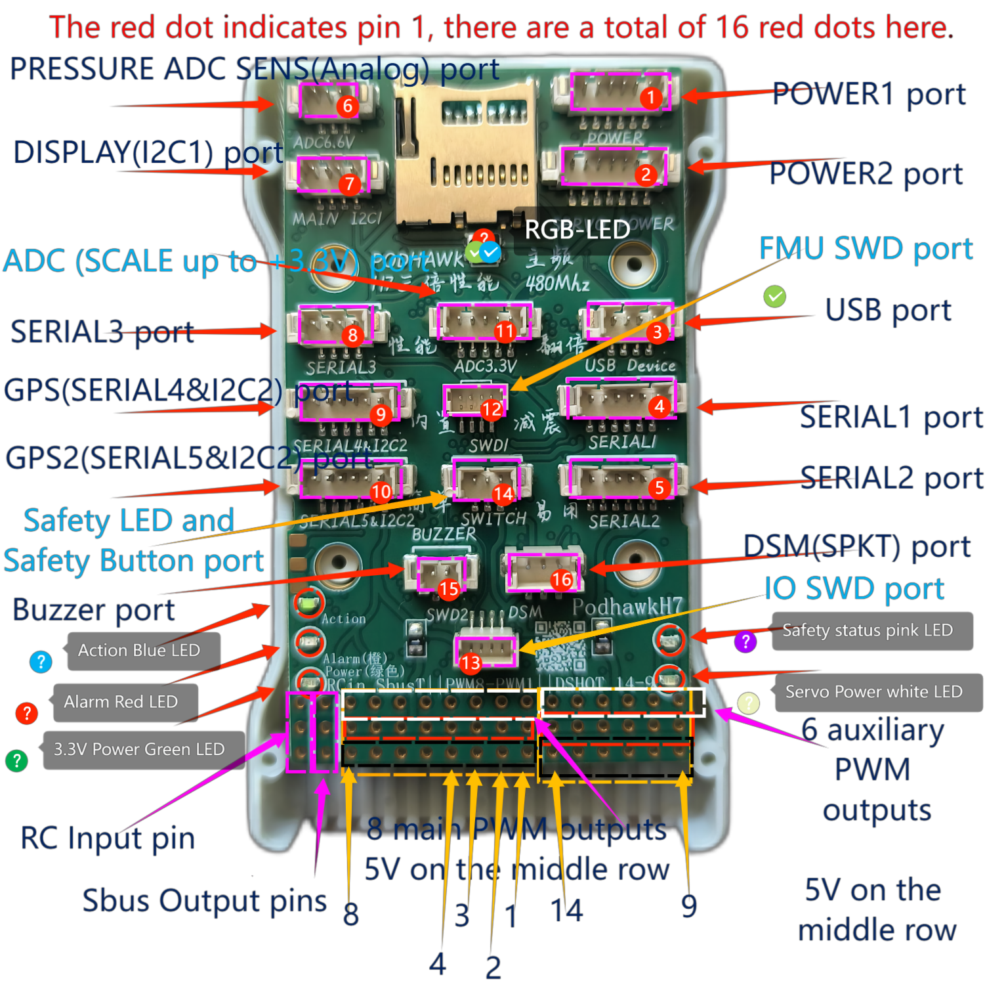

# PodmanH7 Flight Controller

The PodmanH7 flight controller is sold by a range of resellers
listed on the
[Makermare website](http://makermare.com)
[Makermare github](https://github.com/makermare)

This FCU is taking advantage of hardware features as much as possible to improve efficiency.
Built-in voltage and current sensors.
This flight controller have 3 SPI and 6 UART Ports.

## Features

 - STM32H7XX microcontroller 2MB 32-bit processor
 - Two IMUs: BMI270, ICM42688 or IIM42652
 - BMI270 Acc/Gyro
 - IIM42652 Acc/Gyro
 - ICM42688P Acc/Gyro
 - internal vibration isolation for the first IMU
 - SPL06 barometer
 - 2S - 6S Lipo input voltage with voltage monitoring(2 power analog ports)
 - 14x PWM outputs DShot capable (14 PWM protocols as well as DShot)
 - 1x RC input (SBUS and PPM signals)
 - 5x UARTs/serial for GPS and other peripherals,
 - USART2, USART3, UART4, UART8, UART7, USART1 and OTG1 have full DMA (RX and TX).
 - 2 I2C ports for external compass, airspeed, etc.
 - I2C_ORDER: I2C2 I2C1
 - microSDCard for logging, etc.
 - Internal RGB LED
 - Safety switch port
 - Buzzer port

## Pinout

On each connector the red dot indicates pin 1.

## UART Mapping

 - SERIAL0 -> USB
 - SERIAL1 -> UART2 (Telem1)
 - SERIAL2 -> UART3 (Telem2)
 - SERIAL3 -> UART4 (Optical Flow)
 - SERIAL4 -> UART8 (GPS)
 - SERIAL5 -> UART7 (GPS2)
 - SERIAL6 -> UART1 (COMPUTER)

The Telem1 and Telem2 ports have RTS/CTS pins, the other UARTs do not
have RTS/CTS.

The CONS port was originally used as a debug console, but is now a
general purpose UART (debug output is now on USB).

## Connectors

Unless noted otherwise all connectors are 1.25mm pitch

## Battery Monitoring

The board has two dedicated power monitor ports.
The correct battery setting parameters are dependent on
the type of power brick which is connected.

### POWER1 port

   <table border="1" class="docutils">
   <tbody>
   <tr>
   <th>Pin</th>
   <th>Signal</th>
   <th>Volt</th>
   </tr>
   <tr>
   <td>1 (red)</td>
   <td>VCC</td>
   <td>+5V</td>
   </tr>
   <tr>
   <td>2 (red)</td>
   <td>VCC</td>
   <td>+5V</td>
   </tr>
   <tr>
   <td>3 (blk)</td>
   <td>CURRENT(15)</td>
   <td>up to +3.3V</td>
   </tr>
   <tr>
   <td>4 (blk)</td>
   <td>VOLTAGE(14)</td>
   <td>up to +3.3V</td>
   </tr>
   <td>5 (blk)</td>
   <td>GND</td>
   <td>GND</td>
   </tr>
   <td>6 (blk)</td>
   <td>GND</td>
   <td>GND</td>
   </tr>
   </tbody>
   </table>

### POWER2 port

   <table border="1" class="docutils">
   <tbody>
   <tr>
   <th>Pin</th>
   <th>Signal</th>
   <th>Volt</th>
   </tr>
   <tr>
   <td>1 (red)</td>
   <td>VCC</td>
   <td>+5V</td>
   </tr>
   <tr>
   <td>2 (red)</td>
   <td>VCC</td>
   <td>+5V</td>
   </tr>
   <tr>
   <td>3 (red)</td>
   <td>VCC</td>
   <td>+5V</td>
   </tr>
   <tr>
   <td>4 (blk)</td>
   <td>VOLTAGE(14)</td>
   <td>up to +3.3V</td>
   </tr>
   <td>5 (blk)</td>
   <td>GND</td>
   <td>GND</td>
   </tr>
   <td>6 (blk)</td>
   <td>GND</td>
   <td>GND</td>
   </tr>
   </tr>
   <td>7 (blk)</td>
   <td>GND</td>
   <td>GND</td>
   </tr>
   </tbody>
   </table>

### USB port

   <table border="1" class="docutils">
   <tbody>
   <tr>
   <th>Pin</th>
   <th>Signal</th>
   <th>Volt</th>
   </tr>
   <tr>
   <td>1 (red)</td>
   <td>VCC</td>
   <td>+5V</td>
   </tr>
   <tr>
   <td>2 (blk)</td>
   <td>DP (D+)</td>
   <td></td>
   </tr>
   <tr>
   <td>3 (blk)</td>
   <td>DM (D-)</td>
   <td></td>
   </tr>
   <tr>
   <td>4 (blk)</td>
   <td>GND</td>
   <td>GND</td>
   </tr>
   </tbody>
   </table>

### SERIAL1, SERIAL2 ports

   <table border="1" class="docutils">
   <tbody>
   <tr>
   <th>Pin </th>
   <th>Signal </th>
   <th>Volt </th>
   </tr>
   <tr>
   <td>1 (red)</td>
   <td>VCC</td>
   <td>+5V</td>
   </tr>
   <tr>
   <td>2 (blk)</td>
   <td>TX (OUT)</td>
   <td>+3.3V</td>
   </tr>
   <tr>
   <td>3 (blk)</td>
   <td>RX (IN)</td>
   <td>+3.3V</td>
   </tr>
   <tr>
   <td>4 (blk)</td>
   <td>CTS</td>
   <td>+3.3V</td>
   </tr>
   <tr>
   <td>5 (blk)</td>
   <td>RTS</td>
   <td>+3.3V</td>
   </tr>
   <tr>
   <td>6 (blk)</td>
   <td>GND</td>
   <td>GND</td>
   </tr>
   </tbody>
   </table>

### PRESSURE ADC SENS(Analog) port

   <table border="1" class="docutils">
   <tbody>
   <tr>
   <th>Pin</th>
   <th>Signal</th>
   <th>Volt</th>
   </tr>
   <tr>
   <td>1 (red)</td>
   <td>VCC</td>
   <td>+5V</td>
   </tr>
   <tr>
   <td>2 (blk)</td>
   <td>PRESSURE(8)</td>
   <td>up to +6.6V</td>
   </tr>
   <tr>
   <td>3 (blk)</td>
   <td>GND</td>
   <td>GND</td>
   </tr>
   </tbody>
   </table>

### DISPLAY(I2C1) port

   <table border="1" class="docutils">
   <tbody>
   <tr>
   <th>Pin</th>
   <th>Signal</th>
   <th>Volt</th>
   </tr>
   <tr>
   <td>1 (red)</td>
   <td>VCC</td>
   <td>+5V</td>
   </tr>
   <tr>
   <td>2 (blk)</td>
   <td>SCL</td>
   <td>+3.3V (pullups)</td>
   </tr>
   <tr>
   <td>3 (blk)</td>
   <td>SDA</td>
   <td>+3.3V (pullups)</td>
   </tr>
   <tr>
   <td>4 (blk)</td>
   <td>GND</td>
   <td>GND</td>
   </tr>
   </tbody>
   </table>

### SERIAL3 port

   <table border="1" class="docutils">
   <tbody>
   <tr>
   <th>Pin</th>
   <th>Signal</th>
   <th>Volt</th>
   </tr>
   <tr>
   <td>1 (red)</td>
   <td>VCC</td>
   <td>+5V</td>
   </tr>
   <tr>
   <td>2 (blk)</td>
   <td>TX (OUT)</td>
   <td>+3.3V</td>
   </tr>
   <tr>
   <td>3 (blk)</td>
   <td>RX (IN)</td>
   <td>+3.3V</td>
   </tr>
   <tr>
   <td>4 (blk)</td>
   <td>GND</td>
   <td>GND</td>
   </tr>
   </tbody>
   </table>

### GPS(SERIAL4&I2C2), GPS2(SERIAL5&I2C2) ports

   <table border="1" class="docutils">
   <tbody>
   <tr>
   <th>Pin</th>
   <th>Signal</th>
   <th>Volt</th>
   </tr>
   <tr>
   <td>1 (red)</td>
   <td>VCC</td>
   <td>+5V</td>
   </tr>
   <tr>
   <td>2 (blk)</td>
   <td>TX (OUT)</td>
   <td>+3.3V</td>
   </tr>
   <tr>
   <td>3 (blk)</td>
   <td>RX (IN)</td>
   <td>+3.3V</td>
   </tr>
   <tr>
   <td>4 (blk)</td>
   <td>SCL I2C2</td>
   <td>+3.3V (pullups)</td>
   </tr>
   <tr>
   <td>5 (blk)</td>
   <td>SDA I2C2</td>
   <td>+3.3V (pullups)</td>
   </tr>
   <tr>
   <td>6 (blk)</td>
   <td>GND</td>
   <td>GND</td>
   </tr>
   </tbody>
   </table>

### ADC (SCALE up to +3.3V) port

   <table border="1" class="docutils">
   <tbody>
   <tr>
   <th>Pin</th>
   <th>Signal</th>
   <th>Volt</th>
   </tr>
   <tr>
   <td>1 (red)</td>
   <td>VCC</td>
   <td>+5V</td>
   </tr>
   <tr>
   <td>2 (blk)</td>
   <td>TX (OUT)</td>
   <td>+3.3V</td>
   </tr>
   <tr>
   <td>3 (blk)</td>
   <td>RX (IN)</td>
   <td>+3.3V</td>
   </tr>
   <tr>
   <td>4 (blk)</td>
   <td>ADC IN(4)</td>
   <td>up to +3.3V</td>
   </tr>
   <tr>
   <td>5 (blk)</td>
   <td>GND</td>
   <td>GND</td>
   </tr>
   </tbody>
   </table>

### FMU and IO SWD ports

There are two SWD connectors, one for FMU(STM32H7), 
and the other for IOMCU(STM32F1).

   <table border="1" class="docutils">
   <tbody>
   <tr>
   <th>Pin</th>
   <th>Signal</th>
   <th>Volt</th>
   </tr>
   <tr>
   <td>1</td>
   <td>SWCLK</td>
   <td>+3.3</td>
   </tr>
   <tr>
   <td>2</td>
   <td>SWDIO</td>
   <td>+3.3</td>
   </tr>
   <tr>
   <td>3</td>
   <td>GND</td>
   <td>GND</td>
   </tr>
   <tr>
   <td>4</td>
   <td>3.3v</td>
   <td>+3.3V</td>
   </tr>
   </tbody>
   </table>

### Safety LED and Safety Button port

   <table border="1" class="docutils">
   <tbody>
   <tr>
   <th>Pin</th>
   <th>Signal</th>
   <th>Volt</th>
   </tr>
   <tr>
   <td>1 (red)</td>
   <td>3.3v</td>
   <td>+3.3V</td>
   </tr>
   <tr>
   <td>2 (blk)</td>
   <td>Safety LED</td>
   <td></td>
   </tr>
   <tr>
   <td>3 (blk)</td>
   <td>Safety Button</td>
   <td></td>
   </tr>
   </tbody>
   </table>

### Buzzer port

   <table border="1" class="docutils">
   <tbody>
   <tr>
   <th>Pin</th>
   <th>Signal</th>
   <th>Volt</th>
   </tr>
   <tr>
   <td>1 (red)</td>
   <td>Buzzer+</td>
   <td>up to +5.0V</td>
   </tr>
   <tr>
   <td>2 (blk)</td>
   <td>GND(Buzzer-)</td>
   <td>GND</td>
   </tr>
   </tbody>
   </table>

### DSM(SPKT) port

The SPKT port provides a connector for Spektrum satellite
receivers. It is needed to allow for software controlled binding of
satellite receivers.

The pinout of the SPKT port given below is given with the 3.3V power
pin closest to the cube (pin 3).

   <table border="1" class="docutils">
   <tbody>
   <tr>
   <th>Pin</th>
   <th>Signal</th>
   <th>Volt</th>
   </tr>
   <tr>
   <td>1</td>
   <td>RX (IN)</td>
   <td>+3.3V</td>
   </tr>
   <tr>
   <td>2</td>
   <td>GND</td>
   <td>GND</td>
   </tr>
   <tr>
   <td>3</td>
   <td>3.3v</td>
   <td>+3.3V</td>
   </tr>
   </tbody>
   </table>

## RC Input pin
 
RC input is configured on the RCIN pin, at one end of the servo rail,
marked RCIN in the above diagram. This pin supports all RC
protocols. In addition there is a dedicated Spektrum satellite port
which supports software power control, allowing for binding of
Spektrum satellite receivers.

## PWM Output pins

The PodmanH7 supports up to 14 PWM outputs. First first 8 outputs (labelled
"MAIN") are controlled by a dedicated STM32F103 IO controller. These 8
outputs support all PWM output formats.

The remaining 6 outputs (labelled AUX1 to AUX6) are the "auxiliary"
outputs. These are directly attached to the STM32H7XX and support all
PWM protocols as well as DShot.

All 14 PWM outputs have GND on the top row, 5V on the middle row and
signal on the bottom row.

The 8 main PWM outputs are in 3 groups:

 - PWM 1 and 2 in group1
 - PWM 3 and 4 in group2
 - PWM 5, 6, 7 and 8 in group3

The 6 auxiliary PWM outputs are in 2 groups:

 - PWM 1, 2, 3 and 4 in group1
 - PWM 5 and 6 in group2

Channels within the same group need to use the same output rate. If
any channel in a group uses DShot then all channels in the group need
to use DShot.

## GPIOs

The 6 PWM ports can be used as GPIOs (relays, buttons, RPM etc). To
use them you need to limit the number of these pins that is used for
PWM by setting the BRD_PWM_COUNT to a number less than 6. For example
if you set BRD_PWM_COUNT to 4 then PWM5 and PWM6 will be available for
use as GPIOs.

The numbering of the GPIOs for PIN variables in ArduPilot is:

 - PWM1 50
 - PWM2 51
 - PWM3 52
 - PWM4 53
 - PWM5 54
 - PWM6 55

## Compass

The PodmanH7 has an IST8310 compass on board.
You can attach external compass using I2C2 or I2C1,
on the GPS(SERIAL4&I2C2), GPS2(SERIAL5&I2C2) and DISPLAY(I2C1) ports.

## Analog inputs

The PodmanH7 has 5 analog inputs

 - ADC Pin14 -> (up to +3.3V) Battery Voltage
 - ADC Pin15 -> (up to +3.3V) Battery Current Sensor
 - ADC Pin8 -> (up to +6.6V) PRESSURE SENS ADC port input
 - ADC Pin4 -> (up to +3.3V) AUX_ADC1 Sensor (requires custom carrier board)
 - ADC Pin103 -> RSSI voltage monitoring

## Loading Firmware

The board comes pre-installed with an ArduPilot compatible bootloader,
allowing the loading of *.apj firmware files with any ArduPilot
compatible ground station.

## Acknowledgements

For more informations about the author see the
[LightFlightControl Github](https://github.com/makermare/UAV-FlyingControlSystem-LightFlightControl)
[BlueSkyFlightControl Github](https://github.com/makermare/UAV-FlyingControlSystem-BlueSkyFlightControl)
