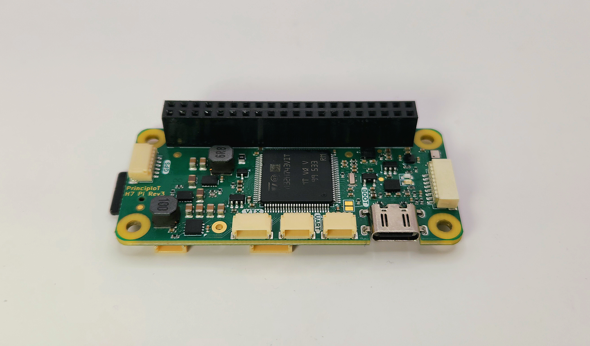
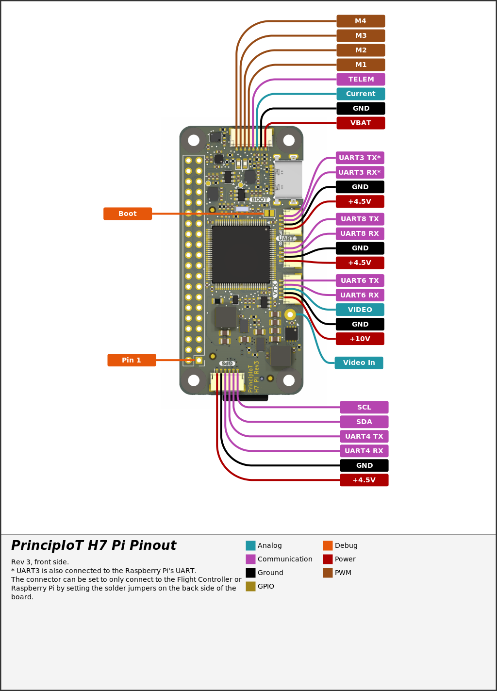
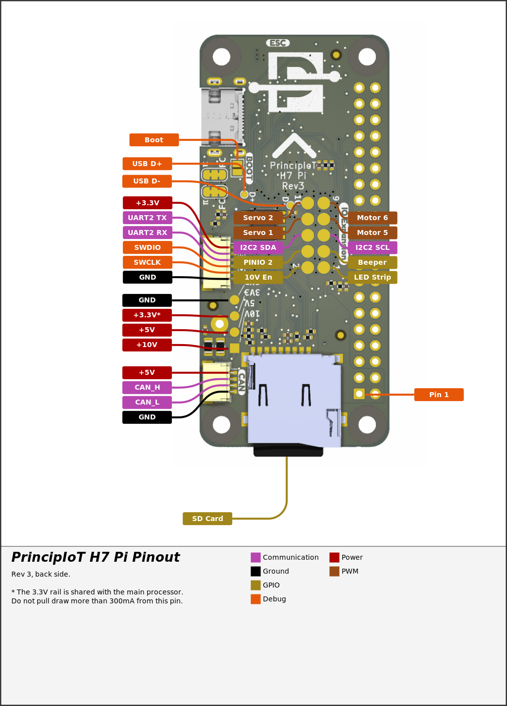

===
PrincipIoT H7 Pi
===

The PrincipIoT H7 Pi autopilot is manufactured by [PrincipIoT](https://principiot.com>). It's designed to be paired with a Raspberry Pi Zero 2 for low cost onboard computing applications.

Where to Buy
============

[PrincipIoT Website](https://principiot.com>)

Specifications
==============
- Processor

  - STM32H743 32-bit processor, 480Mhz
  - 2MB Flash
  - 1MB RAM
- Sensors

  - Invensense ICM-42688P
  - Invensense IIM-42653
  - Infineon DPS368 Barometer
  - ST IIS2MDC Magnetometer

- Interfaces

  - Micro SD card
  - USB-C
  - 9 PWM (6 motors, 2 servos, and LED strip)
  - 6 UARTS, one shared with the Raspberry Pi
  - CAN
  - ESC Connector with current sense and telemetry inputs
  - VTX Connector with UART and analog video from the Raspberry Pi
  - Debug port

- Power

  - Integrated voltage/current power monitor 11V - 30V (3S - 6S) input
  - 10V GPIO controlled Video power BEC, 2A output
  - 5V, 2A output for board, Raspberry Pi, and peripherals

- Dimensions

  - Size: 65 x 30 x 9 mm (20mm high with Raspberry Pi installed)
  - Weight: 11.3g with MicroSD card

For more information, see the [PrincipIoT Wiki](https://principiot.gitbook.io/principiot-docs/h7-pi/).

Pinout
======

UART Mapping
============
The UARTs are marked in the above pinouts. The RX pin is the receive pin for the MCU (input). The TX pin is the transmit pin for the MCU (output).

|Port        | UART    |Protocol        |Function |
|------------|---------|----------------|---------|
|SERIAL0     |  USB    |  MAVLink2      |         |
|SERIAL1     |  USART2 |  Unused        |Debug    |
|SERIAL2     |  USART3 |  MAVLink2      |Pi UART  |
|SERIAL3     |  UART4  |  GPS           |GPS      |
|SERIAL4     |  USART6 |  DisplayPort   |VTX      |
|SERIAL5     |  UART7  |  ESC Telem     |ESC Telem|
|SERIAL6     |  UART8  |  RCin          |RX       |

All UARTs support DMA. Any UART can change function by changing the related protocol parameter.
USART3 is wired to the UART on the 40 pin Raspberry Pi header and the external UART connector.
UART7 is receive only.

RC input
========
<!--This is the most difficult section and varies widely.-->

The PrincipIoT H7 Pi has a dedicated UART for RC input. It's designed for use with a UART based receiver, like ELRS.

Any UART can be used for RC system connections in ArduPilot also, and is compatible with all protocols except PPM. See :ref:`common-rc-systems` for details.

PWM Outputs
===========
The PrincipIoT H7 Pi controller supports up to 8 PWM outputs.

All outputs are directly wired to the H743 MCU.
All 8 outputs support normal PWM output formats. All outputs support DShot, outputs 1-4 support Bi-Directional DShot.

Analog Video and OSD Support
===========
Analog video output from the Raspberry Pi Zero is available on the VTX header when the included POGO pin is installed and the Raspberry Pi is outputting video.

The SH1.0-6P connector supports a DJI Air Unit / HD VTX connection. Protocol defaults to DisplayPort. Pin 1 of the connector is 10v so be careful not to connect this to a peripheral requiring 5v. DisplayPort OSD is enabled by default on SERIAL5.

VTX power control
=================
GPIO 81 controls the VTX BEC output to pins marked "10V" and is included on the HD VTX connector. Setting this GPIO high turns off the voltage regulator. By default this pin is set low (regulator on) at boot.

Camera Switch
=============
GPIO 82 controls the PINIO2 GPIO pin. It defaults to low on boot.

Compass
=======
An on-board IIS2MDC compass is provided. This compass is on the external I2C bus. Do not connect an external IIS2MDC compass or both may not be detected as they only have one address. If you need to use an external compass, use a different model or desolder the onboard one.

GPIOs
=====

|Pin           |GPIO Number |Function        |
|--------------|------------|----------------|
|PWM(1)        | 50         |Motor           |
|PWM(2)        | 51         |Motor           |
|PWM(3)        | 52         |Motor           |
|PWM(4)        | 53         |Motor           |
|PWM(5)        | 54         |Motor           |
|PWM(6)        | 55         |Motor           |
|PWM(7)        | 60         |Servo           |
|PWM(8)        | 61         |Servo           |
|PWM(9)        | 62         |LED Strip       |
|ALARM         | 32         |Buzzer          |
|VTX PWR       | 81         |10V BEC Enable  |
|CAM SW        | 82         |Camera Switch   |
|LED0          | 90         |Blue LED        |
|LED1          | 91         |Green LED       |

Battery Monitor
===============
The board has a internal voltage sensor and connections on the ESC connector for an external current sensor input.
The voltage sensor can handle up to 6S LiPo batteries.

The default battery parameters are:

 - :ref:`BATT_MONITOR<BATT_MONITOR>` = 4
 - :ref:`BATT_VOLT_PIN<BATT_VOLT_PIN__AP_BattMonitor_Analog>` = 10
 - :ref:`BATT_CURR_PIN<BATT_CURR_PIN__AP_BattMonitor_Analog>` = 11 (CURR pin)
 - :ref:`BATT_VOLT_MULT<BATT_VOLT_MULT__AP_BattMonitor_Analog>` = 11.0
 - :ref:`BATT_AMP_PERVLT<BATT_AMP_PERVLT__AP_BattMonitor_Analog>` = 40

Firmware
========
Firmware for the PrincipIoT H7 Pi is available from [ArduPilot Firmware Server](https://firmware.ardupilot.org) under the `PrincipIoTH7Pi` target.

Loading Firmware
================
To flash firmware initially, connect USB while holding the bootloader button and use DFU to load the `with_bl.hex` file. Subsequent updates can be applied using `\.apj` files through a ground station.

