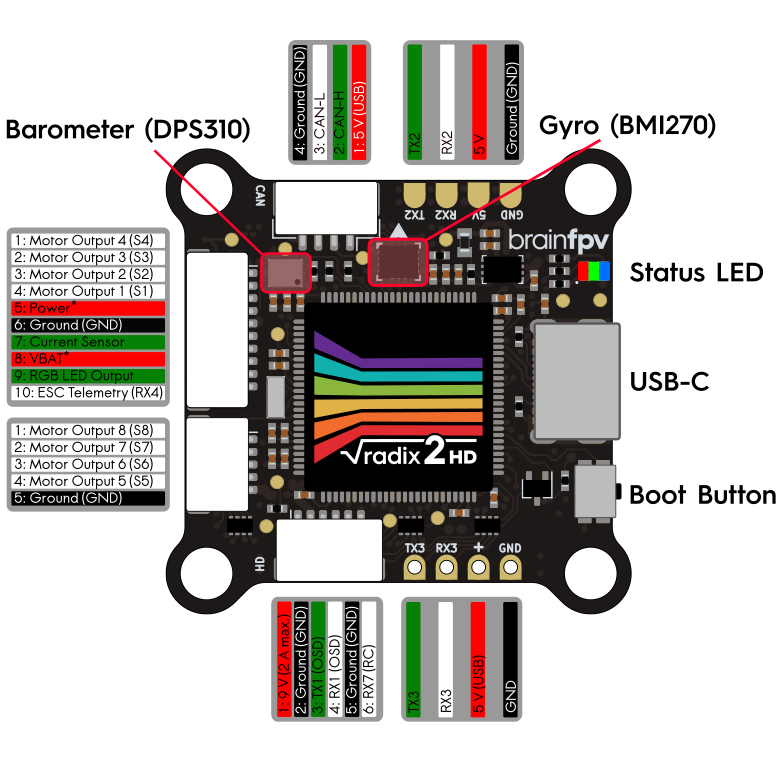
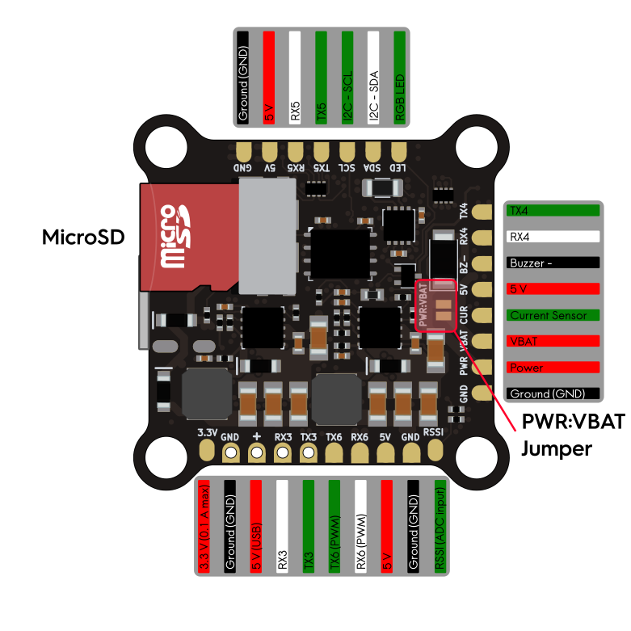

# BrainFPV RADIX 2 HD Flight Controller

The BrainFPV RADIX 2 HD is a flight controller primarily intended for
First Person View (FPV) applications that use a HD (digital) FPV system.

For the full documentation, refer to the [BrainFPV website](https://www.brainfpv.com/kb/radix-2-hd/).

## Features

 - STM32H750 microcontroller
 - IMU: Bosch Sensortec BMI270
 - Barometer: Infineon DPS310
 - Onboard flash: 16 MB connected via QUADSPI
 - microSD slot
 - 6 UARTs plus USB (7 UARTs with alternate board config)
 - 10 PWM outputs (8 supporting BDSHOT on dual 4-in-1 ESC connectors)
 - I2C and CAN port
 - Builtin RGB LED
 - Analog input for voltage sensing, up to 12S (52 V)
 - Analog input for current sensing
 - Analog input for RSSI
 - External buzzer
 - USB Type-C connector
 - Battery voltage 3S-8S (35 V)
 - 5 V / 1.5 A voltage regulator for powering flight controller and external devices
 - 9 V / 2 A voltage regulator for HD FPV system (can be turned on/off using the Relay2 switch)
 - Size: 37 x 37 mm (30.5 mm hole spacing)
 - Weight: 7g
 - Made in the USA, NDAA compliant

## Pinout

Refer to the [full documentation](https://www.brainfpv.com/kb/radix-2-hd/) for details
and how to use the "PWR:VBAT" jumper.

## UART Mapping

 - SERIAL0 -> USB
 - SERIAL1 -> UART1 (DMA-enabled, MSP DisplayPort OSD)
 - SERIAL2 -> UART2 (DMA-enabled, GPS)
 - SERIAL3 -> UART3 (DMA-enabled, RCin)
 - SERIAL4 -> UART4 (spare)
 - SERIAL5 -> UART5 (spare)
 - SERIAL6 -> UART6 (spare, PWM 9 and 10 by default, use BRD_ALT_CONFIG = 1 for UART)
 - SERIAL7 -> UART7 (spare, RX is on HD connector for RC input, TX is not connected to external pad)

## RC Input

By default, SERIAL3 is used for RC input. The RC receiver 5 V pad next to RX3 ("+") is
also powered from USB for easy and safe configuration without having to connect the main
battery.

## PWM Output

The RADIX 2 HD has a total of 10 PWM outputs. The first 8 outputs support BDSHOT and
are on two 4-in-1 ESC connectors. The PWM outputs are in groups of 2 channels each,
all channels in the same group need to use the same configuration / rate.

 - PWM 1-2 Group 1
 - PWM 3-4 Group 2
 - PWM 5-6 Group 3
 - PWM 7-8 Group 4
 - PWM 9-10 Group 5 (These are on the TX6 and RX6 pads that can also be used for SERIAL6)

## Analog inputs

The RADIX 2 HD has 3 analog inputs:

 - ADC Pin 10 -> Battery Voltage (VBAT pin, builtin 1:17.6 voltage divider)
 - ADC Pin 3  -> Battery Current Sensor (CUR pin)
 - ADC Pin 11 -> RSSI voltage monitoring (RSSI pad)

## Battery Monitoring

The RADIX 2 HD can monitor battery voltages up to 12S using a built-in voltage divider.
The board itself can be powered by battery voltages up to 8S (35 V) and there is a jumper
to use the same pin for battery voltage monitoring and for powering the board.

WARNING Powering the board with more than 8S (35 V) with the "PWR:VBAT" jumper soldered
will damage it. Refer to the official documentation for more details.

In addition to voltage sensing, the board also has an input for an external current sensor.

## Loading Firmware

The RADIX 2 HD uses a proprietary bootloader. To load firmware, download the firmware binary file
from the [BrainFPV website](https://www.brainfpv.com/firmware) and copy it to the USB drive
that appears when connecting the RADIX 2 HD to your computer when it is in bootloader mode
(hold the BOOT button and release when connecting to USB).

Note: When using Ardupilot, it is necessary to have a microSD card inserted, without it
the firmware won't run.

Alternatively, you can create your own firmware file using the [BrainFPV Firmware Packer](https://github.com/BrainFPV/brainfpv_fw_packer).
To create a file for Ardupilot, install the BrainFPV Firmware Packer:

    pip install git+https://github.com/BrainFPV/brainfpv_fw_packer.git

After that, build the Copter firmware:

    ./waf configure --board RADIX2HD
    ./waf copter

Finally, use the firmware packer script to create the firmware file that can be used with the
BrainFPV bootloader:

    ./libraries/AP_HAL_ChibiOS/hwdef/RADIX2HD/pack_firmware.sh copter

To use it, copy the resulting `arducopter_{VERSION}_brainfpv.bin` to the USB drive that appears
when the RADIX 2 HD is in bootloader mode. Once it finishes copying, safely remove the drive.
At this point the RADIX 2 HD will reboot and run the Copter firmware.
