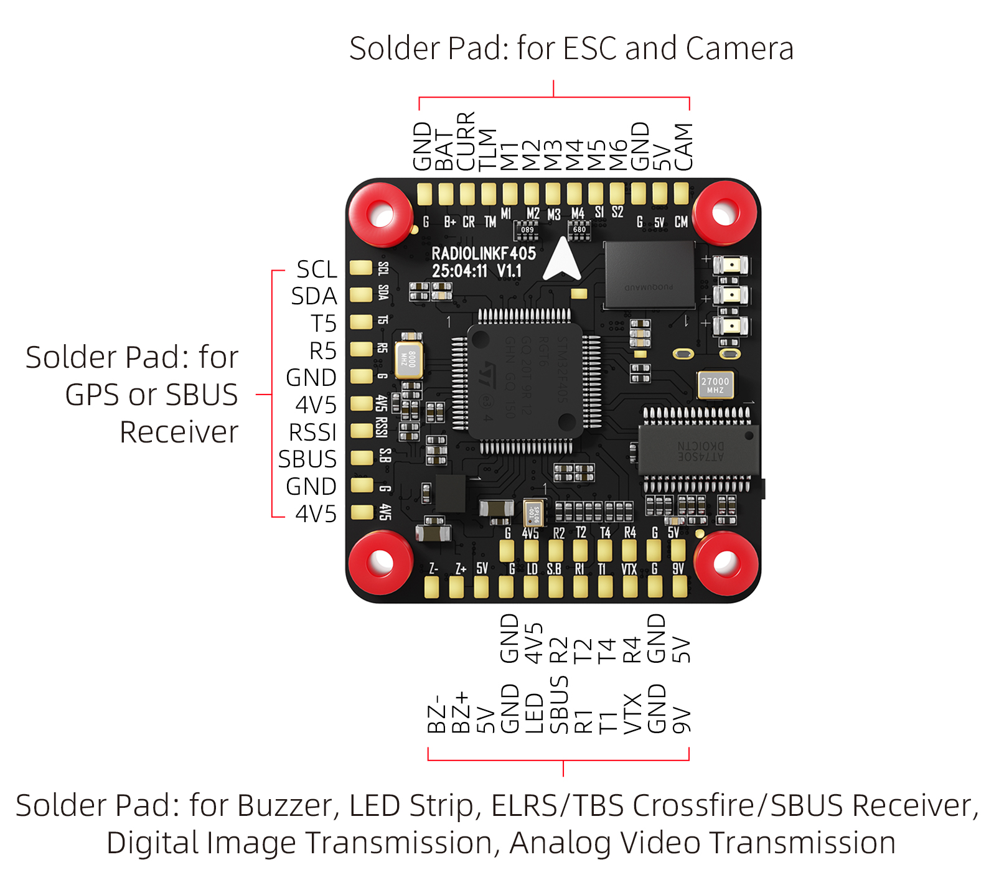
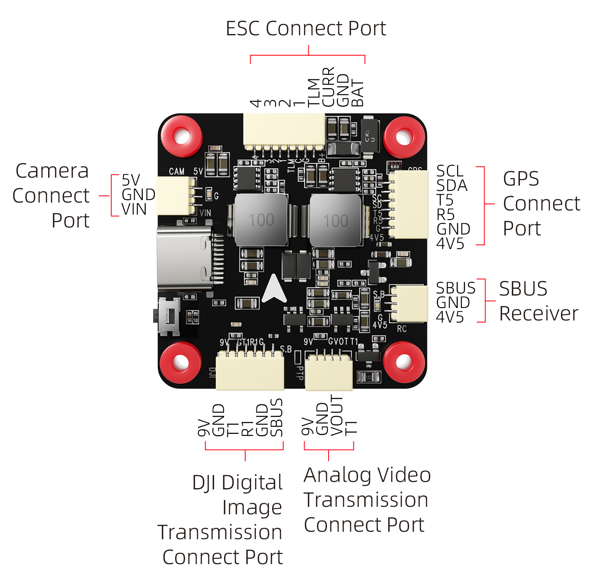

# RadiolinkF405 Flight Controller

The RadiolinkF405 is a flight controller produced by [RadioLink](https://www.radiolink.com/).

## Features

 - STM32F405 microcontroller
 - ICM42688 IMU
 - SPL06 barometer
 - W25N01G flash
 - AT7456E OSD
 - 5 UARTs
 - 7 PWM outputs

## Pinout

## UART Mapping

The UARTs are marked Rn and Tn in the above pinouts. The Rn pin is the
receive pin for UARTn. The Tn pin is the transmit pin for UARTn.

 - SERIAL0 -> USB
 - SERIAL1 -> UART1 (DJI-VTX)
 - SERIAL2 -> UART2 (RCIN, DMA-enabled) 
 - SERIAL3 -> UART3 (ESC Telemetry)
 - SERIAL4 -> UART4 (User)
 - SERIAL5 -> UART5 (GPS)

## RC Input

RC input is configured on the R2 (UART2_RX) pin for most RC unidirectional protocols except SBUS which should be applied at the SBUS pin. PPM is not supported.
For CRSF/ELRS/SRXL2 connection of the receiver to T2 will also be required. See :ref:`common-rc-systems` for more info
  
## OSD Support

The RadiolinkF405 supports analog OSD using its internal MAX7456. Simultaneous HD OSD operation is enabled by defaullt also.

## VTX Support

The JST-GH-6P connector supports a standard DJI HD VTX connection. Pin 1 of the connector is 9v so be careful not to connect
this to a peripheral requiring 5v.

## PWM Output

The RadiolinkF405 supports up to 7 PWM outputs. The pads for motor output
M1 to M4 on the motor connector, M5 M6 for servo or another PWM output, LED pads supports serial led strip.

The PWM is in 3 groups:

 - PWM 1-4 in group1
 - PWM 5-6 in group2
 - PWM 7   in group3 (LED)

Channels within the same group need to use the same output rate. If
any channel in a group uses DShot then all channels in the group need
to use DShot. Channels 1-4 support bi-directional DShot.

## Pin IO

- GPIO81 is 9V VTX power control (HIGH:on; LOW:off)
- RELAY2 is assigned to control this GPIO by default.

## Battery Monitoring

The board has a internal voltage sensor and connections on the ESC connector for an external current sensor input.
The voltage sensor can handle up to 6S LiPo batteries.

The default battery parameters are:

 - :ref:`BATT_MONITOR<BATT_MONITOR>` = 4
 - :ref:`BATT_VOLT_PIN<BATT_VOLT_PIN__AP_BattMonitor_Analog>` = 12
 - :ref:`BATT_CURR_PIN<BATT_CURR_PIN__AP_BattMonitor_Analog>` = 11 (CURR pin)
 - :ref:`BATT_VOLT_MULT<BATT_VOLT_MULT__AP_BattMonitor_Analog>` = 11.0
 - :ref:`BATT_AMP_PERVLT<BATT_AMP_PERVLT__AP_BattMonitor_Analog>` = 25

## Compass

The RadiolinkF405 does not have a builtin compass, but you can attach an external compass using I2C on the SDA and SCL pads.

## Firmware

Firmware for the RadiolinkF405 is available from [ArduPilot Firmware Server](https://firmware.ardupilot.org) under the `RadiolinkF405` target.

## Loading Firmware

To flash firmware initially, connect USB while holding the bootloader button and use DFU to load the `with_bl.hex` file. Subsequent updates can be applied using `.apj` files through a ground station.
