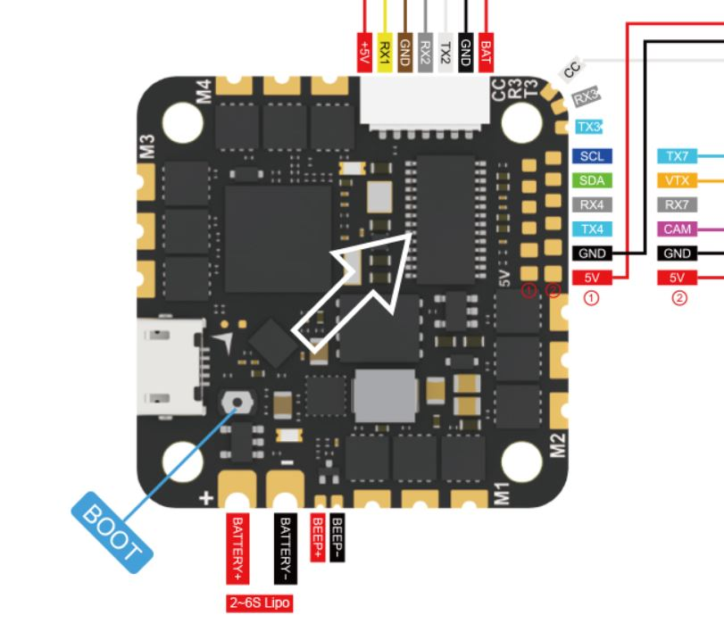

# Foxeer ReaperF745v2 Flight Controller

The ReaperF745v2 is a flight controller produced by [Foxeer](https://www.foxeer.com/).

## Features

 - MCU - STM32F745 32-bit processor
 - IMU - BMI270
 - OSD - AT7456E
 - Onboard Flash: 128MBit
 - 5x UARTs
 - 5x PWM Outputs (4 Motor Output, 1 LED)
 - Battery input voltage: 2S-6S
 - Integrated 45A BlueJay ESCs

## Pinout

## UART Mapping

The UARTs are marked Rn and Tn in the above pinouts. The Rn pin is the
receive pin for UARTn. The Tn pin is the transmit pin for UARTn.

 - SERIAL0 -> USB
 - SERIAL1 -> UART1 (DJI RCIN)
 - SERIAL2 -> UART2 (RX, DMA-enabled)
 - SERIAL3 -> UART3
 - SERIAL4 -> UART4 (Camera)
 - SERIAL7 -> UART7 (GPS, DMA-enabled)

## RC Input

RC input is configured on the R2 (UART2_RX) pin. It supports all serial RC
protocols. For protocols requiring half-duplex serial to transmit
telemetry (such as FPort) you should setup the TX PIN as an RC input serial port,
with half-duplex, pin-swap and inversion enabled.
 
## FrSky Telemetry
 
FrSky Telemetry is supported using the T2 pin (UART2 transmit). You need to set the following parameters to enable support for FrSky S.PORT
 
  - SERIAL5_PROTOCOL 10
  - SERIAL5_OPTIONS 7
  
## OSD Support

The ReaperF745v2 supports OSD using OSD_TYPE 1 (MAX7456 driver).

## PWM Output

The ReaperF745v2 supports up to 5 PWM outputs. There are no pads for motor output
M1 to M4 as these are connected directly to the onboard ESCs. M5 is on a separate pad for LED strip or another PWM output.

The PWM is in 2 groups:

 - PWM 1-4 in group1
 - PWM 5   in group2

Channels within the same group need to use the same output rate. If
any channel in a group uses DShot then all channels in the group need
to use DShot. Channels 1-4 support bi-directional dshot and this is configured by
default to take advantage of the BlueJay ESC firmware that is installed by default.

## Battery Monitoring

The board has a builtin voltage and current sensor. The current
sensor can read up to 130 Amps. The voltage sensor can handle up to 6S
LiPo batteries.

The correct battery setting parameters are:

 - BATT_MONITOR 4
 - BATT_VOLT_PIN 13
 - BATT_CURR_PIN 12
 - BATT_VOLT_MULT 10.9
 - BATT_AMP_PERVLT 100

## Compass

The ReaperF745v2 does not have a builtin compass, but you can attach an external compass using I2C on the SDA and SCL pads.

## Barometer

The ReaperF745v2 does not have a builtin barometer, but you can attach an external barometer using I2C on the SDA and SCL pads.

## Loading Firmware

Initial firmware load can be done with DFU by plugging in USB with the
bootloader button pressed. Then you should load the "with_bl.hex"
firmware, using your favourite DFU loading tool.

Once the initial firmware is loaded you can update the firmware using
any ArduPilot ground station software. Updates should be done with the
*.apj firmware files.

