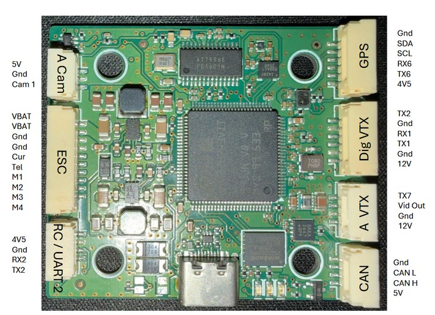
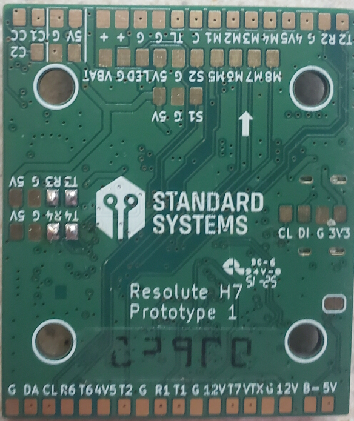

# Resolute H7 Flight Controller

The Resolute H7 is a flight controller produced by [Standard Systems](https://standardsystems.tech/).

## Features

- MCU - STM32H743 32-bit processor running at 480 MHz
- IMU - ICM42688
- Barometer - DPS368
- OSD - AT7456E
- 7x UARTs
- 1x CAN port
- 12x PWM Outputs (10 Motor Output, 1 LED, 1 Smart Audio)
- Battery input voltage: 4S-6S
- BEC 3.3V 0.5A
- BEC 5V 3A
- Controllable 12V VTX BEC, 3A
- Dual switchable camera inputs

## Pinout

## UART Mapping

The UARTs are marked Rxn and Txn in the above pinouts. The Rxn pin is the
receive pin for UARTn. The Tn pin is the transmit pin for UARTn.

- SERIAL0 -> USB
- SERIAL1 -> USART1 (DisplayPort) DMA capable
- SERIAL2 -> USART2 (RCin) DMA capable
- SERIAL3 -> UART3 (USER) DMA capable
- SERIAL4 -> UART4 (USER) DMA capable
- SERIAL6 -> USART6 (GPS)
- SERIAL7 -> UART7 (SmartAudio)
- SERIAL8 -> UART8 (ESC Telemetry)

## RC Input

RC input is configured by default via the USART2 RX input. It supports all serial RC protocols except PPM.

- FPort requires an external bi-directional inverter attached to T5 and [SERIAL2_OPTIONS](https://ardupilot.org/copter/docs/parameters.html#serial2-options-telem2-options) set to 4 (half-duplex).  See [FPort receivers](https://ardupilot.org/copter/docs/common-FPort-receivers.html).
- CRSF/ELRS uses RX2/TX2.
- SRXL2 requires a connection to TX2 and automatically provides telemetry.  Set [SERIAL2_OPTIONS](https://ardupilot.org/copter/docs/parameters.html#serial2-options-telem2-options) to "4".

If the user wishes to use the SBUS from a DJI air unit for RC control, it is suggested that the RX8 pad be used as shown in the wiring diagram and [SERIAL8_PROTOCOL](https://ardupilot.org/copter/docs/parameters.html#serial8-protocol-serial8-protocol-selection) be set to "23" and [SERIAL5_PROTOCOL](https://ardupilot.org/copter/docs/parameters.html#serial5-protocol-serial5-protocol-selection) be changed from "23" to something else.

## PWM Output

The Resolute H7 supports up to 11 outputs. Motor outputs M1 to M4 are on the ESC connector, as well as pads. M5 to M7 are available on pads, along with independent pads marked LED for LED strips and a PWM output near the camera pads for camera OSD control. M1-8 support bi-directional DShot, and all the outputs support DShot.

The PWM is in 5 groups:

- PWM 1-4     in group1
- PWM 5-8     in group2
- PWM 9(LED)  in group3 (set as Serial LED output function by default)
- PWM 10/11   in group4 (Servo 0/1)
- PWM 12(Camera_Control) in group5

Channels within the same group need to use the same output rate. If
any channel in a group uses DShot or LED then all channels in the group need
to use DShot or LED.

## Battery Monitoring

The board has a built-in voltage sensor and external current sensor input. The voltage sensor can handle up to ??S LiPo batteries.

The correct battery setting parameters are:

- BATT_MONITOR = 4
- BATT_VOLT_PIN = 10
- BATT_CURR_PIN = 11
- BATT_VOLT_MULT = 11.0
- BATT_AMP_PERVLT = 40

## Compass

The Resolute H7 does not have a builtin compass, but you can attach an external compass using I2C on the SDA and SCL pads.

## Camera control

GPIO 82 controls the camera output to the connectors marked "CAM1" and "CAM2". Setting this GPIO low switches the video output from CAM1 to CAM2. By default RELAY3 is configured to control this pin.

## VTX Power Control

GPIO 81 provides on/off control of the 12V supply. RELAY 2 controls this GPIO

## HD VTX connector

When using HD video transmission, the flight controller needs to connect to DJI TX and RX via Serial 1.

## OSD Support

The Resolute H7 has an onboard OSD using a MAX7456 chip and is enabled by default. The CAM1/2 and VTX pins provide connections for using the internal OSD. Simultaneous DisplayPort OSD is also possible and is configured by default.

## Loading Firmware

Firmware for these boards can be found [here](https://firmware.ardupilot.org) in sub-folders labeled "ResoluteH7".
Initial firmware load can be done with DFU by plugging in USB with the
bootloader button pressed. Then you should load the "with_bl.hex"
firmware, using your favourite DFU loading tool.

Once the initial firmware is loaded you can update the firmware using
any ArduPilot ground station software. Updates should be done with the
\*.apj firmware files.
