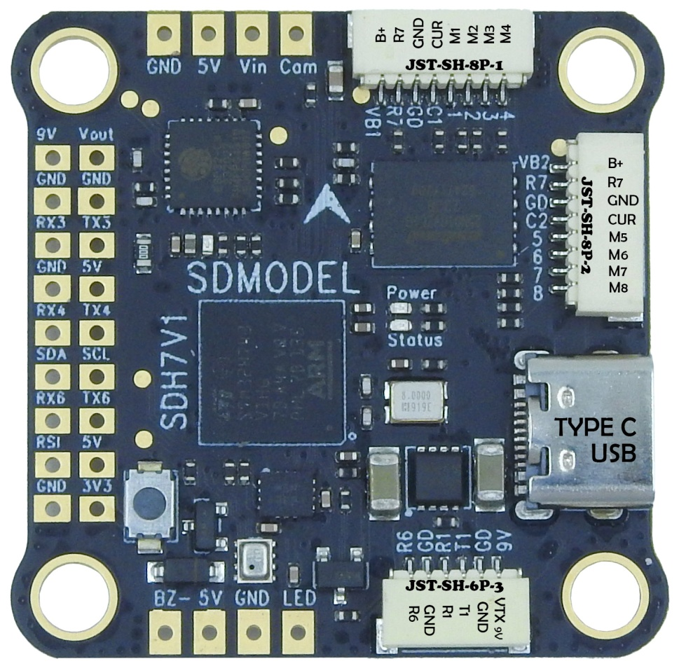
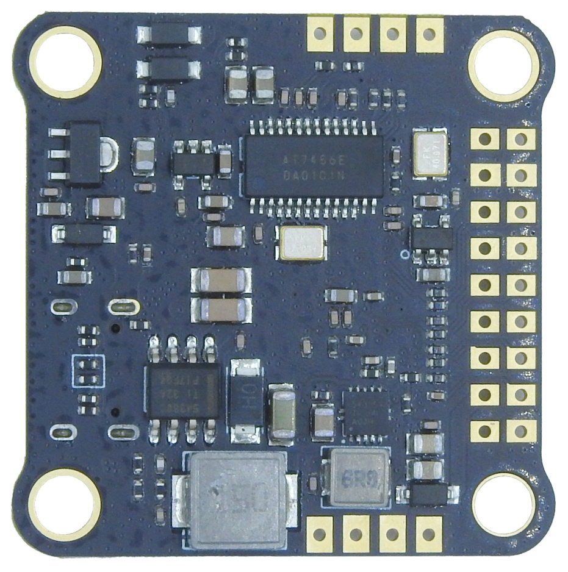
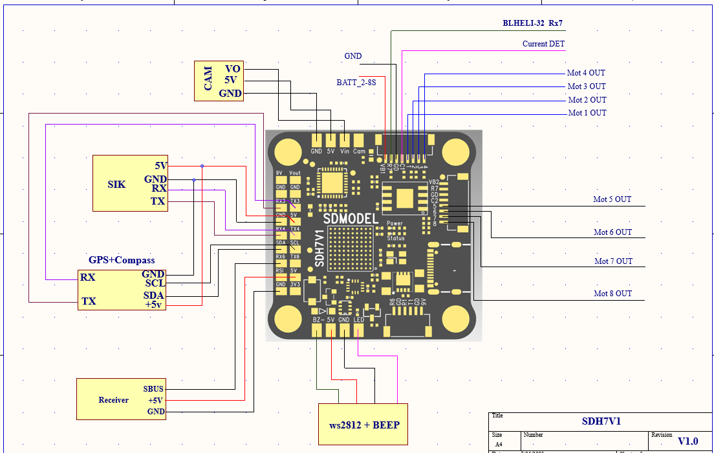

## SDMODEL SDH7 V1

above image and some content courtesy of SDMODEL

## Specifications¶

    Processor
        STM32H743 32-bit processor
        AT7456E OSD
        128 MByte flash for logging

    Sensors
        BMI270 IMU (accel and gyro only, no compass)
        BMP280 barometer

    Power
        2S - 8S Lipo input voltage with voltage monitoring
        9V, 1.5A BEC for powering Video Transmitter

    Interfaces
        9x PWM outputs (9th pwm output is for NeoPixel LED string via the LED pad)
        1x RC input
        6x UARTs/serial for GPS and other peripherals
        1x I2C port for external compass
        USB-C port
        Switchable VTX power
        All UARTS support hardware inversion. SBUS, SmartPort, and other inverted protocols work on any UART without "uninvert hack"
        External current monitor input

## Pinout

PADS

========= ===================
Pin 	  Function
========= ===================
VTX 9v    9V for HD System or other VTX, by default ON/OFF is controlled by RELAY2. See Relay Switch Can be controlled by RELAY2
SDA, SCL  I2C connection (for peripherals)
5V 	  5v output (1.5A max)
3v3 	  3.3v output (0.25A max)
Vi 	  Video input from FPV camera
Vo 	  Video output to video transmitter
CAM 	  To camera OSD control
G or GND  Ground
RSI 	  Analog RSSI (0-3.3v) input from receiver
R3, T3    UART3 RX and TX
R4, T4    UART4 RX and TX
R6, T6    UART6 RX and TX (UART6 RX is also located in the SH plug)
LED 	  WS2182 addressable LED signal wire
Z- 	  Piezo buzzer negative leg
========= ===================

Connectors
 
ESC PORT1 (JST-SH-8P-1)
========= ===================
Pin 	  Function
========= ===================
B+ 	  Battery positive voltage (2S-8S)
R7 	  UART7 RX
GND 	  Ground
CURRENT   CURRENT
M1 	  Motor signal output 1
M2 	  Motor signal output 2
M3 	  Motor signal output 3
M4 	  Motor signal output 4
========= ===================

ESC PORT2 (JST-SH-8P-2)
========= ===================
Pin 	  Function
========= ===================
B+ 	   Battery positive voltage (2S-8S)
R7 	   UART7 RX
GND 	   Ground
CURRENT    CURRENT
M5 	   Motor signal output 5
M6 	   Motor signal output 6
M7 	   Motor signal output 7
M8 	   Motor signal output 8
========= ===================

DJI Connector JST-SH-6P-3
========= ===================
Pin 	  Function
========= ===================
Vtx+ 	  9V for HD System or other VTX, by default ON/OFF is controlled by RELAY2. See Relay Switch
G 	  Ground
T1 	  UART1 TX
R1 	  UART1 RX
G 	  Ground
R6 	  UART6 RX
========= ===================

## UART Mapping¶

The UARTs are marked Rn and Tn in the above pinouts. The Rn pin is the receive pin for UARTn. The Tn pin is the transmit pin for UARTn.

 - SERIAL0 -> USB
 - SERIAL1 -> UART1 (Telem1) DMA-enabled
 - SERIAL2 -> not available externally, internally connected to currently unsupported BT-LE module
 - SERIAL3 -> UART3 (SmartAudio VTX protocol by default)
 - SERIAL4 -> UART4 (GPS) DMA-enabled
 - SERIAL5 -> not available
 - SERIAL6 -> UART6 (Setup for serial RX Protocol SBUS by default) DMA-enabled
 - SERIAL7 -> UART7 (RX7 only available, normally used for ESC telemetry protocol by default)

The SERIAL7 port (UART7) is normally for ESC telemetry, and has an R7 pin on both of the ESC connectors.

Any UART may be re-tasked by changing its protocol parameter.

## Copter Default Frame Type¶

For Copter firmware the FRAME_TYPE is already defaulted to type "12" (BetaFlight X) allowing existing BetaFlight configurations with ESCs attached to have the correct motor ordering without changes to the FRAME_TYPE and FRAME_CLASS parameters or ESC wiring.

## RC Input¶

RC input is configured on the R6 (UART6_RX) pin. It supports all RC protocols except PPM. See Radio Control Systems for details for a specific RC system. SERIAL6_PROTOCOL is set to "23", by default, to enable this.

 - SBUS/DSM/SRXL connects to the R6 pin.
 - FPort requires connection to T6 and SERIAL6_OPTIONS be set to "7".
 - CRSF also requires a T6 connection, in addition to R6, and automatically provides telemetry. Set SERIAL6_OPTIONS to "0".
 - SRXL2 requires a connecton to T6 and automatically provides telemetry. Set SERIAL6_OPTIONS to "4".

Any UART can be used for RC system connections in ArduPilot also, and is compatible with all protocols except PPM. See Radio Control Systems for details.
FrSky Telemetry¶

FrSky Telemetry is supported using the Tx pin of any UART. You need to set the following parameters to enable support for FrSky S.PORT (example shows SERIAL2).

 - SERIAL2_PROTOCOL 10
 - SERIAL2_OPTIONS 7

## OSD Support¶

The SDH7V1 supports OSD using OSD_TYPE 1 (MAX7456 driver). The defaults are also setup to allow DJI Goggle OSD support on UART1.
PWM Output¶

The KakuteH7 supports up to 8 PWM outputs. Outputs are available via two JST-SH connectors. All 8 outputs support DShot and bi-directional DShot, as well as all PWM types.

The PWM is in 3 groups:

 - PWM 1, 2 in group1
 - PWM 3, 4 in group2
 - PWM 5, 6 in group3
 - PWM 7, 8 in group4
 - PWM 9 (LED) in group5

Channels within the same group need to use the same output rate, whether PWM or Dshot. If any channel in a group uses DShot then all channels in the group need to use DShot.

## LED Output¶

The LED output is configured by default to support NeoPixel LED strings.
Battery Monitoring¶

The board has a built-in voltage sensor via the B+ pin, but no internal current sensor. An external current sensor can be connected to the CUR pin.

The correct battery setting parameters are:

 - BATT_MONITOR 4
 - BATT_VOLT_PIN 10
 - BATT_CURR_PIN 11
 - BATT_VOLT_MULT 10.1
 - BATT_AMP_PERVLT varies depending on external current sensor

## Compass¶

The SDMODEL SDH7V1 does not have a built-in compass, however you can attach an external compass using I2C on the SDA and SCL pads.
Firmware¶

## Loading Firmware¶

Initial firmware load can be done with DFU by plugging in USB with the bootloader button pressed. Then you should load the "with_bl.hex" firmware, using your favourite DFU loading tool.

Once the initial firmware is loaded you can update the firmware using any ArduPilot ground station software. Later updates should be done with the *.apj firmware files.

## Connection Diagram

